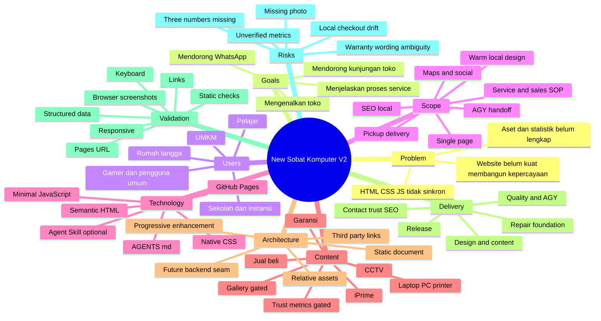
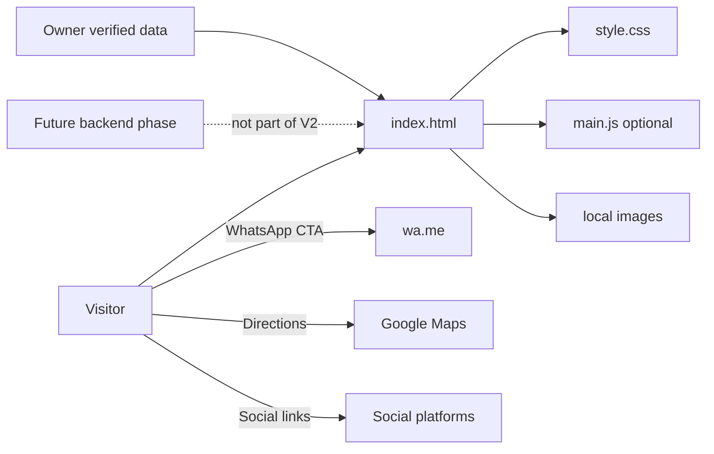
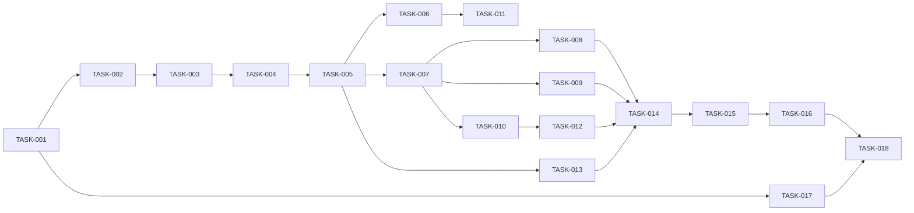

# Planning Package: New Sobat Komputer Website V2

## 1. Document Control

| Field | Value |
|---|---|
| Planning status | **READY WITH ASSUMPTIONS** |
| Project mode | Brownfield |
| Planning depth | Deep |
| Primary objective | Memperbaiki fondasi website yang tidak sinkron, lalu meningkatkan website menjadi landing page toko komputer lokal yang lebih meyakinkan, informatif, responsif, dan efektif mengarahkan pelanggan ke WhatsApp atau toko |
| Intended implementer | Google Antigravity/AGY coding agent dengan human review |
| Repository state | Public repository tersedia dan telah diperiksa pada branch `main` |
| Technology selection | Hybrid: stack eksisting dipertahankan, peningkatan teknis dipilih AI |
| Clarification status | Complete dengan beberapa jawaban Skip dan data bisnis tertunda |
| Confidence | High untuk struktur produk dan repository; Medium untuk aset, statistik bisnis, dan tiga nomor WhatsApp |
| Output filename | `plan-new-sobat-komputer-v2.md` |
| Last updated | 2026-07-18 |

### Planning Scope

Planning ini mencakup:

- Rekonsiliasi `index.html`, `assets/css/style.css`, dan `assets/js/main.js`.
- Redesign satu halaman dengan nuansa lokal yang hangat dan ramah.
- Hero dengan foto depan toko ketika aset valid tersedia.
- Informasi layanan laptop, PC, printer, jual beli perangkat, CCTV, dan internet rumah.
- Ringkasan SOP penerimaan service dan penjualan yang mudah dipahami pelanggan.
- CTA WhatsApp utama dan floating WhatsApp.
- Struktur yang siap menampung tiga nomor WhatsApp tanpa mengharuskan backend.
- Informasi layanan antar-jemput perangkat dengan batasan yang jelas.
- Lokasi, jam buka, Google Maps, media sosial, dan petunjuk datang ke toko.
- Slot bukti kepercayaan untuk rating Google Maps dan statistik bisnis yang hanya aktif setelah data terverifikasi.
- Slot galeri yang tidak menampilkan broken image ketika foto belum tersedia.
- SEO lokal, metadata sosial dasar, `LocalBusiness` JSON-LD, aksesibilitas, performa, dan kompatibilitas GitHub Project Pages.
- Instruksi repository untuk Antigravity/AGY melalui `AGENTS.md` dan skill lokal yang ringkas.
- Atomic tasks, traceability, acceptance criteria, validation, dan release handoff.

### Planning Exclusions

Planning ini tidak mencakup:

- Backend, database, autentikasi, dashboard admin, CMS, API, atau sistem tiket service pada versi ini.
- Katalog stok dinamis, checkout, pembayaran, dan transaksi online.
- Harga service atau harga produk.
- Klaim rating, jumlah pelanggan, jumlah perangkat, jangkauan CCTV, fitur CCTV, atau paket iPrime yang belum diverifikasi.
- Testimonial buatan AI atau kutipan ulasan tanpa izin.
- Tracking/analytics, cookie banner, iklan, atau marketing automation.
- Integrasi langsung WhatsApp Business API.
- Perubahan remote Git, push, pengaturan Pages, atau domain tanpa persetujuan pemilik.
- Implementasi backend masa depan; hanya disediakan seam evolusi dan dokumentasi batas sistem.

### Evidence Quality

- **Verified Fact:** repository publik `alfa-reza/sobat-komputer` tersedia pada branch `main`.
- **Verified Fact:** repository berisi `index.html`, `index.md`, `README.md`, `assets/css/style.css`, `assets/js/main.js`, dan `assets/images/logo.png`.
- **Verified Fact:** HTML menggunakan kelas seperti `site-header`, `container`, `service-grid`, `map-frame`, dan `button`, sedangkan stylesheet mendefinisikan kelas utama seperti `header`, `wrap`, `card-grid`, `map-box`, dan `btn`.
- **Verified Fact:** `index.html` pada snapshot yang diperiksa tidak memuat `assets/js/main.js`.
- **Verified Fact:** JavaScript mencari elemen `menuBtn`, `navList`, dan `backTop`, sedangkan elemen tersebut tidak ada pada HTML snapshot yang diperiksa.
- **Verified Fact:** README menyatakan logo saat ini tidak digunakan karena transparansi belum benar dan foto toko belum tersedia.
- **User Decision:** website tetap satu halaman, GitHub Project Pages, visual hangat dan ramah, tanpa harga, dengan WhatsApp dan kunjungan toko sebagai hasil utama.
- **Assumption:** tiga nomor WhatsApp tambahan, statistik bisnis, rating Google Maps, dan foto depan toko akan diberikan kemudian.
- **AI Recommendation:** pertahankan HTML/CSS/JavaScript native; jangan menambahkan framework atau build tool untuk scope ini.

---

## 2. Executive Summary

Website New Sobat Komputer saat ini sudah memuat informasi dasar toko, tetapi fondasi frontend pada branch `main` tidak konsisten. Markup menggunakan nama kelas yang berbeda dari stylesheet, JavaScript yang tersedia tidak dimuat oleh HTML, dan JavaScript tersebut juga bergantung pada elemen yang belum ada. Akibatnya, desain dan interaksi yang dimaksud oleh CSS/JS tidak dapat dipercaya sebagai perilaku aktif. Perbaikan kontrak HTML–CSS–JS menjadi critical path sebelum menambahkan fitur atau polish visual.

Website V2 akan tetap berupa single-page static site berbasis semantic HTML, native CSS, dan JavaScript minimal. Tidak ada framework, database, backend, atau proses build. Desain diarahkan menjadi hangat, sederhana, dan ramah bagi masyarakat lokal. Struktur halaman menonjolkan pengenalan toko, tombol WhatsApp, tombol petunjuk arah, foto depan toko, layanan, SOP service, SOP penjualan dan garansi, layanan antar-jemput, informasi toko, lokasi, media sosial, serta CTA penutup.

Konten service laptop yang disetujui mencakup pemeriksaan dan perbaikan, penggantian keyboard/SSD/RAM/LCD/baterai, upgrade RAM/storage, dan install ulang. Untuk PC dan printer, planning menggunakan daftar konservatif sebagai rekomendasi AI: pengecekan gangguan umum, upgrade RAM/SSD, install ulang, printer tidak mencetak atau kertas macet, perawatan dasar, dan instalasi driver. Detail CCTV dan iPrime tetap generik karena pengguna memilih Skip; website hanya menyatakan konsultasi/pemasangan dan mengarahkan rincian ke WhatsApp.

SOP service akan diterjemahkan menjadi alur pelanggan yang transparan: pelayanan 3S, pencatatan unit dan kelengkapan, pemberitahuan saat selesai atau update maksimal dua hari, pengecekan bersama, nota garansi satu bulan, dan pencatatan unit. SOP penjualan menjelaskan pengecekan dan segel, transparansi kondisi, nota dan garansi, serta syarat nota harus disimpan. Wording publik tidak boleh mengubah SOP menjadi janji di luar keputusan pengguna.

Bukti kepercayaan berupa rating Google Maps dan statistik jumlah pelanggan/perangkat hanya boleh ditampilkan setelah angka dan sumber diverifikasi. Hingga saat itu, section tersebut disiapkan tetapi tidak merender angka palsu atau placeholder publik. Hal yang sama berlaku pada galeri: struktur dapat disiapkan, tetapi section tidak boleh menghasilkan broken image atau kartu kosong.

Delivery dibagi menjadi lima milestone dan delapan belas atomic tasks. Critical path: repository baseline → kontrak HTML/CSS/JS → shell responsif → desain dan konten → contact/location/SEO → quality gates → release validation. Kesiapan implementasi adalah **READY WITH ASSUMPTIONS**; tidak ada blocker untuk memperbaiki dan meningkatkan versi statis, tetapi aktivasi foto, tiga nomor WhatsApp, dan statistik kepercayaan menunggu data nyata.

---

## 3. Intake Decisions

| Item | Value | Source | Confidence |
|---|---|---|---|
| Project name | New Sobat Komputer Website V2 | User + AI naming | High |
| Project type | Static local-business landing page | User | High |
| Project mode | Brownfield | Verified repository | High |
| Repository | `github.com/alfa-reza/sobat-komputer`, branch `main` | Verified | High |
| Main objective | Mengenalkan toko, mendorong WhatsApp, dan mendorong kunjungan ke toko | User | High |
| Target users | Seluruh pelanggan lokal: pelajar, rumah tangga, UMKM, sekolah/instansi, gamer, dan pengguna umum | User | Medium; target sangat luas |
| Information architecture | Satu halaman dengan anchor navigation | User | High |
| Visual direction | Warna lokal yang hangat dan ramah | User | High |
| Primary hero asset | Foto depan toko | User | High; asset belum tersedia |
| Prices | Tidak ditampilkan | User | High |
| Service access | Datang ke toko dan antar-jemput perangkat | User | High |
| Stock handling | Jelaskan jual beli; seluruh pertanyaan stok diarahkan ke WhatsApp | User | High |
| Trust proof | Rating Google Maps dan jumlah pelanggan/perangkat | User | Medium; nilai belum diberikan |
| Testimonials | Tidak masuk scope saat ini | User Skip | High |
| CCTV/iPrime detail | Tetap generik | User Skip + conservative assumption | High |
| WhatsApp message | Satu pesan umum | User | High |
| WhatsApp presentation | Floating button; siap berkembang menjadi tiga nomor | User | High |
| Current known WhatsApp | `+62 857-4274-4594` | User | High |
| Future platform | Backend mungkin ditambahkan kemudian | User | Medium; requirement belum didefinisikan |
| Current deployment | GitHub Project Pages | User | High |
| Implementation agent | AGY/Google Antigravity | User | High |

---

## 4. Technology Decisions

### Technology Preference

```text
Technology preference: Hybrid
```

Stack repository dipertahankan. Keputusan tambahan difokuskan pada konsistensi, aksesibilitas, performa, dan handoff AGY.

### Selected Stack

| Layer | Technology | Decision source | Rationale | Alternatives | Confidence |
|---|---|---|---|---|---|
| Markup | Semantic HTML5 | Existing repository + AI Recommendation | Native, SEO-friendly, accessible, langsung didukung Pages | JSX/templates | High |
| Styling | Native CSS dengan custom properties | Existing repository + AI Recommendation | Scope kecil; dependency tidak perlu | Tailwind, Bootstrap | High |
| Client behavior | Vanilla JavaScript minimal dan defensive | Existing repository + AI Recommendation | Cukup untuk mobile nav, active link, dan progressive enhancement | Framework JS, no JS | High |
| Font | System font stack pada critical path | AI Recommendation | Menghindari render blocking dan dependency Google Fonts | Self-hosted font, Google Fonts | High |
| Images | Local WebP/JPEG/PNG sesuai kebutuhan, explicit dimensions | AI Recommendation | Kontrol performa dan GitHub Pages compatibility | External image CDN | High |
| Icons | Inline SVG yang dekoratif diberi `aria-hidden`, atau text | AI Recommendation | Tidak memerlukan icon font/CDN | External icon library | High |
| Backend | None untuk V2 | User Decision | Deployment statis saat ini | Serverless/API | High |
| Database | None untuk V2 | User Decision | Tidak ada data dinamis | JSON/CMS/database | High |
| Build tool | None | Existing repository + AI Recommendation | Direct publishing paling sederhana | Vite/Astro | High |
| Package manager | None | Existing repository | Tidak ada dependency | npm/pnpm | High |
| Deployment | GitHub Project Pages, branch/folder yang diverifikasi | User Decision | Requirement eksplisit | Custom hosting | High |
| Map | Google Maps iframe + normal link fallback | Existing repository + User | Mudah dan tidak butuh backend | Static image | High |
| Contact | `wa.me` links dengan pesan URL-encoded | User Decision | Direct conversion | Form/API | High |
| Agent context | Root `AGENTS.md` + optional local Agent Skill | AI Recommendation | Instruksi ringkas, versioned, progressive disclosure | Prompt chat saja | Medium/High |
| Validation | Existing repository commands + browser evidence + manual accessibility/performance audit | Existing repository + AI Recommendation | Tidak menambah tooling | Full test framework | High |

### Technology Constraints

- Semua asset path harus relatif dan valid pada subpath GitHub Project Pages.
- Konten inti harus tersedia tanpa JavaScript.
- JavaScript harus memeriksa elemen sebelum menambahkan listener.
- Tidak boleh ada dependency baru tanpa requirement baru dan persetujuan.
- Tidak boleh ada data bisnis dinamis palsu untuk mensimulasikan backend.
- Backend masa depan tidak boleh memaksa over-engineering pada V2.
- Data kontak penting tidak boleh hanya tersedia melalui JavaScript.
- Critical CSS dan font tidak bergantung CDN eksternal.
- Tidak boleh menggunakan absolute path seperti `/assets/...` untuk project site.
- Jangan menghapus `index.md` atau file legacy tanpa verifikasi fungsi dan persetujuan.

### Technology Rejected or Deferred

| Technology | Status | Reason |
|---|---|---|
| React/Vue/Svelte | Rejected untuk V2 | Tidak ada state/app complexity yang membenarkan framework |
| Astro/Jekyll | Deferred | Bisa dipertimbangkan jika konten berkembang besar, belum diperlukan |
| Tailwind/Bootstrap | Rejected | Native CSS sudah ada dan scope sederhana |
| Backend/API | Deferred | User menyebut pengembangan masa depan, belum ada requirement |
| CMS | Deferred | Tidak ada kebutuhan update non-teknis yang didefinisikan |
| Analytics | Deferred | Belum diminta dan berdampak privasi |
| WhatsApp Business API | Rejected untuk V2 | Memerlukan backend, kredensial, dan compliance |
| Dynamic inventory | Deferred | Pertanyaan stok diarahkan ke WhatsApp |
| Third-party review widget | Rejected | Risiko klaim, tracking, dan dependency |

### Technology Assumptions

- **TECH-ASM-001:** GitHub Pages akan tetap memakai branch `main` dan root, tetapi agent wajib memverifikasi Settings/URL jika akses tersedia.
- **TECH-ASM-002:** Browser target adalah versi modern Chrome, Firefox, Edge, dan Safari yang masih didukung vendor.
- **TECH-ASM-003:** Sistem font dapat diterima untuk V2.
- **TECH-ASM-004:** JavaScript hanya progressive enhancement.
- **TECH-ASM-005:** Backend masa depan akan menjadi proyek/fase terpisah dan tidak mengubah scope V2.
- **TECH-ASM-006:** Root `AGENTS.md` dibaca oleh agent; prompt eksekusi tetap harus menyebut planning file secara eksplisit.
- **TECH-ASM-007:** Local skill Antigravity hanya dibuat bila format/path yang aktif terverifikasi pada instalasi AGY pengguna.

### Recommended AGY Execution Profile

| Activity | Model recommendation | Reason |
|---|---|---|
| Reconnaissance, contract repair, architecture-sensitive changes | Gemini 3.1 Pro (high) | Reasoning lintas file dan kepatuhan requirement |
| Copy, CSS polish, straightforward atomic tasks | Gemini 3.5 Flash | Lebih efisien untuk perubahan rutin |
| Final independent review | Model berbeda atau sesi baru | Mengurangi confirmation bias |
| Third-party model | Optional; hanya jika tersedia pada plan pengguna | Ketersediaan dapat berbeda berdasarkan paket |

Gunakan terminal sandbox/permission restrictions bila tersedia. Jangan memberikan izin push, remote changes, atau destructive command secara default.

---

## 5. Clarification Results

| Question | Answer | Answer mode | Planning impact | Confidence |
|---|---|---|---|---|
| Q1 | Mengetahui toko, mengirim pesan WhatsApp, dan datang ke toko | User | Hero dan CTA harus melayani awareness + contact + directions | High |
| Q2 | Semuanya | User | Bahasa inklusif dan sederhana; jangan terlalu niche | Medium |
| Q3 | Warna lokal yang hangat dan ramah | User | Palette earth/warm neutral dengan hijau hanya untuk WhatsApp | High |
| Q4 | Foto depan toko | User | Hero image menjadi LCP candidate; fallback wajib | High |
| Q5 | Rating Google Maps dan jumlah pelanggan/perangkat | User | Trust section gated sampai data terverifikasi | Medium |
| Q6 Laptop | Service; keyboard, SSD, RAM, LCD, baterai; upgrade; install ulang | User | Detail service dapat dipublikasikan | High |
| Q6 PC | AI tentukan, jangan terlalu banyak | AI-determined | Gunakan daftar konservatif | Medium |
| Q6 Printer | AI tentukan, jangan terlalu banyak | AI-determined | Gunakan daftar konservatif | Medium |
| Q6 lainnya | CCTV dan internet rumah | User | Tetap sebagai layanan utama | High |
| Q7 | Tidak menampilkan harga | User | Tidak ada price table/“mulai dari” | High |
| Q8 | SOP service dan SOP penjualan diberikan | User | Buat section proses dan garansi publik | High |
| Q9 | Di toko dan antar-jemput perangkat | User | Tambahkan service mode; area/biaya via WhatsApp | High |
| Q10 | Jual beli laptop/PC/printer; stok via WhatsApp | User | Tidak ada katalog stok | High |
| Q11 | Bagian kosong, diisi nanti | User | Gallery scaffold tidak dirender bila kosong | High |
| Q12 | Skip | Skip | CCTV/iPrime generic; tidak ada claim detail | High |
| Q13 | Skip | Skip | Tidak ada testimonial/review quote | High |
| Q14 | Satu pesan umum, floating WhatsApp, nanti tiga nomor | User | CTA current number; contact architecture siap bertambah | High |
| Q15 | GitHub Project Pages; backend nanti | User | Static V2 + explicit future evolution seam | High |

### Skipped Questions

- Q12: detail CCTV dan iPrime.
- Q13: Google Business Profile/testimonial source.

### AI-Determined Answers

- **AI-ANS-001 — PC:** “Pengecekan gangguan umum PC, PC lemot/tidak menyala, upgrade RAM atau SSD, install ulang sistem, dan perawatan dasar.” Tidak mencantumkan board-level repair, data recovery, atau layanan spesifik lain tanpa verifikasi.
- **AI-ANS-002 — Printer:** “Pengecekan printer tidak mencetak, kertas macet, hasil cetak bermasalah, perawatan dasar, dan instalasi driver.” Tidak mencantumkan penggantian head/mainboard atau merek tertentu.
- **AI-ANS-003 — CCTV/iPrime:** Hanya “konsultasi dan pemasangan”; detail cakupan, survei, perangkat, kecepatan, harga, dan syarat diarahkan ke WhatsApp.
- **AI-ANS-004 — Galeri:** Section disiapkan secara struktural, tetapi disembunyikan/tidak dirender sampai aset tersedia.
- **AI-ANS-005 — Trust metrics:** Tidak ada angka default. Section hanya diaktifkan setelah bukti dan tanggal verifikasi dicatat.

### Blocking Questions

Tidak ada blocker untuk implementasi fondasi dan redesign. Item berikut memblokir fitur spesifik:

- Foto depan toko memblokir hero image final.
- Dua nomor WhatsApp tambahan dan label kegunaannya memblokir tiga-contact layout final.
- Nilai rating, jumlah pelanggan, jumlah perangkat, sumber, dan tanggal verifikasi memblokir trust metrics.
- Foto galeri memblokir gallery content.
- Makna tepat “garansi lainnya 3 hari” memblokir wording garansi yang sangat spesifik; default publik adalah “garansi mengikuti jenis barang dan tertulis pada nota.”

### Assumptions Created from Clarification

- **ASM-001:** Nomor `+62 857-4274-4594` tetap primary contact sampai kontak lain diberikan.
- **ASM-002:** Antar-jemput tidak dinyatakan gratis; area, jadwal, dan biaya dikonfirmasi via WhatsApp.
- **ASM-003:** Foto depan toko harus mendapat persetujuan publik dan tidak menampilkan data pribadi sensitif.
- **ASM-004:** Rating Google Maps dan statistik bisnis dapat berubah; setiap tampilan menyertakan tanggal verifikasi internal.
- **ASM-005:** Garansi service satu bulan berlaku sesuai nota dan syarat toko.
- **ASM-006:** Garansi penjualan laptop mesin satu bulan; garansi lain/aksesori tiga hari hanya dipublikasikan setelah wording diperiksa pemilik.
- **ASM-007:** Tidak ada pickup form; koordinasi antar-jemput melalui WhatsApp.
- **ASM-008:** Semua audience dilayani, tetapi copy utama menggunakan contoh kebutuhan umum rumah tangga, pelajar, UMKM, dan instansi secara seimbang.

---

## 6. Context and Repository Findings

### 6.1 Problem Context

**Symptom:**  
Website publik memuat informasi toko, tetapi tampilan dan interaksi tidak selaras dengan aset CSS/JS yang tersedia. Website juga belum cukup menjelaskan proses service, garansi, antar-jemput, bukti kepercayaan, atau alasan pelanggan harus menghubungi toko.

**Root cause:**  

1. Contract drift antara class/ID HTML dan selector CSS/JS.
2. Script tersedia tetapi tidak dimuat oleh HTML.
3. Iterasi desain meninggalkan dua struktur naming yang berbeda.
4. Aset logo/foto belum siap.
5. Requirement bisnis lanjutan belum dimodelkan pada versi pertama.

**Requested solution:**  
Website yang lebih bagus, tetap sederhana, single-page, GitHub Pages, dan siap diimplementasikan dengan AGY.

**Recommended solution:**  
Pertama pulihkan contract HTML/CSS/JS menjadi satu sumber kebenaran. Setelah itu lakukan redesign bertahap berbasis semantic sections, warm design tokens, konten service/SOP yang terverifikasi, CTA WhatsApp/Maps, SEO lokal, dan quality gates.

### 6.2 Current-System Summary

- **Runtime:** Browser; tidak ada backend.
- **Framework:** Tidak ada.
- **Entry point:** `index.html` pada root.
- **Stylesheet:** `assets/css/style.css`.
- **JavaScript:** `assets/js/main.js`, tetapi tidak dimuat oleh HTML snapshot.
- **Images:** `assets/images/logo.png`.
- **Legacy content:** `index.md`.
- **Documentation:** `README.md`.
- **Build/package manager:** Tidak ada.
- **Deployment target:** GitHub Pages project site.
- **Validation documented:** `git diff --check` dan Node one-liner untuk memeriksa anchor IDs.
- **License:** GPL-3.0.
- **Existing data flow:** Static HTML → external WhatsApp/social/Maps links.
- **Existing trust boundary:** Browser → third-party platforms.
- **Current limitation:** selector mismatch dan dead JS prevent intended behavior.

### 6.3 Verified Repository Evidence

| Evidence ID | Location | Verified finding | Planning impact |
|---|---|---|---|
| EVID-001 | Repository root | `index.html`, `index.md`, `README.md`, `LICENSE`, `assets/` tersedia | Brownfield plan; preserve files |
| EVID-002 | `index.html` | Entry point 98 lines pada snapshot | Modify, not replace blindly |
| EVID-003 | `index.html` | Memuat `assets/css/style.css` | CSS is active dependency |
| EVID-004 | `index.html` | Tidak terlihat `<script src="assets/js/main.js">` | JS currently inactive |
| EVID-005 | `index.html` | Class examples: `site-header`, `container`, `service-grid`, `map-frame`, `button` | Must reconcile selectors |
| EVID-006 | `assets/css/style.css` | Selector examples: `.header`, `.wrap`, `.card-grid`, `.map-box`, `.btn` | Naming contract drift |
| EVID-007 | `assets/js/main.js` | Queries `menuBtn`, `navList`, `backTop` without null guards | Would error if loaded without matching DOM |
| EVID-008 | `assets/js/main.js` | Implements mobile menu, Escape, active nav, back-to-top | Reuse only after DOM contract fixed |
| EVID-009 | `README.md` | Logo currently not used due transparency issue | Asset validation task |
| EVID-010 | `README.md` | Foto toko belum tersedia | Hero fallback required |
| EVID-011 | `README.md` | No package manager/build/workflow | Avoid invented scripts |
| EVID-012 | `README.md` | Documents `git diff --check` and anchor validation command | Approved validation commands |
| EVID-013 | `README.md` | Root `index.html` intended for branch deployment | GitHub Pages compatibility |
| EVID-014 | `index.html` | Existing WhatsApp, social, tel, and Maps links | Preserve business data |
| EVID-015 | `index.html` | Existing map coordinates present | Revalidate against user map link before release |
| EVID-016 | `assets/css/style.css` | Google Fonts `@import` exists | Performance/privacy decision required |
| EVID-017 | `assets/css/style.css` | CSS already contains mobile styles and focus indicator | Reuse concepts, reconcile implementation |
| EVID-018 | Repository | 10 commits shown at inspection | Preserve history; incremental changes |

### 6.4 Assumptions

#### ASM-001 — Local checkout may differ from public HEAD

- **Reason:** User may have unpushed changes.
- **Risk if wrong:** Agent overwrites local work.
- **Affected sections:** All implementation tasks.
- **Validation:** Run `git status`, `git branch --show-current`, `git log -1 --oneline`, and inspect local files before editing.

#### ASM-002 — Logo replacement will be supplied

- **Reason:** User previously worked on transparent logo.
- **Risk if wrong:** Header/hero lacks final brand asset.
- **Affected sections:** Hero, header, favicon, social metadata.
- **Validation:** Inspect alpha channel and render on light/dark backgrounds.

#### ASM-003 — Exact trust metrics will be supplied later

- **Risk if wrong:** Trust section remains inactive.
- **Validation:** Require source, number, and date before activation.

#### ASM-004 — Three WhatsApp numbers have distinct purposes

- **Risk if wrong:** Contact routing becomes confusing.
- **Validation:** Collect number, label, owner/purpose, and preferred CTA for each.

#### ASM-005 — Backend is not part of V2

- **Risk if wrong:** Static architecture may need replanning.
- **Validation:** New backend requirements require a separate planning revision.

### 6.5 Project Invariants

1. Nama toko tetap **New Sobat Komputer**.
2. Alamat tetap Jalan Raya Kejobong, Purbalingga, sebelah barat Puskesmas Kejobong.
3. Jam buka tetap Senin–Sabtu, 08.00–16.00, sampai pengguna mengubahnya.
4. Nomor primary tetap `+62 857-4274-4594` sampai data baru diberikan.
5. Pesan WhatsApp umum tetap: “Halo New Sobat Komputer, saya mendapatkan informasi dari website.”
6. Website tetap usable tanpa JavaScript.
7. Asset paths kompatibel dengan GitHub Project Pages.
8. Tidak ada harga publik pada V2.
9. Tidak ada klaim statistik/review yang tidak terverifikasi.
10. Tidak ada framework, backend, database, atau build tool pada V2.
11. Tidak ada push, remote change, atau destructive Git operation tanpa instruksi eksplisit.
12. Existing valid business links tidak boleh berubah diam-diam.
13. SOP publik harus setia pada keputusan pengguna dan tidak membuat janji tambahan.
14. Aset yang hilang tidak boleh menghasilkan broken UI.
15. Setiap task harus menghasilkan completion evidence.

---

## 7. Planning Mind Map



### Markmap-Compatible Hierarchy

# New Sobat Komputer V2

## Problem
### HTML, CSS, dan JavaScript tidak sinkron
### Bukti kepercayaan belum siap
### Foto dan kontak tambahan belum lengkap

## Goals
### Mengenalkan toko
### Menghasilkan percakapan WhatsApp
### Mengarahkan kunjungan
### Menjelaskan SOP dan garansi

## Users
### Pelajar
### Rumah tangga
### UMKM
### Sekolah dan instansi
### Gamer dan pengguna umum

## Scope
### Single-page static site
### Warm local visual system
### Service, sales, pickup, Maps, social
### SEO local and accessibility
### AGY handoff

## Technology
### Semantic HTML
### Native CSS
### Minimal JavaScript
### GitHub Project Pages
### AGENTS.md and optional skill

## Delivery
### Foundation repair
### Core redesign
### Trust, contact, location, SEO
### Quality gates
### Release

## Validation
### Repository commands
### Browser evidence
### Accessibility
### Performance
### Link and Pages verification

---

## 8. Unicode Tree Structure

```text
New Sobat Komputer V2
├── 1. Product
│   ├── Awareness
│   ├── WhatsApp conversion
│   ├── Store visit
│   ├── Service transparency
│   └── Trust building
├── 2. Technology
│   ├── Semantic HTML5
│   ├── Native CSS
│   ├── Minimal JavaScript
│   ├── Relative local assets
│   ├── GitHub Project Pages
│   └── AGY instructions
├── 3. Website
│   ├── Header and navigation
│   ├── Hero and storefront photo
│   ├── Store introduction
│   ├── Trust proof (gated)
│   ├── Services
│   ├── Service SOP
│   ├── Sales and warranty SOP
│   ├── Pickup and delivery
│   ├── Gallery (gated)
│   ├── Store information
│   ├── Location and map
│   ├── Contact and social
│   ├── Floating WhatsApp
│   └── Footer
├── 4. Data
│   ├── Business identity
│   ├── Service catalog
│   ├── SOP content
│   ├── Contact numbers
│   ├── Trust metrics
│   ├── Images
│   └── External URLs
├── 5. Delivery
│   ├── MILESTONE-01 Foundation Repair
│   ├── MILESTONE-02 Core Experience
│   ├── MILESTONE-03 Trust and Discovery
│   ├── MILESTONE-04 Quality and Agent Workflow
│   └── MILESTONE-05 Release
├── 6. Validation
│   ├── Static checks
│   ├── Responsive browser checks
│   ├── Keyboard and accessibility
│   ├── Link and map checks
│   ├── Structured data validation
│   └── Pages deployment check
└── 7. Risks
    ├── Missing or wrong assets
    ├── Unverified business claims
    ├── Contact routing ambiguity
    ├── Local checkout divergence
    └── Premature backend complexity
```

### Verified and Proposed Repository Tree

```text
sobat-komputer/
├── index.html                         # Existing, Read + Modify
├── index.md                           # Existing, Read + Verify before changing
├── README.md                          # Existing, Read + Modify
├── LICENSE                            # Existing, Preserve
├── AGENTS.md                          # New
├── assets/
│   ├── css/
│   │   └── style.css                  # Existing, Read + Modify
│   ├── js/
│   │   └── main.js                    # Existing, Read + Modify or simplify
│   └── images/
│       ├── logo.png                   # Existing, Verify/replace
│       ├── storefront.[webp|jpg]      # New only when provided
│       └── gallery/                   # New only when approved photos exist
└── .agent/
    └── skills/
        └── sobat-website-implementation/
            └── SKILL.md               # Optional New; create only after AGY path/format verification
```

### Task Hierarchy

```text
Implementation Plan
├── MILESTONE-01 Foundation Repair
│   ├── TASK-001 Capture local repository baseline
│   ├── TASK-002 Reconcile HTML and CSS contracts
│   └── TASK-003 Reconcile progressive JavaScript behavior
├── MILESTONE-02 Core Experience
│   ├── TASK-004 Establish warm local design tokens
│   ├── TASK-005 Rebuild header and responsive navigation
│   ├── TASK-006 Build hero with storefront asset fallback
│   ├── TASK-007 Expand service content conservatively
│   ├── TASK-008 Publish customer-facing service SOP
│   ├── TASK-009 Publish sales and warranty SOP
│   └── TASK-010 Add pickup, stock, and CTA flows
├── MILESTONE-03 Trust and Discovery
│   ├── TASK-011 Add gated trust metrics and gallery seams
│   ├── TASK-012 Implement contact architecture and floating WhatsApp
│   ├── TASK-013 Improve store information, location, and map
│   └── TASK-014 Add local SEO and structured data
├── MILESTONE-04 Quality and Agent Workflow
│   ├── TASK-015 Complete accessibility and responsive hardening
│   ├── TASK-016 Optimize assets and runtime performance
│   └── TASK-017 Add AGY project instructions
└── MILESTONE-05 Release
    └── TASK-018 Validate, document, and prepare GitHub Pages release
```

---

## 9. Proposed Repository Structure

### 9.1 Logical Structure

The system boundary is a static document hosted by GitHub Pages.

```text
Browser
├── Local static files
│   ├── index.html
│   ├── style.css
│   ├── main.js
│   └── images
└── External destinations
    ├── wa.me
    ├── Google Maps
    ├── TikTok
    ├── Facebook
    └── Instagram
```

- HTML owns content and critical interactions.
- CSS owns visual layout and responsive behavior.
- JavaScript owns only progressive enhancements.
- External services own messaging, mapping, and social content.
- No sensitive data is persisted by the site.
- Backend future work must remain a separate trust boundary.

### 9.2 Component Responsibility Matrix

| Component | Responsibility | Inputs | Outputs | Dependencies | Invariants |
|---|---|---|---|---|---|
| Document shell | Semantic landmarks and section order | Business content | Accessible page | None | Works without JS |
| Header/nav | Navigation and CTA | Section IDs | Anchor navigation | CSS, optional JS | Logical focus order |
| Hero | Value proposition and primary actions | Store photo, copy | WhatsApp/Maps clicks | Images | No broken hero |
| Services | Explain supported work | Verified service catalog | Service understanding | None | No overclaim |
| SOP sections | Explain process and warranty | User SOP | Trust/transparency | None | Faithful wording |
| Trust block | Show verified rating/statistics | Verified metrics | Social proof | None | Hidden until verified |
| Gallery | Show approved photos | Approved images | Visual proof | Images | Hidden when empty |
| Contact | Phone/WhatsApp/social | Contacts | External navigation | Third parties | Primary contact always available |
| Location | Address, hours, map | User data | Directions | Google Maps | Link and iframe agree |
| SEO metadata | Search and social context | Business data | Meta/JSON-LD | None | Visible content matches schema |
| JavaScript | Mobile nav, active state, back-to-top | DOM elements | Enhancement | DOM | Null-safe |
| AGENTS.md/skill | Agent constraints and workflow | Plan/invariants | Better implementation behavior | AGY | Concise and versioned |

### 9.3 Data and Control Flow



### 9.4 Configuration Structure

No environment variables or secrets.

Business values remain in visible HTML/JSON-LD and must be synchronized:

- Store name.
- Phone/WhatsApp.
- Address.
- Hours.
- Services.
- Social URLs.
- Map link/coordinates.
- Trust metrics only when verified.

Do not move critical business data into JavaScript-only configuration. If duplication is unavoidable, document all update locations in README.

### 9.5 State and Data Ownership

| Data | Owner | Persistence | Mutation | Retention |
|---|---|---|---|---|
| Business info | Store owner | Git repository | Manual commit | Until updated |
| Service/SOP copy | Store owner | Git repository | Manual review | Until updated |
| Contacts | Store owner | Git repository | Manual review | Until updated |
| Trust metrics | Store owner + source platform | Git repository | Manual verified update | Include verification date |
| Images | Store owner | Git repository | Approved additions | Remove when outdated |
| Visitor data | Third-party destinations | Not stored by site | Outside boundary | Third-party policy |
| Backend data | Future system | Not applicable | Future plan | Future plan |

---

## 10. Product Requirements Document

### 10.1 Product Overview

New Sobat Komputer V2 adalah website satu halaman untuk membantu calon pelanggan memahami toko, layanan, proses service/penjualan, lokasi, jam buka, dan cara menghubungi toko. Website memprioritaskan penggunaan mobile dan komunikasi WhatsApp.

### 10.2 Problem Statement

Calon pelanggan New Sobat Komputer mengalami kesulitan menilai layanan, proses, garansi, dan cara datang atau menghubungi toko ketika informasi website masih minimal dan implementasi frontend tidak konsisten, yang menyebabkan kepercayaan serta konversi WhatsApp/kunjungan tidak optimal.

### 10.3 Goals

| ID | Goal | Success signal | Measurement |
|---|---|---|---|
| GOAL-001 | Website menjelaskan toko dalam satu kunjungan | Pengguna dapat menemukan identitas, layanan, jam, alamat | Manual task test ≤ 60 detik |
| GOAL-002 | WhatsApp mudah diakses | CTA tersedia di hero, contact, dan floating button | Semua link tervalidasi |
| GOAL-003 | Kunjungan toko mudah direncanakan | Jam, landmark, map, directions jelas | Map/link consistency |
| GOAL-004 | Proses service transparan | SOP service dan garansi terlihat | Content review |
| GOAL-005 | Jual beli transparan | Proses pengecekan, nota, dan garansi jelas | Content review |
| GOAL-006 | Website tampil baik di perangkat umum | Tidak overflow 360px dan desktop | Browser evidence |
| GOAL-007 | Website mudah ditemukan secara lokal | Metadata dan schema valid | Structured-data validation |
| GOAL-008 | Agent implementation terkendali | Tasks atomik dan AGY rules tersedia | Completion reports |

### 10.4 Non-Goals

- **NOGOAL-001:** Online store atau checkout.
- **NOGOAL-002:** Dynamic inventory.
- **NOGOAL-003:** Booking/service tracking.
- **NOGOAL-004:** Backend/database.
- **NOGOAL-005:** Harga publik.
- **NOGOAL-006:** Testimonial generated.
- **NOGOAL-007:** Dynamic Google rating widget.
- **NOGOAL-008:** Multi-language.
- **NOGOAL-009:** Analytics.
- **NOGOAL-010:** UI framework migration.

### 10.5 Users and Actors

| Actor | Need | Permission | Entry point | Expected outcome | Failure impact |
|---|---|---|---|---|---|
| Calon pelanggan umum | Mengetahui toko | Public | Search/social/link | Memahami layanan | Meninggalkan halaman |
| Pelanggan service | Mengetahui proses/garansi | Public | WhatsApp/website | Percaya dan menghubungi | Ekspektasi salah |
| Pembeli perangkat | Mengetahui jual beli/stok | Public | Website | Chat stok | Kehilangan lead |
| Pelanggan CCTV/iPrime | Konsultasi | Public | Service card | Chat detail | Klaim salah |
| Pelanggan antar-jemput | Mengetahui opsi | Public | CTA | Chat area/jadwal | Salah asumsi gratis |
| Store owner | Memperbarui konten | Repository write | Git | Informasi akurat | Data basi |
| AGY agent | Implement task | Local workspace | Plan/AGENTS | Patch terverifikasi | Drift/overreach |

### 10.6 User Stories

- **US-001:** Sebagai calon pelanggan, saya ingin langsung mengetahui toko dan layanan agar yakin tempat ini relevan.
- **US-002:** Sebagai pengguna HP, saya ingin tombol WhatsApp mudah dijangkau agar dapat bertanya cepat.
- **US-003:** Sebagai pelanggan service, saya ingin mengetahui alur penerimaan dan update agar memahami proses.
- **US-004:** Sebagai pembeli laptop, saya ingin memahami pengecekan dan garansi agar lebih percaya.
- **US-005:** Sebagai pelanggan lokal, saya ingin membuka Maps dan melihat landmark agar mudah datang.
- **US-006:** Sebagai pelanggan antar-jemput, saya ingin tahu opsi tersedia tanpa mengira layanan gratis.
- **US-007:** Sebagai pemilik toko, saya ingin menambah kontak/foto/statistik kemudian tanpa redesign besar.
- **US-008:** Sebagai pengguna keyboard, saya ingin seluruh navigasi dan CTA dapat digunakan.
- **US-009:** Sebagai pengguna koneksi lambat, saya ingin halaman tetap cepat dan stabil.
- **US-010:** Sebagai implementer AGY, saya ingin scope dan validasi eksplisit agar tidak menebak.

### 10.7 Primary Use Cases

#### UC-001 — Contact via WhatsApp

- **Trigger:** Visitor needs service, stock, pickup, CCTV, or iPrime information.
- **Precondition:** Browser can open `wa.me`.
- **Main flow:** Click CTA → WhatsApp opens with general message → visitor adds details.
- **Alternative:** Copy/call phone number.
- **Failure:** WhatsApp unavailable → visible phone remains.
- **Postcondition:** Site stores no message data.

#### UC-002 — Visit Store

- **Trigger:** Visitor wants to come.
- **Main flow:** Read hours/address → click directions → Google Maps opens.
- **Failure:** Embed blocked → fallback link works.
- **Postcondition:** Visitor receives directions externally.

#### UC-003 — Understand Service Process

- **Trigger:** Visitor evaluates trust.
- **Main flow:** Read service list → read SOP → understand update and warranty.
- **Failure:** Ambiguous warranty → wording points to written note.
- **Postcondition:** Visitor can ask via WhatsApp.

#### UC-004 — Ask Stock

- **Trigger:** Visitor wants laptop/PC/printer/accessory.
- **Main flow:** Read no-live-catalog notice → click WhatsApp.
- **Postcondition:** Stock confirmed manually.

### 10.8 Functional Requirements

| ID | Requirement | Priority | Source | Acceptance method |
|---|---|---|---|---|
| FR-001 | Page shall use one semantic HTML document with anchor navigation | Must | User | DOM review |
| FR-002 | HTML class/ID contract shall match active CSS/JS | Must | Repository finding | Selector audit |
| FR-003 | Critical content shall remain usable without JS | Must | AI recommendation | Disable JS test |
| FR-004 | Hero shall present store identity, local value, WhatsApp, and Maps/directions CTA | Must | Q1/Q4 | Browser test |
| FR-005 | Hero shall use storefront photo only when a valid approved asset exists | Must | Q4/Q11 | Asset/fallback test |
| FR-006 | Services shall include approved laptop services | Must | Q6 | Content review |
| FR-007 | PC/printer lists shall remain conservative | Must | AI-determined | Content review |
| FR-008 | CCTV/iPrime shall use generic claims and route details to WhatsApp | Must | Q12 Skip | Content review |
| FR-009 | Service SOP shall show 3S, note/condition record, update, joint check, one-month warranty note, and record keeping | Must | Q8 | Content review |
| FR-010 | Sales SOP shall show checking/sealing, condition explanation, note, warranty, and note retention | Must | Q8 | Content review |
| FR-011 | No price shall be displayed | Must | Q7 | Text search |
| FR-012 | Pickup/delivery shall be advertised with area/schedule/fee confirmed via WhatsApp | Must | Q9 | Content review |
| FR-013 | Product stock shall be directed to WhatsApp | Must | Q10 | CTA test |
| FR-014 | Primary WhatsApp shall use the approved general message | Must | Q14 | URL decode test |
| FR-015 | Floating WhatsApp shall be available without obscuring content/focus | Must | Q14 | Mobile/keyboard test |
| FR-016 | Contact structure shall support future three numbers but show only verified numbers | Must | Q14 | DOM/content review |
| FR-017 | Trust metrics shall not render without verified values and sources | Must | Q5 | Negative test |
| FR-018 | Gallery shall not render broken or empty cards | Must | Q11 | Negative test |
| FR-019 | Address, hours, phone, Maps link, and map iframe shall be consistent | Must | User | Manual verification |
| FR-020 | Social links shall remain available and secure in new tabs | Must | Existing data | Link audit |
| FR-021 | LocalBusiness JSON-LD shall match visible verified content | Should | Research | Validator |
| FR-022 | README shall document update points and release validation | Should | Maintainability | Review |
| FR-023 | Root AGENTS.md shall define agent constraints and verified checks | Should | AGY workflow | Review |
| FR-024 | Optional AGY skill shall be created only after active format/path is verified | Could | Research | AGY discovery |
| FR-025 | Backend future work shall be documented as out-of-scope seam | Should | Q15 | Architecture review |

### 10.9 Non-Functional Requirements

| ID | Requirement |
|---|---|
| PERF-001 | Initial page shall avoid unnecessary JS and external render-blocking font imports. |
| PERF-002 | Hero image shall have explicit dimensions/aspect ratio and an optimized format. |
| PERF-003 | Below-fold images and map iframe shall use lazy loading where appropriate. |
| PERF-004 | No layout shift shall be caused by missing image dimensions. |
| ACC-001 | Text/background contrast shall meet WCAG 2.2 AA where applicable. |
| ACC-002 | Interactive targets shall meet or exceed 24×24 CSS px and generally target ~44px for primary mobile controls. |
| ACC-003 | Focus order shall be logical and focus indicators visible. |
| ACC-004 | Mobile menu, if used, shall support keyboard, Escape, and `aria-expanded`. |
| ACC-005 | Skip link and semantic landmarks shall exist. |
| ACC-006 | Reduced-motion preference shall be respected for smooth scrolling/animation. |
| REL-001 | Missing optional assets/data shall degrade gracefully. |
| REL-002 | External links shall have visible fallback text. |
| SEC-001 | External new-tab links shall use `rel="noopener noreferrer"`. |
| SEC-002 | No secrets, API keys, or personal customer data shall be committed. |
| PRIV-001 | Site shall not collect visitor data in V2. |
| COMP-001 | All local paths shall work on a project-site subpath. |
| COMP-002 | Layout shall be usable from 360px viewport through desktop. |
| MAINT-001 | Naming conventions shall be consistent across HTML/CSS/JS. |
| MAINT-002 | Business update locations shall be documented. |
| MAINT-003 | No dead CSS/JS selectors shall remain after reconciliation. |
| SEO-001 | Title and description shall identify service, Kejobong, and Purbalingga naturally. |
| SEO-002 | Heading hierarchy shall be logical with one primary H1. |
| SEO-003 | Structured data shall not include unverified rating/statistics. |
| AGENT-001 | AGY shall execute one atomic task at a time and report evidence. |
| AGENT-002 | Agent shall not push or change remote configuration without instruction. |

### 10.10 Input and Output Contracts

#### WhatsApp

Input:
- E.164 number without `+`.
- URL-encoded general message.

Output:
- Valid `https://wa.me/<number>?text=<encoded>` URL.

#### Trust Metric

Input:
- Metric name.
- Exact value.
- Source URL/reference.
- Date verified.
- Owner approval.

Output:
- Visible metric matching source.
- No dynamic claim beyond input.

#### Gallery Item

Input:
- Approved image file.
- Accurate alt text.
- Width/height.
- Optional caption.

Output:
- Responsive local image without broken state.

### 10.11 Edge Cases

- JavaScript disabled.
- `main.js` loaded while optional DOM elements absent.
- Logo has fake checkerboard transparency.
- Storefront image absent.
- Only one of three WhatsApp numbers available.
- Map iframe blocked by browser/network.
- Long TikTok URL/query parameters.
- Very narrow 360px viewport.
- Text zoom to 200%.
- Keyboard focus behind sticky header/floating button.
- Rating/count becomes stale.
- “Garansi lainnya” remains ambiguous.
- External social account unavailable.
- GitHub Pages base path differs from root.
- Local checkout has uncommitted work.

### 10.12 UX and Content Guidelines

- Bahasa Indonesia sederhana, sopan, tidak terlalu formal.
- Hindari jargon teknis tanpa manfaat pelanggan.
- CTA labels use actions: “Chat WhatsApp”, “Buka Petunjuk Arah”, “Tanya Stok”.
- Warm palette does not replace WhatsApp brand green as the only primary brand color.
- Do not overload hero with all services.
- Service cards show common needs, not exhaustive repair promises.
- SOP uses 4–6 concise steps with detail disclosure if needed.
- Warranty copy points to the written note as source of truth.
- Use real photos rather than AI-generated fake storefront/customer photos.

### 10.13 Analytics and Observability

No analytics in V2. Completion evidence comes from:

- Browser screenshots.
- Console error check.
- Link verification.
- Lighthouse/DevTools audit if available.
- Structured data validator.
- GitHub Pages live check.
- Task completion reports.

### 10.14 Security and Privacy

- No user-submitted form.
- No customer details stored.
- No secrets.
- External links secured.
- No untrusted HTML injection.
- Static JSON-LD values manually reviewed.
- Avoid third-party font tracking by removing Google Fonts import or replacing with system font.
- Map iframe is the primary unavoidable third-party embed; provide fallback and lazy load.
- Do not commit internal customer service records, photos of notes, serial numbers, or customer faces without consent.

### 10.15 Compatibility

- GitHub Project Pages relative paths.
- Modern evergreen browsers.
- Keyboard and touch.
- JavaScript-disabled baseline.
- Reduced motion.
- 360px mobile minimum.
- Do not promise IE support.

### 10.16 Acceptance Criteria

```gherkin
Scenario: Visitor contacts the store
  Given the website is open on a mobile device
  When the visitor activates any primary WhatsApp CTA
  Then WhatsApp opens for the verified primary number
  And the approved general message is prefilled

Scenario: Visitor finds the store
  Given the visitor reads the location section
  When the visitor activates the directions link
  Then Google Maps opens to the verified store location
  And the visible address matches the page information

Scenario: Optional storefront photo is missing
  Given no approved storefront image exists
  When the page loads
  Then no broken image is displayed
  And the hero remains visually complete

Scenario: Trust values are not verified
  Given rating and customer/device counts are unavailable
  When the page loads
  Then no fabricated number or empty statistic is visible

Scenario: JavaScript is disabled
  Given JavaScript is disabled
  When the visitor opens the website
  Then all content and primary links remain usable

Scenario: Keyboard navigation
  Given the visitor uses only a keyboard
  When navigating header, sections, CTAs, social links, and floating WhatsApp
  Then focus order is logical
  And focus is visible
  And no control is obscured

Scenario: GitHub Project Pages
  Given the site is published under a repository subpath
  When the page loads
  Then CSS, JavaScript, logo, and approved images resolve successfully
```

### 10.17 Definition of Done

- All Must requirements implemented or explicitly marked pending due external data.
- HTML/CSS/JS selectors reconciled.
- No console errors in tested browsers.
- No broken links/images.
- Primary WhatsApp and Maps verified.
- Mobile and desktop screenshots produced.
- Keyboard and text zoom checks completed.
- Static repository commands pass.
- Structured data matches visible content and validates.
- No unverified metrics/testimonials.
- README and AGENTS.md updated.
- No unrelated refactor.
- No push/remote changes without approval.
- Completion report lists deviations and pending assets.
- GitHub Pages live URL checked if access/configuration permits.

---

## 11. Technical Design and Architecture

### 11.1 Recommended Approach

Use the existing repository structure. Rebuild the page incrementally, not as an uncontrolled rewrite:

1. Capture local baseline.
2. Choose one naming convention and reconcile HTML/CSS/JS.
3. Restore a reliable no-JS document.
4. Add progressive JavaScript only after DOM contracts exist.
5. Apply warm design tokens.
6. Add content sections and CTAs.
7. Add SEO/accessibility/performance improvements.
8. Add AGY instructions and release evidence.

### 11.2 Architectural Decisions

#### ADR-001: Keep a zero-build static architecture

**Status:** Accepted  
**Context:** GitHub Pages, small one-page site, no dynamic data.  
**Decision:** Keep HTML/CSS/JS native without package manager/build tool.  
**Rationale:** Lowest operational complexity and best fit.  
**Alternatives considered:** Vite, Astro, React.  
**Trade-offs:** Manual content duplication and no component templating.  
**Consequences:** README must document update locations.  
**Requirements addressed:** FR-001, COMP-001, MAINT-001.

#### ADR-002: HTML is the source of truth for critical content

**Status:** Accepted  
**Decision:** Business information and primary links remain in HTML. JS cannot be required to render them.  
**Trade-offs:** Some repeated contact links.  
**Requirements addressed:** FR-003, FR-014, REL-001.

#### ADR-003: Optional content is gated, not faked

**Status:** Accepted  
**Decision:** Trust metrics, gallery, and extra contacts render only after verified data exists.  
**Alternatives:** Placeholders, lorem ipsum, fake stats.  
**Trade-offs:** Some planned sections remain inactive.  
**Requirements addressed:** FR-016–FR-018, SEO-003.

#### ADR-004: Progressive enhancement JavaScript

**Status:** Accepted  
**Decision:** JS supports mobile nav, active state, and back-to-top/floating behavior with null guards.  
**Trade-offs:** Features are less elaborate but robust.  
**Requirements addressed:** FR-003, ACC-004, MAINT-003.

#### ADR-005: Future backend is a separate architecture phase

**Status:** Accepted  
**Decision:** Do not introduce APIs/config abstractions now. Preserve semantic IDs and clear content boundaries only.  
**Trade-offs:** Future migration will require mapping static content.  
**Requirements addressed:** FR-025, NOGOAL-004.

#### ADR-006: AGY context uses concise layered instructions

**Status:** Proposed/Accepted after local AGY verification  
**Decision:** Root `AGENTS.md` contains invariants and commands; detailed workflow can be an on-demand skill. Chat prompt explicitly references the planning file.  
**Rationale:** Keeps baseline context small while preserving repeatable workflow.  
**Requirements addressed:** FR-023, FR-024, AGENT-001.

### 11.3 Alternatives Considered

- Full rewrite in a framework: rejected.
- Keep current CSS and only rename HTML: possible, but final choice should be based on which naming set better matches complete design. Agent must choose one and remove orphan selectors.
- Delete JavaScript: acceptable if responsive navigation can be implemented accessibly without it; however existing intended behavior can be reused after fixing.
- Dynamic Google rating: rejected due API/backend and freshness complexity.
- Empty gallery placeholders: rejected due weak UX.
- Store all contacts in JS config: rejected because no-JS invariant.

### 11.4 Interfaces

#### DOM contracts

- Header/nav button IDs and classes must be documented near implementation.
- Every anchor `href="#id"` must target an existing unique ID.
- JS must use guarded selectors.
- Floating WhatsApp must be a normal anchor, not JS-created.

#### External link contracts

- WhatsApp: approved number/message.
- Maps: user-provided place link and matching iframe.
- Social: existing URLs.
- `tel:`: E.164-compatible.

#### Future backend seam

Potential future dynamic domains:

- Service status.
- Inventory.
- Appointment/pickup requests.
- Content management.

No endpoint/schema is specified in V2. A new PRD is required.

### 11.5 Error-Handling Strategy

- Missing optional image: omit image or render designed non-image hero; no broken icon.
- Missing optional contact: do not render empty contact card.
- JS missing element: return without error.
- External link failure: visible phone/address remains.
- Map embed failure: directions link remains.
- Stale trust metric: remove/hide until reverified.
- Invalid local path: release gate fails.
- Local dirty worktree: agent reports and avoids overwrite.

### 11.6 Test Strategy

- **Static:** diff whitespace, anchor target script, manual selector audit.
- **Unit-like JS:** browser console exercises menu open/close/Escape, only if feature exists.
- **Integration:** full page with CSS/JS/images served from project-like subpath.
- **End-to-end:** WhatsApp, Maps, tel, social links.
- **Accessibility:** keyboard, focus, skip link, heading/landmark, contrast, zoom.
- **Performance:** inspect LCP hero, CLS, image sizes, unused JS/font requests.
- **Compatibility:** 360px, tablet, desktop; JS disabled.
- **Regression:** all business details and links remain correct.
- **Security:** no secrets, new-tab rel, no user data.

### 11.7 Migration Strategy

No data migration. Code migration:

1. Snapshot current behavior/screenshots.
2. Reconcile contracts.
3. Add sections incrementally.
4. Validate after each milestone.
5. Preserve rollback via Git commit history.

### 11.8 Rollout Strategy

Direct release to GitHub Pages after review. No feature flag system.

Optional content gates are content-level:

- Trust section disabled until data exists.
- Gallery disabled until assets exist.
- Extra contacts absent until numbers exist.

### 11.9 Documentation Plan

- README: local preview, file map, business data update checklist, asset guidance, Pages release.
- AGENTS.md: invariants, scope boundaries, verified validation commands, no-push rule.
- Optional Skill: atomic task execution and completion report.
- Planning file: source of truth.

---

## 12. Delivery Strategy

| Milestone | Objective | Requirements | Entry criteria | Exit criteria | Main risks |
|---|---|---|---|---|---|
| MILESTONE-01 Foundation Repair | Restore reliable HTML/CSS/JS contract | FR-001–FR-003 | Local baseline known | No dead active contracts/console errors | Overwriting local changes |
| MILESTONE-02 Core Experience | Deliver warm redesign and business content | FR-004–FR-013 | Foundation stable | Hero, services, SOP, pickup flows complete | Missing photo, copy ambiguity |
| MILESTONE-03 Trust and Discovery | Contact, location, trust seams, SEO | FR-014–FR-021 | Core sections complete | Links/schema/location consistent | Unverified metrics |
| MILESTONE-04 Quality and Agent Workflow | Accessibility, performance, AGY guidance | NFRs, FR-022–FR-024 | Feature content stable | Quality gates and instructions complete | Tool/path differences |
| MILESTONE-05 Release | Validate and prepare Pages release | Definition of Done | All prior milestones | Evidence and owner checklist ready | Pages settings inaccessible |

### Critical Path

`TASK-001 → TASK-002 → TASK-003 → TASK-004 → TASK-005 → TASK-006/007 → TASK-008/009/010 → TASK-012/013 → TASK-014 → TASK-015 → TASK-016 → TASK-018`

### Parallel Workstreams

- TASK-008 and TASK-009 can run in parallel after service content structure.
- TASK-011 can run after shared section styling.
- TASK-017 can begin after verified commands and invariants are stable.
- Asset preparation can run outside code tasks but cannot activate photo/gallery without approval.

### Review Gates

- Gate A: after contract repair.
- Gate B: after content/redesign.
- Gate C: after SEO/accessibility/performance.
- Gate D: final Pages evidence.

---

## 13. Task Dependency Map



- No circular dependency.
- Tests are embedded throughout and consolidated in TASK-018.
- TASK-011 can remain partially pending without blocking release if optional content is correctly gated.
- TASK-017 depends on TASK-001 because commands and local AGY behavior must be verified.

---

## 14. Task Index

| ID | Title | Milestone | Priority | Depends on | Parallel group | Complexity | Risk | Requirement coverage |
|---|---|---|---|---|---|---|---|---|
| TASK-001 | Capture local repository baseline | M01 | Must | None | P0 | S | Medium | MAINT-001, AGENT-002 |
| TASK-002 | Reconcile HTML and CSS contracts | M01 | Must | T001 | P0 | M | High | FR-001, FR-002 |
| TASK-003 | Reconcile progressive JavaScript behavior | M01 | Must | T002 | P0 | S | Medium | FR-003, ACC-004 |
| TASK-004 | Establish warm local design tokens | M02 | Must | T003 | P1 | S | Low | Q3, ACC-001 |
| TASK-005 | Rebuild header and responsive navigation | M02 | Must | T004 | P1 | M | Medium | FR-001, ACC-004 |
| TASK-006 | Build hero with storefront fallback | M02 | Must | T005 | P2 | M | Medium | FR-004, FR-005 |
| TASK-007 | Expand service content conservatively | M02 | Must | T005 | P2 | M | Medium | FR-006–FR-008 |
| TASK-008 | Publish customer-facing service SOP | M02 | Must | T007 | P3 | S | Medium | FR-009 |
| TASK-009 | Publish sales and warranty SOP | M02 | Must | T007 | P3 | S | High | FR-010 |
| TASK-010 | Add pickup, stock, and CTA flows | M02 | Must | T007 | P3 | S | Medium | FR-011–FR-013 |
| TASK-011 | Add gated trust metrics and gallery seams | M03 | Should | T006 | P4 | M | Medium | FR-017, FR-018 |
| TASK-012 | Implement contact architecture and floating WhatsApp | M03 | Must | T010 | P4 | M | Medium | FR-014–FR-016 |
| TASK-013 | Improve store information, location, and map | M03 | Must | T005 | P4 | S | Medium | FR-019, FR-020 |
| TASK-014 | Add local SEO and structured data | M03 | Should | T008,T009,T012,T013 | P5 | M | Medium | FR-021, SEO-* |
| TASK-015 | Complete accessibility and responsive hardening | M04 | Must | T014 | P6 | M | High | ACC-*, COMP-* |
| TASK-016 | Optimize assets and runtime performance | M04 | Should | T015 | P6 | M | Medium | PERF-* |
| TASK-017 | Add AGY project instructions | M04 | Should | T001 | P2 | S | Medium | FR-022–FR-024 |
| TASK-018 | Validate, document, and prepare Pages release | M05 | Must | T016,T017 | P7 | M | High | All Must + DoD |

---

## 15. Detailed Atomic Tasks

### TASK-001 — Capture Local Repository Baseline

#### Metadata

| Field | Value |
|---|---|
| Milestone | MILESTONE-01 |
| Priority | Must |
| Complexity | S |
| Risk | Medium |
| Depends on | None |
| Blocks | TASK-002, TASK-017 |
| Parallel group | P0 |
| Suggested change unit | One commit or one small pull request |
| Requirements | MAINT-001, AGENT-002 |

#### Objective

Membuktikan kondisi local checkout sebelum mengubah file dan mencatat perbedaan terhadap public branch `main`.

#### Why This Task Exists

Public repository telah diperiksa, tetapi local workspace dapat memiliki perubahan yang belum dipush. Baseline mencegah overwrite dan fakta repository palsu.

#### Context for the Implementer

- Periksa root repository, current branch, worktree, latest commit, dan file utama.
- Jangan reset, checkout paksa, clean, stash, atau menghapus perubahan pengguna.
- Catat apakah Pages workflow/CNAME atau file lain ada secara lokal.

#### Read Before Editing

- Read every file listed as READ or MODIFY below.
- Confirm the active local code path.
- Read relevant requirements, ADRs, and project invariants.
- Do not assume public GitHub HEAD equals the local checkout.

#### Expected Files

| Status | Path | Purpose |
|---|---|---|
| READ | `index.html` | Active page entry point |
| READ | `assets/css/style.css` | Active styles |
| READ | `assets/js/main.js` | Existing enhancement code |
| READ | `README.md` | Documented commands and deployment |
| VERIFY | repository root | Branch, status, history, untracked files |

#### Implementation Steps

1. Run non-destructive repository inspection.
2. Compare local file structure and relevant content with planning evidence.
3. Identify uncommitted changes and ownership uncertainty.
4. Record verified validation commands and active Pages-related files.
5. Stop and report only if proceeding would overwrite unresolved user changes.

#### Required Behavior

- No file modification required unless a baseline note is explicitly requested.
- Completion report includes current branch, latest commit, dirty files, and discovered deployment files.

#### Must Preserve

- All local changes.
- Git history and remote configuration.

#### Explicitly Out of Scope

- No design/code changes.
- No Git cleanup or reset.

#### Edge Cases

- Detached HEAD.
- Untracked assets.
- Local files differ from public HEAD.

#### Error Behavior

If worktree is dirty, continue only where changes can be safely preserved; otherwise mark affected tasks blocked.

#### Testing Requirements

##### Automated/Static Checks

- Use repository's existing documented validation commands only after identifying them.

##### Manual Verification

- Inspect file tree and current active entry point.

##### Suggested Validation Commands

Use only verified repository commands. The commands currently documented in `README.md` are:

```bash
git diff --check
node -e "const fs=require('fs');const h=fs.readFileSync('index.html','utf8');const ids=[...h.matchAll(/\bid=\"([^\"]+)\"/g)].map(m=>m[1]);const anchors=[...h.matchAll(/href=\"#([^\"]+)\"/g)].map(m=>m[1]);if(anchors.some(id=>!ids.includes(id)))process.exit(1)"
```

Do not invent package scripts or claim a command ran when it did not.

#### Acceptance Criteria

- [ ] Baseline facts recorded.
- [ ] No user changes lost.
- [ ] TASK-002 has exact files to edit.
- [ ] Existing valid business information remains unchanged unless required.
- [ ] Relevant checks pass or failures are reported.
- [ ] No unrelated files are modified.

#### Completion Evidence

Report:

1. Files changed.
2. Behavior implemented.
3. Tests/checks executed and exact results.
4. Screenshots/artifacts where relevant.
5. Assumptions and deviations.
6. Pending external data/assets.
7. Remaining risks.
8. Recommended next task.

#### Rollback

Revert only the commit/change unit for this task. Do not reset unrelated work. For content-only changes, restore the previous verified content and rerun link/anchor checks.

#### Lower-Tier / AGY Execution Prompt

```text
Implement TASK-001 from plan-new-sobat-komputer-v2.md.

Before editing:
1. Read AGENTS.md if present.
2. Read the Executive Summary, Project Invariants, relevant ADRs, and this task.
3. Inspect the local repository and preserve uncommitted work.

Implement only this task. Do not add frameworks, backend, database, build tools, prices, unverified claims, fake statistics, or unrelated refactors. Do not push or change remotes.

Run only verified checks. Afterward report files changed, behavior, checks/results, deviations, pending data, and next task.
```


### TASK-002 — Reconcile HTML and CSS Contracts

#### Metadata

| Field | Value |
|---|---|
| Milestone | MILESTONE-01 |
| Priority | Must |
| Complexity | M |
| Risk | High |
| Depends on | TASK-001 |
| Blocks | TASK-003, TASK-004 |
| Parallel group | P0 |
| Suggested change unit | One commit or one small pull request |
| Requirements | FR-001, FR-002, MAINT-001, MAINT-003 |

#### Objective

Membuat satu naming contract yang konsisten antara markup dan stylesheet sehingga semua struktur aktif memiliki style yang dimaksud.

#### Why This Task Exists

Public HEAD menunjukkan HTML dan CSS memakai dua naming systems berbeda. Fitur/polish tidak boleh dibangun di atas contract yang rusak.

#### Context for the Implementer

- Choose one convention after reading the full files; do not blindly rename only one selector.
- Remove or document orphan active selectors.
- Preserve semantic landmarks, business links, and no-JS usability.

#### Read Before Editing

- Read every file listed as READ or MODIFY below.
- Confirm the active local code path.
- Read relevant requirements, ADRs, and project invariants.
- Do not assume public GitHub HEAD equals the local checkout.

#### Expected Files

| Status | Path | Purpose |
|---|---|---|
| READ | `index.html` | DOM and business content |
| READ | `assets/css/style.css` | Selectors and layout rules |
| MODIFY | `index.html` | Align classes/structure |
| MODIFY | `assets/css/style.css` | Align selectors and remove confirmed dead rules |

#### Implementation Steps

1. Inventory HTML classes/IDs and CSS selectors.
2. Choose canonical names based on clarity and intended final components.
3. Update markup and CSS together.
4. Ensure all anchor targets remain unique and valid.
5. Check that default layout is readable before JS.
6. Remove only selectors proven unused and not reserved for planned tasks.

#### Required Behavior

- Every visible component uses matching styles.
- No horizontal overflow at baseline widths.
- Skip link remains functional.

#### Must Preserve

- Business details and URLs.
- Semantic heading order.
- Relative stylesheet path.

#### Explicitly Out of Scope

- No full redesign yet.
- No new framework or dependency.

#### Edge Cases

- CSS minified into one line.
- Legacy classes referenced only by JS or future sections.

#### Error Behavior

If selector ownership is ambiguous, preserve it and document rather than deleting.

#### Testing Requirements

##### Automated/Static Checks

- `git diff --check`
- Run the README anchor-target Node command.

##### Manual Verification

- Open page with CSS and verify header, sections, cards, map, footer.

##### Suggested Validation Commands

Use only verified repository commands. The commands currently documented in `README.md` are:

```bash
git diff --check
node -e "const fs=require('fs');const h=fs.readFileSync('index.html','utf8');const ids=[...h.matchAll(/\bid=\"([^\"]+)\"/g)].map(m=>m[1]);const anchors=[...h.matchAll(/href=\"#([^\"]+)\"/g)].map(m=>m[1]);if(anchors.some(id=>!ids.includes(id)))process.exit(1)"
```

Do not invent package scripts or claim a command ran when it did not.

#### Acceptance Criteria

- [ ] HTML/CSS naming is consistent.
- [ ] No required component is unstyled due selector mismatch.
- [ ] Verified commands pass.
- [ ] Existing valid business information remains unchanged unless required.
- [ ] Relevant checks pass or failures are reported.
- [ ] No unrelated files are modified.

#### Completion Evidence

Report:

1. Files changed.
2. Behavior implemented.
3. Tests/checks executed and exact results.
4. Screenshots/artifacts where relevant.
5. Assumptions and deviations.
6. Pending external data/assets.
7. Remaining risks.
8. Recommended next task.

#### Rollback

Revert only the commit/change unit for this task. Do not reset unrelated work. For content-only changes, restore the previous verified content and rerun link/anchor checks.

#### Lower-Tier / AGY Execution Prompt

```text
Implement TASK-002 from plan-new-sobat-komputer-v2.md.

Before editing:
1. Read AGENTS.md if present.
2. Read the Executive Summary, Project Invariants, relevant ADRs, and this task.
3. Inspect the local repository and preserve uncommitted work.

Implement only this task. Do not add frameworks, backend, database, build tools, prices, unverified claims, fake statistics, or unrelated refactors. Do not push or change remotes.

Run only verified checks. Afterward report files changed, behavior, checks/results, deviations, pending data, and next task.
```


### TASK-003 — Reconcile Progressive JavaScript Behavior

#### Metadata

| Field | Value |
|---|---|
| Milestone | MILESTONE-01 |
| Priority | Must |
| Complexity | S |
| Risk | Medium |
| Depends on | TASK-002 |
| Blocks | TASK-004 |
| Parallel group | P0 |
| Suggested change unit | One commit or one small pull request |
| Requirements | FR-003, ACC-004, REL-001, MAINT-003 |

#### Objective

Memutuskan dan menerapkan JS enhancement yang benar-benar dibutuhkan, memuat script secara tepat, dan membuatnya null-safe.

#### Why This Task Exists

Existing JS is inactive and would fail against the current DOM. Dead/incompatible code increases maintenance risk.

#### Context for the Implementer

- Mobile navigation may need JS after header task, but base links must remain accessible.
- Use `defer` if script is loaded from head or load before closing body.
- Do not create critical content through JS.

#### Read Before Editing

- Read every file listed as READ or MODIFY below.
- Confirm the active local code path.
- Read relevant requirements, ADRs, and project invariants.
- Do not assume public GitHub HEAD equals the local checkout.

#### Expected Files

| Status | Path | Purpose |
|---|---|---|
| READ | `index.html` | DOM contract |
| READ | `assets/js/main.js` | Existing behavior |
| MODIFY | `assets/js/main.js` | Guard and align behavior |
| MODIFY | `index.html` | Load script and provide matching controls if retained |

#### Implementation Steps

1. List desired behavior: menu, Escape, active link, optional back-to-top.
2. Remove behavior not justified or implement matching DOM.
3. Guard every optional element before listener attachment.
4. Respect reduced motion for programmatic smooth scrolling.
5. Verify zero console errors with and without optional controls.

#### Required Behavior

- No-JS content remains navigable.
- JS enhancements work only when matching elements exist.
- Escape returns focus for open mobile menu.

#### Must Preserve

- Normal anchor navigation.
- Browser-native link behavior.

#### Explicitly Out of Scope

- No animation library.
- No data fetching.

#### Edge Cases

- Script cached from prior version.
- Viewport changes while menu open.

#### Error Behavior

A missing optional element must not throw.

#### Testing Requirements

##### Automated/Static Checks

- `git diff --check`
- Run anchor-target check.

##### Manual Verification

- Test with JS enabled/disabled and inspect console.

##### Suggested Validation Commands

Use only verified repository commands. The commands currently documented in `README.md` are:

```bash
git diff --check
node -e "const fs=require('fs');const h=fs.readFileSync('index.html','utf8');const ids=[...h.matchAll(/\bid=\"([^\"]+)\"/g)].map(m=>m[1]);const anchors=[...h.matchAll(/href=\"#([^\"]+)\"/g)].map(m=>m[1]);if(anchors.some(id=>!ids.includes(id)))process.exit(1)"
```

Do not invent package scripts or claim a command ran when it did not.

#### Acceptance Criteria

- [ ] Script is either correctly loaded and functional or removed if unnecessary.
- [ ] No uncaught exceptions.
- [ ] Critical links work without JS.
- [ ] Existing valid business information remains unchanged unless required.
- [ ] Relevant checks pass or failures are reported.
- [ ] No unrelated files are modified.

#### Completion Evidence

Report:

1. Files changed.
2. Behavior implemented.
3. Tests/checks executed and exact results.
4. Screenshots/artifacts where relevant.
5. Assumptions and deviations.
6. Pending external data/assets.
7. Remaining risks.
8. Recommended next task.

#### Rollback

Revert only the commit/change unit for this task. Do not reset unrelated work. For content-only changes, restore the previous verified content and rerun link/anchor checks.

#### Lower-Tier / AGY Execution Prompt

```text
Implement TASK-003 from plan-new-sobat-komputer-v2.md.

Before editing:
1. Read AGENTS.md if present.
2. Read the Executive Summary, Project Invariants, relevant ADRs, and this task.
3. Inspect the local repository and preserve uncommitted work.

Implement only this task. Do not add frameworks, backend, database, build tools, prices, unverified claims, fake statistics, or unrelated refactors. Do not push or change remotes.

Run only verified checks. Afterward report files changed, behavior, checks/results, deviations, pending data, and next task.
```


### TASK-004 — Establish Warm Local Design Tokens

#### Metadata

| Field | Value |
|---|---|
| Milestone | MILESTONE-02 |
| Priority | Must |
| Complexity | S |
| Risk | Low |
| Depends on | TASK-003 |
| Blocks | TASK-005 |
| Parallel group | P1 |
| Suggested change unit | One commit or one small pull request |
| Requirements | Q3, ACC-001, PERF-001 |

#### Objective

Mendefinisikan palette, typography, spacing, radius, shadows, and motion yang hangat, ramah, dan konsisten.

#### Why This Task Exists

User explicitly chose warm local visuals. Tokens prevent inconsistent one-off styling.

#### Context for the Implementer

- Use warm neutrals/earth accents; WhatsApp green remains action-specific.
- Prefer system font and remove Google Fonts import unless a verified reason remains.
- Check contrast before applying.

#### Read Before Editing

- Read every file listed as READ or MODIFY below.
- Confirm the active local code path.
- Read relevant requirements, ADRs, and project invariants.
- Do not assume public GitHub HEAD equals the local checkout.

#### Expected Files

| Status | Path | Purpose |
|---|---|---|
| MODIFY | `assets/css/style.css` | Root custom properties and base styles |
| READ | `index.html` | Content density and component needs |

#### Implementation Steps

1. Define background/surface/text/muted/border/accent/success tokens.
2. Define spacing, max-width, radii, focus ring, and shadow tokens.
3. Replace hard-coded repeated colors where practical.
4. Add reduced-motion handling.
5. Remove external font import and use robust system stack.

#### Required Behavior

- Visual tone feels warm, not gaming/corporate.
- WhatsApp CTA remains recognizable.
- Focus indicator remains visible.

#### Must Preserve

- Readable contrast.
- Lightweight CSS.

#### Explicitly Out of Scope

- No dark mode unless already required.
- No decorative animation system.

#### Edge Cases

- Warm accent fails contrast on white.
- Google font remains cached but should not be required.

#### Error Behavior

If an accent cannot meet contrast, adjust token rather than reducing text size/weight.

#### Testing Requirements

##### Automated/Static Checks

- `git diff --check`

##### Manual Verification

- Contrast check for body, muted text, buttons, focus, links.

##### Suggested Validation Commands

Use only verified repository commands. The commands currently documented in `README.md` are:

```bash
git diff --check
node -e "const fs=require('fs');const h=fs.readFileSync('index.html','utf8');const ids=[...h.matchAll(/\bid=\"([^\"]+)\"/g)].map(m=>m[1]);const anchors=[...h.matchAll(/href=\"#([^\"]+)\"/g)].map(m=>m[1]);if(anchors.some(id=>!ids.includes(id)))process.exit(1)"
```

Do not invent package scripts or claim a command ran when it did not.

#### Acceptance Criteria

- [ ] Tokens are centralized.
- [ ] No critical Google Fonts request.
- [ ] Core colors meet intended contrast.
- [ ] Existing valid business information remains unchanged unless required.
- [ ] Relevant checks pass or failures are reported.
- [ ] No unrelated files are modified.

#### Completion Evidence

Report:

1. Files changed.
2. Behavior implemented.
3. Tests/checks executed and exact results.
4. Screenshots/artifacts where relevant.
5. Assumptions and deviations.
6. Pending external data/assets.
7. Remaining risks.
8. Recommended next task.

#### Rollback

Revert only the commit/change unit for this task. Do not reset unrelated work. For content-only changes, restore the previous verified content and rerun link/anchor checks.

#### Lower-Tier / AGY Execution Prompt

```text
Implement TASK-004 from plan-new-sobat-komputer-v2.md.

Before editing:
1. Read AGENTS.md if present.
2. Read the Executive Summary, Project Invariants, relevant ADRs, and this task.
3. Inspect the local repository and preserve uncommitted work.

Implement only this task. Do not add frameworks, backend, database, build tools, prices, unverified claims, fake statistics, or unrelated refactors. Do not push or change remotes.

Run only verified checks. Afterward report files changed, behavior, checks/results, deviations, pending data, and next task.
```


### TASK-005 — Rebuild Header and Responsive Navigation

#### Metadata

| Field | Value |
|---|---|
| Milestone | MILESTONE-02 |
| Priority | Must |
| Complexity | M |
| Risk | Medium |
| Depends on | TASK-004 |
| Blocks | TASK-006, TASK-007, TASK-013 |
| Parallel group | P1 |
| Suggested change unit | One commit or one small pull request |
| Requirements | FR-001, ACC-004, ACC-005, COMP-002 |

#### Objective

Membuat header yang ringkas, sticky bila aman, dan navigasi responsif yang dapat digunakan dengan touch, mouse, dan keyboard.

#### Why This Task Exists

Header is the primary orientation/control surface and existing JS expects a menu contract that does not exist.

#### Context for the Implementer

- Use logo only if valid; otherwise text brand.
- Sticky header must not hide anchor focus/content.
- Avoid excessive nav items on small screens.

#### Read Before Editing

- Read every file listed as READ or MODIFY below.
- Confirm the active local code path.
- Read relevant requirements, ADRs, and project invariants.
- Do not assume public GitHub HEAD equals the local checkout.

#### Expected Files

| Status | Path | Purpose |
|---|---|---|
| MODIFY | `index.html` | Header/nav DOM |
| MODIFY | `assets/css/style.css` | Responsive header styles |
| MODIFY | `assets/js/main.js` | Menu behavior if needed |

#### Implementation Steps

1. Define nav sections based on final information architecture.
2. Implement accessible menu button with label and `aria-expanded`.
3. Keep nav links in DOM regardless of JS.
4. Handle open/close, link click, Escape, and viewport transitions.
5. Set scroll margin/padding so headings are not hidden.
6. Verify 360px layout and long brand text.

#### Required Behavior

- Header remains readable and non-obstructive.
- Menu works by keyboard and touch.
- Primary WhatsApp CTA may be present without crowding.

#### Must Preserve

- Skip link.
- Logical DOM order.

#### Explicitly Out of Scope

- No mega menu.
- No animated drawer requiring a library.

#### Edge Cases

- Text zoom 200%.
- Long translations not required but layout should wrap sensibly.

#### Error Behavior

If JS fails, navigation links remain available in a simple layout.

#### Testing Requirements

##### Automated/Static Checks

- Anchor-target check.
- `git diff --check`

##### Manual Verification

- 360px, 768px, desktop; keyboard; Escape; focus visibility.

##### Suggested Validation Commands

Use only verified repository commands. The commands currently documented in `README.md` are:

```bash
git diff --check
node -e "const fs=require('fs');const h=fs.readFileSync('index.html','utf8');const ids=[...h.matchAll(/\bid=\"([^\"]+)\"/g)].map(m=>m[1]);const anchors=[...h.matchAll(/href=\"#([^\"]+)\"/g)].map(m=>m[1]);if(anchors.some(id=>!ids.includes(id)))process.exit(1)"
```

Do not invent package scripts or claim a command ran when it did not.

#### Acceptance Criteria

- [ ] All nav links target existing sections.
- [ ] No focus hidden under header.
- [ ] No horizontal overflow.
- [ ] Existing valid business information remains unchanged unless required.
- [ ] Relevant checks pass or failures are reported.
- [ ] No unrelated files are modified.

#### Completion Evidence

Report:

1. Files changed.
2. Behavior implemented.
3. Tests/checks executed and exact results.
4. Screenshots/artifacts where relevant.
5. Assumptions and deviations.
6. Pending external data/assets.
7. Remaining risks.
8. Recommended next task.

#### Rollback

Revert only the commit/change unit for this task. Do not reset unrelated work. For content-only changes, restore the previous verified content and rerun link/anchor checks.

#### Lower-Tier / AGY Execution Prompt

```text
Implement TASK-005 from plan-new-sobat-komputer-v2.md.

Before editing:
1. Read AGENTS.md if present.
2. Read the Executive Summary, Project Invariants, relevant ADRs, and this task.
3. Inspect the local repository and preserve uncommitted work.

Implement only this task. Do not add frameworks, backend, database, build tools, prices, unverified claims, fake statistics, or unrelated refactors. Do not push or change remotes.

Run only verified checks. Afterward report files changed, behavior, checks/results, deviations, pending data, and next task.
```


### TASK-006 — Build Hero with Storefront Asset Fallback

#### Metadata

| Field | Value |
|---|---|
| Milestone | MILESTONE-02 |
| Priority | Must |
| Complexity | M |
| Risk | Medium |
| Depends on | TASK-005 |
| Blocks | TASK-011 |
| Parallel group | P2 |
| Suggested change unit | One commit or one small pull request |
| Requirements | FR-004, FR-005, PERF-002, REL-001 |

#### Objective

Membangun hero yang mengenalkan toko, menawarkan WhatsApp dan directions, serta menampilkan foto depan toko hanya bila asset valid.

#### Why This Task Exists

Q1 and Q4 define the highest-impact content and asset.

#### Context for the Implementer

- The storefront image may be unavailable.
- Do not use AI-generated fake storefront imagery.
- Hero image is likely LCP and must be optimized.

#### Read Before Editing

- Read every file listed as READ or MODIFY below.
- Confirm the active local code path.
- Read relevant requirements, ADRs, and project invariants.
- Do not assume public GitHub HEAD equals the local checkout.

#### Expected Files

| Status | Path | Purpose |
|---|---|---|
| MODIFY | `index.html` | Hero content/actions/picture when available |
| MODIFY | `assets/css/style.css` | Hero layout/fallback |
| VERIFY | `assets/images/` | Approved storefront asset |

#### Implementation Steps

1. Write concise value proposition for local audience.
2. Add WhatsApp and directions CTAs.
3. If image exists, verify approval, dimensions, crop, quality, and alt.
4. Use `<picture>` only when alternate formats actually exist.
5. Provide designed text/shape fallback when image absent.
6. Reserve image space to prevent layout shift.

#### Required Behavior

- Hero answers who/where/what/action quickly.
- No broken image.
- CTA order supports WhatsApp and visit.

#### Must Preserve

- Approved WhatsApp message and map link.

#### Explicitly Out of Scope

- No carousel.
- No stock photo pretending to be the store.

#### Edge Cases

- Portrait photo supplied for wide hero.
- Large source file.
- Logo transparency incorrect.

#### Error Behavior

Invalid image is omitted and reported, not silently shipped.

#### Testing Requirements

##### Automated/Static Checks

- `git diff --check`

##### Manual Verification

- Check LCP candidate, image crop at 360px/desktop, fallback without image.

##### Suggested Validation Commands

Use only verified repository commands. The commands currently documented in `README.md` are:

```bash
git diff --check
node -e "const fs=require('fs');const h=fs.readFileSync('index.html','utf8');const ids=[...h.matchAll(/\bid=\"([^\"]+)\"/g)].map(m=>m[1]);const anchors=[...h.matchAll(/href=\"#([^\"]+)\"/g)].map(m=>m[1]);if(anchors.some(id=>!ids.includes(id)))process.exit(1)"
```

Do not invent package scripts or claim a command ran when it did not.

#### Acceptance Criteria

- [ ] Hero remains complete with or without image.
- [ ] Both CTAs work.
- [ ] No layout shift from image dimensions.
- [ ] Existing valid business information remains unchanged unless required.
- [ ] Relevant checks pass or failures are reported.
- [ ] No unrelated files are modified.

#### Completion Evidence

Report:

1. Files changed.
2. Behavior implemented.
3. Tests/checks executed and exact results.
4. Screenshots/artifacts where relevant.
5. Assumptions and deviations.
6. Pending external data/assets.
7. Remaining risks.
8. Recommended next task.

#### Rollback

Revert only the commit/change unit for this task. Do not reset unrelated work. For content-only changes, restore the previous verified content and rerun link/anchor checks.

#### Lower-Tier / AGY Execution Prompt

```text
Implement TASK-006 from plan-new-sobat-komputer-v2.md.

Before editing:
1. Read AGENTS.md if present.
2. Read the Executive Summary, Project Invariants, relevant ADRs, and this task.
3. Inspect the local repository and preserve uncommitted work.

Implement only this task. Do not add frameworks, backend, database, build tools, prices, unverified claims, fake statistics, or unrelated refactors. Do not push or change remotes.

Run only verified checks. Afterward report files changed, behavior, checks/results, deviations, pending data, and next task.
```


### TASK-007 — Expand Service Content Conservatively

#### Metadata

| Field | Value |
|---|---|
| Milestone | MILESTONE-02 |
| Priority | Must |
| Complexity | M |
| Risk | Medium |
| Depends on | TASK-005 |
| Blocks | TASK-008, TASK-009, TASK-010 |
| Parallel group | P2 |
| Suggested change unit | One commit or one small pull request |
| Requirements | FR-006, FR-007, FR-008 |

#### Objective

Menyajikan layanan dalam kelompok yang mudah dipahami tanpa klaim berlebihan.

#### Why This Task Exists

The current services are too generic; user supplied detailed laptop services and delegated limited PC/printer wording.

#### Context for the Implementer

- Laptop list is user-approved.
- PC/printer are AI recommendations and must remain short.
- CCTV/iPrime details were skipped.

#### Read Before Editing

- Read every file listed as READ or MODIFY below.
- Confirm the active local code path.
- Read relevant requirements, ADRs, and project invariants.
- Do not assume public GitHub HEAD equals the local checkout.

#### Expected Files

| Status | Path | Purpose |
|---|---|---|
| MODIFY | `index.html` | Service section content |
| MODIFY | `assets/css/style.css` | Service card/list layout |

#### Implementation Steps

1. Group laptop/PC/printer service in one repair domain with clear sublists or cards.
2. Include approved laptop replacements/upgrades/install.
3. Use conservative PC/printer list from AI answers.
4. Separate jual beli, CCTV, and iPrime actions.
5. Add contextual WhatsApp links without different prefilled messages unless still general.
6. Avoid wording such as guaranteed fix, cheapest, fastest, all brands, or on-site features.

#### Required Behavior

- Visitor can identify common needs quickly.
- Each service offers a next action.
- No price displayed.

#### Must Preserve

- Original service categories.
- Plain Indonesian.

#### Explicitly Out of Scope

- No exhaustive spare-part matrix.
- No brand logos without permission.

#### Edge Cases

- “dll.” in source requirement; replace with non-exhaustive wording, not invented services.

#### Error Behavior

Unverified service capability must be omitted or phrased as consultation.

#### Testing Requirements

##### Automated/Static Checks

- Search visible text for currency symbols/pricing phrases.
- `git diff --check`

##### Manual Verification

- Owner content review.

##### Suggested Validation Commands

Use only verified repository commands. The commands currently documented in `README.md` are:

```bash
git diff --check
node -e "const fs=require('fs');const h=fs.readFileSync('index.html','utf8');const ids=[...h.matchAll(/\bid=\"([^\"]+)\"/g)].map(m=>m[1]);const anchors=[...h.matchAll(/href=\"#([^\"]+)\"/g)].map(m=>m[1]);if(anchors.some(id=>!ids.includes(id)))process.exit(1)"
```

Do not invent package scripts or claim a command ran when it did not.

#### Acceptance Criteria

- [ ] Laptop list matches user facts.
- [ ] PC/printer lists are limited.
- [ ] CCTV/iPrime claims are generic.
- [ ] Existing valid business information remains unchanged unless required.
- [ ] Relevant checks pass or failures are reported.
- [ ] No unrelated files are modified.

#### Completion Evidence

Report:

1. Files changed.
2. Behavior implemented.
3. Tests/checks executed and exact results.
4. Screenshots/artifacts where relevant.
5. Assumptions and deviations.
6. Pending external data/assets.
7. Remaining risks.
8. Recommended next task.

#### Rollback

Revert only the commit/change unit for this task. Do not reset unrelated work. For content-only changes, restore the previous verified content and rerun link/anchor checks.

#### Lower-Tier / AGY Execution Prompt

```text
Implement TASK-007 from plan-new-sobat-komputer-v2.md.

Before editing:
1. Read AGENTS.md if present.
2. Read the Executive Summary, Project Invariants, relevant ADRs, and this task.
3. Inspect the local repository and preserve uncommitted work.

Implement only this task. Do not add frameworks, backend, database, build tools, prices, unverified claims, fake statistics, or unrelated refactors. Do not push or change remotes.

Run only verified checks. Afterward report files changed, behavior, checks/results, deviations, pending data, and next task.
```


### TASK-008 — Publish Customer-Facing Service SOP

#### Metadata

| Field | Value |
|---|---|
| Milestone | MILESTONE-02 |
| Priority | Must |
| Complexity | S |
| Risk | Medium |
| Depends on | TASK-007 |
| Blocks | TASK-014 |
| Parallel group | P3 |
| Suggested change unit | One commit or one small pull request |
| Requirements | FR-009 |

#### Objective

Mengubah SOP internal penerimaan service menjadi alur publik yang ringkas, jelas, dan setia pada keputusan pengguna.

#### Why This Task Exists

Process transparency builds trust and reduces customer uncertainty.

#### Context for the Implementer

- Preserve 3S, service note and accessories record, completion/update notice, joint check, one-month warranty note, and master recording.
- Do not expose internal customer records.

#### Read Before Editing

- Read every file listed as READ or MODIFY below.
- Confirm the active local code path.
- Read relevant requirements, ADRs, and project invariants.
- Do not assume public GitHub HEAD equals the local checkout.

#### Expected Files

| Status | Path | Purpose |
|---|---|---|
| MODIFY | `index.html` | Service process section |
| MODIFY | `assets/css/style.css` | Steps/timeline styles |

#### Implementation Steps

1. Convert SOP to numbered steps.
2. Clarify update: notify when complete; if not complete within two days, provide an update.
3. State unit/accessories are recorded on service note.
4. State final check is performed together.
5. State one-month service warranty is explained and documented on note.
6. Mention records are maintained without exposing internal system details.

#### Required Behavior

- Process is understandable on mobile.
- Warranty source of truth remains the note/terms explained by store.

#### Must Preserve

- 3S values.
- User-provided timing.

#### Explicitly Out of Scope

- No online status tracking claim.
- No exact repair completion guarantee.

#### Edge Cases

- Unit cannot be completed in two days; wording promises update, not completion.

#### Error Behavior

Avoid absolute warranty coverage claims not supplied.

#### Testing Requirements

##### Automated/Static Checks

- `git diff --check`

##### Manual Verification

- Read aloud for clarity and owner review.

##### Suggested Validation Commands

Use only verified repository commands. The commands currently documented in `README.md` are:

```bash
git diff --check
node -e "const fs=require('fs');const h=fs.readFileSync('index.html','utf8');const ids=[...h.matchAll(/\bid=\"([^\"]+)\"/g)].map(m=>m[1]);const anchors=[...h.matchAll(/href=\"#([^\"]+)\"/g)].map(m=>m[1]);if(anchors.some(id=>!ids.includes(id)))process.exit(1)"
```

Do not invent package scripts or claim a command ran when it did not.

#### Acceptance Criteria

- [ ] All required SOP elements present.
- [ ] No promise of two-day completion.
- [ ] No private record details.
- [ ] Existing valid business information remains unchanged unless required.
- [ ] Relevant checks pass or failures are reported.
- [ ] No unrelated files are modified.

#### Completion Evidence

Report:

1. Files changed.
2. Behavior implemented.
3. Tests/checks executed and exact results.
4. Screenshots/artifacts where relevant.
5. Assumptions and deviations.
6. Pending external data/assets.
7. Remaining risks.
8. Recommended next task.

#### Rollback

Revert only the commit/change unit for this task. Do not reset unrelated work. For content-only changes, restore the previous verified content and rerun link/anchor checks.

#### Lower-Tier / AGY Execution Prompt

```text
Implement TASK-008 from plan-new-sobat-komputer-v2.md.

Before editing:
1. Read AGENTS.md if present.
2. Read the Executive Summary, Project Invariants, relevant ADRs, and this task.
3. Inspect the local repository and preserve uncommitted work.

Implement only this task. Do not add frameworks, backend, database, build tools, prices, unverified claims, fake statistics, or unrelated refactors. Do not push or change remotes.

Run only verified checks. Afterward report files changed, behavior, checks/results, deviations, pending data, and next task.
```


### TASK-009 — Publish Sales and Warranty SOP

#### Metadata

| Field | Value |
|---|---|
| Milestone | MILESTONE-02 |
| Priority | Must |
| Complexity | S |
| Risk | High |
| Depends on | TASK-007 |
| Blocks | TASK-014 |
| Parallel group | P3 |
| Suggested change unit | One commit or one small pull request |
| Requirements | FR-010 |

#### Objective

Menjelaskan proses jual beli, pengecekan, nota, dan garansi tanpa menimbulkan interpretasi garansi yang salah.

#### Why This Task Exists

Warranty wording is high-risk and must be precise.

#### Context for the Implementer

- User states unit checked and sealed; condition and warranty explained; laptop machine warranty one month; other/accessory warranty three days; note required.
- “Garansi lainnya” is ambiguous.

#### Read Before Editing

- Read every file listed as READ or MODIFY below.
- Confirm the active local code path.
- Read relevant requirements, ADRs, and project invariants.
- Do not assume public GitHub HEAD equals the local checkout.

#### Expected Files

| Status | Path | Purpose |
|---|---|---|
| MODIFY | `index.html` | Sales process/warranty section |
| MODIFY | `assets/css/style.css` | Process/callout styles |

#### Implementation Steps

1. Publish checking/sealing and transparent condition explanation.
2. Explain that warranty details are written on the note.
3. Use safe wording: laptop machine warranty up to one month according to note; certain other items/accessories up to three days according to note, pending owner confirmation.
4. State warranty claim requires the original note.
5. Include courteous closing/value without making religious copy mandatory if tone feels inappropriate; owner text can mention hope that unit is durable and beneficial.

#### Required Behavior

- Customer understands checking and note importance.
- No legal ambiguity is increased.

#### Must Preserve

- User's durations and note requirement.

#### Explicitly Out of Scope

- No broad manufacturer warranty claim.
- No return/refund policy invented.

#### Edge Cases

- Different units have different conditions.
- Note lost.

#### Error Behavior

If owner does not confirm ambiguous wording, use general “sesuai ketentuan pada nota” and report pending detail.

#### Testing Requirements

##### Automated/Static Checks

- `git diff --check`

##### Manual Verification

- Owner sign-off on warranty copy required.

##### Suggested Validation Commands

Use only verified repository commands. The commands currently documented in `README.md` are:

```bash
git diff --check
node -e "const fs=require('fs');const h=fs.readFileSync('index.html','utf8');const ids=[...h.matchAll(/\bid=\"([^\"]+)\"/g)].map(m=>m[1]);const anchors=[...h.matchAll(/href=\"#([^\"]+)\"/g)].map(m=>m[1]);if(anchors.some(id=>!ids.includes(id)))process.exit(1)"
```

Do not invent package scripts or claim a command ran when it did not.

#### Acceptance Criteria

- [ ] Process present.
- [ ] Warranty wording is qualified by note.
- [ ] No invented return/refund terms.
- [ ] Existing valid business information remains unchanged unless required.
- [ ] Relevant checks pass or failures are reported.
- [ ] No unrelated files are modified.

#### Completion Evidence

Report:

1. Files changed.
2. Behavior implemented.
3. Tests/checks executed and exact results.
4. Screenshots/artifacts where relevant.
5. Assumptions and deviations.
6. Pending external data/assets.
7. Remaining risks.
8. Recommended next task.

#### Rollback

Revert only the commit/change unit for this task. Do not reset unrelated work. For content-only changes, restore the previous verified content and rerun link/anchor checks.

#### Lower-Tier / AGY Execution Prompt

```text
Implement TASK-009 from plan-new-sobat-komputer-v2.md.

Before editing:
1. Read AGENTS.md if present.
2. Read the Executive Summary, Project Invariants, relevant ADRs, and this task.
3. Inspect the local repository and preserve uncommitted work.

Implement only this task. Do not add frameworks, backend, database, build tools, prices, unverified claims, fake statistics, or unrelated refactors. Do not push or change remotes.

Run only verified checks. Afterward report files changed, behavior, checks/results, deviations, pending data, and next task.
```


### TASK-010 — Add Pickup, Stock, and CTA Flows

#### Metadata

| Field | Value |
|---|---|
| Milestone | MILESTONE-02 |
| Priority | Must |
| Complexity | S |
| Risk | Medium |
| Depends on | TASK-007 |
| Blocks | TASK-012 |
| Parallel group | P3 |
| Suggested change unit | One commit or one small pull request |
| Requirements | FR-011, FR-012, FR-013 |

#### Objective

Membuat jalur jelas untuk antar-jemput dan pertanyaan stok tanpa form atau katalog dinamis.

#### Why This Task Exists

User explicitly supports pickup/delivery and directs stock questions to WhatsApp.

#### Context for the Implementer

- Area, schedule, and fees are unknown.
- No prices.
- Use general WhatsApp message.

#### Read Before Editing

- Read every file listed as READ or MODIFY below.
- Confirm the active local code path.
- Read relevant requirements, ADRs, and project invariants.
- Do not assume public GitHub HEAD equals the local checkout.

#### Expected Files

| Status | Path | Purpose |
|---|---|---|
| MODIFY | `index.html` | Pickup and stock copy/CTAs |
| MODIFY | `assets/css/style.css` | Supporting callout styles |

#### Implementation Steps

1. Add concise pickup/delivery explanation.
2. State coverage, schedule, and possible fee must be confirmed via WhatsApp.
3. Add jual beli/stok callout for laptop, PC, printer, accessories if approved.
4. Use normal links so flows work without JS.
5. Avoid “free pickup” or area claims.

#### Required Behavior

- Visitors know how to ask for pickup and stock.
- No price or live inventory shown.

#### Must Preserve

- General message.
- Primary contact.

#### Explicitly Out of Scope

- No booking form.
- No inventory cards.

#### Edge Cases

- Visitor outside service area.
- Only one WhatsApp contact active.

#### Error Behavior

External WhatsApp failure still leaves visible phone.

#### Testing Requirements

##### Automated/Static Checks

- Search for currency/price language.
- `git diff --check`

##### Manual Verification

- Click each contextual CTA.

##### Suggested Validation Commands

Use only verified repository commands. The commands currently documented in `README.md` are:

```bash
git diff --check
node -e "const fs=require('fs');const h=fs.readFileSync('index.html','utf8');const ids=[...h.matchAll(/\bid=\"([^\"]+)\"/g)].map(m=>m[1]);const anchors=[...h.matchAll(/href=\"#([^\"]+)\"/g)].map(m=>m[1]);if(anchors.some(id=>!ids.includes(id)))process.exit(1)"
```

Do not invent package scripts or claim a command ran when it did not.

#### Acceptance Criteria

- [ ] Pickup limitations visible.
- [ ] Stock routed to WhatsApp.
- [ ] No price displayed.
- [ ] Existing valid business information remains unchanged unless required.
- [ ] Relevant checks pass or failures are reported.
- [ ] No unrelated files are modified.

#### Completion Evidence

Report:

1. Files changed.
2. Behavior implemented.
3. Tests/checks executed and exact results.
4. Screenshots/artifacts where relevant.
5. Assumptions and deviations.
6. Pending external data/assets.
7. Remaining risks.
8. Recommended next task.

#### Rollback

Revert only the commit/change unit for this task. Do not reset unrelated work. For content-only changes, restore the previous verified content and rerun link/anchor checks.

#### Lower-Tier / AGY Execution Prompt

```text
Implement TASK-010 from plan-new-sobat-komputer-v2.md.

Before editing:
1. Read AGENTS.md if present.
2. Read the Executive Summary, Project Invariants, relevant ADRs, and this task.
3. Inspect the local repository and preserve uncommitted work.

Implement only this task. Do not add frameworks, backend, database, build tools, prices, unverified claims, fake statistics, or unrelated refactors. Do not push or change remotes.

Run only verified checks. Afterward report files changed, behavior, checks/results, deviations, pending data, and next task.
```


### TASK-011 — Add Gated Trust Metrics and Gallery Seams

#### Metadata

| Field | Value |
|---|---|
| Milestone | MILESTONE-03 |
| Priority | Should |
| Complexity | M |
| Risk | Medium |
| Depends on | TASK-006 |
| Blocks | None |
| Parallel group | P4 |
| Suggested change unit | One commit or one small pull request |
| Requirements | FR-017, FR-018, REL-001, SEO-003 |

#### Objective

Menyiapkan komponen trust/gallery yang dapat diaktifkan nanti tanpa menampilkan data atau gambar palsu sekarang.

#### Why This Task Exists

User wants Google rating, counts, and gallery, but values/assets are missing.

#### Context for the Implementer

- Do not render empty public placeholders.
- A documented HTML block or pattern may remain disabled until data exists.
- Avoid JS-only conditional rendering.

#### Read Before Editing

- Read every file listed as READ or MODIFY below.
- Confirm the active local code path.
- Read relevant requirements, ADRs, and project invariants.
- Do not assume public GitHub HEAD equals the local checkout.

#### Expected Files

| Status | Path | Purpose |
|---|---|---|
| MODIFY | `index.html` | Gated section markup or documented insertion points |
| MODIFY | `assets/css/style.css` | Reusable trust/gallery component styles |
| MODIFY | `README.md` | Activation checklist |
| CREATE | `assets/images/gallery/` | Only when approved assets exist |

#### Implementation Steps

1. Define exact fields required for each metric: value, label, source, verified date.
2. Prepare section structure without visible fabricated values.
3. Define gallery item contract: file, dimensions, alt, caption, approval.
4. If no data/assets, omit section from navigation and visible DOM or use an HTML comment insertion point.
5. Document how to activate and validate.

#### Required Behavior

- Current release has no fake/empty content.
- Future data can be added consistently.

#### Must Preserve

- Page rhythm without hidden blank gaps.

#### Explicitly Out of Scope

- No live scraping/API.
- No fake testimonials or AI photos.

#### Edge Cases

- Rating changes after publication.
- Image contains customer/serial/nota.

#### Error Behavior

Any unverified item must remain unpublished.

#### Testing Requirements

##### Automated/Static Checks

- Check no broken image refs.
- `git diff --check`

##### Manual Verification

- Verify section absent/complete in both data states if test fixtures are used locally.

##### Suggested Validation Commands

Use only verified repository commands. The commands currently documented in `README.md` are:

```bash
git diff --check
node -e "const fs=require('fs');const h=fs.readFileSync('index.html','utf8');const ids=[...h.matchAll(/\bid=\"([^\"]+)\"/g)].map(m=>m[1]);const anchors=[...h.matchAll(/href=\"#([^\"]+)\"/g)].map(m=>m[1]);if(anchors.some(id=>!ids.includes(id)))process.exit(1)"
```

Do not invent package scripts or claim a command ran when it did not.

#### Acceptance Criteria

- [ ] No placeholder statistics visible.
- [ ] No empty gallery visible.
- [ ] README lists activation requirements.
- [ ] Existing valid business information remains unchanged unless required.
- [ ] Relevant checks pass or failures are reported.
- [ ] No unrelated files are modified.

#### Completion Evidence

Report:

1. Files changed.
2. Behavior implemented.
3. Tests/checks executed and exact results.
4. Screenshots/artifacts where relevant.
5. Assumptions and deviations.
6. Pending external data/assets.
7. Remaining risks.
8. Recommended next task.

#### Rollback

Revert only the commit/change unit for this task. Do not reset unrelated work. For content-only changes, restore the previous verified content and rerun link/anchor checks.

#### Lower-Tier / AGY Execution Prompt

```text
Implement TASK-011 from plan-new-sobat-komputer-v2.md.

Before editing:
1. Read AGENTS.md if present.
2. Read the Executive Summary, Project Invariants, relevant ADRs, and this task.
3. Inspect the local repository and preserve uncommitted work.

Implement only this task. Do not add frameworks, backend, database, build tools, prices, unverified claims, fake statistics, or unrelated refactors. Do not push or change remotes.

Run only verified checks. Afterward report files changed, behavior, checks/results, deviations, pending data, and next task.
```


### TASK-012 — Implement Contact Architecture and Floating WhatsApp

#### Metadata

| Field | Value |
|---|---|
| Milestone | MILESTONE-03 |
| Priority | Must |
| Complexity | M |
| Risk | Medium |
| Depends on | TASK-010 |
| Blocks | TASK-014 |
| Parallel group | P4 |
| Suggested change unit | One commit or one small pull request |
| Requirements | FR-014, FR-015, FR-016, SEC-001 |

#### Objective

Menyediakan primary WhatsApp di seluruh CTA, floating anchor yang accessible, dan struktur kontak yang dapat diperluas menjadi tiga nomor.

#### Why This Task Exists

WhatsApp is a primary outcome; user expects three numbers later.

#### Context for the Implementer

- Only one number is verified.
- Critical contact cannot depend on JS.
- Floating button must not cover content or focus.

#### Read Before Editing

- Read every file listed as READ or MODIFY below.
- Confirm the active local code path.
- Read relevant requirements, ADRs, and project invariants.
- Do not assume public GitHub HEAD equals the local checkout.

#### Expected Files

| Status | Path | Purpose |
|---|---|---|
| MODIFY | `index.html` | Contact links and floating anchor |
| MODIFY | `assets/css/style.css` | Contact grid/floating style |
| MODIFY | `assets/js/main.js` | Only optional display behavior |

#### Implementation Steps

1. Normalize primary number and approved message.
2. Ensure all current CTA URLs decode to the same approved message.
3. Implement floating WhatsApp as visible labeled/accessible anchor.
4. Add safe bottom spacing and responsive placement.
5. Design contact list markup where additional verified numbers can be inserted with human-readable labels.
6. Do not render WhatsApp 2/3 placeholders.

#### Required Behavior

- Primary contact always works.
- Floating CTA is not the only contact path.
- Additional contacts can be added without changing core layout.

#### Must Preserve

- Visible phone number.
- No-JS operation.

#### Explicitly Out of Scope

- No auto-popup.
- No tracking parameters.
- No WhatsApp API.

#### Edge Cases

- Small viewport with browser bars.
- Keyboard focus reaches floating button.
- Three numbers later need distinct labels.

#### Error Behavior

If WhatsApp URL invalid, release is blocked.

#### Testing Requirements

##### Automated/Static Checks

- Decode/inspect all `wa.me` links.
- `git diff --check`

##### Manual Verification

- Open each CTA on mobile/desktop or verify destination preview.

##### Suggested Validation Commands

Use only verified repository commands. The commands currently documented in `README.md` are:

```bash
git diff --check
node -e "const fs=require('fs');const h=fs.readFileSync('index.html','utf8');const ids=[...h.matchAll(/\bid=\"([^\"]+)\"/g)].map(m=>m[1]);const anchors=[...h.matchAll(/href=\"#([^\"]+)\"/g)].map(m=>m[1]);if(anchors.some(id=>!ids.includes(id)))process.exit(1)"
```

Do not invent package scripts or claim a command ran when it did not.

#### Acceptance Criteria

- [ ] All current WhatsApp links use verified primary number/message.
- [ ] Floating button accessible.
- [ ] No empty extra contacts.
- [ ] Existing valid business information remains unchanged unless required.
- [ ] Relevant checks pass or failures are reported.
- [ ] No unrelated files are modified.

#### Completion Evidence

Report:

1. Files changed.
2. Behavior implemented.
3. Tests/checks executed and exact results.
4. Screenshots/artifacts where relevant.
5. Assumptions and deviations.
6. Pending external data/assets.
7. Remaining risks.
8. Recommended next task.

#### Rollback

Revert only the commit/change unit for this task. Do not reset unrelated work. For content-only changes, restore the previous verified content and rerun link/anchor checks.

#### Lower-Tier / AGY Execution Prompt

```text
Implement TASK-012 from plan-new-sobat-komputer-v2.md.

Before editing:
1. Read AGENTS.md if present.
2. Read the Executive Summary, Project Invariants, relevant ADRs, and this task.
3. Inspect the local repository and preserve uncommitted work.

Implement only this task. Do not add frameworks, backend, database, build tools, prices, unverified claims, fake statistics, or unrelated refactors. Do not push or change remotes.

Run only verified checks. Afterward report files changed, behavior, checks/results, deviations, pending data, and next task.
```


### TASK-013 — Improve Store Information, Location, and Map

#### Metadata

| Field | Value |
|---|---|
| Milestone | MILESTONE-03 |
| Priority | Must |
| Complexity | S |
| Risk | Medium |
| Depends on | TASK-005 |
| Blocks | TASK-014 |
| Parallel group | P4 |
| Suggested change unit | One commit or one small pull request |
| Requirements | FR-019, FR-020, REL-002 |

#### Objective

Menyatukan jam, alamat, landmark, tel, Maps, dan social links dalam section yang mudah dipindai.

#### Why This Task Exists

Store visit is a top outcome and address inconsistency would directly harm customers.

#### Context for the Implementer

- User map link and existing coordinates must be cross-checked.
- Map iframe at bottom is required.
- Social URLs exist.

#### Read Before Editing

- Read every file listed as READ or MODIFY below.
- Confirm the active local code path.
- Read relevant requirements, ADRs, and project invariants.
- Do not assume public GitHub HEAD equals the local checkout.

#### Expected Files

| Status | Path | Purpose |
|---|---|---|
| MODIFY | `index.html` | Information/location/contact sections |
| MODIFY | `assets/css/style.css` | Info/map layout |

#### Implementation Steps

1. Present days/hours with semantic text.
2. Present address and landmark consistently.
3. Verify map link and iframe point to same location.
4. Keep normal Maps link above/beside embed.
5. Lazy-load iframe and provide meaningful title.
6. Check social links and secure new tabs.
7. Avoid dynamic open-now status unless time-zone logic is deliberately implemented and tested.

#### Required Behavior

- Information visible before iframe.
- Map failure does not block directions.
- Social labels are meaningful.

#### Must Preserve

- Exact address/hours/URLs.

#### Explicitly Out of Scope

- No automatic geolocation.
- No unverified open-now badge.

#### Edge Cases

- Maps short URL redirects.
- Iframe blocked.
- Social link query parameters expire.

#### Error Behavior

Mismatch between map link and coordinates blocks release.

#### Testing Requirements

##### Automated/Static Checks

- Anchor/link inventory.
- `git diff --check`

##### Manual Verification

- Open Maps/social/tel links and compare pin.

##### Suggested Validation Commands

Use only verified repository commands. The commands currently documented in `README.md` are:

```bash
git diff --check
node -e "const fs=require('fs');const h=fs.readFileSync('index.html','utf8');const ids=[...h.matchAll(/\bid=\"([^\"]+)\"/g)].map(m=>m[1]);const anchors=[...h.matchAll(/href=\"#([^\"]+)\"/g)].map(m=>m[1]);if(anchors.some(id=>!ids.includes(id)))process.exit(1)"
```

Do not invent package scripts or claim a command ran when it did not.

#### Acceptance Criteria

- [ ] Address/hours consistent.
- [ ] Map link and iframe match.
- [ ] External links secured.
- [ ] Existing valid business information remains unchanged unless required.
- [ ] Relevant checks pass or failures are reported.
- [ ] No unrelated files are modified.

#### Completion Evidence

Report:

1. Files changed.
2. Behavior implemented.
3. Tests/checks executed and exact results.
4. Screenshots/artifacts where relevant.
5. Assumptions and deviations.
6. Pending external data/assets.
7. Remaining risks.
8. Recommended next task.

#### Rollback

Revert only the commit/change unit for this task. Do not reset unrelated work. For content-only changes, restore the previous verified content and rerun link/anchor checks.

#### Lower-Tier / AGY Execution Prompt

```text
Implement TASK-013 from plan-new-sobat-komputer-v2.md.

Before editing:
1. Read AGENTS.md if present.
2. Read the Executive Summary, Project Invariants, relevant ADRs, and this task.
3. Inspect the local repository and preserve uncommitted work.

Implement only this task. Do not add frameworks, backend, database, build tools, prices, unverified claims, fake statistics, or unrelated refactors. Do not push or change remotes.

Run only verified checks. Afterward report files changed, behavior, checks/results, deviations, pending data, and next task.
```


### TASK-014 — Add Local SEO and Structured Data

#### Metadata

| Field | Value |
|---|---|
| Milestone | MILESTONE-03 |
| Priority | Should |
| Complexity | M |
| Risk | Medium |
| Depends on | TASK-008, TASK-009, TASK-012, TASK-013 |
| Blocks | TASK-015 |
| Parallel group | P5 |
| Suggested change unit | One commit or one small pull request |
| Requirements | FR-021, SEO-001, SEO-002, SEO-003 |

#### Objective

Meningkatkan metadata dan local business understanding tanpa mengklaim data yang belum tersedia.

#### Why This Task Exists

The store needs local discovery; structured data must mirror visible facts.

#### Context for the Implementer

- Canonical/live Pages URL may be unknown.
- No aggregateRating until verified and eligible.
- Logo may not be valid.

#### Read Before Editing

- Read every file listed as READ or MODIFY below.
- Confirm the active local code path.
- Read relevant requirements, ADRs, and project invariants.
- Do not assume public GitHub HEAD equals the local checkout.

#### Expected Files

| Status | Path | Purpose |
|---|---|---|
| MODIFY | `index.html` | Title, description, OG basics, JSON-LD |
| VERIFY | `assets/images/logo.png` | Logo metadata suitability |
| MODIFY | `README.md` | SEO update checklist |

#### Implementation Steps

1. Write concise title/description for New Sobat Komputer, Kejobong, Purbalingga.
2. Ensure one H1 and logical headings.
3. Add LocalBusiness/ComputerStore-compatible JSON-LD using only visible verified fields.
4. Include opening hours, telephone, address, sameAs, map URL if correct.
5. Exclude aggregate rating/customer counts until verified.
6. Add canonical/OG URL/image only after live URL/asset are known; otherwise document pending.
7. Validate schema syntax and visible-data consistency.

#### Required Behavior

- Metadata accurately describes page.
- No SEO keyword stuffing.
- Schema does not promise rich results.

#### Must Preserve

- Natural Indonesian copy.

#### Explicitly Out of Scope

- No Product schema without product data.
- No Review schema/testimonials.

#### Edge Cases

- Project Pages URL changes.
- Logo invalid.
- Social URLs include tracking query.

#### Error Behavior

Invalid JSON-LD or mismatched data blocks completion.

#### Testing Requirements

##### Automated/Static Checks

- Parse JSON-LD as JSON.
- `git diff --check`

##### Manual Verification

- Google Rich Results/Schema validator if accessible; inspect search snippet preview.

##### Suggested Validation Commands

Use only verified repository commands. The commands currently documented in `README.md` are:

```bash
git diff --check
node -e "const fs=require('fs');const h=fs.readFileSync('index.html','utf8');const ids=[...h.matchAll(/\bid=\"([^\"]+)\"/g)].map(m=>m[1]);const anchors=[...h.matchAll(/href=\"#([^\"]+)\"/g)].map(m=>m[1]);if(anchors.some(id=>!ids.includes(id)))process.exit(1)"
```

Do not invent package scripts or claim a command ran when it did not.

#### Acceptance Criteria

- [ ] Schema parses.
- [ ] Visible and structured data match.
- [ ] Unverified ratings/counts absent.
- [ ] Existing valid business information remains unchanged unless required.
- [ ] Relevant checks pass or failures are reported.
- [ ] No unrelated files are modified.

#### Completion Evidence

Report:

1. Files changed.
2. Behavior implemented.
3. Tests/checks executed and exact results.
4. Screenshots/artifacts where relevant.
5. Assumptions and deviations.
6. Pending external data/assets.
7. Remaining risks.
8. Recommended next task.

#### Rollback

Revert only the commit/change unit for this task. Do not reset unrelated work. For content-only changes, restore the previous verified content and rerun link/anchor checks.

#### Lower-Tier / AGY Execution Prompt

```text
Implement TASK-014 from plan-new-sobat-komputer-v2.md.

Before editing:
1. Read AGENTS.md if present.
2. Read the Executive Summary, Project Invariants, relevant ADRs, and this task.
3. Inspect the local repository and preserve uncommitted work.

Implement only this task. Do not add frameworks, backend, database, build tools, prices, unverified claims, fake statistics, or unrelated refactors. Do not push or change remotes.

Run only verified checks. Afterward report files changed, behavior, checks/results, deviations, pending data, and next task.
```


### TASK-015 — Complete Accessibility and Responsive Hardening

#### Metadata

| Field | Value |
|---|---|
| Milestone | MILESTONE-04 |
| Priority | Must |
| Complexity | M |
| Risk | High |
| Depends on | TASK-014 |
| Blocks | TASK-016 |
| Parallel group | P6 |
| Suggested change unit | One commit or one small pull request |
| Requirements | ACC-001–ACC-006, COMP-001, COMP-002 |

#### Objective

Menyelesaikan keyboard, focus, contrast, zoom, target size, landmarks, and responsive checks.

#### Why This Task Exists

The target audience is broad and mobile-heavy; quality is not complete without accessible controls.

#### Context for the Implementer

- Sticky header and floating CTA are common focus-obscuring risks.
- Warm colors must maintain contrast.

#### Read Before Editing

- Read every file listed as READ or MODIFY below.
- Confirm the active local code path.
- Read relevant requirements, ADRs, and project invariants.
- Do not assume public GitHub HEAD equals the local checkout.

#### Expected Files

| Status | Path | Purpose |
|---|---|---|
| MODIFY | `index.html` | ARIA/semantic corrections |
| MODIFY | `assets/css/style.css` | Focus, sizing, responsive fixes |
| MODIFY | `assets/js/main.js` | Keyboard/focus fixes |

#### Implementation Steps

1. Audit landmarks, headings, labels, alt text, decorative SVG.
2. Test keyboard sequence and menu behavior.
3. Ensure focus indicator contrast and no obscuring.
4. Check targets at least 24×24; primary controls approximately 44px.
5. Test 360px, 768px, desktop, 200% zoom.
6. Check reduced motion and no horizontal overflow.
7. Ensure floating CTA does not cover footer/content.

#### Required Behavior

- All interactions keyboard-operable.
- Text remains readable at zoom.
- No focus trap.

#### Must Preserve

- Visual warmth and simplicity.

#### Explicitly Out of Scope

- No ARIA where native HTML is sufficient.

#### Edge Cases

- Long service text.
- Map iframe focus.
- Mobile menu open during resize.

#### Error Behavior

Any unreachable CTA or hidden focus is release-blocking.

#### Testing Requirements

##### Automated/Static Checks

- Anchor check.
- `git diff --check`

##### Manual Verification

- Keyboard-only, zoom, responsive screenshots, contrast review.

##### Suggested Validation Commands

Use only verified repository commands. The commands currently documented in `README.md` are:

```bash
git diff --check
node -e "const fs=require('fs');const h=fs.readFileSync('index.html','utf8');const ids=[...h.matchAll(/\bid=\"([^\"]+)\"/g)].map(m=>m[1]);const anchors=[...h.matchAll(/href=\"#([^\"]+)\"/g)].map(m=>m[1]);if(anchors.some(id=>!ids.includes(id)))process.exit(1)"
```

Do not invent package scripts or claim a command ran when it did not.

#### Acceptance Criteria

- [ ] Accessibility acceptance scenarios pass.
- [ ] No horizontal overflow.
- [ ] Focus visible and unobscured.
- [ ] Existing valid business information remains unchanged unless required.
- [ ] Relevant checks pass or failures are reported.
- [ ] No unrelated files are modified.

#### Completion Evidence

Report:

1. Files changed.
2. Behavior implemented.
3. Tests/checks executed and exact results.
4. Screenshots/artifacts where relevant.
5. Assumptions and deviations.
6. Pending external data/assets.
7. Remaining risks.
8. Recommended next task.

#### Rollback

Revert only the commit/change unit for this task. Do not reset unrelated work. For content-only changes, restore the previous verified content and rerun link/anchor checks.

#### Lower-Tier / AGY Execution Prompt

```text
Implement TASK-015 from plan-new-sobat-komputer-v2.md.

Before editing:
1. Read AGENTS.md if present.
2. Read the Executive Summary, Project Invariants, relevant ADRs, and this task.
3. Inspect the local repository and preserve uncommitted work.

Implement only this task. Do not add frameworks, backend, database, build tools, prices, unverified claims, fake statistics, or unrelated refactors. Do not push or change remotes.

Run only verified checks. Afterward report files changed, behavior, checks/results, deviations, pending data, and next task.
```


### TASK-016 — Optimize Assets and Runtime Performance

#### Metadata

| Field | Value |
|---|---|
| Milestone | MILESTONE-04 |
| Priority | Should |
| Complexity | M |
| Risk | Medium |
| Depends on | TASK-015 |
| Blocks | TASK-018 |
| Parallel group | P6 |
| Suggested change unit | One commit or one small pull request |
| Requirements | PERF-001–PERF-004, REL-001 |

#### Objective

Mengurangi request/blocking yang tidak perlu dan memastikan gambar/map tidak merusak LCP/CLS.

#### Why This Task Exists

The site should perform well on local mobile connections.

#### Context for the Implementer

- Existing CSS imports Google Fonts.
- Storefront may become LCP.
- No build pipeline.

#### Read Before Editing

- Read every file listed as READ or MODIFY below.
- Confirm the active local code path.
- Read relevant requirements, ADRs, and project invariants.
- Do not assume public GitHub HEAD equals the local checkout.

#### Expected Files

| Status | Path | Purpose |
|---|---|---|
| MODIFY | `assets/css/style.css` | Remove blocking font import and optimize CSS |
| VERIFY/MODIFY | `assets/images/*` | Image dimensions/format/size |
| MODIFY | `index.html` | Preload only if justified, width/height, lazy loading |

#### Implementation Steps

1. Confirm external font import removed.
2. Optimize approved images without visibly unacceptable quality loss.
3. Set width/height or aspect ratio.
4. Do not lazy-load the LCP hero image; lazy-load below-fold images/map.
5. Minimize JS work and scroll handlers; use passive/throttled approach only if needed.
6. Remove confirmed dead CSS/JS after final DOM stable.
7. Check requests and layout stability.

#### Required Behavior

- No layout shift from images.
- Initial rendering does not wait on external font.
- Page remains functional on slow connection.

#### Must Preserve

- Image source quality.
- No build dependency.

#### Explicitly Out of Scope

- No aggressive minification that harms maintenance unless approved.
- No CDN migration.

#### Edge Cases

- Only PNG storefront available.
- Logo file is oversized or fake transparent.

#### Error Behavior

Do not ship invalid logo/photo merely to complete visual requirement.

#### Testing Requirements

##### Automated/Static Checks

- `git diff --check`

##### Manual Verification

- Network/request inspection; Lighthouse/DevTools if available; CLS/LCP review.

##### Suggested Validation Commands

Use only verified repository commands. The commands currently documented in `README.md` are:

```bash
git diff --check
node -e "const fs=require('fs');const h=fs.readFileSync('index.html','utf8');const ids=[...h.matchAll(/\bid=\"([^\"]+)\"/g)].map(m=>m[1]);const anchors=[...h.matchAll(/href=\"#([^\"]+)\"/g)].map(m=>m[1]);if(anchors.some(id=>!ids.includes(id)))process.exit(1)"
```

Do not invent package scripts or claim a command ran when it did not.

#### Acceptance Criteria

- [ ] No unnecessary font request.
- [ ] Images sized and optimized.
- [ ] No obvious CLS.
- [ ] Existing valid business information remains unchanged unless required.
- [ ] Relevant checks pass or failures are reported.
- [ ] No unrelated files are modified.

#### Completion Evidence

Report:

1. Files changed.
2. Behavior implemented.
3. Tests/checks executed and exact results.
4. Screenshots/artifacts where relevant.
5. Assumptions and deviations.
6. Pending external data/assets.
7. Remaining risks.
8. Recommended next task.

#### Rollback

Revert only the commit/change unit for this task. Do not reset unrelated work. For content-only changes, restore the previous verified content and rerun link/anchor checks.

#### Lower-Tier / AGY Execution Prompt

```text
Implement TASK-016 from plan-new-sobat-komputer-v2.md.

Before editing:
1. Read AGENTS.md if present.
2. Read the Executive Summary, Project Invariants, relevant ADRs, and this task.
3. Inspect the local repository and preserve uncommitted work.

Implement only this task. Do not add frameworks, backend, database, build tools, prices, unverified claims, fake statistics, or unrelated refactors. Do not push or change remotes.

Run only verified checks. Afterward report files changed, behavior, checks/results, deviations, pending data, and next task.
```


### TASK-017 — Add AGY Project Instructions

#### Metadata

| Field | Value |
|---|---|
| Milestone | MILESTONE-04 |
| Priority | Should |
| Complexity | S |
| Risk | Medium |
| Depends on | TASK-001 |
| Blocks | TASK-018 |
| Parallel group | P2 |
| Suggested change unit | One commit or one small pull request |
| Requirements | FR-022, FR-023, FR-024, AGENT-001, AGENT-002 |

#### Objective

Menambahkan instruksi agent yang ringkas dan dapat ditemukan, tanpa menggandakan seluruh planning ke context setiap saat.

#### Why This Task Exists

User implements with AGY/Antigravity; reliable execution needs repository-local rules and progressive disclosure.

#### Context for the Implementer

- AGENTS.md is an open convention.
- Antigravity skills/path can vary by version; verify locally.
- Explicit chat prompt should still name the plan.

#### Read Before Editing

- Read every file listed as READ or MODIFY below.
- Confirm the active local code path.
- Read relevant requirements, ADRs, and project invariants.
- Do not assume public GitHub HEAD equals the local checkout.

#### Expected Files

| Status | Path | Purpose |
|---|---|---|
| CREATE | `AGENTS.md` | Root agent rules |
| CREATE | `.agent/skills/sobat-website-implementation/SKILL.md` | Optional after path/format verification |
| MODIFY | `README.md` | Agent workflow note |
| READ | planning file path used by user | Source of truth |

#### Implementation Steps

1. Create concise AGENTS.md with project purpose, invariants, file map, verified commands, no-push rule, no-framework rule, and completion evidence.
2. Do not paste the full plan into AGENTS.md.
3. Check local AGY version/docs for skill path and frontmatter requirements.
4. If verified, create an on-demand skill for task-by-task execution; otherwise document prompt-only workflow.
5. Test that AGY discovers the instructions where possible.

#### Required Behavior

- Agent receives essential rules at startup.
- Detailed task text loads only when needed.
- No invented commands.

#### Must Preserve

- README remains human-focused.
- Planning remains source of truth.

#### Explicitly Out of Scope

- No global user config changes.
- No installing community skill bundles without review.

#### Edge Cases

- AGY ignores referenced files inside AGENTS.md.
- Skill path differs by version.

#### Error Behavior

If discovery cannot be verified, keep AGENTS.md and use explicit prompt; do not claim skill active.

#### Testing Requirements

##### Automated/Static Checks

- `git diff --check`

##### Manual Verification

- Start AGY in repo and ask it to summarize applicable rules without editing.

##### Suggested Validation Commands

Use only verified repository commands. The commands currently documented in `README.md` are:

```bash
git diff --check
node -e "const fs=require('fs');const h=fs.readFileSync('index.html','utf8');const ids=[...h.matchAll(/\bid=\"([^\"]+)\"/g)].map(m=>m[1]);const anchors=[...h.matchAll(/href=\"#([^\"]+)\"/g)].map(m=>m[1]);if(anchors.some(id=>!ids.includes(id)))process.exit(1)"
```

Do not invent package scripts or claim a command ran when it did not.

#### Acceptance Criteria

- [ ] AGENTS.md concise and accurate.
- [ ] Optional skill status honestly reported.
- [ ] No global config modified.
- [ ] Existing valid business information remains unchanged unless required.
- [ ] Relevant checks pass or failures are reported.
- [ ] No unrelated files are modified.

#### Completion Evidence

Report:

1. Files changed.
2. Behavior implemented.
3. Tests/checks executed and exact results.
4. Screenshots/artifacts where relevant.
5. Assumptions and deviations.
6. Pending external data/assets.
7. Remaining risks.
8. Recommended next task.

#### Rollback

Revert only the commit/change unit for this task. Do not reset unrelated work. For content-only changes, restore the previous verified content and rerun link/anchor checks.

#### Lower-Tier / AGY Execution Prompt

```text
Implement TASK-017 from plan-new-sobat-komputer-v2.md.

Before editing:
1. Read AGENTS.md if present.
2. Read the Executive Summary, Project Invariants, relevant ADRs, and this task.
3. Inspect the local repository and preserve uncommitted work.

Implement only this task. Do not add frameworks, backend, database, build tools, prices, unverified claims, fake statistics, or unrelated refactors. Do not push or change remotes.

Run only verified checks. Afterward report files changed, behavior, checks/results, deviations, pending data, and next task.
```


### TASK-018 — Validate, Document, and Prepare GitHub Pages Release

#### Metadata

| Field | Value |
|---|---|
| Milestone | MILESTONE-05 |
| Priority | Must |
| Complexity | M |
| Risk | High |
| Depends on | TASK-016, TASK-017 |
| Blocks | None |
| Parallel group | P7 |
| Suggested change unit | One commit or one small pull request |
| Requirements | All Must requirements, Definition of Done |

#### Objective

Menjalankan validation lengkap, memperbarui dokumentasi, dan menghasilkan evidence siap review/publish.

#### Why This Task Exists

A visually good page is not complete until links, content, accessibility, and Pages behavior are verified.

#### Context for the Implementer

- Do not push or change Pages Settings without user instruction.
- Some optional content may remain pending by design.
- Use project-subpath preview when possible.

#### Read Before Editing

- Read every file listed as READ or MODIFY below.
- Confirm the active local code path.
- Read relevant requirements, ADRs, and project invariants.
- Do not assume public GitHub HEAD equals the local checkout.

#### Expected Files

| Status | Path | Purpose |
|---|---|---|
| VERIFY | all modified files | Scope and quality |
| MODIFY | `README.md` | Current structure, update checklist, validation, release |
| VERIFY | GitHub Pages config/live URL | If accessible |
| CREATE | completion report/artifacts | Only in requested location |

#### Implementation Steps

1. Run `git diff --check`.
2. Run the README anchor-target Node command.
3. Review `git diff` for unrelated changes and business-data drift.
4. Serve/open the site using an available safe local method and a project-like subpath if possible.
5. Test mobile/desktop, JS disabled, keyboard, zoom, console, all links, map, WhatsApp, social, optional content states.
6. Validate JSON-LD.
7. Capture screenshots/artifacts.
8. Update README with exact current commands and pending data checklist.
9. If Pages is configured and user authorizes, verify live URL; otherwise report manual owner steps.

#### Required Behavior

- Final report distinguishes completed, pending external data, and blocked items.
- Release does not include fake metrics or broken assets.

#### Must Preserve

- No remote/push changes without instruction.
- GPL license.

#### Explicitly Out of Scope

- No automatic publish without approval.
- No claim of tests not run.

#### Edge Cases

- Pages Settings inaccessible.
- Live cache stale.
- Optional photo/contacts/metrics unavailable.

#### Error Behavior

Any broken primary CTA, wrong map, console error, or selector mismatch blocks Ready status.

#### Testing Requirements

##### Automated/Static Checks

- `git diff --check`
- README anchor-target Node command.

##### Manual Verification

- Full browser matrix and evidence checklist.

##### Suggested Validation Commands

Use only verified repository commands. The commands currently documented in `README.md` are:

```bash
git diff --check
node -e "const fs=require('fs');const h=fs.readFileSync('index.html','utf8');const ids=[...h.matchAll(/\bid=\"([^\"]+)\"/g)].map(m=>m[1]);const anchors=[...h.matchAll(/href=\"#([^\"]+)\"/g)].map(m=>m[1]);if(anchors.some(id=>!ids.includes(id)))process.exit(1)"
```

Do not invent package scripts or claim a command ran when it did not.

#### Acceptance Criteria

- [ ] All required checks recorded with results.
- [ ] README accurate.
- [ ] Remaining assets/data explicitly listed.
- [ ] Owner receives exact publication steps.
- [ ] Existing valid business information remains unchanged unless required.
- [ ] Relevant checks pass or failures are reported.
- [ ] No unrelated files are modified.

#### Completion Evidence

Report:

1. Files changed.
2. Behavior implemented.
3. Tests/checks executed and exact results.
4. Screenshots/artifacts where relevant.
5. Assumptions and deviations.
6. Pending external data/assets.
7. Remaining risks.
8. Recommended next task.

#### Rollback

Revert only the commit/change unit for this task. Do not reset unrelated work. For content-only changes, restore the previous verified content and rerun link/anchor checks.

#### Lower-Tier / AGY Execution Prompt

```text
Implement TASK-018 from plan-new-sobat-komputer-v2.md.

Before editing:
1. Read AGENTS.md if present.
2. Read the Executive Summary, Project Invariants, relevant ADRs, and this task.
3. Inspect the local repository and preserve uncommitted work.

Implement only this task. Do not add frameworks, backend, database, build tools, prices, unverified claims, fake statistics, or unrelated refactors. Do not push or change remotes.

Run only verified checks. Afterward report files changed, behavior, checks/results, deviations, pending data, and next task.
```

---

## 16. Requirement Traceability Matrix

| Requirement | Source | ADR | Implementing tasks | Acceptance criteria/tests | Status |
|---|---|---|---|---|---|
| FR-001–FR-003 | Repository + user | ADR-001, ADR-002, ADR-004 | T002,T003,T005 | No-JS, selector, anchor tests | Planned |
| FR-004–FR-005 | Q1,Q4 | ADR-002, ADR-003 | T006 | Hero/fallback scenarios | Planned |
| FR-006–FR-008 | Q6,Q12 | ADR-002 | T007 | Owner content review | Planned |
| FR-009 | Q8 Service SOP | ADR-002 | T008 | SOP content scenario | Planned |
| FR-010 | Q8 Sales SOP | ADR-002 | T009 | Warranty sign-off | Planned |
| FR-011–FR-013 | Q7,Q9,Q10 | ADR-002 | T010 | No price; CTA tests | Planned |
| FR-014–FR-016 | Q14 | ADR-002, ADR-003 | T012 | WhatsApp decode/mobile tests | Planned |
| FR-017–FR-018 | Q5,Q11 | ADR-003 | T011 | Negative gated-content tests | Planned |
| FR-019–FR-020 | User/existing repository | ADR-002 | T013 | Map/social/tel tests | Planned |
| FR-021 | Research | ADR-002, ADR-003 | T014 | JSON-LD validator | Planned |
| FR-022–FR-024 | AGY research | ADR-006 | T017,T018 | AGY discovery and docs review | Planned |
| FR-025 | Q15 | ADR-005 | T014,T017 | Architecture review | Planned |
| PERF-* | Research | ADR-001, ADR-004 | T006,T016 | Network/LCP/CLS review | Planned |
| ACC-* | WCAG | ADR-004 | T005,T012,T015 | Keyboard/contrast/zoom | Planned |
| SEC-* / PRIV-* | Security analysis | ADR-002 | T012–T018 | Link/secret/data audit | Planned |
| COMP-* | GitHub Pages | ADR-001 | T002,T015,T018 | Project-subpath/live check | Planned |
| MAINT-* | Repository findings | ADR-006 | T001–T003,T017,T018 | Dead selector/docs audit | Planned |
| SEO-* | Google Search docs | ADR-003 | T014 | Metadata/schema validation | Planned |
| AGENT-* | User + AGY research | ADR-006 | T001,T017,T018 | Completion report/no-push | Planned |

Traceability validation:

- Every Must FR has at least one task.
- Every Must FR has an observable acceptance method.
- Security/privacy requirements have review tasks.
- Optional metrics/gallery have negative tests.
- Future backend has no implementation task because it is explicitly out of scope.
- No task exists solely for unrequested architecture complexity.

---

## 17. Risks and Open Questions

### 17.1 Risk Register

| ID | Risk | Probability | Impact | Trigger | Mitigation | Contingency | Owner |
|---|---|---|---|---|---|---|---|
| RISK-001 | Local checkout differs from public HEAD | Medium | High | Dirty status/different files | T001 baseline | Pause affected edits | Implementer/User |
| RISK-002 | HTML/CSS/JS drift causes regressions | High | High | Dead selectors/errors | T002/T003 contract repair | Roll back task commit | Implementer |
| RISK-003 | Storefront photo unavailable/poor | High | Medium | Missing invalid asset | Designed fallback | Release without photo | User |
| RISK-004 | Logo transparency remains invalid | Medium | Medium | Checkerboard pixels | Verify/replace | Text brand fallback | User |
| RISK-005 | Rating/counts inaccurate or stale | High | High | Missing source/date | Gate section | Omit metrics | User |
| RISK-006 | Three contacts cause routing confusion | Medium | Medium | Numbers without labels | Require labels/purpose | Keep primary only | User |
| RISK-007 | Warranty wording ambiguous | Medium | High | “garansi lainnya” | Note-qualified copy + owner sign-off | General wording only | User |
| RISK-008 | Pickup perceived free/unlimited | Medium | Medium | Vague copy | Explicit confirm area/fee | Remove claim | Product |
| RISK-009 | CCTV/iPrime overclaims | Medium | High | Invented features/coverage | Generic wording | Consultation-only card | Product |
| RISK-010 | Warm palette fails contrast | Medium | Medium | Low contrast tokens | WCAG review | Adjust accent | Implementer |
| RISK-011 | Floating button obscures content/focus | Medium | Medium | Small viewport | Safe spacing and testing | Reduce/relocate | Implementer |
| RISK-012 | Project Pages paths fail | Medium | High | Root-relative URLs | Relative paths/subpath test | Fix before release | Implementer |
| RISK-013 | AGY ignores nested references/rules | Medium | Medium | Agent skips plan | Explicit prompt + AGENTS.md | Prompt-only workflow | User |
| RISK-014 | AGY skill path changes | Medium | Low | Skill undiscovered | Verify local version | Do not create claim | Implementer |
| RISK-015 | Premature backend work expands scope | Medium | High | Agent adds API/config | ADR-005/no-backend rule | Revert unrelated work | User/Reviewer |
| RISK-016 | External social/map URL changes | Low/Medium | Medium | Link fails | Final link audit | Update/remove link | User |
| RISK-017 | Public photos expose customer data | Medium | High | Serial/face/note visible | Approval/redaction review | Do not publish | User |

### 17.2 Open Questions

| ID | Question | Why it matters | Default assumption | Affected sections | Blocking? |
|---|---|---|---|---|---|
| OQ-001 | Apa dua nomor WhatsApp tambahan dan label/purpose masing-masing? | Contact routing | Use primary only | Contact/CTA | Feature-specific |
| OQ-002 | Berapa rating Google Maps dan kapan diverifikasi? | Trust accuracy | Hide rating | Trust/SEO | Feature-specific |
| OQ-003 | Berapa jumlah pelanggan dan perangkat, periode serta sumbernya? | Claim accuracy | Hide counts | Trust | Feature-specific |
| OQ-004 | Di mana file foto depan toko final? | Hero quality | Use fallback | Hero | Feature-specific |
| OQ-005 | Foto galeri apa yang disetujui dan alt/caption-nya? | Gallery | Hide gallery | Gallery | Feature-specific |
| OQ-006 | Apa makna persis “garansi lainnya 3 hari”? | Warranty accuracy | “Sesuai nota” | Sales SOP | Feature-specific |
| OQ-007 | Area/jadwal/biaya antar-jemput? | Prevent false expectation | Confirm via WA | Pickup | No |
| OQ-008 | Apakah live Pages URL/canonical sudah ada? | SEO/canonical/release | Omit canonical until verified | SEO | Feature-specific |
| OQ-009 | Format/path skill yang digunakan AGY local version? | Skill discovery | AGENTS.md + explicit prompt | Agent workflow | No |
| OQ-010 | Requirement backend masa depan apa? | Future architecture | Separate future PRD | Non-goal | No for V2 |

### 17.3 Decision Log

| Decision ID | Decision | Source | Status | Reason | Requirements affected |
|---|---|---|---|---|---|
| DEC-001 | Single-page static site | User | Accepted | Simple local profile | FR-001 |
| DEC-002 | Warm local design | User | Accepted | Target audience | Q3 |
| DEC-003 | No prices | User | Accepted | Business choice | FR-011 |
| DEC-004 | WhatsApp + visit are primary actions | User | Accepted | Conversion goals | FR-004 |
| DEC-005 | Primary number until extras verified | Assumption | Accepted provisional | Prevent empty routing | FR-016 |
| DEC-006 | Metrics/gallery gated | AI Recommendation | Accepted | No fabricated content | FR-017,FR-018 |
| DEC-007 | No backend in V2 | User + AI | Accepted | GitHub Pages current scope | ADR-005 |
| DEC-008 | AGENTS.md plus optional skill | AI Recommendation | Proposed | Efficient AGY context | ADR-006 |
| DEC-009 | Contract repair precedes redesign | Repository evidence | Accepted | Critical correctness | T002,T003 |
| DEC-010 | System font preferred | AI Recommendation | Accepted | Performance/privacy | PERF-001 |

---

## 18. Validation Report

### 18.1 Scope Validation

- Solution directly addresses awareness, WhatsApp, visit, trust, and process transparency.
- Backend and dynamic inventory remain excluded.
- Optional content is not allowed to become fake placeholder scope.
- Tasks are limited to the static repository and agent workflow.

### 18.2 Requirement Quality

- Must requirements are atomic and testable.
- High-risk wording has owner sign-off.
- Failure behavior is defined for missing assets/data and third-party failures.
- Success signals are observable without analytics.

### 18.3 Technology Quality

- Stack matches current repository and GitHub Pages.
- No unnecessary dependency.
- JS is progressive.
- Future backend is acknowledged without speculative implementation.
- AGY rules are layered to reduce context load.

### 18.4 Architecture Quality

- Clear boundary between static site and external destinations.
- HTML owns critical content.
- Optional content has gates.
- Trust boundaries and privacy are explicit.
- Dependency direction remains simple.

### 18.5 Tree Consistency

- Mind map, Unicode tree, repository tree, milestones, and tasks align.
- No proposed runtime component lacks requirement.
- Optional skill is marked conditional and not asserted as existing.

### 18.6 Task Quality

- 18 atomic tasks.
- No XL task.
- Each task contains files, scope, edge cases, validation, rollback, and execution prompt.
- Dependencies are acyclic.
- Tests are distributed, not delayed entirely.

### 18.7 Test Coverage

Covered:

- Happy paths: WhatsApp, Maps, service reading.
- Negative paths: missing images/metrics, JS disabled, external embed blocked.
- Boundaries: 360px, zoom, long content.
- Regression: business data/links.
- Security/privacy: external links, no secrets/customer data.
- Compatibility: project subpath.
- Release: live Pages check if possible.

### 18.8 Hallucination Check

- Existing paths are sourced from repository.
- Proposed paths are labeled New/Optional.
- No dependency version specified.
- No invented package script.
- Only README-documented commands are listed as verified.
- PC/printer content labeled AI-determined.
- Rating/count/photo/contact data remain assumptions/open questions.
- AGY skill path requires local verification.

### 18.9 Readiness Score

| Dimension | Score 0–5 | Notes |
|---|---:|---|
| Requirement completeness | 5 | Q1–Q15 processed |
| Clarification completeness | 4 | Optional data remains |
| Technology fit | 5 | Native static stack |
| Repository understanding | 4 | Public branch inspected; local pending |
| Architecture clarity | 5 | Simple boundaries |
| Tree consistency | 5 | Aligned |
| Task executability | 5 | Atomic and evidence-driven |
| Testability | 5 | Observable checks |
| Security coverage | 4 | Appropriate for static site |
| Compatibility coverage | 5 | Project Pages explicit |
| Handoff quality | 5 | AGY-specific protocol |

**Total:** 52/55  
**Status:** **READY WITH ASSUMPTIONS**

---

## 19. Lower-Tier Model / AGY Handoff Protocol

### Implementation Rules

The AGY agent must:

1. Start in the repository root.
2. Read `AGENTS.md` if present.
3. Explicitly read this planning file; do not rely only on an indirect reference.
4. Read Executive Summary, Project Invariants, Technology Decisions, and Task Index.
5. Execute one atomic task at a time in dependency order.
6. Read only the relevant detailed task, requirements, ADRs, and files for the current task.
7. Preserve local uncommitted work.
8. Never add framework, backend, database, package manager, or build tool.
9. Never publish prices, fake statistics, fake reviews, or unverified service claims.
10. Never make a push, remote change, forced checkout, reset, or clean without explicit authorization.
11. Use browser/artifact evidence for visual tasks.
12. Run only verified commands.
13. Report failures honestly.
14. Stop only for a real destructive/conflicting blocker; otherwise continue to next unblocked task.
15. Use a separate review pass/session after implementation.

### Recommended AGY Master Prompt

```text
Implement the approved planning package:
@.opencode/plan/plan-new-sobat-komputer-v2.md

If the file is stored elsewhere, use its actual repository-relative path.

This is an implementation task, not a new planning task.

Before editing:
1. Read AGENTS.md if present.
2. Read Document Control, Executive Summary, Technology Decisions, Project Invariants, Task Index, and Lower-Tier/AGY Handoff Protocol.
3. Inspect the local Git branch, status, latest commit, file tree, and active GitHub Pages structure.
4. Preserve all existing user changes.

Execute TASK-001 through TASK-018 in dependency order, one atomic task at a time.
For each task, read only that task plus its referenced requirements and ADRs.
After each task, run the verified checks that apply, record concise evidence, and continue automatically when unblocked.

Non-negotiable constraints:
- Keep HTML, native CSS, and minimal vanilla JavaScript.
- No framework, backend, database, package manager, build tool, CMS, or dynamic inventory.
- No prices.
- No fabricated rating, customer/device counts, testimonials, photos, service claims, contacts, or warranties.
- Critical content and contact links must work without JavaScript.
- Use relative asset paths compatible with GitHub Project Pages.
- Do not push, modify remotes, change Pages settings, reset, clean, or delete unrelated files.
- Do not claim a test or browser check was run unless it was actually run.

Missing optional data behavior:
- Use the verified primary WhatsApp only.
- Keep trust metrics hidden until values/source/date are supplied.
- Keep gallery hidden until approved images exist.
- Use a complete non-image hero fallback until storefront photo is supplied.
- Keep CCTV/iPrime wording generic.
- Qualify warranty wording by the written note when ambiguous.

Use AGY browser/artifacts to capture mobile and desktop evidence for visual changes.
At completion report:
- status of TASK-001–TASK-018;
- files changed;
- exact checks and results;
- screenshots/artifacts;
- WhatsApp, Maps, social, keyboard, responsive, schema, and Pages results;
- optional data/assets still pending;
- deviations, blockers, and remaining risks;
- exact owner actions needed for publishing.

Do not ask for confirmation between tasks unless a real destructive conflict, business-data ambiguity that cannot use the documented conservative fallback, or missing access blocks the task.
```

### AGY Context Strategy

- Keep `AGENTS.md` concise: approximately one to two screens where practical.
- Put detailed repeatable workflow in an on-demand skill only if local AGY supports/discovers it.
- Do not duplicate all 18 tasks in `AGENTS.md`.
- Explicit prompts override indirect references and should name the planning file.
- Use terminal sandbox/limited permissions.
- Prefer one implementation agent and one independent reviewer rather than many parallel agents editing the same small files.
- For this small repository, parallel coding agents risk merge conflict more than they save time.

### Drift-Handling Protocol

If a new fact is found:

1. Record file/location and exact finding.
2. Identify affected requirement, ADR, task, and acceptance criterion.
3. Do not silently redesign.
4. Preserve completed valid work.
5. Use documented conservative fallback where available.
6. Mark only affected task partial/blocked.
7. Propose a planning amendment for material scope/architecture changes.

### Task Completion Report

```markdown
# Task Completion Report: TASK-XXX

## Status
Completed / Partially completed / Blocked

## Files Changed
- ...

## Behavior Implemented
- ...

## Checks
| Command or check | Result | Evidence |
|---|---|---|
| `...` | Pass/Fail/Not run | ... |

## Acceptance Criteria
- [x] ...
- [ ] ...

## Visual Evidence
- Mobile:
- Desktop:
- Keyboard/accessibility:

## Deviations
- None / ...

## Pending External Data
- None / ...

## Risks Remaining
- ...

## Recommended Next Task
TASK-...
```

---

## 20. Final File Metadata

### Targeted Research Sources

The planning uses more than 20 quality sources, prioritizing repository evidence, official documentation, standards, official product/service sites, and focused community evidence.

| ID | Source | Type | Planning use |
|---|---|---|---|
| SRC-001 | [Repository root](https://github.com/alfa-reza/sobat-komputer/tree/main) | Primary repository | Structure, README, deployment facts |
| SRC-002 | [Repository index.html](https://github.com/alfa-reza/sobat-komputer/blob/main/index.html) | Primary repository | DOM/class/link evidence |
| SRC-003 | [Repository style.css raw](https://raw.githubusercontent.com/alfa-reza/sobat-komputer/main/assets/css/style.css) | Primary repository | CSS selector/performance evidence |
| SRC-004 | [Repository main.js raw](https://raw.githubusercontent.com/alfa-reza/sobat-komputer/main/assets/js/main.js) | Primary repository | JS DOM contract evidence |
| SRC-005 | [GitHub Pages overview](https://docs.github.com/en/pages/getting-started-with-github-pages/what-is-github-pages) | Official docs | Static hosting fit |
| SRC-006 | [GitHub Pages publishing source](https://docs.github.com/en/pages/getting-started-with-github-pages/configuring-a-publishing-source-for-your-github-pages-site) | Official docs | Branch/folder deployment |
| SRC-007 | [GitHub Pages site](https://pages.github.com/) | Official | Project site/subpath concept |
| SRC-008 | [Google LocalBusiness structured data](https://developers.google.com/search/docs/appearance/structured-data/local-business) | Official docs | Local JSON-LD |
| SRC-009 | [Establish business details](https://developers.google.com/search/docs/appearance/establish-business-details) | Official docs | Search/Maps identity |
| SRC-010 | [Google SEO Starter Guide](https://developers.google.com/search/docs/fundamentals/seo-starter-guide) | Official docs | SEO basics |
| SRC-011 | [Structured data introduction](https://developers.google.com/search/docs/appearance/structured-data/intro-structured-data) | Official docs | Schema accuracy |
| SRC-012 | [Google Maps Embed guide](https://developers.google.com/maps/documentation/embed/get-started) | Official docs | Iframe/fallback |
| SRC-013 | [Web Vitals](https://web.dev/articles/vitals) | Official guidance | Quality metrics |
| SRC-014 | [Top Core Web Vitals improvements](https://web.dev/articles/top-cwv) | Official guidance | Avoid JS, image sizing |
| SRC-015 | [Largest Contentful Paint](https://web.dev/articles/lcp) | Official guidance | Hero image |
| SRC-016 | [Cumulative Layout Shift](https://web.dev/articles/cls) | Official guidance | Explicit dimensions |
| SRC-017 | [WCAG 2.2 Quick Reference](https://www.w3.org/WAI/WCAG22/quickref/) | Standard guidance | Target size and AA checks |
| SRC-018 | [WCAG Contrast Minimum](https://www.w3.org/WAI/WCAG22/Understanding/contrast-minimum) | Standard guidance | Palette validation |
| SRC-019 | [WCAG Focus Visible](https://www.w3.org/WAI/WCAG22/Understanding/focus-visible.html) | Standard guidance | Keyboard focus |
| SRC-020 | [WCAG Focus Order](https://www.w3.org/WAI/WCAG22/Understanding/focus-order.html) | Standard guidance | Logical navigation |
| SRC-021 | [MDN Responsive Design](https://developer.mozilla.org/en-US/docs/Learn_web_development/Core/CSS_layout/Responsive_Design) | Primary developer docs | Responsive strategy |
| SRC-022 | [Antigravity CLI Overview](https://antigravity.google/docs/cli-overview) | Official docs | AGY workflow |
| SRC-023 | [Using AGY CLI](https://antigravity.google/docs/cli-using) | Official docs | CLI operation |
| SRC-024 | [Antigravity CLI Features](https://antigravity.google/docs/cli-features) | Official docs | Sandbox/permissions |
| SRC-025 | [Antigravity Models](https://antigravity.google/docs/models) | Official docs | Model selection |
| SRC-026 | [Antigravity Getting Started Codelab](https://codelabs.developers.google.com/getting-started-google-antigravity) | Official codelab | Agent orchestration |
| SRC-027 | [Google Developers Antigravity introduction](https://developers.googleblog.com/build-with-google-antigravity-our-new-agentic-development-platform/) | Official blog | Plan-execute-verify/artifacts |
| SRC-028 | [AGENTS.md open format](https://agents.md/) | Open convention | Repository agent rules |
| SRC-029 | [Agent Skills Overview](https://agentskills.io/home) | Open standard docs | Progressive disclosure |
| SRC-030 | [Antigravity CLI issue tracker](https://github.com/google-antigravity/antigravity-cli/issues) | Official community | Current CLI risks |
| SRC-031 | [Antigravity skill collection](https://github.com/rmyndharis/antigravity-skills) | Community repository | Skill patterns; not blindly trusted |
| SRC-032 | [Production engineering agent skills](https://github.com/addyosmani/agent-skills) | Expert community repository | Quality-gate patterns |
| SRC-033 | [Antigravity subagent/skills discussion](https://github.com/google-gemini/gemini-cli/discussions/27305) | Community discussion | Version/path caution |
| SRC-034 | [Enterkomputer](https://enterkomputer.com/) | Official retailer | Service breadth and after-sales presentation |
| SRC-035 | [Enterkomputer warranty FAQ](https://enterkomputer.com/faq/term-and-condition) | Official retailer | Clear warranty/process pattern |
| SRC-036 | [Geek Squad computer services](https://www.bestbuy.com/site/services/computer-tablet-services/pcmcat138100050019.c?id=pcmcat138100050019) | Official service site | Clear problem/action flow |
| SRC-037 | [iFixit](https://www.ifixit.com/) | Official repair platform | Trust via process/evidence |

### Research Conclusions Applied

1. Local service websites benefit from clear problem categories, process, trust, location, and direct action—not excessive product catalog.
2. Static Pages is appropriate for current scope.
3. Structured data must mirror visible facts and cannot substitute for accurate business information.
4. Avoid unnecessary JavaScript and reserve image dimensions.
5. Accessibility must cover focus, contrast, target size, and responsive use.
6. AGY works best with explicit task-oriented prompts, artifacts, sandboxed permissions, concise project rules, and on-demand skills.
7. Community resources are patterns, not authoritative project facts; local version/path must be verified.

## Final File

**Filename:** `plan-new-sobat-komputer-v2.md`  
**Format:** Markdown UTF-8  
**Primary language:** Indonesian  
**Diagrams:** Mermaid  
**Hierarchy:** Unicode tree  
**Implementation target:** Google Antigravity/AGY coding agent  
**Planning status:** **READY WITH ASSUMPTIONS**
