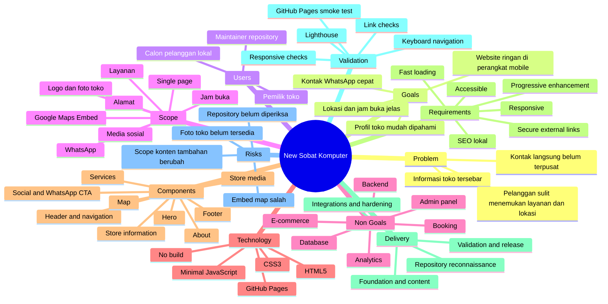
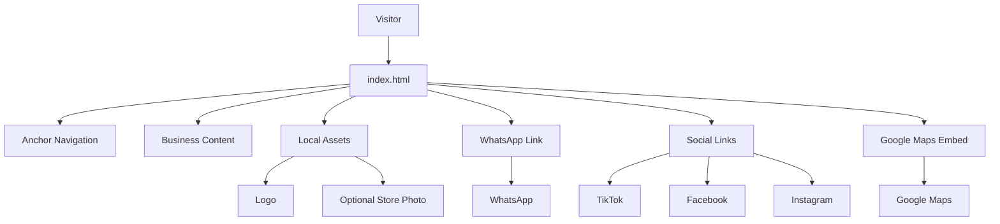
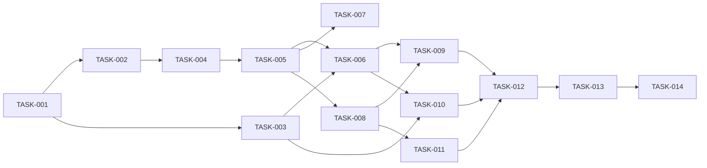

# Planning Package: New Sobat Komputer

## 1. Document Control

| Field | Value |
|---|---|
| Planning status | **READY WITH ASSUMPTIONS** |
| Project mode | Greenfield implementation in an existing but uninspected repository |
| Planning depth | Standard |
| Primary objective | Membangun website profil toko statis, responsif, ramah pengguna lokal, dan dapat diterbitkan melalui GitHub Pages |
| Intended implementer | Human atau lower-tier AI coding model |
| Repository state | Repository tersedia tetapi belum diberikan |
| Technology selection | AI-selected |
| Clarification status | Partial; satu area konten ditunda dan repository belum diperiksa |
| Confidence | Medium |
| Output filename | `plan-new-sobat-komputer.md` |
| Last updated | 2026-07-17 |

### Planning Scope

Planning ini mencakup:

- Website statis satu halaman untuk toko **New Sobat Komputer**.
- Informasi layanan, alamat, jam operasional, kontak, media sosial, logo, foto toko, dan peta.
- Navigasi menuju bagian-bagian halaman.
- CTA WhatsApp dengan pesan awal.
- Desain sederhana dan ramah untuk masyarakat lokal.
- Responsivitas, aksesibilitas dasar, SEO lokal, keamanan tautan eksternal, dan performa.
- Deployment ke GitHub Pages.
- Atomic task yang dapat diberikan kepada coding agent lain.

### Planning Exclusions

Planning ini tidak mencakup:

- E-commerce, keranjang belanja, checkout, atau pembayaran.
- Sistem booking atau tiket service.
- Backend, database, autentikasi, atau panel admin.
- Chat widget pihak ketiga.
- Analytics, iklan, cookie tracking, atau consent management.
- Blog atau CMS.
- Multi-bahasa.
- Custom domain pada rilis awal.
- Konten tambahan yang masih dijawab “Nanti”, sampai pengguna memberikan detail.
- Source code produksi.

### Evidence Quality

- Informasi bisnis, layanan, kontak, gaya desain, struktur halaman, dan tautan sosial berasal langsung dari pengguna.
- Link Google Maps telah teridentifikasi mengarah ke tempat bernama **New Sobat Komputer** dengan koordinat sekitar `-7.3924116, 109.5058119`.
- GitHub Pages secara resmi mendukung hosting file HTML, CSS, dan JavaScript statis dari repository.
- Fakta repository belum dapat diverifikasi karena repository belum diberikan.
- Semua path repository di dokumen ini adalah **proposed structure**, bukan verified existing path.

---

## 2. Executive Summary

New Sobat Komputer membutuhkan website profil publik yang membuat calon pelanggan lokal dapat memahami layanan toko, mengetahui jam buka dan alamat, melihat identitas toko, membuka lokasi pada Google Maps, serta menghubungi toko melalui WhatsApp. Website harus sederhana, terasa ramah bagi masyarakat lokal, ringan di perangkat seluler, dan dapat diterbitkan tanpa server melalui GitHub Pages.

Pendekatan yang direkomendasikan adalah website satu halaman berbasis HTML5, CSS3, dan JavaScript minimal tanpa framework, backend, database, package manager, atau proses build. Struktur halaman meliputi header dan navigasi, hero, pengenalan toko, layanan, jam operasional, alamat, media sosial, area foto toko, CTA WhatsApp, Google Maps Embed, dan footer. JavaScript hanya digunakan untuk progressive enhancement seperti navigasi seluler dan perilaku ringan; konten penting harus tetap dapat dibaca ketika JavaScript tidak berjalan.

Stack ini dipilih karena GitHub Pages merupakan hosting statis yang dapat menerbitkan HTML, CSS, dan JavaScript langsung dari repository. Deployment awal direkomendasikan melalui publishing source dari branch setelah struktur repository diverifikasi. Entry point harus berupa `index.html` pada root publishing source yang dipilih.

Risiko terbesar adalah repository belum diperiksa, foto toko belum tersedia, detail konten tambahan belum diputuskan, dan kode embed Google Maps harus dikonfirmasi dari lokasi resmi agar tidak menggunakan pin yang salah. Risiko tersebut tidak memblokir planning, karena dapat ditangani melalui task reconnaissance, fallback tanpa foto rusak, dan validasi integrasi sebelum rilis.

Delivery dibagi menjadi empat milestone dan empat belas atomic task. Critical path adalah reconnaissance repository → kontrak konten → struktur semantik → visual dan konten inti → integrasi kontak/peta → hardening → validasi → deployment. Planning dinilai **READY WITH ASSUMPTIONS** dan siap digunakan setelah implementer memulai dengan task reconnaissance.

---

## 3. Intake Decisions

| Item | Value | Source | Confidence |
|---|---|---|---|
| Project name | New Sobat Komputer | User Decision | High |
| Project type | Static business profile website | User Decision | High |
| Main objective | Menampilkan profil toko dan memudahkan pelanggan menghubungi serta menemukan lokasi toko | Reasoned Inference dari requirement pengguna | High |
| Target users | Calon pelanggan di Kejobong, Purbalingga, dan wilayah sekitar | Reasoned Inference | Medium |
| Target platform | Browser desktop dan mobile | AI Recommendation | High |
| Page model | Single-page dengan anchor navigation | User Decision | High |
| Visual direction | Sederhana dan ramah untuk masyarakat lokal | User Decision | High |
| Hosting | GitHub Pages | User Decision | High |
| Primary conversion | Klik WhatsApp | Reasoned Inference | High |
| Repository mode | Existing repository, not yet provided | User Decision | High |
| Primary language | Bahasa Indonesia | Reasoned Inference | High |
| Business phone | `+62 857-4274-4594` | User Decision | High |
| Address | Jalan Raya Kejobong, Purbalingga, sebelah barat Puskesmas Kejobong | User Decision | High |
| Operating hours | Senin–Sabtu, 08.00–16.00 | User Decision | High |

---

## 4. Technology Decisions

### Technology Preference

```text
Technology preference: AI-selected
```

### Selected Stack

| Layer | Technology | Decision source | Rationale | Alternatives | Confidence |
|---|---|---|---|---|---|
| Markup | Semantic HTML5 | AI Recommendation | Native, accessible, SEO-friendly, directly supported GitHub Pages | JSX, templates | High |
| Styling | Native CSS3 with custom properties | AI Recommendation | No dependency, easy branding, small payload | Bootstrap, Tailwind CSS | High |
| Client behavior | Minimal vanilla JavaScript ES6+ | AI Recommendation | Sufficient for mobile navigation and progressive enhancement | No JavaScript, framework JS | High |
| Frontend framework | None | AI Recommendation | Scope does not justify framework or build pipeline | React, Vue, Astro | High |
| Backend | None | AI Recommendation | All content is public and static | Serverless functions | High |
| Database | None | AI Recommendation | No dynamic data or user account | JSON API, CMS | High |
| Build tool | None | AI Recommendation | Direct publishing is simplest | Vite, Parcel | High |
| Package manager | None required | AI Recommendation | No runtime dependencies | npm, pnpm | High |
| Deployment | GitHub Pages publishing source from verified branch/folder | User Decision + AI Recommendation | Native fit for static assets | Custom Actions workflow | High |
| CI/CD | Existing repository workflow if present; otherwise GitHub Pages native publishing | AI Recommendation | Avoid unnecessary workflow complexity | Custom Pages workflow | Medium |
| Map integration | Google Maps iframe embed plus normal map link fallback | User Decision + AI Recommendation | Visible location at bottom and resilient fallback | Static map image | High |
| Contact integration | `wa.me` deep link with encoded message | User Decision + AI Recommendation | Direct customer contact without backend | Form service | High |
| Icons | Inline SVG or text labels | AI Recommendation | No external icon dependency | Icon font, external CDN | Medium |
| Testing | Browser matrix, responsive checks, accessibility audit, Lighthouse, link validation | AI Recommendation | Matches static site risk profile | Full E2E suite | High |

### Technology Constraints

- Website must run as static files on GitHub Pages.
- Website must not require backend, database, environment secret, or server-side rendering.
- Content utama must remain usable without JavaScript.
- Asset paths must work under a GitHub project Pages subpath, not only at domain root.
- Do not add a framework or package dependency without a newly approved requirement.
- Do not use an external CDN for critical CSS, fonts, or icons unless explicitly approved.

### Technology Rejected

| Technology | Decision | Reason |
|---|---|---|
| React/Vue | Rejected for initial scope | Adds build tooling and runtime complexity without product need |
| Tailwind/Bootstrap | Rejected for initial scope | Native CSS is sufficient and avoids dependency payload |
| Backend/API | Rejected | No dynamic server-side behavior |
| Database/CMS | Rejected | Content volume is small and owner can edit repository files |
| Third-party WhatsApp widget | Rejected | A direct link is simpler, faster, and less privacy-invasive |
| Analytics | Deferred | Not requested and would introduce privacy/cookie considerations |

### Technology Assumptions

- **TECH-ASM-001:** Repository permits static files at root or a documented publishing directory.
- **TECH-ASM-002:** GitHub Pages is enabled or can be enabled by the repository owner.
- **TECH-ASM-003:** No Jekyll-specific behavior is required.
- **TECH-ASM-004:** A custom domain is not required for the first release.
- **TECH-ASM-005:** Browser-native system fonts are acceptable.
- **TECH-ASM-006:** The store does not require an online form because WhatsApp is the primary contact channel.

### Targeted Research Summary

| Research ID | Finding | Source | Planning impact | Accessed | Confidence |
|---|---|---|---|---|---|
| RES-001 | GitHub Pages hosts static HTML, CSS, and JavaScript from a repository | Official GitHub Docs: “What is GitHub Pages?” | Confirms no backend/build is required | 2026-07-17 | High |
| RES-002 | Publishing can be configured from a selected branch and folder | Official GitHub Docs: “Configuring a publishing source” | Deployment task must verify branch/folder | 2026-07-17 | High |
| RES-003 | GitHub Pages expects `index.html` at the top level of the publishing source | Official GitHub Docs: “Troubleshooting 404 errors” | Entry-point acceptance criterion | 2026-07-17 | High |
| RES-004 | User’s short Google Maps link resolves to “New Sobat Komputer” near `-7.3924116, 109.5058119` | Redirect result from user-provided Google Maps URL | Supports location validation and fallback map link | 2026-07-17 | Medium |

Official references:

- [What is GitHub Pages?](https://docs.github.com/en/pages/getting-started-with-github-pages/what-is-github-pages)
- [Configuring a publishing source](https://docs.github.com/en/pages/getting-started-with-github-pages/configuring-a-publishing-source-for-your-github-pages-site)
- [Troubleshooting GitHub Pages 404 errors](https://docs.github.com/en/pages/getting-started-with-github-pages/troubleshooting-404-errors-for-github-pages-sites)

---

## 5. Clarification Results

| Question | Answer | Answer mode | Planning impact | Confidence |
|---|---|---|---|---|
| Q1 — Gaya visual | Sederhana dan ramah untuk masyarakat lokal | User | Gunakan bahasa jelas, visual hangat, dan hindari nuansa korporat/gaming berlebihan | High |
| Q2 — Struktur halaman | Satu halaman dengan navigasi menuju setiap bagian | User | Single document dengan semantic sections dan anchor links | High |
| Q3 — Media sosial | TikTok, Facebook, dan Instagram diberikan | User | Tautan dapat dimasukkan tanpa placeholder | High |
| Q4 — Lokasi | Link Google Maps diberikan | User | Sediakan iframe embed dan fallback menuju link tersebut | High |
| Q5 — Aset | Logo transparan | User | Logo wajib didukung; foto toko belum tersedia | High |
| Q6 — Konten tambahan | “Nanti” | Deferred by user | Konten tambahan tidak masuk rilis awal; layout harus mudah diperluas | Medium |
| Q7 — Pesan WhatsApp | “Halo New Sobat Komputer, saya mendapatkan informasi dari website.” | User | Gunakan pesan URL-encoded pada semua CTA WhatsApp | High |
| Q8 — Repository | Repository sudah ada dan akan diberikan nanti | User | TASK-001 wajib reconnaissance sebelum mengedit | High |

### Skipped or Deferred Questions

- Q6 belum memiliki konten spesifik.
- Foto toko disebut pada intake awal, tetapi aset yang dikonfirmasi saat klarifikasi hanya logo transparan.
- Nama branch, publishing directory, workflow, dan URL GitHub Pages belum diketahui.

### AI-Determined Answers

- Bahasa utama: Bahasa Indonesia.
- Website menggunakan system font.
- Konten tambahan tidak ditampilkan sebagai placeholder publik.
- Area foto hanya ditampilkan ketika aset foto valid tersedia; tidak boleh ada broken image.
- Tidak ada form kontak atau analytics pada rilis awal.
- Map iframe menggunakan lazy loading dan link fallback.

### Blocking Questions

Tidak ada pertanyaan blocking untuk planning. Repository access adalah blocking untuk **mulai mengubah file**, bukan untuk menghasilkan planning.

### Assumptions Created from Clarification

- **ASM-001:** Rilis awal hanya memuat informasi yang telah tersedia.
- **ASM-002:** Logo transparan akan disediakan dalam format web-compatible.
- **ASM-003:** Foto toko dapat ditambahkan kemudian tanpa mengubah arsitektur.
- **ASM-004:** Link media sosial tetap publik dan aktif saat validasi rilis.
- **ASM-005:** Google Maps Embed dapat dibuat dari tempat yang sama dengan link yang diberikan.

---

## 6. Context and Repository Findings

### 6.1 Problem Context

**Symptom:**  
Calon pelanggan belum memiliki halaman web resmi yang menggabungkan layanan, jam buka, alamat, media sosial, peta, dan kontak WhatsApp dalam satu tempat.

**Root cause:**  
Informasi toko tersebar pada kanal sosial dan komunikasi langsung, sehingga pelanggan harus mencari atau bertanya secara manual.

**Requested solution:**  
Website statis satu halaman yang mendukung GitHub Pages.

**Recommended solution:**  
Landing page HTML/CSS/JS ringan dengan CTA WhatsApp utama, informasi lokal yang mudah dibaca, navigasi anchor, map embed di bagian bawah, dan fallback pada semua integrasi eksternal.

### 6.2 Current-System Summary

Repository belum tersedia untuk diperiksa. Kondisi berikut belum diverifikasi:

- Struktur directory.
- Existing files.
- Active branch.
- GitHub Pages source.
- Existing workflow.
- Naming convention.
- Existing CSS/JS.
- Existing license atau README.
- Existing domain or `CNAME`.
- Existing validation commands.
- Existing image assets.

Implementation must begin with repository reconnaissance. Do not overwrite existing work before identifying active entry point and publishing source.

### 6.3 Verified Evidence

| Evidence ID | Location | Verified finding | Planning impact |
|---|---|---|---|
| EVID-001 | User intake | Nama toko adalah New Sobat Komputer | Branding dan metadata |
| EVID-002 | User intake | Website harus statis dan mendukung GitHub Pages | Architecture and deployment |
| EVID-003 | User intake | WhatsApp: `+62 857-4274-4594` | Contact contract |
| EVID-004 | User intake | Alamat dan jam buka tersedia | Location and operations sections |
| EVID-005 | User intake | Empat kelompok layanan tersedia | Services section |
| EVID-006 | User clarification | Single-page dan visual sederhana/ramah | Information architecture and design |
| EVID-007 | User clarification | Social URLs tersedia | External-link integration |
| EVID-008 | User clarification | WhatsApp prefilled message tersedia | CTA contract |
| EVID-009 | Google Maps redirect | Link mengarah ke New Sobat Komputer | Map validation |
| EVID-010 | Official GitHub Docs | Static HTML/CSS/JS can be hosted by GitHub Pages | Confirms technology fit |

### 6.4 Assumptions

#### ASM-001 — Bahasa utama Indonesia

- **Assumption:** Semua copy publik menggunakan Bahasa Indonesia.
- **Reason:** Target pengguna lokal dan seluruh requirement diberikan dalam Bahasa Indonesia.
- **Risk if wrong:** Pengunjung non-Indonesia mungkin membutuhkan terjemahan.
- **Affected sections:** PRD, UX, SEO.
- **Validation:** Konfirmasi saat review konten.

#### ASM-002 — No backend

- **Assumption:** Tidak ada fitur yang mengirim atau menyimpan data pengguna.
- **Reason:** Kontak dilakukan melalui WhatsApp dan seluruh konten bersifat publik.
- **Risk if wrong:** Fitur baru dapat memerlukan architecture revision.
- **Affected sections:** Technology, security, deployment.
- **Validation:** Review scope sebelum implementasi.

#### ASM-003 — Foto toko belum tersedia

- **Assumption:** Rilis dapat berjalan dengan logo dan layout content-first tanpa broken image.
- **Reason:** Aset yang dikonfirmasi hanya logo transparan.
- **Risk if wrong:** Hero/galeri perlu penyesuaian saat foto diberikan.
- **Affected sections:** Hero, media section, performance.
- **Validation:** Inventory asset pada TASK-001 dan TASK-003.

#### ASM-004 — Repository path belum diketahui

- **Assumption:** Proposed paths dapat disesuaikan setelah reconnaissance.
- **Reason:** Repository belum diberikan.
- **Risk if wrong:** Implementer dapat mengubah lokasi yang bukan publishing source.
- **Affected sections:** Repository tree, all tasks.
- **Validation:** TASK-001.

#### ASM-005 — No custom domain

- **Assumption:** Rilis awal menggunakan URL bawaan GitHub Pages.
- **Reason:** Custom domain belum disebut.
- **Risk if wrong:** SEO canonical, base URL, dan `CNAME` perlu diperbarui.
- **Affected sections:** Metadata and deployment.
- **Validation:** TASK-001/TASK-014.

#### ASM-006 — No analytics

- **Assumption:** Tidak ada analytics atau tracking.
- **Reason:** Tidak diminta dan tidak diperlukan untuk tujuan utama.
- **Risk if wrong:** Perlu privacy disclosure dan consent analysis.
- **Affected sections:** Privacy and observability.
- **Validation:** Owner review.

### 6.5 Project Invariants

- Nama dan nomor kontak toko tidak boleh berubah tanpa instruksi pengguna.
- Jam buka harus ditampilkan sebagai Senin–Sabtu, 08.00–16.00.
- Empat kelompok layanan wajib tetap terlihat.
- Semua informasi utama harus dapat dibaca tanpa JavaScript.
- Tidak boleh ada backend, database, secret, atau API key pada client.
- Asset paths must be relative and safe for GitHub project Pages subpaths.
- External links must not break page navigation.
- Missing store photo must not create a broken image or empty unusable section.
- Map integration must include a normal link fallback.
- Changes must remain inside website scope; no opportunistic refactor.
- Repository conventions override proposed filenames after verification.

---

## 7. Planning Mind Map

### 7.1 Mermaid Mind Map



### 7.2 Markmap-Compatible Hierarchy

# New Sobat Komputer

## Problem
### Informasi toko tersebar
### Pelanggan sulit menemukan layanan dan lokasi
### Kontak langsung belum terpusat

## Goals
### Profil toko mudah dipahami
### Kontak WhatsApp cepat
### Lokasi dan jam buka jelas
### Website ringan di perangkat mobile

## Users
### Calon pelanggan lokal
### Pemilik toko
### Maintainer repository

## Scope
### Single-page
### Informasi layanan
### Jam buka dan alamat
### Media sosial
### WhatsApp
### Logo dan foto toko
### Google Maps Embed

## Non-Goals
### E-commerce
### Booking
### Backend dan database
### Admin panel
### Analytics

## Technology
### HTML5
### CSS3
### Minimal JavaScript
### GitHub Pages
### No build

## Components
### Header dan navigasi
### Hero
### Tentang
### Layanan
### Informasi toko
### Kontak dan sosial
### Media toko
### Peta
### Footer

## Delivery
### Repository reconnaissance
### Foundation dan content
### Integrations dan hardening
### Validation dan release

## Validation
### Link checks
### Responsive checks
### Accessibility checks
### Lighthouse
### Deployment smoke test

## Risks
### Repository belum diperiksa
### Foto toko belum tersedia
### Map embed tidak tepat
### Konten tambahan berubah

---

## 8. Unicode Tree Structure

### 8.1 Product Hierarchy

```text
New Sobat Komputer
├── 1. Product
│   ├── Problem
│   │   ├── Informasi layanan belum terpusat
│   │   ├── Kontak dan lokasi sulit ditemukan cepat
│   │   └── Tidak ada profil web resmi yang ringan
│   ├── Goals
│   │   ├── Menjelaskan layanan toko
│   │   ├── Mengarahkan pelanggan ke WhatsApp
│   │   ├── Menampilkan jam buka dan lokasi
│   │   └── Membangun kepercayaan melalui identitas visual
│   ├── Users
│   │   ├── Calon pelanggan lokal
│   │   ├── Pelanggan yang mencari service/perangkat
│   │   └── Pemilik atau pengelola toko
│   ├── Scope
│   │   ├── Single-page responsive
│   │   ├── Empat kategori layanan
│   │   ├── Kontak dan media sosial
│   │   ├── Logo dan foto toko bila tersedia
│   │   └── Google Maps Embed
│   └── Non-Goals
│       ├── Transaksi online
│       ├── Booking
│       ├── Login/admin
│       └── Database
├── 2. Technology
│   ├── Frontend
│   │   ├── HTML5
│   │   ├── CSS3
│   │   └── Minimal JavaScript
│   ├── Backend
│   │   └── None
│   ├── Database
│   │   └── None
│   ├── Infrastructure
│   │   └── GitHub Pages
│   └── Testing
│       ├── Browser/manual
│       ├── Accessibility
│       ├── Lighthouse
│       └── Link and deployment smoke checks
├── 3. System
│   ├── Navigation
│   ├── Hero and About
│   ├── Services
│   ├── Store Information
│   ├── Contact and Social
│   ├── Store Media
│   ├── Map Integration
│   └── Footer
├── 4. Data
│   ├── Business Identity
│   ├── Service Catalog
│   ├── Operating Hours
│   ├── Contact Links
│   ├── Social URLs
│   └── Map Location
├── 5. Delivery
│   ├── Milestone 1 — Discovery and Contracts
│   ├── Milestone 2 — Core Page
│   ├── Milestone 3 — Integration and Hardening
│   └── Milestone 4 — Validation and Release
├── 6. Validation
│   ├── Functional checks
│   ├── Responsive checks
│   ├── Accessibility checks
│   ├── Performance checks
│   └── GitHub Pages checks
└── 7. Risks
    ├── Technical
    │   ├── Unknown repository structure
    │   └── GitHub Pages path mismatch
    ├── Content
    │   ├── Missing store photo
    │   └── Deferred additional content
    └── Operational
        ├── External links may change
        └── Map embed may load slowly
```

### 8.2 Proposed Repository Tree

This tree is a proposal only. Every path must be reconciled with the existing repository during TASK-001.

```text
repository/
├── index.html                         # VERIFY existing; CREATE or MODIFY
├── .nojekyll                          # CREATE only if plain branch publishing needs Jekyll bypass
├── assets/                            # VERIFY existing; CREATE if absent
│   ├── css/
│   │   └── styles.css                 # CREATE or MODIFY
│   ├── js/
│   │   └── main.js                    # CREATE or MODIFY; optional minimal enhancement
│   └── images/
│       ├── [verified-logo-file]       # PROVIDED asset; filename to confirm
│       └── [future-store-photo]       # OPTIONAL; do not fabricate
├── README.md                          # MODIFY or CREATE
└── [existing-repository-files]        # READ and PRESERVE
```

### 8.3 Delivery Hierarchy

```text
Implementation Plan
├── MILESTONE-01 Discovery and Contracts
│   ├── TASK-001 Reconnoiter repository and Pages configuration
│   ├── TASK-002 Freeze business content and integration contracts
│   └── TASK-003 Inventory and prepare visual assets
├── MILESTONE-02 Core Page
│   ├── TASK-004 Build semantic page shell and navigation
│   ├── TASK-005 Establish visual design foundation
│   ├── TASK-006 Implement hero and store introduction
│   ├── TASK-007 Implement services section
│   └── TASK-008 Implement hours, address, and contact information
├── MILESTONE-03 Integration and Hardening
│   ├── TASK-009 Implement WhatsApp and social integrations
│   ├── TASK-010 Implement store-photo capability and fallback
│   ├── TASK-011 Implement Google Maps section and fallback
│   └── TASK-012 Harden responsive, accessibility, SEO, and performance
└── MILESTONE-04 Validation and Release
    ├── TASK-013 Execute cross-browser and acceptance validation
    └── TASK-014 Document and publish through GitHub Pages
```

---

## 9. Proposed Repository Structure

### 9.1 Logical Structure

The system is a static document application with no server trust boundary.

- **Content layer:** Business identity, service text, operating hours, contact, and location.
- **Presentation layer:** Semantic HTML sections and native CSS.
- **Enhancement layer:** Optional JavaScript for mobile navigation and small interaction behavior.
- **External integration layer:** WhatsApp, TikTok, Facebook, Instagram, and Google Maps.
- **Hosting layer:** GitHub Pages.

Dependency direction:

```text
Content → Semantic HTML → CSS presentation
                      ↘ Optional JavaScript enhancement
                      ↘ External links and iframe
GitHub Pages → Serves all local static assets
```

No user-submitted data is owned or persisted by this site.

### 9.2 Repository Structure Rules

- Prefer the repository’s existing convention after reconnaissance.
- `index.html` must be at the top level of the selected publishing source.
- Use relative local paths such as `assets/css/styles.css`; do not assume deployment at `/`.
- Do not create `package.json` unless the repository already uses one or validation requirements are explicitly expanded.
- Do not add generated build output.
- Do not include image files that the user has not supplied.
- Avoid duplicate content files for a single-page site.
- Keep external URLs in one clearly documented area of the HTML or existing configuration convention.

### 9.3 Component Responsibility Matrix

| Component | Responsibility | Inputs | Outputs | Dependencies | Invariants |
|---|---|---|---|---|---|
| Page shell | Document metadata, landmarks, section order | Content contract | Valid semantic page | None | Works without JS |
| Navigation | Link to page sections | Section IDs | Anchor navigation | Page shell | All anchors valid |
| Hero | Introduce store and primary CTA | Name, tagline, logo | First-view content | Logo asset, WhatsApp contract | CTA visible on mobile |
| About | Explain store role and local value | Approved copy | Trust-building content | Content contract | No invented claims |
| Services | Present four service groups | Service list | Readable cards/list | Content contract | All four groups shown |
| Store info | Show hours and address | Hours, address | Operational details | Content contract | Exact values preserved |
| Contact/social | Open WhatsApp and social accounts | URLs and message | External navigation | Browser | Safe external-link attributes |
| Store media | Show photo only when available | Verified photo asset | Responsive image | Asset inventory | No broken image |
| Map | Display location and fallback link | Verified map place/embed | Lazy iframe and link | Google Maps | Correct location and title |
| Footer | Repeat essential identity/contact | Store name, year | Closing content | Page shell | No false legal claims |

### 9.4 Data and Control Flow



### 9.5 Configuration Structure

There are no runtime environment variables or secrets.

Configuration-like values:

| Value | Source | Handling |
|---|---|---|
| Store name | User | Visible HTML and metadata |
| Phone display | User | Human-readable text |
| WhatsApp normalized number | Derived | `6285742744594` |
| WhatsApp message | User | URL-encoded in `wa.me` link |
| Address | User | Visible HTML |
| Hours | User | Visible HTML and structured data if used |
| Social URLs | User | Exact external links |
| Map link | User | Fallback link |
| Map embed URL | Derived/verified during implementation | Iframe `src`; no API key |
| Base URL/canonical | Repository/domain discovery | Do not guess before TASK-001 |

### 9.6 State and Data Ownership

| Data | Owner | Persistence | Mutation | Retention |
|---|---|---|---|---|
| Business content | Store owner | Git repository | Commit-based edits | Until changed |
| Logo/photo | Store owner | Git repository | File replacement | Until changed |
| Social URLs | Store owner | Git repository | HTML/config edit | Until changed |
| Visitor data | None | Not stored | None | None |
| Map provider data | Google | External | External | Subject to provider |
| WhatsApp conversation | Store and visitor via WhatsApp | External | External | Subject to WhatsApp |

---

## 10. Product Requirements Document

### 10.1 Product Overview

New Sobat Komputer website is a public, single-page business profile for a local computer-service store. It presents essential business information and directs visitors to WhatsApp, social media, and the physical location.

### 10.2 Problem Statement

Calon pelanggan New Sobat Komputer mengalami kesulitan menemukan informasi layanan, jam operasional, kontak, dan lokasi dalam satu tempat ketika mencari bantuan komputer atau perangkat terkait, yang menyebabkan pelanggan harus bertanya manual atau berpindah antarplatform.

### 10.3 Goals

| ID | Goal | Success signal | Measurement |
|---|---|---|---|
| GOAL-001 | Menjelaskan layanan toko dengan cepat | Semua empat layanan terlihat dan mudah dipindai | Manual content audit |
| GOAL-002 | Memudahkan kontak melalui WhatsApp | CTA membuka nomor dan pesan yang benar | Functional link test |
| GOAL-003 | Memudahkan pelanggan menemukan toko | Alamat, patokan, map embed, dan fallback link tersedia | Map acceptance test |
| GOAL-004 | Menyediakan pengalaman mobile yang baik | Tidak ada horizontal overflow pada viewport 360 px | Responsive test |
| GOAL-005 | Menjaga website ringan dan mudah dirawat | Tidak ada framework/backend/build requirement | Architecture audit |
| GOAL-006 | Mendukung pencarian lokal dasar | Metadata toko, layanan, alamat, dan jam tersedia | SEO audit |

### 10.4 Non-Goals

- **NOGOAL-001:** Melakukan transaksi jual beli secara online.
- **NOGOAL-002:** Menerima booking service melalui form.
- **NOGOAL-003:** Menyediakan akun pelanggan.
- **NOGOAL-004:** Menyimpan data pengguna.
- **NOGOAL-005:** Menyediakan dashboard admin.
- **NOGOAL-006:** Menyediakan daftar produk atau harga dinamis.
- **NOGOAL-007:** Menyediakan analytics pada rilis awal.

### 10.5 Users and Actors

#### Actor A — Calon pelanggan lokal

- **Identity:** Pengguna mobile atau desktop yang membutuhkan service atau produk.
- **Need:** Mengetahui layanan, jam buka, alamat, dan cara menghubungi toko.
- **Permission:** Public read-only.
- **Entry point:** Search engine, shared link, atau social media.
- **Expected outcome:** Menghubungi toko atau membuka petunjuk arah.
- **Failure impact:** Pelanggan meninggalkan website atau menghubungi lokasi yang salah.

#### Actor B — Pemilik/pengelola toko

- **Identity:** Pemilik informasi bisnis.
- **Need:** Website mudah diperbarui dan tidak membutuhkan server.
- **Permission:** Repository write access outside website runtime.
- **Entry point:** Git repository.
- **Expected outcome:** Mengubah konten/aset melalui commit.
- **Failure impact:** Informasi publik menjadi kedaluwarsa.

#### Actor C — Repository maintainer

- **Identity:** Human developer atau coding agent.
- **Need:** Requirement eksplisit, path terverifikasi, dan deployment sederhana.
- **Permission:** Repository access.
- **Entry point:** Planning package and repository.
- **Expected outcome:** Implementasi scope secara atomik.
- **Failure impact:** Deployment rusak atau scope drift.

### 10.6 User and System Stories

- **US-001:** Sebagai calon pelanggan, saya ingin melihat jenis layanan agar saya tahu apakah toko dapat membantu kebutuhan saya.
- **US-002:** Sebagai calon pelanggan, saya ingin membuka WhatsApp dengan satu klik agar saya dapat bertanya tanpa menyalin nomor.
- **US-003:** Sebagai calon pelanggan, saya ingin melihat jam buka agar saya tidak datang ketika toko tutup.
- **US-004:** Sebagai calon pelanggan, saya ingin melihat alamat, patokan, dan peta agar saya dapat menemukan toko.
- **US-005:** Sebagai calon pelanggan, saya ingin membuka akun sosial resmi agar saya dapat melihat informasi toko lainnya.
- **US-006:** Sebagai pengelola toko, saya ingin konten berbentuk static files agar pemeliharaan dan hosting sederhana.
- **US-007:** Sebagai pengguna mobile, saya ingin tampilan mudah dibaca dan tombol mudah disentuh agar saya dapat menggunakan situs dengan nyaman.
- **SS-001:** Sebagai sistem, website harus dapat disajikan oleh GitHub Pages tanpa backend.
- **SS-002:** Sebagai sistem, informasi utama harus tersedia ketika JavaScript gagal atau dinonaktifkan.
- **SS-003:** Sebagai sistem, kegagalan map iframe tidak boleh menghilangkan link menuju Google Maps.

### 10.7 Primary Use Cases

#### UC-001 — Menilai kecocokan layanan

- **Trigger:** Visitor opens the website.
- **Preconditions:** Static page loads.
- **Main flow:** Visitor reads hero → scans service categories → identifies relevant service.
- **Alternative flow:** Visitor uses navigation to jump directly to services.
- **Failure flow:** If decorative assets fail, service text remains readable.
- **Output:** Visitor understands service scope.
- **Postconditions:** Visitor may continue to WhatsApp or location.

#### UC-002 — Menghubungi toko melalui WhatsApp

- **Trigger:** Visitor selects a WhatsApp CTA.
- **Preconditions:** Device/browser can open the WhatsApp URL.
- **Main flow:** Browser opens `wa.me` link → number and message are prefilled.
- **Alternative flow:** Visitor copies the displayed phone number.
- **Failure flow:** If app is unavailable, browser handles WhatsApp web or shows provider error; number remains visible.
- **Output:** A conversation can be started.
- **Postconditions:** Communication moves outside the website.

#### UC-003 — Menemukan lokasi toko

- **Trigger:** Visitor reaches location section.
- **Preconditions:** Map provider is accessible.
- **Main flow:** Visitor views map → selects map or direction link.
- **Alternative flow:** Visitor reads textual address and landmark.
- **Failure flow:** If iframe fails, fallback map link and address remain available.
- **Output:** Visitor receives location information.
- **Postconditions:** Navigation continues in Google Maps.

#### UC-004 — Mengetahui jam operasional

- **Trigger:** Visitor navigates to store information.
- **Preconditions:** Page content loads.
- **Main flow:** Visitor reads day range and hours.
- **Alternative flow:** Information is repeated near contact CTA if design allows.
- **Failure flow:** No dynamic “open now” status is shown, preventing timezone or holiday inaccuracies.
- **Output:** Visitor knows normal operating schedule.
- **Postconditions:** Visitor can decide when to contact/visit.

### 10.8 Functional Requirements

| ID | Requirement | Priority | Source | Acceptance method |
|---|---|---|---|---|
| FR-001 | Website shall provide one public HTML page with semantic sections and anchor navigation. | Must | User | AC-001, markup audit |
| FR-002 | Header/navigation shall link to all major sections and each target ID shall exist. | Must | User + AI | AC-002, link test |
| FR-003 | Hero shall show the name “New Sobat Komputer”, a concise value statement, and a primary WhatsApp CTA. | Must | User + AI | AC-003 |
| FR-004 | Website shall show the transparent logo supplied by the user with meaningful alternative text. | Must | User | AC-004 |
| FR-005 | Website shall show these services: service laptop/PC/printer; jual beli laptop/PC/printer; pemasangan CCTV; pemasangan internet rumah iPrime. | Must | User | AC-005 |
| FR-006 | Website shall show operating hours as Senin–Sabtu, 08.00–16.00. | Must | User | AC-006 |
| FR-007 | Website shall show the address “Jalan Raya Kejobong, Purbalingga” and landmark “Sebelah barat Puskesmas Kejobong.” | Must | User | AC-007 |
| FR-008 | Every primary WhatsApp CTA shall target normalized number `6285742744594` and prefill the approved message. | Must | User | AC-008 |
| FR-009 | Website shall provide exact TikTok, Facebook, and Instagram links supplied by the user. | Must | User | AC-009 |
| FR-010 | External links opened in a new tab shall use `rel="noopener noreferrer"`. | Must | AI Recommendation | Security audit |
| FR-011 | Website shall include Google Maps Embed in the lowest content region before the footer. | Must | User | AC-010 |
| FR-012 | Map section shall include the visible textual address and a normal link to the supplied Google Maps location. | Must | AI Recommendation | AC-010 |
| FR-013 | Map iframe shall use a descriptive title and lazy loading. | Must | AI Recommendation | Markup/performance audit |
| FR-014 | Website shall support a store photo when an approved asset is available. | Should | User intake | AC-011 |
| FR-015 | When a store photo is unavailable, the page shall not render a broken image or false stock photo. | Must | AI Recommendation | AC-011 |
| FR-016 | Footer shall show store identity, navigation/contact access, and a non-misleading copyright line. | Should | AI Recommendation | Content audit |
| FR-017 | Primary content shall remain available without JavaScript. | Must | AI Recommendation | AC-012 |
| FR-018 | Mobile navigation enhancement, if used, shall expose an accessible control and preserve anchor links. | Should | AI Recommendation | Keyboard test |
| FR-019 | Page shall include local-business metadata: title, description, viewport, canonical when known, and appropriate social preview fields when asset/base URL are known. | Must | AI Recommendation | SEO audit |
| FR-020 | Content shall not claim unsupported certifications, pricing, turnaround time, warranties, partnerships, or service coverage. | Must | Safety/accuracy | Content audit |
| FR-021 | Content sections shall be structured so approved additional content can be added later without changing hosting architecture. | Should | User deferred Q6 | Architecture review |
| FR-022 | The website shall expose a visible phone number fallback separate from the WhatsApp deep link. | Must | AI Recommendation | AC-008 |
| FR-023 | All local asset references shall work from the selected GitHub Pages publishing subpath. | Must | Deployment constraint | AC-013 |
| FR-024 | The production publishing source shall contain a top-level `index.html`. | Must | Official GitHub Pages behavior | AC-013 |

### 10.9 Non-Functional Requirements

| ID | Requirement | Measure |
|---|---|---|
| PERF-001 | Initial local page payload, excluding third-party map resources, should remain below 1.5 MB after image optimization. | Network audit |
| PERF-002 | Map iframe shall be below the fold and lazy-loaded. | Markup and network audit |
| PERF-003 | Lighthouse mobile Performance target shall be at least 90 under a repeatable test profile, or deviations shall be documented. | Lighthouse report |
| PERF-004 | No render-blocking third-party font, icon, or framework request shall be required for core content. | Network audit |
| ACC-001 | The page shall target WCAG 2.2 AA for applicable static-page criteria. | Accessibility audit |
| ACC-002 | All interactive elements shall be reachable and operable by keyboard. | Keyboard test |
| ACC-003 | Normal text contrast shall meet at least 4.5:1; large text at least 3:1. | Contrast check |
| ACC-004 | Touch targets for primary controls should be at least 44×44 CSS pixels. | Responsive inspection |
| ACC-005 | Focus indication shall remain visible. | Keyboard inspection |
| COMP-001 | Layout shall work at widths 360 px, 768 px, 1024 px, and 1440 px without horizontal overflow. | Viewport test |
| COMP-002 | Site shall support current stable Chrome, Edge, Firefox, and Safari, plus common Android WebView behavior where practical. | Browser smoke tests |
| COMP-003 | Core content and links shall remain usable when JavaScript is disabled. | No-JS test |
| SEC-001 | No secret, token, API key, private contact data, or credential shall be committed. | Repository scan |
| SEC-002 | External new-tab links shall prevent opener access. | Markup audit |
| SEC-003 | No unsanitized user input or dynamic HTML injection shall be introduced. | Code audit |
| PRIV-001 | Site shall not collect or persist visitor data. | Architecture audit |
| PRIV-002 | Third-party network exposure shall be limited to user-requested integrations and documented map embedding. | Network audit |
| REL-001 | Failure of logo/photo/map/social providers shall not hide textual business information. | Negative-path test |
| MAINT-001 | Business contact values shall not be duplicated inconsistently across files. | Code/content review |
| MAINT-002 | CSS shall use reusable custom properties for core spacing, typography, and brand colors. | Code review |
| SEO-001 | Page shall have one unique H1 and a logical heading hierarchy. | Markup audit |
| SEO-002 | Metadata shall describe the store, primary services, and Kejobong/Purbalingga location without keyword stuffing. | Content review |
| SEO-003 | Structured data may be added only with verified facts and a valid public URL. | Structured-data validation |
| LOC-001 | Visible customer-facing copy shall use clear Bahasa Indonesia and avoid unexplained technical jargon. | Content review |

### 10.10 Input and Output Contracts

#### Business identity

```text
Store name: New Sobat Komputer
Phone display: +62 857-4274-4594
WhatsApp normalized number: 6285742744594
Address line: Jalan Raya Kejobong, Purbalingga.
Landmark: Sebelah barat Puskesmas Kejobong.
Hours: Senin–Sabtu, 08.00–16.00
```

#### Service catalog

```text
1. Service Laptop, PC dan printer
2. Jual Beli Laptop, PC dan printer
3. Pemasangan CCTV
4. Pemasangan Internet Rumah (iPrime)
```

#### WhatsApp contract

```text
Base: https://wa.me/6285742744594
Message: Halo New Sobat Komputer, saya mendapatkan informasi dari website.
Behavior: URL-encode the message; preserve punctuation and number.
Fallback: Display human-readable phone number.
```

#### Social contract

```text
TikTok: https://www.tiktok.com/@faizmuqoro?_r=1&_t=ZS-986XrogH8gk
Facebook: https://www.facebook.com/sobat.komputer/
Instagram: https://www.instagram.com/sobat_komp?igsh=bTNydHkxdXB6ZmVm
```

Implementer should preserve the exact user URLs for initial release. A later maintenance pass may replace tracking/share query parameters only after confirming the canonical profile URL resolves correctly.

#### Map contract

```text
User link: https://maps.app.goo.gl/cxNxjCxVBrSPXgYX7
Resolved place: New Sobat Komputer
Approximate coordinates: -7.3924116, 109.5058119
Embed: Obtain/verify a no-key Google Maps embed for the same place.
Fallback: Keep the user-provided Maps link visible and clickable.
```

### 10.11 Edge Cases

| Edge case | Required behavior |
|---|---|
| Logo file has unexpected dimensions | Preserve aspect ratio and cap rendered size |
| Logo file is missing | Fail validation; do not silently ship a broken brand image |
| Store photo is missing | Omit photo element or use a deliberate content-only layout |
| Map iframe is blocked | Address and fallback Maps link remain visible |
| WhatsApp app is not installed | Browser may open WhatsApp Web; visible number remains available |
| Social account is unavailable | No page crash; link validation reports failure |
| JavaScript disabled | Navigation anchors and all content still work |
| Very narrow viewport | No horizontal scroll; CTA remains reachable |
| Long user agent font scaling | Layout reflows without clipped text |
| Reduced motion enabled | Disable or minimize nonessential animation |
| GitHub project-site subpath | Relative assets resolve correctly |
| Repository uses `/docs` publishing | Files are placed/updated in that verified directory |
| Existing site already has content | Preserve unrelated behavior and reconcile sections rather than overwrite blindly |
| Business closes on holidays | Do not show dynamic “open now”; display normal schedule only |
| External URL includes query parameters | Encode attributes safely and retain exact URL semantics |

### 10.12 UX and Developer Experience

#### UX principles

- Lead with the store name, value proposition, and WhatsApp CTA.
- Use familiar Indonesian wording and service names.
- Keep section labels predictable: Beranda, Layanan, Tentang, Lokasi, Kontak.
- Repeat the primary CTA after high-intent sections without overwhelming the page.
- Use visual hierarchy rather than dense paragraphs.
- Do not hide essential information inside carousels, modals, or hover-only interactions.
- Place map near the bottom as requested.
- Clearly distinguish external links from internal navigation.

#### Developer experience

- No build command required for normal content edits.
- Clear README deployment instructions.
- Small files with obvious responsibilities.
- No unnecessary abstraction.
- Content values documented in one place.
- Every task reports files changed and validation evidence.

### 10.13 Analytics and Observability

Initial release:

- No analytics.
- No cookies or tracking code.
- Operational observability is limited to GitHub Pages deployment status and manual uptime checks.
- Broken-link and Lighthouse reports should be attached to the release evidence when practical.
- If analytics is later requested, create a separate planning change addressing privacy, consent, data retention, and vendor selection.

### 10.14 Security and Privacy

- No authentication or authorization boundary exists.
- No user input is collected.
- No data is stored by the site.
- Do not use `innerHTML` for navigation state or other dynamic output.
- Use only `https` external destinations.
- New-tab links require `noopener noreferrer`.
- Do not commit private repository credentials or Google API keys.
- Prefer a no-key embed generated by Google Maps sharing tools.
- Avoid external scripts for icons, animation, or chat.
- Map iframe causes a third-party request; keep it lazy-loaded and below the fold.
- Do not log WhatsApp messages or visitor identifiers.
- Do not publish hidden metadata from source images; strip unnecessary EXIF from store photos.

### 10.15 Compatibility

- Static hosting: GitHub Pages.
- Publishing source: branch/folder to be verified.
- Entry file: `index.html` at publishing-source root.
- Use relative paths.
- Avoid unsupported server features such as redirects requiring server configuration.
- If a 404 page is later needed, add it as a separate scoped task.
- Existing repository licensing and workflow conventions must be preserved.

### 10.16 Acceptance Criteria

#### AC-001 — Single-page structure

```gherkin
Scenario: Visitor opens the home page
  Given the GitHub Pages site is deployed
  When the visitor loads the root site URL
  Then one complete public page is displayed
  And all required content sections are present
```

#### AC-002 — Anchor navigation

```gherkin
Scenario: Visitor uses section navigation
  Given the page is loaded
  When the visitor activates a navigation link
  Then the browser moves to the matching section
  And the destination ID exists
```

#### AC-003 — Primary hero CTA

```gherkin
Scenario: Visitor sees the first viewport
  Given the page is viewed at 360 pixels width
  When the hero is displayed
  Then the store name is visible
  And a WhatsApp CTA is reachable without horizontal scrolling
```

#### AC-004 — Logo

```gherkin
Scenario: Store branding loads
  Given the verified transparent logo exists
  When the page loads
  Then the logo is displayed without distortion
  And it has meaningful alternative text
```

#### AC-005 — Services

```gherkin
Scenario: Visitor reviews services
  Given the visitor opens the services section
  When the section is displayed
  Then all four approved service groups are present
  And no unsupported service claim is added
```

#### AC-006 — Hours

```gherkin
Scenario: Visitor reviews operating hours
  Given the store information section is visible
  When the visitor reads the schedule
  Then it states Senin–Sabtu
  And it states 08.00–16.00
```

#### AC-007 — Address

```gherkin
Scenario: Visitor reviews the address
  Given the location information is visible
  When the visitor reads the address
  Then Jalan Raya Kejobong, Purbalingga is shown
  And the landmark west of Puskesmas Kejobong is shown
```

#### AC-008 — WhatsApp integration

```gherkin
Scenario: Visitor contacts the store
  Given a WhatsApp CTA is visible
  When the visitor activates the CTA
  Then the destination uses number 6285742744594
  And the approved message is prefilled
  And the human-readable phone number remains visible on the page
```

#### AC-009 — Social links

```gherkin
Scenario: Visitor opens a social account
  Given the social section is visible
  When the visitor activates TikTok, Facebook, or Instagram
  Then the exact approved account URL is used
  And a new-tab link cannot access the opener window
```

#### AC-010 — Map

```gherkin
Scenario: Visitor locates the store
  Given the location section is near the bottom of the page
  When the visitor reaches the section
  Then a Google Maps embed for New Sobat Komputer is present
  And the address is visible
  And a fallback link opens the approved Maps location
```

#### AC-011 — Missing store photo

```gherkin
Scenario: Store photo is not yet supplied
  Given no verified store photo exists
  When the page is released
  Then no broken image is rendered
  And the layout remains complete and intentional
```

#### AC-012 — JavaScript unavailable

```gherkin
Scenario: JavaScript is disabled
  Given the visitor disables JavaScript
  When the page loads
  Then all business information is readable
  And internal anchors and external contact links remain usable
```

#### AC-013 — GitHub Pages deployment

```gherkin
Scenario: Site is published
  Given the repository publishing source is configured
  When the release commit is deployed
  Then the Pages URL returns the website
  And index.html is at the publishing-source root
  And local CSS, JavaScript, and image assets return successfully
```

#### AC-014 — Responsive and accessible behavior

```gherkin
Scenario: Visitor uses keyboard on a small screen
  Given the page is displayed at 360 pixels width
  When the visitor tabs through interactive elements
  Then focus remains visible
  And every required action is operable
  And no horizontal overflow occurs
```

### 10.17 Definition of Done

- [ ] All Must functional requirements are implemented.
- [ ] All acceptance criteria pass or have a documented, approved deviation.
- [ ] Repository reconnaissance evidence is recorded.
- [ ] Existing repository behavior outside scope remains unchanged.
- [ ] Logo asset is verified and optimized.
- [ ] No broken local or external link is knowingly shipped.
- [ ] Responsive checks pass at required widths.
- [ ] Keyboard and accessibility checks pass.
- [ ] Lighthouse targets are met or deviations are documented.
- [ ] No secrets, API keys, debug code, placeholder claims, or stock-photo misrepresentation remain.
- [ ] Google Maps location matches the approved place.
- [ ] GitHub Pages deployment is successful and smoke-tested.
- [ ] README documents content edits and publishing source.
- [ ] Completion evidence lists files, tests/checks, results, assumptions, and deviations.

---

## 11. Technical Design and Architecture

### 11.1 Recommended Approach

Implement a progressively enhanced, static single-page website:

1. Semantic HTML provides all content and navigation.
2. Native CSS establishes a friendly local visual identity, responsive layout, and accessible states.
3. Minimal JavaScript enhances mobile navigation only where necessary.
4. External integrations use direct HTTPS links and one lazy Google Maps iframe.
5. GitHub Pages serves repository files from the verified publishing source.
6. No build, framework, backend, database, or secrets are introduced.

### 11.2 Architectural Decisions

### ADR-001: Use plain static web technologies

**Status:** Accepted  
**Context:** The website contains public business information and must run on GitHub Pages.  
**Decision:** Use semantic HTML5, native CSS, and minimal vanilla JavaScript.  
**Rationale:** Lowest operational complexity and direct compatibility with static hosting.  
**Alternatives considered:** React, Vue, Astro, Bootstrap, Tailwind.  
**Trade-offs:** Repeated content updates are manual; there is no component compiler.  
**Consequences:** Fast load, simple deployment, low dependency risk.  
**Requirements addressed:** FR-001, FR-017, FR-023, FR-024, PERF-004, MAINT-001.

### ADR-002: Use a single-page anchored information architecture

**Status:** Accepted  
**Context:** The user explicitly requested one page with navigation to each section.  
**Decision:** Use section landmarks with stable IDs and anchor links.  
**Rationale:** Appropriate for a small set of related business information.  
**Alternatives considered:** Multiple pages.  
**Trade-offs:** The page can become long if future content expands significantly.  
**Consequences:** Simple navigation and one deployment entry point.  
**Requirements addressed:** FR-001, FR-002, FR-021.

### ADR-003: Keep JavaScript nonessential

**Status:** Accepted  
**Context:** Static information must remain available under failure conditions.  
**Decision:** JavaScript may enhance mobile navigation but cannot be required for business content or primary links.  
**Rationale:** Improves reliability, accessibility, and maintainability.  
**Alternatives considered:** JavaScript-rendered content.  
**Trade-offs:** Fewer advanced animations and dynamic UI patterns.  
**Consequences:** No-JS acceptance test is mandatory.  
**Requirements addressed:** FR-017, FR-018, COMP-003, REL-001.

### ADR-004: Use direct external links and a lazy map iframe

**Status:** Accepted  
**Context:** WhatsApp, social media, and Google Maps are required.  
**Decision:** Use direct HTTPS links, safe new-tab attributes, a lazy iframe, and visible fallback content.  
**Rationale:** Avoids SDKs, API keys, and third-party scripts.  
**Alternatives considered:** Social SDKs, chat widget, Maps JavaScript API.  
**Trade-offs:** Provider availability remains external; map still adds network cost.  
**Consequences:** Integrations remain isolated and fail gracefully.  
**Requirements addressed:** FR-008–FR-013, SEC-001, SEC-002, PRIV-002.

### ADR-005: Use content-first media fallbacks

**Status:** Accepted  
**Context:** Only the transparent logo is confirmed; store photo is pending.  
**Decision:** Do not ship fake stock photography or broken image placeholders. Render a complete content layout and add the photo only after asset verification.  
**Rationale:** Preserves accuracy and visual quality.  
**Alternatives considered:** Generic stock photo or blank placeholder.  
**Trade-offs:** Initial page may be less visually rich.  
**Consequences:** Media section is optional at runtime but its architecture is planned.  
**Requirements addressed:** FR-004, FR-014, FR-015, REL-001.

### ADR-006: Publish from the repository’s verified Pages source

**Status:** Proposed until TASK-001  
**Context:** Repository exists but is not available for inspection.  
**Decision:** Prefer native “Deploy from a branch” for plain static files; retain an existing verified workflow if the repository already uses one correctly.  
**Rationale:** Avoid replacing a functioning deployment model.  
**Alternatives considered:** New custom GitHub Actions workflow.  
**Trade-offs:** Final deployment details cannot be frozen before repository access.  
**Consequences:** TASK-001 must identify branch/folder and TASK-014 must validate production.  
**Requirements addressed:** FR-023, FR-024, AC-013.

### 11.3 Alternatives Considered

| Alternative | Benefit | Reason not selected |
|---|---|---|
| React/Vite SPA | Component model and local tooling | Unnecessary build/dependency complexity |
| Astro | Strong static generation | Content volume does not justify generator |
| Bootstrap | Fast layout primitives | Generic visual result and extra payload |
| Tailwind CSS | Utility workflow | Requires build or large prebuilt CSS |
| Google Maps JavaScript API | Rich map controls | Requires API key and more client code |
| Contact form service | Structured inquiries | Adds data processing and third-party dependency |
| Multi-page site | More room for future content | User explicitly selected single-page |
| Remote image CDN | Image transformations | Adds vendor dependency; local optimized assets are sufficient |

### 11.4 Interfaces

#### Internal anchor interface

| Section purpose | Proposed ID | Requirement |
|---|---|---|
| Home/hero | `beranda` | FR-002 |
| About | `tentang` | FR-002 |
| Services | `layanan` | FR-002 |
| Store information | `informasi` | FR-002 |
| Location/map | `lokasi` | FR-002 |
| Contact/social | `kontak` | FR-002 |

IDs are proposed and must be reconciled with existing markup.

#### External link interface

- WhatsApp: exact normalized number and encoded message.
- TikTok/Facebook/Instagram: exact approved URLs.
- Maps: exact approved fallback link plus verified embed.
- All links: HTTPS.
- New tabs: `target="_blank"` only with `rel="noopener noreferrer"`.

#### Asset interface

- Logo: transparent PNG, WebP, or SVG supplied by owner.
- Photo: approved JPEG/WebP/PNG only.
- Every raster image: explicit width/height when known, responsive sizing, optimized file size.
- Do not convert SVG containing untrusted scripts without inspection.

### 11.5 Error-Handling Strategy

| Error category | Behavior |
|---|---|
| Missing local stylesheet/script | Release validation fails; do not publish knowingly |
| Missing logo | Release blocked until corrected |
| Missing store photo | Omit the image; continue with content layout |
| Map provider failure | Keep address and fallback link visible |
| Social link failure | Keep page functional; report during validation |
| WhatsApp handler unavailable | Keep phone number visible |
| JavaScript exception | Static page and links remain functional |
| Invalid anchor | Validation fails before release |
| GitHub Pages 404 | Verify publishing source and top-level `index.html` |
| Asset subpath failure | Convert root-absolute paths to verified relative paths |

No retries, server errors, transactions, or exit codes are applicable to the public runtime.

### 11.6 Test Strategy

#### Unit-level static checks

- Validate normalized phone number and encoded message.
- Verify required section IDs and matching navigation links.
- Verify required text values and social URLs.
- Verify all local assets referenced by markup exist.
- Verify new-tab security attributes.

Use repository-native validation if available. Do not invent commands before TASK-001.

#### Integration checks

- Open WhatsApp destination.
- Open each social profile.
- Load the exact Google Maps place.
- Load CSS, JS, and image assets from the deployed Pages subpath.

#### End-to-end/manual checks

- Navigate the entire page at 360 px and 1440 px.
- Keyboard-only navigation.
- JavaScript-disabled behavior.
- Browser smoke tests.
- Map blocked/offline fallback.

#### Performance checks

- Lighthouse mobile.
- Network request inspection.
- Image size and dimension audit.
- Confirm map lazy loading.

#### Accessibility checks

- Automated browser audit.
- Heading and landmark inspection.
- Color contrast.
- Focus visibility.
- Alternative text and iframe title.

#### Security checks

- Secret scan.
- New-tab opener check.
- No dynamic HTML injection.
- No unnecessary third-party scripts.

### 11.7 Migration Strategy

No data migration is required. If an existing website is present:

1. Capture current behavior and publishing source.
2. Preserve unrelated files.
3. Replace or merge only approved page areas.
4. Preview before changing production source.
5. Keep a rollback commit/reference.

### 11.8 Rollout Strategy

Use a direct release after local/preview validation:

1. Implement on a feature branch if repository workflow supports it.
2. Review rendered site.
3. Merge to the verified publishing branch.
4. Wait for Pages deployment result.
5. Smoke-test the public URL.
6. Roll back the release commit if critical content, asset, or routing fails.

### 11.9 Documentation Plan

README shall document:

- Website purpose.
- Publishing branch/folder.
- Main file locations.
- How to replace logo and add a store photo.
- Where to edit phone, address, hours, services, social URLs, and map.
- Validation steps actually used by the repository.
- Deployment and rollback process.
- Known deferred content.

---

## 12. Delivery Strategy

| Milestone | Objective | Requirements | Entry criteria | Exit criteria | Main risks |
|---|---|---|---|---|---|
| MILESTONE-01 | Verify repository and freeze contracts | All facts, FR-023, FR-024 | Repository access | Paths, Pages source, content, and assets documented | Unknown existing structure |
| MILESTONE-02 | Build core page and approved content | FR-001–FR-007, FR-016–FR-018 | M1 complete | Semantic responsive draft works without integrations | Content/layout drift |
| MILESTONE-03 | Add integrations and hardening | FR-008–FR-015, FR-019–FR-022 | Core page stable | WhatsApp, social, map, accessibility, SEO, performance complete | External provider issues |
| MILESTONE-04 | Validate and publish | All Must requirements | M3 complete | Acceptance tests pass and public Pages URL works | Deployment path/404 |

### Critical Path

```text
TASK-001 → TASK-002 → TASK-004 → TASK-005 → TASK-006
→ TASK-008 → TASK-009 → TASK-011 → TASK-012 → TASK-013 → TASK-014
```

### Parallel Workstreams

- TASK-003 can run after TASK-001 and in parallel with TASK-002.
- TASK-007 and TASK-008 can run after the shell/design foundation.
- TASK-010 can run when assets are known and does not block textual sections.
- Documentation notes should be updated during each task; final consolidation is TASK-014.

### Gates

- **Review gate:** After TASK-008, verify content and visual direction.
- **Integration gate:** After TASK-011, verify all external destinations.
- **Test gate:** TASK-013.
- **Documentation gate:** TASK-014.
- **Release gate:** Public Pages smoke test.

---

## 13. Task Dependency Map



- No circular dependency exists.
- Repository access is required for every implementation task and is first isolated in TASK-001.
- The main bottleneck is correct publishing-source discovery.
- Tests are embedded in every task; TASK-013 provides full regression and acceptance validation.

---

## 14. Task Index

| ID | Title | Milestone | Priority | Depends on | Parallel group | Complexity | Risk | Requirement coverage |
|---|---|---|---|---|---|---|---|---|
| TASK-001 | Reconnoiter repository and Pages configuration | M1 | Must | None | P0 | S | High | FR-023, FR-024 |
| TASK-002 | Freeze business content and integration contracts | M1 | Must | TASK-001 | P1 | S | Medium | FR-003, FR-005–FR-013, FR-020, FR-022 |
| TASK-003 | Inventory and prepare visual assets | M1 | Must | TASK-001 | P1 | S | Medium | FR-004, FR-014, FR-015 |
| TASK-004 | Build semantic page shell and navigation | M2 | Must | TASK-002 | P2 | M | Medium | FR-001, FR-002, FR-017, FR-018 |
| TASK-005 | Establish visual design foundation | M2 | Must | TASK-004 | P3 | M | Medium | ACC-003–ACC-005, MAINT-002, LOC-001 |
| TASK-006 | Implement hero and store introduction | M2 | Must | TASK-003, TASK-005 | P4 | S | Low | FR-003, FR-004, FR-020 |
| TASK-007 | Implement services section | M2 | Must | TASK-005 | P4 | S | Low | FR-005, FR-020 |
| TASK-008 | Implement hours, address, and contact information | M2 | Must | TASK-005 | P4 | S | Low | FR-006, FR-007, FR-022 |
| TASK-009 | Implement WhatsApp and social integrations | M3 | Must | TASK-006, TASK-008 | P5 | S | Medium | FR-008–FR-010, FR-022 |
| TASK-010 | Implement store-photo capability and fallback | M3 | Should | TASK-003, TASK-006 | P5 | S | Low | FR-014, FR-015 |
| TASK-011 | Implement Google Maps section and fallback | M3 | Must | TASK-008 | P5 | S | Medium | FR-011–FR-013 |
| TASK-012 | Harden responsive, accessibility, SEO, and performance | M3 | Must | TASK-009–TASK-011 | P6 | M | High | FR-017–FR-021, all NFRs |
| TASK-013 | Execute cross-browser and acceptance validation | M4 | Must | TASK-012 | P7 | M | High | AC-001–AC-014 |
| TASK-014 | Document and publish through GitHub Pages | M4 | Must | TASK-013 | P8 | S | High | FR-023, FR-024, AC-013 |

---

## 15. Detailed Atomic Tasks

## TASK-001 — Reconnoiter Repository and Pages Configuration

### Metadata

| Field | Value |
|---|---|
| Milestone | MILESTONE-01 |
| Priority | Must |
| Complexity | S |
| Risk | High |
| Depends on | None |
| Blocks | TASK-002, TASK-003 |
| Parallel group | P0 |
| Suggested change unit | One commit containing documentation only, if changes are needed |
| Requirements | FR-023, FR-024, AC-013 |

### Objective

Produce verified evidence of repository structure, existing website behavior, and active GitHub Pages publishing configuration before editing source files.

### Why This Task Exists

Repository facts are unknown. Editing before discovery could overwrite existing work or publish from the wrong directory.

### Context for the Implementer

- Repository exists but has not been provided during planning.
- All paths in this planning package are proposals.
- ADR-006 remains proposed until this task completes.

### Read Before Editing

- Repository root.
- README and contribution documentation.
- Existing `index.html` or other entry point.
- Existing workflows under the repository’s workflow directory.
- Existing Pages configuration visible in repository settings, when access permits.
- Existing `CNAME`, `.nojekyll`, build files, and asset directories.

### Expected Files

| Status | Path | Purpose |
|---|---|---|
| READ | Repository root | Identify structure and conventions |
| READ | Existing documentation | Identify commands and deployment |
| READ | Existing workflow/configuration locations | Identify Pages publishing behavior |
| VERIFY | Active publishing source | Confirm branch and folder |
| MODIFY | Planning implementation notes or README only if appropriate | Record verified findings |

### Implementation Steps

1. List repository directories and files.
2. Identify language/tooling markers and package manager, if any.
3. Locate the active page entry point.
4. Identify current local asset conventions.
5. Identify existing scripts and validation commands.
6. Check whether Pages deploys from branch/folder or Actions.
7. Identify current public Pages URL and any custom domain.
8. Record verified evidence and reconcile proposed paths.
9. Stop and report if the repository contains a conflicting application or destructive migration risk.

### Required Behavior

- Report only verified facts.
- Identify all files likely to be modified.
- Confirm whether `index.html` is at publishing-source root.
- Confirm whether root-relative asset paths are safe.

### Must Preserve

- Existing license, history, workflows, and unrelated files.
- Existing public behavior not superseded by approved requirements.
- Any valid custom-domain configuration.

### Explicitly Out of Scope

- Building page sections.
- Replacing deployment workflow.
- Adding dependencies.
- Refactoring unrelated repository code.

### Edge Cases

- Repository is empty.
- Pages is not enabled.
- Pages publishes from `/docs`.
- Existing workflow builds another framework.
- Existing site already uses Jekyll.
- Repository has a custom domain.
- Access does not permit viewing settings.

### Error Behavior

If publishing source cannot be verified, mark TASK-001 **Blocked** and report the missing access or information. Do not guess.

### Testing Requirements

#### Automated Tests

- None required unless repository already provides a safe discovery/validation command.

#### Manual Verification

- Confirm public URL if available.
- Confirm root/publishing entry file.
- Confirm existing commands from documentation.

#### Suggested Validation Commands

Use only the repository’s existing documented commands. Do not invent package scripts.

### Acceptance Criteria

- [ ] Repository structure is documented with evidence.
- [ ] Active publishing source is known or explicitly blocked.
- [ ] Existing validation commands are known.
- [ ] Proposed paths are reconciled.
- [ ] No unrelated files are modified.

### Completion Evidence

Report repository tree summary, verified entry point, publishing source, workflows, commands, constraints, and remaining unknowns.

### Rollback

Revert any documentation-only commit created by this task.

### Lower-Tier Execution Prompt

You are implementing TASK-001 from the approved planning package. Inspect the repository before editing. Report verified files, entry points, Pages configuration, validation commands, and conflicts. Do not build features or invent paths.

---

## TASK-002 — Freeze Business Content and Integration Contracts

### Metadata

| Field | Value |
|---|---|
| Milestone | MILESTONE-01 |
| Priority | Must |
| Complexity | S |
| Risk | Medium |
| Depends on | TASK-001 |
| Blocks | TASK-004 |
| Parallel group | P1 |
| Suggested change unit | One commit or documented review change |
| Requirements | FR-003, FR-005–FR-013, FR-020, FR-022 |

### Objective

Create a single verified content contract for all business text, links, hours, address, services, and external destinations.

### Why This Task Exists

Inconsistent duplicated values can send customers to the wrong contact or location.

### Context for the Implementer

Use the contracts in PRD section 10.10. Do not rewrite business facts or add marketing claims without approval.

### Read Before Editing

- Verified content locations from TASK-001.
- Existing website copy, if present.
- PRD sections 10.8 and 10.10.

### Expected Files

| Status | Path | Purpose |
|---|---|---|
| READ | Verified page/content files | Compare existing values |
| MODIFY | Verified page/content source | Establish approved content |
| VERIFY | Any existing metadata or structured data | Prevent inconsistent facts |

### Implementation Steps

1. Normalize display and machine forms of the phone number.
2. Encode the approved WhatsApp message.
3. Copy the four services exactly in meaning.
4. Preserve hours and address.
5. Preserve the exact social URLs for release.
6. Record the approved Google Maps fallback link.
7. Remove unsupported claims from existing content.
8. Ensure future copy uses consistent naming: “New Sobat Komputer.”

### Required Behavior

- One approved value per business fact.
- No invented price, warranty, speed, brand authorization, coverage, or turnaround promise.

### Must Preserve

- User-provided spellings and links unless a verified technical correction is required.
- The explicit iPrime service label.

### Explicitly Out of Scope

- Visual styling.
- Additional content from Q6.
- Canonicalizing social tracking parameters without validation.

### Edge Cases

- Existing content uses a different phone or store name.
- Social URL redirects.
- Existing map points elsewhere.
- Existing copy contains unsupported claims.

### Error Behavior

Conflicting business facts must be reported for owner decision; do not choose silently.

### Testing Requirements

#### Automated Tests

Where repository tooling exists, assert required values and links.

#### Manual Verification

Open each external destination and compare visible business details.

#### Suggested Validation Commands

Use verified repository commands only.

### Acceptance Criteria

- [ ] All approved facts are represented consistently.
- [ ] WhatsApp target and message are correct.
- [ ] Four services, hours, and address match the PRD.
- [ ] Unsupported claims are absent.
- [ ] No unrelated files are modified.

### Completion Evidence

Report final business values, conflicts found, links tested, and files changed.

### Rollback

Revert the content-contract commit.

### Lower-Tier Execution Prompt

Implement only the approved business-content contract. Do not improve or invent marketing claims. Report every changed value and any conflict with existing repository content.

---

## TASK-003 — Inventory and Prepare Visual Assets

### Metadata

| Field | Value |
|---|---|
| Milestone | MILESTONE-01 |
| Priority | Must |
| Complexity | S |
| Risk | Medium |
| Depends on | TASK-001 |
| Blocks | TASK-006, TASK-010 |
| Parallel group | P1 |
| Suggested change unit | One asset-focused commit |
| Requirements | FR-004, FR-014, FR-015, PERF-001 |

### Objective

Verify the transparent logo and determine whether an approved store photo exists, then prepare only supplied assets for web use.

### Why This Task Exists

Unverified or oversized images can break branding, performance, or accuracy.

### Context for the Implementer

The logo is confirmed conceptually, but filename, dimensions, and format are unknown. Store photo is not yet confirmed as an available file.

### Read Before Editing

- Asset directories found in TASK-001.
- Supplied image files.
- Existing image references and licensing notes.

### Expected Files

| Status | Path | Purpose |
|---|---|---|
| READ | Verified image directory | Inventory existing assets |
| CREATE/MODIFY | Verified logo path | Add or optimize supplied logo |
| CREATE | Store photo path only if supplied | Add approved store photo |
| VERIFY | HTML references | Prevent broken assets |

### Implementation Steps

1. Identify the exact logo file and verify transparency.
2. Inspect dimensions, format, file size, and visible quality.
3. Optimize without changing the logo’s appearance.
4. Preserve aspect ratio and transparency.
5. Strip unnecessary metadata from raster assets.
6. Check for an approved store photo.
7. If no photo exists, record the content-only fallback decision.
8. Document recommended rendered dimensions.

### Required Behavior

- Use only owner-supplied or explicitly approved assets.
- No stock photo may be presented as the real store.
- No font files are added.

### Must Preserve

- Logo proportions, colors, and transparent background.
- Original source asset outside optimized output if repository conventions retain originals.

### Explicitly Out of Scope

- Redesigning the logo.
- Generating a new photo.
- Building page markup.

### Edge Cases

- Logo has opaque background.
- Logo is low resolution.
- Filename contains spaces or unsafe characters.
- Multiple conflicting logo versions exist.
- Photo contains sensitive metadata or people requiring approval.

### Error Behavior

Block logo-dependent release if no usable logo can be verified. Store photo absence is non-blocking.

### Testing Requirements

#### Automated Tests

Check referenced file existence if repository tooling supports it.

#### Manual Verification

Inspect transparency, sharpness, aspect ratio, and file size.

#### Suggested Validation Commands

Use existing verified image or repository commands only.

### Acceptance Criteria

- [ ] A verified transparent logo is ready.
- [ ] Asset path and dimensions are documented.
- [ ] Store-photo availability is explicitly recorded.
- [ ] No unapproved image is added.
- [ ] Performance budget is considered.

### Completion Evidence

Report asset filenames, formats, sizes, dimensions, optimization performed, and missing assets.

### Rollback

Restore original asset files and references.

### Lower-Tier Execution Prompt

Inventory only verified visual assets. Prepare the supplied transparent logo and optional approved store photo. Never invent or download substitute imagery.

---

## TASK-004 — Build Semantic Page Shell and Navigation

### Metadata

| Field | Value |
|---|---|
| Milestone | MILESTONE-02 |
| Priority | Must |
| Complexity | M |
| Risk | Medium |
| Depends on | TASK-002 |
| Blocks | TASK-005 |
| Parallel group | P2 |
| Suggested change unit | One page-structure commit |
| Requirements | FR-001, FR-002, FR-017, FR-018, SEO-001 |

### Objective

Create or adapt the single-page semantic document, landmarks, ordered sections, and internal navigation.

### Why This Task Exists

Every later component depends on stable section boundaries and accessible navigation.

### Context for the Implementer

Use verified paths from TASK-001. Proposed IDs are `beranda`, `tentang`, `layanan`, `informasi`, `lokasi`, and `kontak`.

### Read Before Editing

- Existing entry HTML.
- Existing CSS/JS that controls navigation.
- ADR-002 and ADR-003.
- Verified content contract.

### Expected Files

| Status | Path | Purpose |
|---|---|---|
| MODIFY/CREATE | Verified `index.html` | Semantic page shell |
| MODIFY/CREATE | Verified minimal JS file, only if needed | Mobile navigation enhancement |
| READ | Existing styles | Preserve behavior |

### Implementation Steps

1. Add language, charset, viewport, title placeholder sourced from contract, and base semantic document.
2. Add skip link.
3. Create header, navigation, main, section, and footer landmarks.
4. Assign unique section IDs and matching navigation anchors.
5. Keep all anchors usable without JavaScript.
6. If a mobile toggle is necessary, implement it as progressive enhancement with correct ARIA state.
7. Add empty structural positions only for approved sections; do not publish placeholder copy.

### Required Behavior

- One H1.
- Logical heading order.
- Valid unique IDs.
- Keyboard-operable navigation.
- No content rendered solely by JavaScript.

### Must Preserve

- Existing repository framework conventions if TASK-001 finds a valid static architecture.
- Unrelated metadata and functionality unless conflicting with PRD.

### Explicitly Out of Scope

- Final visual styling.
- Full section copy implementation.
- External integrations.

### Edge Cases

- Existing page has multiple H1s.
- Sticky header obscures anchor targets.
- Mobile navigation remains open after selection.
- JS fails.
- Reduced motion is enabled.

### Error Behavior

Navigation must fall back to visible anchor links if enhancement fails.

### Testing Requirements

#### Automated Tests

Validate unique IDs and anchor targets using repository tooling where available.

#### Manual Verification

Keyboard navigation, skip link, no-JS navigation, heading outline.

#### Suggested Validation Commands

Use verified repository commands only.

### Acceptance Criteria

- [ ] FR-001 and FR-002 are satisfied.
- [ ] Every major section has a valid target.
- [ ] Core navigation works without JavaScript.
- [ ] Semantic landmarks and one H1 exist.
- [ ] No unrelated files are modified.

### Completion Evidence

Report section order, IDs, navigation behavior, files changed, and tests.

### Rollback

Revert the page-shell commit.

### Lower-Tier Execution Prompt

Build only the semantic single-page shell and navigation. Keep JavaScript optional and preserve existing repository conventions.

---

## TASK-005 — Establish Visual Design Foundation

### Metadata

| Field | Value |
|---|---|
| Milestone | MILESTONE-02 |
| Priority | Must |
| Complexity | M |
| Risk | Medium |
| Depends on | TASK-004 |
| Blocks | TASK-006, TASK-007, TASK-008 |
| Parallel group | P3 |
| Suggested change unit | One styling-foundation commit |
| Requirements | ACC-003–ACC-005, MAINT-002, LOC-001 |

### Objective

Implement a reusable CSS foundation that feels simple, friendly, local, readable, and responsive.

### Why This Task Exists

Consistent spacing, typography, color, and controls are needed before section-specific styling.

### Context for the Implementer

Follow the logo’s verified colors where suitable, but prioritize contrast and readability. Do not force a gaming aesthetic.

### Read Before Editing

- Existing CSS architecture.
- Verified logo colors.
- Semantic shell.
- Accessibility NFRs.

### Expected Files

| Status | Path | Purpose |
|---|---|---|
| MODIFY/CREATE | Verified stylesheet | Design tokens and layout primitives |
| READ | Existing HTML | Match semantic classes |
| VERIFY | Existing global styles | Avoid regressions |

### Implementation Steps

1. Define CSS custom properties for spacing, typography, surface, border, focus, and brand accents.
2. Use system font stacks.
3. Add box sizing, responsive media defaults, and readable line length.
4. Style buttons/links with visible states.
5. Create reusable container, section, grid, card, and CTA patterns.
6. Add focus-visible treatment.
7. Add reduced-motion handling.
8. Avoid fixed heights that clip content.

### Required Behavior

- Clear visual hierarchy.
- Contrast targets met.
- Primary controls meet touch-size guidance.
- No horizontal overflow at 360 px.

### Must Preserve

- Logo integrity.
- Browser default semantics where custom styling is unnecessary.
- User zoom and text scaling.

### Explicitly Out of Scope

- Adding external fonts.
- Section-specific content.
- Complex animation.
- Theme switcher.

### Edge Cases

- Long Indonesian text.
- 200% zoom.
- High-contrast/focus use.
- Very wide desktop.
- Missing image.

### Error Behavior

If logo colors fail contrast, use them as non-text accents rather than forcing inaccessible text colors.

### Testing Requirements

#### Automated Tests

Run existing CSS lint or style checks only if present.

#### Manual Verification

Contrast, focus, zoom, required viewport widths.

#### Suggested Validation Commands

Use verified repository commands only.

### Acceptance Criteria

- [ ] Reusable visual tokens exist.
- [ ] Focus is visible.
- [ ] Contrast requirements are met.
- [ ] Layout is stable at 360 px.
- [ ] No external font/icon dependency is introduced.

### Completion Evidence

Report design tokens, responsive rules, accessibility checks, and screenshots if repository workflow expects them.

### Rollback

Revert styling-foundation changes.

### Lower-Tier Execution Prompt

Create the visual foundation only. Use native CSS, system fonts, accessible contrast, and reusable patterns. Do not add frameworks or external assets.

---

## TASK-006 — Implement Hero and Store Introduction

### Metadata

| Field | Value |
|---|---|
| Milestone | MILESTONE-02 |
| Priority | Must |
| Complexity | S |
| Risk | Low |
| Depends on | TASK-003, TASK-005 |
| Blocks | TASK-009, TASK-010 |
| Parallel group | P4 |
| Suggested change unit | One section-focused commit |
| Requirements | FR-003, FR-004, FR-020, AC-003, AC-004 |

### Objective

Implement the first-view hero and concise store introduction using approved facts and the verified logo.

### Why This Task Exists

The hero establishes identity, service relevance, and the primary customer action.

### Context for the Implementer

The visual direction is simple and friendly. Avoid claims such as “terbaik,” “termurah,” or “resmi” unless separately verified.

### Read Before Editing

- Verified logo output from TASK-003.
- Page shell and design foundation.
- Content contract.

### Expected Files

| Status | Path | Purpose |
|---|---|---|
| MODIFY | Verified entry HTML | Hero and introduction markup |
| MODIFY | Verified stylesheet | Hero layout |
| VERIFY | Verified logo path | Branding |

### Implementation Steps

1. Add logo with meaningful alternative text.
2. Add store name as the single page H1 or ensure H1 ownership remains valid.
3. Add concise value statement based on approved services.
4. Add primary WhatsApp CTA using the content contract.
5. Add optional secondary anchor to services or location.
6. Add short “Tentang” copy without unsupported claims.
7. Confirm content-first behavior when optional imagery is absent.

### Required Behavior

- Store name and CTA are clear on mobile.
- Logo is not distorted.
- Copy is concise and accurate.

### Must Preserve

- One H1.
- Approved store name and contact.
- Page function without JavaScript.

### Explicitly Out of Scope

- Store photo unless TASK-010 is also complete.
- Testimonials, pricing, certification, or unsupported marketing claims.

### Edge Cases

- Wide or tall logo.
- Text wraps over multiple lines.
- CTA label becomes long.
- Logo fails to load.

### Error Behavior

A missing logo is a release-blocking defect; textual identity must still render during development.

### Testing Requirements

#### Automated Tests

Verify logo reference and required hero text if tooling exists.

#### Manual Verification

360 px first viewport, logo aspect ratio, CTA keyboard activation.

#### Suggested Validation Commands

Use verified repository commands only.

### Acceptance Criteria

- [ ] AC-003 passes.
- [ ] AC-004 passes.
- [ ] No unsupported claim appears.
- [ ] Hero remains usable without JavaScript.
- [ ] No unrelated files are modified.

### Completion Evidence

Report copy used, asset reference, mobile behavior, and test evidence.

### Rollback

Revert hero-specific changes.

### Lower-Tier Execution Prompt

Implement only the hero and store introduction using approved facts and logo. Keep copy factual, local, friendly, and concise.

---

## TASK-007 — Implement Services Section

### Metadata

| Field | Value |
|---|---|
| Milestone | MILESTONE-02 |
| Priority | Must |
| Complexity | S |
| Risk | Low |
| Depends on | TASK-005 |
| Blocks | TASK-012 |
| Parallel group | P4 |
| Suggested change unit | One section-focused commit |
| Requirements | FR-005, FR-020, AC-005 |

### Objective

Present the four approved service categories in a clear, scannable section.

### Why This Task Exists

Service clarity is the main decision point before a visitor contacts the store.

### Context for the Implementer

Use only the four approved categories. Explanatory copy may clarify meaning but may not introduce unverified capabilities.

### Read Before Editing

- Content contract.
- Page shell.
- Design foundation.

### Expected Files

| Status | Path | Purpose |
|---|---|---|
| MODIFY | Verified entry HTML | Services markup |
| MODIFY | Verified stylesheet | Services layout |

### Implementation Steps

1. Add the section heading and short factual introduction.
2. Add one semantic item/card for each approved service group.
3. Use text or inline decorative SVG only; do not add external icon libraries.
4. Ensure card reading order remains logical without CSS.
5. Add a contextual WhatsApp CTA only if it does not duplicate or overwhelm primary navigation.
6. Verify spelling and capitalization.

### Required Behavior

All four service groups are visible and distinguishable.

### Must Preserve

- Approved service meanings.
- Accessible heading order.
- Mobile scanability.

### Explicitly Out of Scope

- Price lists.
- Brand lists.
- Service warranty.
- Turnaround promises.
- Product inventory.

### Edge Cases

- Long service labels.
- Icon does not load.
- Grid collapses on small screens.
- User enlarges text.

### Error Behavior

Decorative icon failure must not remove service labels.

### Testing Requirements

#### Automated Tests

Assert four required service labels where tooling exists.

#### Manual Verification

Readability at 360 px and 200% zoom.

#### Suggested Validation Commands

Use verified repository commands only.

### Acceptance Criteria

- [ ] AC-005 passes.
- [ ] Four service categories are present.
- [ ] No unsupported detail is added.
- [ ] Reading order is logical.
- [ ] No unrelated files are modified.

### Completion Evidence

Report labels, layout behavior, and validation results.

### Rollback

Revert services-section changes.

### Lower-Tier Execution Prompt

Implement the services section with exactly the approved service categories. Do not add prices, brands, warranties, or new services.

---

## TASK-008 — Implement Hours, Address, and Contact Information

### Metadata

| Field | Value |
|---|---|
| Milestone | MILESTONE-02 |
| Priority | Must |
| Complexity | S |
| Risk | Low |
| Depends on | TASK-005 |
| Blocks | TASK-009, TASK-011 |
| Parallel group | P4 |
| Suggested change unit | One information-section commit |
| Requirements | FR-006, FR-007, FR-022, AC-006, AC-007 |

### Objective

Add accurate operating hours, address, landmark, and visible phone fallback.

### Why This Task Exists

Visitors need operational information even when external applications do not open.

### Context for the Implementer

Do not calculate dynamic “open now” status because holidays and exceptions are unknown.

### Read Before Editing

- Content contract.
- Existing business information in repository.
- Visual foundation.

### Expected Files

| Status | Path | Purpose |
|---|---|---|
| MODIFY | Verified entry HTML | Store information |
| MODIFY | Verified stylesheet | Information layout |

### Implementation Steps

1. Add a clearly labeled store-information section.
2. Display Senin–Sabtu and 08.00–16.00.
3. Display Jalan Raya Kejobong, Purbalingga.
4. Display “Sebelah barat Puskesmas Kejobong.”
5. Display the phone number in human-readable form.
6. Use semantic elements such as address/time only where accurate and useful.
7. Ensure the section remains readable without map or JavaScript.

### Required Behavior

Exact hours and address must be visible as text.

### Must Preserve

- Punctuation and number meaning.
- No dynamic holiday/open status.
- Accessible reading order.

### Explicitly Out of Scope

- Holiday schedule.
- Live open/closed indicator.
- Phone-call tracking.
- Additional branches.

### Edge Cases

- Small screen.
- Number wraps.
- Map is unavailable.
- Browser auto-detects phone number.

### Error Behavior

External integration failure has no effect on visible information.

### Testing Requirements

#### Automated Tests

Assert required hours, address, landmark, and phone where tooling exists.

#### Manual Verification

Content comparison against contract and mobile layout.

#### Suggested Validation Commands

Use verified repository commands only.

### Acceptance Criteria

- [ ] AC-006 passes.
- [ ] AC-007 passes.
- [ ] Visible phone fallback is present.
- [ ] No dynamic open/closed claim is added.
- [ ] No unrelated files are modified.

### Completion Evidence

Report exact displayed values and responsive checks.

### Rollback

Revert information-section changes.

### Lower-Tier Execution Prompt

Implement only the approved hours, address, landmark, and visible phone. Do not infer holiday hours or additional locations.

---

## TASK-009 — Implement WhatsApp and Social Integrations

### Metadata

| Field | Value |
|---|---|
| Milestone | MILESTONE-03 |
| Priority | Must |
| Complexity | S |
| Risk | Medium |
| Depends on | TASK-006, TASK-008 |
| Blocks | TASK-012 |
| Parallel group | P5 |
| Suggested change unit | One integrations commit |
| Requirements | FR-008, FR-009, FR-010, FR-022, AC-008, AC-009 |

### Objective

Make all WhatsApp and social CTAs open the exact approved destinations safely.

### Why This Task Exists

Incorrect contact links directly harm customer conversion and trust.

### Context for the Implementer

Use normalized WhatsApp number `6285742744594` and the exact approved prefilled message.

### Read Before Editing

- Content contract.
- Existing link components.
- Security requirements.

### Expected Files

| Status | Path | Purpose |
|---|---|---|
| MODIFY | Verified entry HTML | CTA and social links |
| MODIFY | Verified stylesheet | Link/control presentation |
| MODIFY | Verified JS only if existing navigation behavior requires it | Nonessential enhancement |

### Implementation Steps

1. URL-encode the approved WhatsApp message.
2. Apply the same destination contract to every primary WhatsApp CTA.
3. Keep the visible phone number.
4. Add exact TikTok, Facebook, and Instagram links.
5. Add accessible names that identify each destination.
6. Add new-tab security attributes when opening externally.
7. Avoid third-party social SDKs and icon fonts.
8. Test on mobile and desktop browser behavior.

### Required Behavior

- Correct number and message.
- Correct account URLs.
- Safe external navigation.
- No JavaScript dependency.

### Must Preserve

- Exact social links supplied by user for initial release.
- Visible contact fallback.

### Explicitly Out of Scope

- Social feed embeds.
- Share widgets.
- WhatsApp Business API.
- Tracking parameters added by the website.

### Edge Cases

- WhatsApp app absent.
- Browser blocks popups.
- Social profile redirects.
- URL contains ampersands and query parameters.
- Link opened using keyboard.

### Error Behavior

If a destination is invalid at validation time, block release or obtain owner approval; do not substitute an inferred account.

### Testing Requirements

#### Automated Tests

Check URL values, message encoding, and `rel` attributes where tooling exists.

#### Manual Verification

Activate every link on mobile and desktop.

#### Suggested Validation Commands

Use verified repository commands only.

### Acceptance Criteria

- [ ] AC-008 passes.
- [ ] AC-009 passes.
- [ ] All primary WhatsApp links are consistent.
- [ ] No third-party SDK is introduced.
- [ ] No unrelated files are modified.

### Completion Evidence

Report final href values, destinations tested, device/browser behavior, and any redirect.

### Rollback

Revert integration links and styling.

### Lower-Tier Execution Prompt

Implement only WhatsApp and approved social links. Preserve exact destinations, encode the message correctly, and use safe external-link attributes.

---

## TASK-010 — Implement Store-Photo Capability and Fallback

### Metadata

| Field | Value |
|---|---|
| Milestone | MILESTONE-03 |
| Priority | Should |
| Complexity | S |
| Risk | Low |
| Depends on | TASK-003, TASK-006 |
| Blocks | TASK-012 |
| Parallel group | P5 |
| Suggested change unit | One media-focused commit |
| Requirements | FR-014, FR-015, AC-011, REL-001 |

### Objective

Support an approved store photo without making release dependent on a file that has not yet been supplied.

### Why This Task Exists

The initial request mentions a store photo, but clarification confirms only the logo asset.

### Context for the Implementer

A content-only layout is valid. Do not use generic stock imagery as if it were the real store.

### Read Before Editing

- Asset inventory.
- Hero/about layout.
- Image performance requirements.

### Expected Files

| Status | Path | Purpose |
|---|---|---|
| MODIFY | Verified entry HTML | Conditional/optional media markup |
| MODIFY | Verified stylesheet | Responsive photo treatment |
| CREATE | Verified photo path only if supplied | Approved store image |

### Implementation Steps

1. Check TASK-003 evidence for an approved photo.
2. If available, add a responsive image with accurate alt text and dimensions.
3. Optimize format/file size and strip unnecessary metadata.
4. If absent, omit the image element and preserve a deliberate layout.
5. Do not publish placeholder filenames or broken references.
6. Document how to add/replace the photo later.

### Required Behavior

Page remains complete with or without a store photo.

### Must Preserve

- Honest representation.
- Content visibility.
- Performance budget.

### Explicitly Out of Scope

- Photo generation.
- Stock image search.
- Gallery or carousel.
- Image upload UI.

### Edge Cases

- Portrait photo in landscape area.
- Very large image.
- Photo contains people or sensitive data.
- File renamed.
- Browser cannot decode newer format.

### Error Behavior

Missing optional photo does not fail runtime; broken referenced photo fails release validation.

### Testing Requirements

#### Automated Tests

Verify referenced photo exists if markup includes it.

#### Manual Verification

Test both photo-present and photo-absent layouts.

#### Suggested Validation Commands

Use verified repository commands only.

### Acceptance Criteria

- [ ] AC-011 passes.
- [ ] No unapproved image is shown.
- [ ] No broken media reference exists.
- [ ] Layout works at required widths.
- [ ] No unrelated files are modified.

### Completion Evidence

Report whether a photo was included, asset properties, fallback behavior, and tests.

### Rollback

Remove the photo reference and restore content-only layout.

### Lower-Tier Execution Prompt

Add the store photo only when an approved asset exists. Otherwise deliver a complete content-only layout with no broken or fake image.

---

## TASK-011 — Implement Google Maps Section and Fallback

### Metadata

| Field | Value |
|---|---|
| Milestone | MILESTONE-03 |
| Priority | Must |
| Complexity | S |
| Risk | Medium |
| Depends on | TASK-008 |
| Blocks | TASK-012 |
| Parallel group | P5 |
| Suggested change unit | One map-integration commit |
| Requirements | FR-011, FR-012, FR-013, AC-010, PRIV-002 |

### Objective

Add a Google Maps embed near the bottom of the page for the approved New Sobat Komputer location, with visible address and fallback link.

### Why This Task Exists

The user explicitly requires a map embed, while provider failure and incorrect pins must be handled safely.

### Context for the Implementer

The supplied short link resolves to New Sobat Komputer near `-7.3924116, 109.5058119`. The embed must represent the same place.

### Read Before Editing

- Approved Maps link.
- Verified address section.
- Map privacy/performance requirements.
- Existing content security policy, if any.

### Expected Files

| Status | Path | Purpose |
|---|---|---|
| MODIFY | Verified entry HTML | Map iframe and fallback link |
| MODIFY | Verified stylesheet | Responsive map container |
| VERIFY | Existing security headers/config | Ensure iframe is permitted if applicable |

### Implementation Steps

1. Open the user-provided Maps link and verify the place name.
2. Obtain a no-key embed for that exact place using Google Maps sharing/embed behavior.
3. Add the map after the main informational/contact content and before footer, as requested.
4. Set a descriptive iframe title.
5. Enable lazy loading and appropriate referrer policy where compatible.
6. Use a responsive aspect-ratio container.
7. Keep the address and fallback Maps link visible outside the iframe.
8. Test the deployed origin, not only local file mode.

### Required Behavior

- Exact location.
- Lazy-loaded iframe.
- Visible fallback link and address.
- Keyboard focus does not trap the user.

### Must Preserve

- The approved textual address and map link.
- Core page behavior when third-party content is blocked.

### Explicitly Out of Scope

- Google Maps JavaScript API.
- API key.
- Live distance or route calculation.
- Geolocation request.

### Edge Cases

- Google refuses embedding.
- Third-party cookies/content blocked.
- Offline mode.
- Map receives keyboard focus.
- Embed is slow.
- Place listing changes.

### Error Behavior

If a valid embed cannot be produced, keep the map link and address, mark FR-011 blocked, and request owner/Google embed code. Do not point to an approximate unrelated location.

### Testing Requirements

#### Automated Tests

Validate iframe title, lazy-loading attribute, and fallback link if tooling exists.

#### Manual Verification

Compare place name/address, test map blocked, keyboard flow, and mobile aspect ratio.

#### Suggested Validation Commands

Use verified repository commands only.

### Acceptance Criteria

- [ ] AC-010 passes.
- [ ] The map represents New Sobat Komputer.
- [ ] Fallback information remains visible when iframe is blocked.
- [ ] No API key or map SDK is added.
- [ ] No unrelated files are modified.

### Completion Evidence

Report embed source type, place verification, fallback behavior, and browser/network checks.

### Rollback

Remove the iframe while retaining address and fallback link until corrected.

### Lower-Tier Execution Prompt

Embed the exact approved New Sobat Komputer location without an API key. Keep a visible address and Maps fallback. Never substitute an approximate pin silently.

---

## TASK-012 — Harden Responsive, Accessibility, SEO, and Performance

### Metadata

| Field | Value |
|---|---|
| Milestone | MILESTONE-03 |
| Priority | Must |
| Complexity | M |
| Risk | High |
| Depends on | TASK-009, TASK-010, TASK-011 |
| Blocks | TASK-013 |
| Parallel group | P6 |
| Suggested change unit | One hardening pull request |
| Requirements | FR-017–FR-021, all NFRs, AC-012, AC-014 |

### Objective

Bring the complete page to the defined responsiveness, accessibility, SEO, privacy, security, and performance standards.

### Why This Task Exists

Cross-cutting quality cannot be guaranteed by section implementation alone.

### Context for the Implementer

This task fixes defects and consistency issues only; it must not expand product scope.

### Read Before Editing

- Complete current page.
- All ADRs and NFRs.
- Existing repository linting/testing configuration.
- Deployed or preview environment.

### Expected Files

| Status | Path | Purpose |
|---|---|---|
| MODIFY | Verified entry HTML | Metadata, semantics, accessibility |
| MODIFY | Verified stylesheet | Responsive/accessibility fixes |
| MODIFY | Verified JS if present | Robust enhancement behavior |
| MODIFY | Verified asset files | Optimization only |
| VERIFY | Repository configuration | No secret or path issue |

### Implementation Steps

1. Test required viewport widths and remove horizontal overflow.
2. Verify keyboard order, skip link, focus visibility, and touch targets.
3. Verify headings, labels, alt text, iframe title, and landmarks.
4. Test JavaScript-disabled behavior.
5. Add accurate title and meta description.
6. Add canonical/social metadata only when base URL and preview asset are verified.
7. Add structured data only if all fields and public URL are verified.
8. Optimize image sizes and dimensions.
9. Confirm map is lazy-loaded and no unnecessary third-party request is added.
10. Check new-tab security attributes.
11. Scan for secrets, debug output, unsupported claims, and placeholder text.
12. Record Lighthouse and accessibility results; fix regressions.

### Required Behavior

Meet all Must NFRs and document any performance deviation with evidence.

### Must Preserve

- Approved content.
- Exact destinations.
- No-JS behavior.
- Existing deployment convention.

### Explicitly Out of Scope

- New sections.
- Analytics.
- PWA/service worker.
- Framework migration.
- Cosmetic redesign unrelated to a quality defect.

### Edge Cases

- 200% text zoom.
- Reduced motion.
- Slow 4G.
- Map blocked.
- Long URL.
- Missing optional photo.
- Project Pages subpath.
- Browser autofill/link handling.

### Error Behavior

Any inaccessible primary action, broken required asset, secret exposure, wrong contact/location, or Pages subpath failure blocks TASK-013.

### Testing Requirements

#### Automated Tests

Run all verified repository static checks. Use browser accessibility tools available in the established workflow.

#### Manual Verification

Required viewports, keyboard, no-JS, contrast, network, metadata, and content audit.

#### Suggested Validation Commands

Use only commands verified by TASK-001. Record exact commands in completion evidence.

### Acceptance Criteria

- [ ] AC-012 and AC-014 pass.
- [ ] All Must NFRs pass.
- [ ] Lighthouse target passes or deviation is documented.
- [ ] No secret/debug/placeholder remains.
- [ ] No unrelated feature is introduced.

### Completion Evidence

Report audit scores, issues fixed, commands, screenshots/reports, deviations, and remaining risks.

### Rollback

Revert hardening changes individually if they introduce regressions; do not revert security fixes without replacement.

### Lower-Tier Execution Prompt

Harden only the completed approved page against the listed NFRs. Fix responsiveness, accessibility, SEO, security, privacy, and performance defects without adding features.

---

## TASK-013 — Execute Cross-Browser and Acceptance Validation

### Metadata

| Field | Value |
|---|---|
| Milestone | MILESTONE-04 |
| Priority | Must |
| Complexity | M |
| Risk | High |
| Depends on | TASK-012 |
| Blocks | TASK-014 |
| Parallel group | P7 |
| Suggested change unit | Validation report plus defect-fix commits |
| Requirements | AC-001–AC-014, Definition of Done |

### Objective

Execute the complete acceptance matrix and resolve release-blocking defects before deployment.

### Why This Task Exists

The website’s primary risks are wrong links/content, mobile usability, accessibility, and deployment-path failures.

### Context for the Implementer

Validation evidence must be reproducible. Do not mark an item passed based only on source-code inspection when runtime behavior is required.

### Read Before Editing

- Full PRD.
- Requirement traceability matrix.
- Repository validation instructions.
- Current preview site.

### Expected Files

| Status | Path | Purpose |
|---|---|---|
| VERIFY | All changed website files | Regression scope |
| CREATE/MODIFY | Existing validation report location | Record results |
| MODIFY | Only files with confirmed defects | Correct failures |

### Implementation Steps

1. Map every acceptance criterion to a validation action.
2. Run verified automated checks.
3. Test at 360, 768, 1024, and 1440 px.
4. Test Chrome/Edge/Firefox and Safari where available.
5. Test keyboard-only and no-JS behavior.
6. Open WhatsApp, all social links, and Maps.
7. Block or disable map loading and verify fallback.
8. Run Lighthouse and accessibility audits.
9. Verify no broken asset request.
10. Verify exact business content.
11. Fix release-blocking defects in focused commits.
12. Re-run affected checks.
13. Produce pass/fail evidence and residual-risk list.

### Required Behavior

All Must acceptance criteria pass before TASK-014.

### Must Preserve

- Scope boundaries.
- Repository conventions.
- Approved content and integrations.

### Explicitly Out of Scope

- Adding optional enhancements during QA.
- Broad refactoring.
- Changing requirements to make tests pass.

### Edge Cases

- Browser unavailable for testing.
- Social provider requires login.
- WhatsApp Web behavior differs.
- Lighthouse score variability.
- Maps content blocked by network policy.

### Error Behavior

Mark blocked or failed criteria explicitly. Do not fabricate pass results.

### Testing Requirements

#### Automated Tests

All verified repository checks.

#### Manual Verification

Full AC-001–AC-014 matrix.

#### Suggested Validation Commands

Use exact commands discovered in TASK-001 and include outputs.

### Acceptance Criteria

- [ ] Every AC has evidence.
- [ ] All Must criteria pass.
- [ ] Failed optional criteria have documented disposition.
- [ ] Regression checks pass.
- [ ] No unrelated files are modified.

### Completion Evidence

Provide a table of criterion, method, environment, result, and evidence location.

### Rollback

Revert individual defect fixes if they introduce a higher-severity regression and reopen the criterion.

### Lower-Tier Execution Prompt

Validate every acceptance criterion with runtime evidence. Fix only confirmed defects. Never mark a test passed without executing the applicable check.

---

## TASK-014 — Document and Publish Through GitHub Pages

### Metadata

| Field | Value |
|---|---|
| Milestone | MILESTONE-04 |
| Priority | Must |
| Complexity | S |
| Risk | High |
| Depends on | TASK-013 |
| Blocks | Release completion |
| Parallel group | P8 |
| Suggested change unit | One release/documentation commit |
| Requirements | FR-023, FR-024, AC-013 |

### Objective

Finalize maintenance documentation, publish from the verified GitHub Pages source, and smoke-test the public URL.

### Why This Task Exists

A locally correct static page is incomplete until the real Pages URL serves all assets and interactions correctly.

### Context for the Implementer

Follow the deployment model discovered in TASK-001. Do not replace an existing working workflow without a requirement.

### Read Before Editing

- TASK-001 repository findings.
- TASK-013 validation report.
- Existing README/deployment docs.
- Pages configuration and deployment logs.

### Expected Files

| Status | Path | Purpose |
|---|---|---|
| MODIFY/CREATE | Verified README | Maintenance and deployment |
| VERIFY | Publishing-source `index.html` | Entry point |
| CREATE | `.nojekyll` only if justified | Bypass Jekyll for plain static source |
| MODIFY | Existing workflow only if required and approved | Pages deployment |
| VERIFY | All production assets | Public smoke test |

### Implementation Steps

1. Document file locations and content-update instructions.
2. Document logo/photo replacement process.
3. Document external-link and map update process.
4. Document verified validation commands.
5. Confirm publishing branch/folder.
6. Ensure `index.html` is at its root.
7. Add `.nojekyll` only if appropriate for the chosen plain-static branch setup.
8. Commit/merge according to repository workflow.
9. Confirm deployment succeeds.
10. Open the public URL and verify HTML, CSS, JS, logo, optional photo, WhatsApp, social links, and map.
11. Record release commit and rollback procedure.
12. Do not declare release complete until public smoke checks pass.

### Required Behavior

Public GitHub Pages site is functional under its real URL and subpath.

### Must Preserve

- Existing custom domain if verified.
- Existing valid workflow.
- Repository history and unrelated documentation.

### Explicitly Out of Scope

- Purchasing/configuring a custom domain.
- New CI unrelated to deployment.
- Post-release content additions.

### Edge Cases

- Pages URL returns 404.
- CSS/image paths work locally but fail on project subpath.
- Deployment remains queued or fails.
- Repository is private under a plan that does not support the intended setup.
- Custom domain DNS is present unexpectedly.

### Error Behavior

If deployment fails, do not change unrelated repository settings. Diagnose source, entry point, workflow log, and path issues; roll back if the public site is degraded.

### Testing Requirements

#### Automated Tests

Use existing deployment checks and Pages workflow result.

#### Manual Verification

Full public-URL smoke test.

#### Suggested Validation Commands

Use verified commands and GitHub Pages deployment results only.

### Acceptance Criteria

- [ ] AC-013 passes.
- [ ] README reflects actual repository behavior.
- [ ] Public site loads required assets.
- [ ] Release and rollback references are recorded.
- [ ] No unrelated files are modified.

### Completion Evidence

Report release commit, publishing source, public URL, deployment result, smoke-test results, and rollback reference.

### Rollback

Revert the release commit or restore the previous publishing-source commit, then verify the public URL.

### Lower-Tier Execution Prompt

Publish only after TASK-013 passes. Follow the verified existing Pages model, document actual commands/paths, smoke-test the public URL, and report release and rollback evidence.

---

## 16. Requirement Traceability Matrix

| Requirement | Source | ADR | Implementing tasks | Acceptance criteria | Tests | Status |
|---|---|---|---|---|---|---|
| FR-001 | User | ADR-001, ADR-002 | TASK-004 | AC-001 | Semantic markup | Planned |
| FR-002 | User | ADR-002 | TASK-004 | AC-002 | Anchor/keyboard test | Planned |
| FR-003 | User + AI | ADR-001 | TASK-002, TASK-006 | AC-003 | Mobile hero test | Planned |
| FR-004 | User | ADR-005 | TASK-003, TASK-006 | AC-004 | Asset inspection | Planned |
| FR-005 | User | ADR-001 | TASK-002, TASK-007 | AC-005 | Content audit | Planned |
| FR-006 | User | ADR-001 | TASK-002, TASK-008 | AC-006 | Content audit | Planned |
| FR-007 | User | ADR-001 | TASK-002, TASK-008 | AC-007 | Content audit | Planned |
| FR-008 | User | ADR-004 | TASK-002, TASK-009 | AC-008 | Link activation | Planned |
| FR-009 | User | ADR-004 | TASK-002, TASK-009 | AC-009 | External-link test | Planned |
| FR-010 | AI | ADR-004 | TASK-009, TASK-012 | AC-009 | Security audit | Planned |
| FR-011 | User | ADR-004 | TASK-011 | AC-010 | Map runtime test | Planned |
| FR-012 | AI | ADR-004 | TASK-002, TASK-008, TASK-011 | AC-010 | Fallback test | Planned |
| FR-013 | AI | ADR-004 | TASK-011, TASK-012 | AC-010 | Markup/network audit | Planned |
| FR-014 | User intake | ADR-005 | TASK-003, TASK-010 | AC-011 | Media test | Planned |
| FR-015 | AI | ADR-005 | TASK-003, TASK-010 | AC-011 | Missing-asset test | Planned |
| FR-016 | AI | ADR-002 | TASK-004, TASK-012 | AC-001 | Content audit | Planned |
| FR-017 | AI | ADR-003 | TASK-004, TASK-012 | AC-012 | No-JS test | Planned |
| FR-018 | AI | ADR-003 | TASK-004, TASK-012 | AC-014 | Keyboard test | Planned |
| FR-019 | AI | ADR-001 | TASK-012 | AC-001, AC-013 | SEO audit | Planned |
| FR-020 | Accuracy | ADR-005 | TASK-002, TASK-006, TASK-007, TASK-012 | AC-005 | Claim audit | Planned |
| FR-021 | User deferred | ADR-002 | TASK-004, TASK-012 | Architecture review | Maintainability review | Planned |
| FR-022 | AI | ADR-004 | TASK-002, TASK-008, TASK-009 | AC-008 | Contact fallback | Planned |
| FR-023 | Hosting | ADR-001, ADR-006 | TASK-001, TASK-012, TASK-014 | AC-013 | Deployed asset test | Planned |
| FR-024 | GitHub Docs | ADR-006 | TASK-001, TASK-014 | AC-013 | Entry-point test | Planned |
| All PERF | AI | ADR-001, ADR-004, ADR-005 | TASK-003, TASK-011, TASK-012, TASK-013 | AC-010, AC-014 | Lighthouse/network | Planned |
| All ACC | AI | ADR-002, ADR-003 | TASK-004, TASK-005, TASK-012, TASK-013 | AC-002, AC-014 | Keyboard/a11y audit | Planned |
| All SEC/PRIV | AI | ADR-004 | TASK-009, TASK-011, TASK-012, TASK-013 | AC-008–AC-010 | Security/network audit | Planned |
| All COMP/REL | AI | ADR-003, ADR-005, ADR-006 | TASK-010, TASK-012–TASK-014 | AC-011–AC-014 | Browser/no-JS/deploy | Planned |

Traceability validation:

- Every Must FR has at least one implementing task.
- Every FR has an acceptance or audit method.
- Security/privacy requirements have validation tasks.
- Deployment requirements have reconnaissance, implementation, test, and rollback coverage.
- No task is orphaned from a requirement or documented risk.

---

## 17. Risks and Open Questions

### 17.1 Risk Register

| ID | Risk | Probability | Impact | Trigger | Mitigation | Contingency | Owner |
|---|---|---:|---:|---|---|---|---|
| RISK-001 | Repository structure conflicts with proposed paths | Medium | High | TASK-001 finds existing framework or `/docs` source | Reconcile paths before editing | Update plan/task file locations | Implementer |
| RISK-002 | GitHub Pages publishing source is unknown or inaccessible | Medium | High | Settings cannot be viewed | Use repository evidence and owner access | Mark deployment blocked | Repository owner |
| RISK-003 | Logo asset is missing, opaque, or low quality | Medium | Medium | TASK-003 asset audit | Request verified transparent asset; optimize safely | Use textual identity during development; block release if branding requirement fails | Store owner |
| RISK-004 | Store photo is unavailable | High | Low | No approved photo supplied | Content-first layout | Release without photo; add later task | Store owner |
| RISK-005 | Map embed points to wrong place | Low | High | Place name/address mismatch | Verify against supplied link and coordinates | Remove iframe, retain address/link, block FR-011 | Implementer |
| RISK-006 | Map iframe degrades performance/privacy | Medium | Medium | Lighthouse/network audit | Lazy-load below fold; no Maps SDK | Keep fallback link and revisit embed policy | Implementer |
| RISK-007 | External social URL changes or requires login | Medium | Low | Link validation fails | Preserve approved links and test before release | Owner supplies replacement | Store owner |
| RISK-008 | WhatsApp URL encoding is incorrect | Low | High | Wrong number/message in runtime test | Centralize contract and test every CTA | Block release and correct links | Implementer |
| RISK-009 | Root-absolute assets fail on project Pages subpath | Medium | High | Public CSS/images return 404 | Use verified relative paths | Roll back release and fix paths | Implementer |
| RISK-010 | Additional content request causes scope creep | Medium | Medium | Q6 details arrive during implementation | Treat as change request and map to sections/tasks | Create plan revision | Store owner/planner |
| RISK-011 | Existing custom domain/workflow is overwritten | Low | High | TASK-001 skipped or incomplete | Preserve verified deployment config | Roll back to prior commit/config | Implementer |
| RISK-012 | Unsupported marketing claims are introduced | Medium | Medium | Copy differs from contract | Content audit and FR-020 | Remove claim before release | Reviewer |
| RISK-013 | Accessibility regressions occur in mobile navigation | Medium | Medium | Keyboard/focus test fails | Progressive enhancement and visible focus | Use always-visible navigation fallback | Implementer |
| RISK-014 | Lighthouse score varies due to third-party map | High | Low | Repeat tests differ | Test map lazy behavior and document environment | Accept justified variance if core targets remain | Reviewer |

### 17.2 Open Questions

| ID | Question | Why it matters | Default assumption | Affected sections | Blocking? |
|---|---|---|---|---|---|
| OQ-001 | What is the repository URL or archive? | Required to verify paths and Pages source | Repository will be provided before TASK-001 | All implementation tasks | Blocking for implementation |
| OQ-002 | What is the exact logo filename/format? | Required for asset integration | Transparent web-compatible file will be supplied | TASK-003, TASK-006 | Blocking for final branded release |
| OQ-003 | Will a real store photo be supplied? | Determines whether media appears at initial release | No photo in initial release | TASK-010 | No |
| OQ-004 | What additional content will be added later? | May add sections and tasks | Out of initial scope | FR-021, delivery | No |
| OQ-005 | Is there a custom domain? | Changes canonical URL and Pages config | No custom domain | SEO, TASK-014 | No |
| OQ-006 | Does the existing repository use Jekyll or Actions? | Determines deployment details | Native branch publishing preferred | ADR-006, TASK-014 | Blocking for deployment |
| OQ-007 | Is the iPrime name/capitalization final and approved for public use? | Prevents branding inconsistency | Use exactly “iPrime” as user supplied | Services copy | No |

### 17.3 Decision Log

| Decision ID | Decision | Source | Status | Reason | Requirements affected |
|---|---|---|---|---|---|
| DEC-001 | Use AI-selected stack | User | Accepted | User selected option 1 | Technology |
| DEC-002 | Use simple, locally friendly visual style | User | Accepted | Explicit clarification | ACC, LOC |
| DEC-003 | Use single-page anchor navigation | User | Accepted | Explicit clarification | FR-001, FR-002 |
| DEC-004 | Use direct WhatsApp CTA with approved message | User | Accepted | Explicit clarification | FR-008 |
| DEC-005 | Use supplied social URLs | User | Accepted | Exact links provided | FR-009 |
| DEC-006 | Put Google Maps Embed near page bottom | User | Accepted | Explicit requirement | FR-011 |
| DEC-007 | Do not invent additional content | Planner | Accepted with assumption | Q6 deferred | FR-020, FR-021 |
| DEC-008 | Release can omit store photo without broken placeholder | Planner | Accepted with assumption | Photo not yet confirmed | FR-014, FR-015 |
| DEC-009 | No framework/build/backend/database | Planner | Accepted | Right-sized architecture | ADR-001 |
| DEC-010 | Verify existing repository before file changes | Planner | Accepted | Repository unavailable | TASK-001 |

---

## 18. Validation Report

### 18.1 Scope Validation

| Check | Result | Notes |
|---|---|---|
| Solution addresses the stated business problem | Pass | Centralizes services, contact, hours, and location |
| Single-page scope preserved | Pass | No extra page required |
| No feature creep | Pass | E-commerce, booking, CMS, analytics excluded |
| Deferred content handled explicitly | Pass | Q6 becomes open question/change request |
| Every task remains within scope | Pass | Reconnaissance, implementation, hardening, release only |

### 18.2 Requirement Quality

| Check | Result | Notes |
|---|---|---|
| Functional requirements are atomic | Pass | Each requirement expresses one observable behavior |
| Requirements are testable | Pass | Each has acceptance or audit method |
| Failure behavior is defined | Pass | External integrations and missing photo covered |
| Business values are explicit | Pass | Number, message, services, hours, address, and links recorded |
| Unsupported claims prevented | Pass | FR-020 and content tasks |

### 18.3 Technology Quality

| Check | Result | Notes |
|---|---|---|
| Stack fits GitHub Pages | Pass | Plain static assets |
| Operational complexity is proportional | Pass | No backend/build/framework |
| Repository compatibility verified | Pending | TASK-001 required |
| Dependency count minimized | Pass | No mandatory dependency |
| Security/privacy impact analyzed | Pass | No data collection; limited third-party integration |
| Alternatives considered | Pass | Frameworks, CSS libraries, APIs, forms reviewed |
| AI decisions labeled | Pass | Recommendations and assumptions separated |

### 18.4 Architecture Quality

| Check | Result | Notes |
|---|---|---|
| Dependency direction clear | Pass | Content/HTML/CSS/optional JS/external |
| Data ownership clear | Pass | Store owns static content; no visitor data |
| Trust boundary clear | Pass | Third-party links/iframe external |
| Right-sized | Pass | Static single page |
| Repository consistency | Pending | Awaiting reconnaissance |
| Failure fallback present | Pass | Text and links survive media/provider failures |

### 18.5 Tree Consistency

| Check | Result | Notes |
|---|---|---|
| Mind map matches PRD | Pass | Goals, scope, components, delivery aligned |
| Unicode tree matches architecture | Pass | Same components and milestones |
| Repository tree marked proposed | Pass | No unverified path presented as existing |
| Task hierarchy matches task index | Pass | 14 tasks across 4 milestones |
| No fictional component treated as verified | Pass | All unknowns labeled |

### 18.6 Task Quality

| Check | Result | Notes |
|---|---|---|
| Tasks are small and imperative | Pass | Each targets one logical change |
| Dependencies complete | Pass | No circular edge |
| Acceptance criteria present | Pass | Every task has checklist |
| Must Preserve included | Pass | Each task |
| Out of Scope included | Pass | Each task |
| Lower-tier prompts included | Pass | Each task |
| Repository commands not invented | Pass | Explicit discovery requirement |
| Tests not deferred entirely | Pass | Per-task checks plus final validation |

### 18.7 Test Coverage

| Area | Coverage |
|---|---|
| Happy path | Services, CTA, social, map, deployment |
| Negative path | Missing photo, blocked map, unavailable WhatsApp app |
| Boundary | 360–1440 px, zoom, long wrapping |
| Regression | Existing repository behavior and public deployment |
| Integration | WhatsApp, social profiles, Google Maps |
| Security | New-tab attributes, secret scan, no injection |
| Accessibility | Keyboard, focus, contrast, headings, alt/title |
| Compatibility | Major browsers, no-JS, GitHub project subpath |
| Rollback | Release commit/publishing source restoration |

### 18.8 Hallucination Check

| Potential hallucination | Disposition |
|---|---|
| Existing repository paths | Marked proposed and assigned to TASK-001 |
| Existing package scripts | Not invented |
| Existing framework/workflow | Unknown and explicitly deferred |
| Exact map embed URL | Not invented; must be derived and verified |
| Store photo filename | Not invented |
| Custom domain | Assumption only |
| Dependency versions | None specified |
| Public Pages URL | Not invented |
| Claims about price/warranty/quality | Explicitly prohibited |

### 18.9 Readiness Score

| Dimension | Score 0–5 | Notes |
|---|---:|---|
| Requirement completeness | 5 | Core business information is explicit |
| Clarification completeness | 4 | Additional content and photo deferred |
| Technology fit | 5 | Strong fit for static GitHub Pages |
| Repository understanding | 1 | Repository not provided |
| Architecture clarity | 5 | Simple and explicit |
| Tree consistency | 5 | Mind map, tree, components, and tasks align |
| Task executability | 4 | Executable after TASK-001 |
| Testability | 5 | AC and validation methods complete |
| Security coverage | 4 | Appropriate for no-input static site |
| Compatibility coverage | 5 | Browser, no-JS, and subpath covered |
| Handoff quality | 5 | Atomic tasks and lower-tier prompts included |

**Total:** 48/55

**Final status:** **READY WITH ASSUMPTIONS**

Reason: Planning is complete and traceable, but implementation must not start beyond TASK-001 until repository access is available. Logo verification is required before branded release.

---

## 19. Lower-Tier Model Handoff Protocol

### Implementation Rules

The implementation model must:

1. Read Executive Summary.
2. Read Project Invariants.
3. Read Technology Decisions.
4. Start with TASK-001.
5. Work on one task at a time.
6. Follow dependency order.
7. Use verified repository paths, not proposed paths blindly.
8. Preserve approved business facts exactly.
9. Avoid frameworks, dependencies, backend, database, and build tools unless the plan is revised.
10. Avoid opportunistic refactoring.
11. Keep primary content functional without JavaScript.
12. Run applicable validation before claiming completion.
13. Report exact files changed and commands executed.
14. Report deviations, failures, and new findings honestly.
15. Stop when a conflict changes product scope, deployment model, public contract, or security boundary.

### Repository Discovery Rule

Before any source-code change:

```text
Location: To be confirmed during repository reconnaissance.
```

For validation:

```text
Use the repository's existing documented validation commands.
Do not invent package scripts or build commands.
```

### Drift-Handling Protocol

When new facts are discovered:

1. Record the fact and evidence location.
2. Identify affected assumptions, requirements, ADRs, tree nodes, and tasks.
3. Do not silently change architecture.
4. Mark the current task completed, partial, or blocked.
5. Propose the smallest planning revision.
6. Preserve completed work that remains valid.
7. Obtain owner decision for conflicting business facts.

### Change-Request Triggers

A plan revision is required if any of these occur:

- User requests e-commerce, booking, form submission, CMS, analytics, or multi-language.
- Repository requires a framework or build pipeline that cannot be safely removed.
- Custom domain or SEO URL becomes mandatory.
- Multiple pages are requested.
- Dynamic inventory/pricing is requested.
- Google Maps embed requires an API key or alternative provider.
- Additional content materially changes page architecture.
- Store owner changes phone, location, services, or hours.

### Task Completion Report

```markdown
# Task Completion Report: TASK-XXX

## Status
Completed / Partially completed / Blocked

## Files Changed
- ...

## Behavior Implemented
- ...

## Tests
- Added:
- Updated:
- Existing tests executed:

## Validation
| Command or check | Result |
|---|---|
| `verified command or manual check` | Pass / Fail |

## Acceptance Criteria
- [x] ...
- [ ] ...

## Deviations
- None / ...

## New Findings
- ...

## Risks Remaining
- ...

## Recommended Next Task
TASK-...
```

### Global Completion Evidence

The final implementer must provide:

- Repository and publishing-source summary.
- Final file tree for modified/created files.
- Public Pages URL.
- Release commit/reference.
- Links tested.
- Viewports/browsers tested.
- Accessibility and Lighthouse results.
- Map verification result.
- Rollback reference.
- Deferred content and asset list.

---

## 20. Final File Metadata

## Final File

**Filename:** `plan-new-sobat-komputer.md`  
**Format:** Markdown UTF-8  
**Primary language:** Indonesian  
**Diagrams:** Mermaid  
**Hierarchy:** Unicode tree  
**Implementation target:** Lower-tier AI coding model  
**Planning status:** **READY WITH ASSUMPTIONS**
