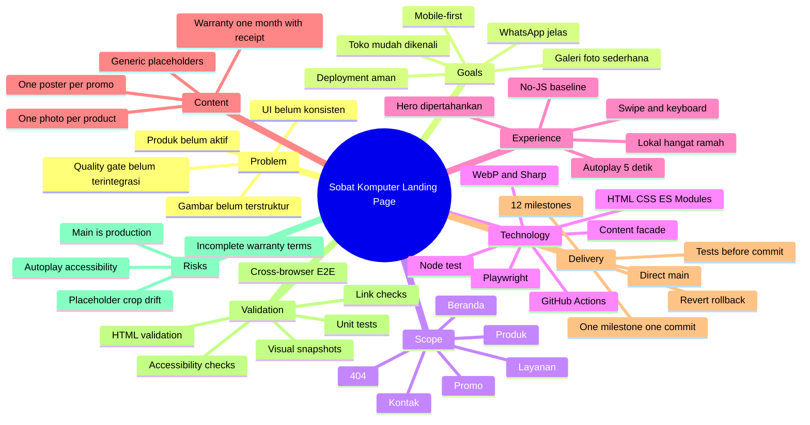
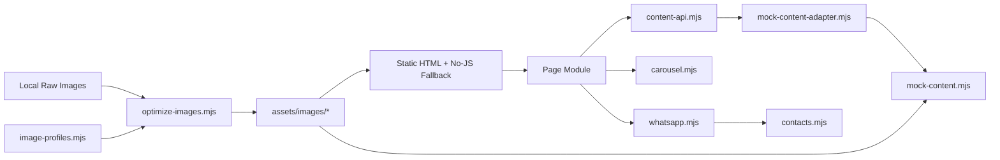
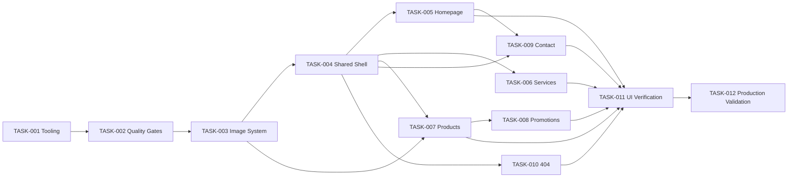

# Planning Package: Penyempurnaan Landing Page Sobat Komputer

## 1. Document Control

| Field | Value |
|---|---|
| Planning status | **READY WITH ASSUMPTIONS** |
| Project mode | Brownfield |
| Planning depth | Deep |
| Primary objective | Menjadikan website toko lebih meyakinkan, rapi, ringan, mobile-first, dan mudah digunakan untuk melihat layanan, produk, promosi, lokasi, serta menghubungi WhatsApp |
| Intended implementer | AI coding agent dengan pengawasan manusia |
| Repository state | Available dan telah direkognisi |
| Technology selection | Hybrid: stack inti dipilih pengguna, tooling ditentukan bersama AI |
| Clarification status | Complete; 36 jawaban diproses |
| Confidence | High untuk scope landing page; Medium untuk konten gambar dan detail operasional yang masih berupa placeholder |
| Output filename | `plan-sobat-komputer-landing-page.md` |
| Last updated | 2026-07-20 |

### Planning Scope

Planning ini mencakup:

- Penyempurnaan lima halaman statis yang sudah ada: Beranda, Layanan, Produk, Promo, dan Kontak.
- Penambahan halaman `404.html` khusus GitHub Pages.
- Audit dan perbaikan UI/UX per halaman dengan prioritas perangkat ponsel.
- Galeri Produk berbasis foto saja, satu foto per slide, swipe/keyboard, dan autoplay setiap lima detik.
- Carousel Promo satu poster per slide dengan autoplay setiap lima detik.
- Penataan ulang direktori gambar dan optimasi aset menggunakan script Node.js lokal.
- Penggantian sementara dengan satu set gambar generik yang konsisten dan mudah diganti.
- Perapian kontrak konten, nomor kontak, template pesan WhatsApp, dan katalog resmi.
- Validasi HTML, unit test, Playwright end-to-end, screenshot visual terkontrol, dan GitHub Actions.
- Accessibility yang relevan terhadap WCAG 2.2 Level AA dan baseline tanpa JavaScript.
- Strategi satu milestone menjadi satu commit langsung ke `main`, hanya setelah semua quality gate milestone lulus.
- Dokumentasi handoff agent yang berada di file planning ini dan tidak menjadi file tambahan dalam repository.

### Planning Exclusions

- Perubahan menjadi React, Next.js, Astro, Vue, atau framework frontend lain.
- Bundler dan proses build untuk menghasilkan halaman website.
- Sistem transaksi, checkout, keranjang, pembayaran, akun pelanggan, atau dashboard pengelolaan.
- Kategori dan filter produk.
- Deskripsi, spesifikasi, harga, atau reference code yang terlihat pada galeri Produk.
- Analytics.
- Lighthouse sebagai quality gate.
- Pekerjaan SEO baru; metadata yang sudah ada hanya wajib tidak rusak.
- Feed media sosial pihak ketiga.
- Perubahan custom domain.
- Penambahan klaim rating, jumlah pelanggan, jumlah perangkat, garansi tambahan, atau bukti sosial yang belum terverifikasi.

### Evidence Quality

| Class | Quality | Notes |
|---|---|---|
| Repository structure | High | Struktur root, halaman HTML, JavaScript modules, images, dan tests terlihat langsung pada branch `main` |
| Runtime behavior | Medium–High | Sebagian telah diverifikasi dari source dan unit tests; seluruh perilaku UI perlu divalidasi kembali dengan Playwright |
| Business rules | High | Nomor WhatsApp, pola produk/promo, garansi, dan batas scope diberikan langsung oleh pengguna |
| Visual quality | Medium | Source CSS dan halaman tersedia, tetapi gambar final belum tersedia dan akan memakai placeholder konsisten |
| Operational details | Medium | Cakupan wilayah spesifik, peran khusus Admin 1, dan rincian pengecualian garansi belum ditentukan |

---

## 2. Executive Summary

Sobat Komputer memiliki website statis multi-page yang sudah memiliki fondasi teknis cukup baik: semantic HTML, stylesheet global, JavaScript ES modules, content facade, mock adapter, carousel, sanitasi WhatsApp, dan unit tests. Kekurangan utamanya bukan kebutuhan framework baru, melainkan konsistensi UI/UX, struktur aset gambar, kualitas pengalaman mobile, halaman Produk yang belum menjadi galeri foto aktif, quality gate repository yang belum terintegrasi, dan ketidakrapian konfigurasi tooling.

Target utama planning ini adalah membuat pengunjung masyarakat Kejobong dan sekitarnya dapat melihat keberadaan serta penawaran toko dengan cepat dan nyaman, terutama dari ponsel. Website tetap zero-build dan dipublikasikan melalui GitHub Pages. Lima halaman yang ada dipertahankan, ditambah halaman 404. Hero dipertahankan secara konseptual. Kedalaman perubahan ditentukan per halaman: Beranda, Layanan, Kontak, dan Promo mendapat redesign moderat; Produk mendapat perubahan besar karena harus menjadi galeri foto-only; shell bersama dan 404 mendapat penyempurnaan terarah.

Galeri Produk akan menampilkan satu foto per slide, tanpa deskripsi, harga, kategori, atau kode. Pengunjung dapat swipe, menggunakan keyboard, kontrol prev/next, atau menunggu autoplay lima detik. Aksi produk menuju Admin 2 dengan pesan konteks produk tanpa kode. Promo memakai pola satu poster per slide dengan autoplay lima detik dan CTA ke Admin 2 atau katalog resmi. Owner menangani CTA umum, servis, lokasi, dan floating WhatsApp. Admin 1 tetap ditampilkan secara netral sampai perannya ditentukan.

Aset foto utama menggunakan WebP. Logo memakai SVG hanya bila sumber vektor asli tersedia; logo tidak boleh “dipalsukan” menjadi SVG hasil pembungkus raster. Gambar mentah disimpan di direktori input lokal yang diabaikan Git. Script Node.js berbasis `sharp` melakukan orientasi, resize, konversi, penghapusan metadata, dan validasi budget. CI hanya memeriksa hasil; CI tidak mengubah atau meng-commit aset.

Delivery terdiri dari 12 milestone atomik. Setiap milestone harus menghasilkan satu commit deployable ke `main`. Sebelum commit, milestone wajib melewati quality gate yang relevan. Sesudah push, GitHub Actions dan deployment live diperiksa. Rollback dilakukan dengan `git revert`, bukan force-push. Critical path adalah stabilisasi tooling → quality gates → migrasi gambar → shell bersama → halaman per halaman → test lintas perangkat → validasi produksi.

Risiko terbesar adalah penggunaan `main` langsung sebagai branch produksi, placeholder yang dapat menutupi masalah crop gambar final, autoplay carousel yang dapat mengganggu accessibility, dan detail garansi yang belum lengkap. Seluruhnya dimitigasi melalui commit kecil, pause controls, no-JS fallback, image profiles berbasis `object-fit`, copy garansi konservatif, dan rollback per milestone.

---

## 3. Intake Decisions

| Item | Value | Source | Confidence |
|---|---|---|---|
| Project name | Sobat Komputer Landing Page | User Decision | High |
| Project type | Multi-page static storefront landing site | User Decision + Repository | High |
| Main objective | Pengunjung melihat website toko dan memahami keberadaan/penawaran toko | User Decision | High |
| Target users | Semua masyarakat Kejobong dan sekitarnya | User Decision | High |
| Primary device | Ponsel | User Decision | High |
| Secondary device | Desktop | User Decision | High |
| Hosting | GitHub Pages dari repository `alfa-reza/sobat-komputer` | User Decision | High |
| Branch workflow | Langsung ke `main`; pull request tidak wajib | User Decision | High |
| Page set | Beranda, Layanan, Produk, Promo, Kontak, dan 404 | User Decision | High |
| Visual direction | Lokal, hangat, dan ramah | User Decision | High |
| Hero | Konsep yang ada dipertahankan | User Decision | Medium |
| Product presentation | Satu foto per slide; tanpa deskripsi, kategori, harga, atau kode | User Decision | High |
| Product autoplay | Ganti slide setiap 5 detik dengan dukungan swipe | User Decision | High |
| Promotion presentation | Satu poster per slide; ganti setiap 5 detik | User Decision | High |
| Image placeholders | Satu set gambar generik yang konsisten | User Decision | High |
| Image optimization | Script Node.js lokal | User Decision | High |
| Maps | Lazy-loaded Google Maps | User Decision | High |
| Social media | Tautan biasa; tanpa embedded feed | User Decision | High |
| Warranty | 1 bulan untuk pembelian laptop dan layanan servis; klaim wajib menunjukkan nota | User Decision | High |
| Accessibility | WCAG 2.2 AA relevan + konten inti tersedia tanpa JavaScript | User Decision | High |
| Testing | Unit, HTML/link validation, Playwright, visual checks, GitHub Actions | User Decision | High |
| Analytics | Ditunda | User Decision | High |
| SEO expansion | Ditunda | User Decision | High |
| Agent tooling | Playwright MCP, Chrome DevTools MCP, GitHub MCP opsional read-only | User Decision | High |
| Agent documentation | Hanya melalui planning package; tidak menjadi file repository terpisah | User Decision | High |

---

## 4. Technology Decisions

### Technology Preference

```text
Technology preference: Hybrid
```

### Selected Stack

| Layer | Technology | Decision source | Rationale | Alternatives considered | Confidence |
|---|---|---|---|---|---|
| Markup | HTML5 semantic multi-page | User + Existing Repository | Ringan, langsung kompatibel dengan GitHub Pages, baik untuk no-JS baseline | SPA framework | High |
| Styling | CSS3 global yang dimodularisasi dengan section/component naming | Existing Repository + AI Recommendation | Tidak memerlukan build; cukup untuk scope; mengurangi migrasi berisiko | Tailwind, Sass | High |
| Client behavior | JavaScript ES modules | User + Existing Repository | Sudah digunakan dan sesuai zero-build | TypeScript/bundler | High |
| Content boundary | Existing `content-api.mjs` facade + mock adapter | User Decision | Mempertahankan boundary data yang sudah diuji tanpa mengikat UI ke fixture | Direct DOM hardcoding | High |
| Image output | WebP untuk foto/poster; SVG hanya untuk logo vektor asli | AI Recommendation | Workflow sederhana, kompatibilitas luas, pengurangan ukuran signifikan | AVIF + WebP; JPEG fallback | High |
| Image processing | Node.js script + `sharp` | User Decision + AI Recommendation | Resize dan konversi deterministik, dapat digunakan lokal dan diperiksa CI | Python/Pillow; optimasi manual | High |
| Unit tests | Built-in `node:test` | Existing Repository | Sudah digunakan oleh test saat ini; dependency minimal | Vitest/Jest | High |
| HTML validation | `html-validate` CLI | AI Recommendation | Mendeteksi markup tidak valid dan error accessibility dasar | validator online/manual | Medium–High |
| Browser tests | Stable `@playwright/test` | User Decision + AI Recommendation | Multi-browser, mobile emulation, visual snapshot, dan no-JS testing | MCP sebagai test runner; Cypress | High |
| CI | GitHub Actions | User Decision | Berada pada platform repository dan dapat menjadi gate sebelum/selepas push | CI pihak ketiga | High |
| Hosting | GitHub Pages | User Decision | Cocok untuk zero-build static site | Hosting lain | High |
| Maps | Lazy-loaded Google Maps iframe | User Decision | Berguna untuk toko fisik dan dapat ditunda pemuatannya | Static preview + click-to-load | Medium–High |
| MCP | Playwright MCP + Chrome DevTools MCP; GitHub MCP read-only opsional | User Decision | Mendukung audit interaksi, diagnosis rendering/performance, dan inspeksi repository | Banyak MCP tambahan | High |

### Technology Constraints

- Website harus tetap dapat dibuka langsung sebagai file statis yang disajikan GitHub Pages.
- Tidak boleh menambahkan framework runtime atau bundler untuk HTML/CSS/JavaScript.
- Dependency development tidak boleh masuk sebagai script yang dimuat pengunjung.
- MCP bukan dependency website dan tidak boleh dimasukkan ke dependency runtime repository.
- Playwright yang digunakan dalam repository harus versi stabil, bukan prerelease/alpha.
- Versi Node.js harus dipilih dari jalur LTS aktif dan dipin setelah kompatibilitas `sharp`, Playwright, serta lockfile diverifikasi pada TASK-001.
- CI tidak boleh mengubah source atau membuat commit otomatis.
- Semua halaman inti harus tetap menyediakan navigasi dan informasi utama ketika JavaScript dinonaktifkan.

### Technology Rejected

| Technology/Approach | Decision | Reason |
|---|---|---|
| React/Next.js/Vue/Astro | Rejected | Tidak menyelesaikan masalah utama dan menambah build/runtime complexity |
| Tailwind migration | Rejected | Tidak diperlukan untuk merapikan CSS yang sudah ada |
| AVIF sebagai output wajib | Rejected untuk scope ini | Menambah matriks format dan testing; WebP cukup untuk target sederhana |
| Auto-optimization oleh CI | Rejected | CI tidak boleh menghasilkan diff atau commit tak terduga |
| MCP dalam `package.json` | Rejected | MCP adalah tooling agent/editor, bukan bagian project runtime/test suite |
| Autoplay tanpa kontrol | Rejected | Bertentangan dengan accessibility dan kontrol pengguna |
| Gambar asli resolusi tinggi di deployment tree | Rejected | Membebani repository dan berisiko terpakai tanpa optimasi |

### Technology Assumptions

| ID | Assumption | Reason | Risk if wrong | Validation |
|---|---|---|---|---|
| TECH-ASM-001 | WebP diterima oleh seluruh target browser yang relevan | Target modern mobile/desktop | Browser lama dapat gagal menampilkan gambar | Playwright projects dan fallback visual placeholder/no-JS |
| TECH-ASM-002 | Logo vektor asli mungkin belum tersedia | Repository saat ini memiliki raster | Memaksa SVG palsu tidak memberi manfaat | Gunakan WebP/PNG teroptimasi sampai sumber vektor asli tersedia |
| TECH-ASM-003 | `sharp` dapat dipasang pada jalur Node LTS yang dipilih | Tool resmi menyediakan binary pada platform umum | CI atau Ubuntu lokal gagal install | Verifikasi clean install di TASK-001 sebelum pipeline disahkan |
| TECH-ASM-004 | GitHub Pages tetap menyajikan root repository | Sesuai penggunaan saat ini | Path aset dapat rusak jika source deployment berbeda | Smoke test live dan relative-path validation |

---

## 5. Clarification Results

| Question | Answer | Answer mode | Planning impact | Confidence |
|---|---|---|---|---|
| Q1 | Zero-build; tooling development boleh ditambah | User | Stack inti tidak berubah; tooling hanya dev/CI | High |
| Q2 | AI menentukan kedalaman perubahan per halaman | AI-delegated | Audit per halaman menghasilkan redesign berbeda | High |
| Q3 | Pengunjung melihat website toko | User | Informational storefront menjadi tujuan utama | High |
| Q4 | Masyarakat Kejobong dan sekitarnya | User | Copy lokal dan mobile-first | High |
| Q5 | Cakupan wilayah spesifik dilewati | Skip | Tidak membuat daftar wilayah/klaim jangkauan | Medium |
| Q6 | Lokal, hangat, ramah | User | Visual/copy tidak terlalu korporat atau futuristik | High |
| Q7 | Lima halaman + 404 | User | Tidak menggabungkan menjadi SPA/single page | High |
| Q8 | AI menentukan homepage sections | AI-delegated | Section dipilih berdasarkan tujuan storefront | High |
| Q9 | Hero dipertahankan | User/Skip | Tidak mengganti konsep utama; hanya polish responsif | Medium |
| Q10 | Set gambar generik konsisten | User | Placeholder memakai rasio/profil seragam | High |
| Q11 | Produk satu foto per slide, swipe/autoplay 5 detik | User | Product grid lama diganti carousel foto-only | High |
| Q12 | Pesan produk tanpa kode | User | Reference code tidak muncul di UI/pesan | High |
| Q13 | Satu galeri tanpa kategori | User | Tidak ada filter/tabs | High |
| Q14 | Promo satu foto per slide, autoplay 5 detik | User | Pertahankan pola carousel | High |
| Q15 | Owner/Admin 1/Admin 2/katalog resmi ditetapkan | User | Routing kontak disentralisasi | High |
| Q16 | Pesan berbeda per konteks | User | WhatsApp builder memakai intent template | High |
| Q17 | Struktur image tree disetujui | User | Migrasi aset terarah | High |
| Q18 | Format dipilih AI | AI-determined | WebP; SVG hanya bila sumber asli vektor | High |
| Q19 | Budget dipilih AI | AI-determined | Budget ukuran/dimensi menjadi quality gate | Medium–High |
| Q20 | Script Node.js lokal | User | `sharp` + scripts lokal | High |
| Q21 | SEO tidak dikerjakan | Skip/User intent | Hanya preserve metadata yang ada | High |
| Q22 | Maps lazy; social link biasa | User | Tidak ada feed/widget sosial | High |
| Q23 | Bukti kepercayaan belum ada; placeholder | User | Tidak membuat testimoni/rating palsu | High |
| Q24 | Garansi 1 bulan, nota wajib | User | Copy garansi eksplisit tetapi konservatif | High |
| Q25 | WCAG 2.2 AA relevan + no-JS | User | Accessibility menjadi acceptance gate | High |
| Q26 | Mobile utama; desktop opsional | User | Prioritas layout/test ke ponsel | High |
| Q27 | Seluruh test + GitHub Actions | User | Multi-layer validation wajib | High |
| Q28 | Tidak memakai Lighthouse/SEO; fokus UI/UX | User | Tidak ada skor Lighthouse gate | High |
| Q29 | Analytics ditunda | Skip | Tidak ada tracking script | High |
| Q30 | Playwright + DevTools; GitHub MCP read-only opsional | User | Tooling agent eksternal | High |
| Q31 | Satu milestone = satu commit; commit setelah test | User | Delivery plan 12 milestone/12 commit | High |
| Q32 | Direct push ke `main`; PR tidak wajib | User | Setiap milestone wajib deployable dan rollbackable | High |
| Q33 | Tetap domain GitHub Pages | User | Relative URL dan canonical existing tidak diubah | High |
| Q34 | Pertahankan facade + mock adapter | User | UI tetap mengambil konten melalui boundary existing | High |
| Q35 | Scope hanya landing page statis | User | Tidak ada task sistem sisi server | High |
| Q36 | Dokumentasi agent tidak di-commit | User | Handoff berada di planning package ini | High |

### Skipped Questions

- **Q5:** wilayah spesifik. Default konservatif: gunakan “Kejobong dan sekitarnya” tanpa menyebut kecamatan/kabupaten lain atau layanan kunjungan tertentu.
- **Q21:** ekspansi SEO. Default: jangan menambah feature SEO, tetapi jangan menghapus metadata valid yang sudah ada.
- **Q29:** analytics. Default: tidak ada tracking.

### AI-Determined Answers

- Kedalaman redesign per halaman.
- Struktur section homepage.
- WebP sebagai format gambar utama.
- Budget ukuran dan dimensi gambar.
- Routing praktis: Owner untuk umum/servis/lokasi; Admin 2 untuk produk/promo/katalog; Admin 1 tetap sebagai kontak netral.
- Strategi screenshot visual dan matriks browser.

### Blocking Questions

Tidak ada blocking question. Detail berikut non-blocking dan dicatat sebagai open question:

- Peran khusus Admin 1.
- Detail pengecualian garansi.
- Gambar final dan focal point setiap foto.
- URL media sosial resmi yang akan ditampilkan.

### Assumptions Created from Clarification

| ID | Assumption | Risk if wrong | Affected sections | Validation method |
|---|---|---|---|---|
| ASM-001 | Admin 2 menangani pertanyaan Produk/Promo karena nomor yang sama menjadi katalog resmi | Pesan masuk ke petugas yang tidak tepat | WhatsApp routing, Produk, Promo | Konfirmasi manual sebelum TASK-007/TASK-008 commit |
| ASM-002 | Owner menangani CTA umum, servis, lokasi, dan floating action | Beban pesan tidak sesuai pembagian kerja | Beranda, Layanan, Kontak | Konfirmasi manual sebelum TASK-005 commit |
| ASM-003 | Admin 1 boleh ditampilkan sebagai “Admin 1” tanpa spesialisasi | Label terasa kurang membantu | Kontak | Ubah label ketika peran tersedia |
| ASM-004 | Gambar generik hanya sementara dan memiliki rasio sama dengan profil final | Crop final dapat berubah | Semua halaman visual | Uji ulang saat gambar final menggantikan placeholder |
| ASM-005 | Garansi hanya dapat diklaim dengan nota dan berlaku satu bulan untuk pembelian laptop serta servis | Detail kondisi/pengecualian belum jelas | Layanan, Beranda | Tampilkan hanya kalimat yang sudah dikonfirmasi |

---

## 6. Context and Repository Findings

### 6.1 Problem Context

**Symptom**

- Website terasa belum cukup matang secara visual meskipun halaman dan konten utama sudah tersedia.
- Produk belum berfungsi sebagai galeri foto aktif.
- Struktur gambar masih datar dan beberapa aset terlalu besar.
- Tooling dan test repository belum menjadi satu quality workflow yang dapat dijalankan konsisten.
- Peran nomor WhatsApp belum dikomunikasikan secara jelas.

**Root cause**

- Halaman berkembang bertahap tanpa design-system ringan dan image profile yang eksplisit.
- Carousel, product renderer, contact routing, serta test belum diselaraskan dengan keputusan bisnis terbaru.
- `package.json` tidak menggambarkan unit tests yang sebenarnya sudah ada.
- Belum ada batas ukuran gambar dan workflow konversi sebelum aset masuk repository.

**Requested solution**

- Planning menyeluruh untuk landing page statis GitHub Pages.
- Mobile-first UI/UX.
- Foto generik konsisten sementara.
- Galeri produk/promo berbasis slide.
- Struktur gambar rapi dan ringan.
- Test otomatis dan GitHub Actions.

**Recommended solution**

- Pertahankan stack zero-build dan boundary content existing.
- Bangun design tokens/shell ringan di CSS existing.
- Generalisasi carousel agar dapat dipakai Produk dan Promo tanpa label “Poster” yang hard-coded.
- Ganti product card renderer menjadi photo-only carousel renderer.
- Sentralisasi konfigurasi kontak dan template WhatsApp.
- Tambahkan deterministic image pipeline dan quality gates.
- Lakukan satu milestone deployable per commit.

### 6.2 Current-System Summary

- Repository mempunyai lima halaman utama: `index.html`, `layanan.html`, `produk.html`, `promo.html`, dan `kontak.html`.
- Styling utama berada di `assets/css/style.css`.
- JavaScript dipisahkan ke `assets/js/core/`, `assets/js/data/`, dan `assets/js/public/`.
- `content-api.mjs` mendelegasikan hero, promotions, dan products ke mock adapter.
- `carousel.mjs` sudah menangani autoplay 5 detik, swipe, keyboard, hover/focus pause, visibility state, dan reduced motion.
- `whatsapp.mjs` sudah memiliki sanitasi data, tetapi konfigurasi kontak dan kontraknya perlu disesuaikan dengan routing baru.
- Produk saat ini dirender sebagai card/grid dan menerima 1–5 gambar serta reference code; ini bertentangan dengan keputusan terbaru satu foto per produk dan tanpa kode pada pesan.
- Promo sudah memakai pola carousel satu poster per slide.
- Repository memiliki test untuk carousel, content API, hero, navigation, products, promotions, dan WhatsApp.
- `package.json` saat ini belum menjalankan test existing melalui `npm test` dan memuat dependency MCP/Playwright prerelease yang perlu dipisahkan/diganti.
- Direktori gambar saat ini masih datar, berisi logo, favicon, hero, dan poster.

### 6.3 Verified Repository Evidence

| Evidence ID | Location | Verified finding | Planning impact |
|---|---|---|---|
| EVID-001 | Repository root | Lima halaman HTML, `assets/`, `tests/`, README, license, dan package files tersedia | Pertahankan multi-page architecture |
| EVID-002 | `assets/js/core/content-api.mjs` | Facade menyediakan `getHero`, `getPromotions`, `getProducts` | Jangan bypass facade dari UI |
| EVID-003 | `assets/js/data/mock-content-adapter.mjs` | Adapter memvalidasi data dan path gambar | Ubah contract produk secara eksplisit dan testable |
| EVID-004 | `assets/js/public/carousel.mjs` | Autoplay 5 detik, pause conditions, keyboard, swipe tersedia | Reuse dan generalisasi; jangan membuat carousel kedua |
| EVID-005 | `assets/js/public/products.mjs` | Produk saat ini card/grid, 1–5 gambar, dan reference code | TASK-007 menjadi perubahan besar |
| EVID-006 | `assets/js/public/promotions.mjs` | Promo menggunakan carousel dan fallback | Refactor ringan, bukan rewrite |
| EVID-007 | `assets/js/core/whatsapp.mjs` | URL dibangun dan disanitasi melalui modul terpusat | Sentralisasi nomor/template di boundary yang sama |
| EVID-008 | `tests/` | Tujuh test files tersedia | Aktifkan dan sesuaikan, jangan mengganti seluruh test stack |
| EVID-009 | `package.json` | `npm test` masih placeholder; dependency MCP dan Playwright prerelease ada | TASK-001 wajib sebelum UI work |
| EVID-010 | `assets/images/` | Folder gambar datar | TASK-003 migrasi struktur dan references |
| EVID-011 | `layanan.html` | Copy garansi sudah menyebut 1 bulan pada servis/pembelian tertentu | Selaraskan hanya dengan keputusan user; jangan perluas klaim |
| EVID-012 | `produk.html` | Empty state produk tampil ketika data tidak tersedia | Fallback harus tetap valid setelah carousel ditambahkan |

### 6.4 Assumptions

| ID | Assumption | Reason | Risk if wrong | Affected sections | Validation method |
|---|---|---|---|---|---|
| ASM-006 | Main adalah source aktif GitHub Pages | User menyatakan deploy langsung dari main | Push dapat tidak langsung memengaruhi live jika source berbeda | Delivery/Release | Cek Pages settings dan live URL pada TASK-012 |
| ASM-007 | Semua external social URLs belum tersedia | Tidak diberikan | Link placeholder dapat bocor ke produksi | Footer/Kontak | Jangan render link tanpa URL valid |
| ASM-008 | Gambar placeholder boleh dibuat/dipilih tanpa klaim bahwa itu kondisi toko asli | User meminta generik | Pengunjung dapat menganggap foto asli | Alt/caption dan replacement plan | Gunakan aset netral; jangan beri caption “hasil kami” |
| ASM-009 | Product click membuka WhatsApp Admin 2 | Selaras dengan katalog resmi | Routing salah | Produk | Konfirmasi owner sebelum commit |

### 6.5 Project Invariants

1. Website tetap zero-build dan multi-page.
2. Lima halaman existing dan URL-nya harus tetap tersedia.
3. Path publik menggunakan relative URLs agar bekerja di project path GitHub Pages.
4. Hero tetap tersedia dan konsep utamanya tidak diganti total.
5. Konten inti dan navigasi tetap berguna tanpa JavaScript.
6. Carousel tidak boleh menjadi satu-satunya cara menemukan konten; kontrol manual wajib tersedia.
7. Autoplay adalah 5.000 ms dan berhenti pada hover, focus, tab tidak aktif, reduced motion, atau interaksi pengguna yang relevan.
8. Produk tidak menampilkan deskripsi, harga, kategori, atau kode.
9. Produk hanya memiliki satu image source per item dalam normalized public contract.
10. Promo satu poster per item.
11. Tidak ada testimoni, rating, angka pelanggan, atau klaim bukti yang belum terverifikasi.
12. Garansi ditulis konservatif: satu bulan untuk pembelian laptop dan servis, dengan nota sebagai syarat klaim.
13. Metadata valid yang sudah ada tidak boleh dihapus walaupun pekerjaan SEO baru di luar scope.
14. Tidak ada analytics script.
15. MCP tidak masuk dependency project.
16. Setiap milestone menghasilkan satu commit yang deployable dan reversible.
17. Commit hanya dilakukan setelah quality gate milestone lulus.
18. Tidak boleh force-push untuk rollback; gunakan `git revert`.
19. Tidak boleh melakukan opportunistic refactor di luar task aktif.
20. Gambar final dapat mengganti placeholder tanpa perubahan struktur DOM atau data contract.

---

## 7. Planning Mind Map



### Markmap-Compatible Hierarchy

# Sobat Komputer Landing Page

## Problem
### UI belum konsisten
### Produk belum aktif
### Gambar belum terstruktur
### Quality gate belum terintegrasi

## Goals
### Toko mudah dikenali
### Mobile-first
### Galeri foto sederhana
### WhatsApp jelas
### Deployment aman

## Scope
### Beranda
### Layanan
### Produk
### Promo
### Kontak
### 404

## Technology
### HTML, CSS, ES Modules
### Content facade dan mock adapter
### WebP dan Sharp
### Node test
### Playwright
### GitHub Actions

## Experience
### Lokal, hangat, ramah
### Hero dipertahankan
### Swipe dan keyboard
### Autoplay lima detik
### No-JS baseline

## Content
### Placeholder generik konsisten
### Satu foto per produk
### Satu poster per promo
### Garansi satu bulan dengan nota

## Delivery
### Dua belas milestone
### Satu milestone satu commit
### Direct push main
### Tests before commit
### Revert rollback

## Validation
### Unit
### HTML dan link
### Cross-browser E2E
### Visual snapshots
### Accessibility

## Risks
### Main sebagai produksi
### Crop placeholder berbeda dari foto final
### Autoplay accessibility
### Detail garansi belum lengkap

---

## 8. Unicode Tree Structure

### Product and System Hierarchy

```text
Sobat Komputer Landing Page
├── 1. Product
│   ├── Problem
│   │   ├── UI/UX belum konsisten
│   │   ├── Produk masih empty-state
│   │   └── Gambar belum optimal
│   ├── Goals
│   │   ├── Menampilkan toko secara meyakinkan
│   │   ├── Mengutamakan ponsel
│   │   └── Mengarahkan intent ke WhatsApp
│   ├── Users
│   │   └── Masyarakat Kejobong dan sekitarnya
│   ├── Scope
│   │   ├── Beranda
│   │   ├── Layanan
│   │   ├── Produk
│   │   ├── Promo
│   │   ├── Kontak
│   │   └── 404
│   └── Non-Goals
│       ├── Transaksi online
│       ├── Analytics
│       ├── Ekspansi SEO
│       └── Framework migration
├── 2. Technology
│   ├── Frontend
│   │   ├── Semantic HTML
│   │   ├── CSS3
│   │   └── ES Modules
│   ├── Content
│   │   ├── content-api facade
│   │   └── mock adapter
│   ├── Images
│   │   ├── WebP
│   │   ├── Sharp
│   │   └── Image budgets
│   ├── Testing
│   │   ├── node:test
│   │   ├── html-validate
│   │   ├── Playwright Test
│   │   └── Visual snapshots
│   └── Infrastructure
│       ├── GitHub Actions
│       └── GitHub Pages
├── 3. System
│   ├── Shared Shell
│   │   ├── Header navigation
│   │   ├── Floating WhatsApp
│   │   └── Footer
│   ├── Content Facade
│   ├── Shared Carousel
│   ├── WhatsApp Intent Builder
│   ├── Image Pipeline
│   └── Page Controllers
├── 4. Data
│   ├── Hero pair
│   ├── Product photo items
│   ├── Promotion poster items
│   ├── Contact routes
│   └── Image profiles
├── 5. Delivery
│   ├── Foundation
│   ├── Image migration
│   ├── Shared UI
│   ├── Page improvements
│   ├── Cross-device verification
│   └── Production validation
├── 6. Validation
│   ├── Unit tests
│   ├── Static validation
│   ├── E2E tests
│   ├── Accessibility tests
│   ├── Visual tests
│   └── Manual live checks
└── 7. Risks
    ├── Direct main deployment
    ├── Image replacement drift
    ├── Autoplay behavior
    └── Incomplete operational details
```

### Task Hierarchy

```text
Implementation Plan
├── MILESTONE-01 Repository Foundation
│   └── TASK-001 Stabilize package and local quality commands
├── MILESTONE-02 Automated Quality Gates
│   └── TASK-002 Add HTML validation, Playwright, and GitHub Actions
├── MILESTONE-03 Image System
│   └── TASK-003 Add image pipeline and migrate optimized assets
├── MILESTONE-04 Shared Mobile-First Shell
│   └── TASK-004 Refine shared header, navigation, footer, and design tokens
├── MILESTONE-05 Homepage
│   └── TASK-005 Improve storefront homepage hierarchy
├── MILESTONE-06 Services
│   └── TASK-006 Improve service and warranty presentation
├── MILESTONE-07 Products
│   └── TASK-007 Build photo-only product carousel
├── MILESTONE-08 Promotions
│   └── TASK-008 Refine promotion carousel and catalog actions
├── MILESTONE-09 Contact
│   └── TASK-009 Clarify WhatsApp contacts and lazy map experience
├── MILESTONE-10 Error Handling
│   └── TASK-010 Add custom 404 and navigation integrity
├── MILESTONE-11 UI Verification
│   └── TASK-011 Add cross-device accessibility and visual coverage
└── MILESTONE-12 Production Validation
    └── TASK-012 Remove obsolete assets and validate GitHub Pages
```

---

## 9. Proposed Repository Structure

### 9.1 Logical Structure

```text
HTML pages
├── Semantic static content and no-JS fallbacks
├── Shared CSS classes and design tokens
└── Page-specific module entry points
    ├── Content facade
    │   └── Mock adapter
    ├── Shared carousel
    ├── WhatsApp intent builder
    └── DOM rendering/enhancement
```

Dependency direction:

```text
HTML → public page modules → core facade/helpers → data adapter/fixtures
```

Rules:

- `public/` modules boleh mengakses DOM.
- `core/` modules tidak bergantung pada halaman tertentu.
- `data/` modules tidak mengakses DOM.
- HTML berisi fallback yang tetap berguna tanpa enhancement.
- CSS tidak bergantung pada JavaScript untuk layout dasar.
- Image pipeline hanya tooling lokal; output-nya adalah aset statis publik.

### 9.2 Repository Structure

Path existing di bawah telah diverifikasi. Path new/modify adalah usulan planning.

```text
sobat-komputer/
├── .github/
│   └── workflows/
│       └── quality.yml                         # New
├── .image-input/                               # Local only; gitignored
│   ├── brand/                                  # New local input
│   ├── hero/                                   # New local input
│   ├── services/                               # New local input
│   ├── products/                               # New local input
│   ├── promotions/                             # New local input
│   └── store/                                  # New local input
├── assets/
│   ├── css/
│   │   └── style.css                           # Modify
│   ├── images/
│   │   ├── brand/
│   │   │   ├── logo.webp                       # New/migrate
│   │   │   ├── logo.svg                        # New only if true vector source exists
│   │   │   └── favicon.ico                     # Migrate/optimize
│   │   ├── hero/
│   │   │   ├── home-hero-desktop.webp          # Migrate/optimize
│   │   │   └── home-hero-mobile.webp           # Migrate/optimize
│   │   ├── services/
│   │   │   ├── laptop-service.webp             # New placeholder
│   │   │   ├── pc-service.webp                 # New placeholder
│   │   │   ├── printer-service.webp            # New placeholder
│   │   │   ├── cctv.webp                       # New placeholder
│   │   │   └── internet.webp                   # New placeholder
│   │   ├── products/
│   │   │   ├── product-01.webp                 # New placeholder
│   │   │   ├── product-02.webp                 # New placeholder
│   │   │   └── product-03.webp                 # New placeholder
│   │   ├── promotions/
│   │   │   ├── promotion-01.webp               # Migrate/placeholder
│   │   │   ├── promotion-02.webp               # Migrate/placeholder
│   │   │   └── promotion-03.webp               # Migrate/placeholder
│   │   ├── store/
│   │   │   ├── storefront.webp                 # New placeholder or optimized existing
│   │   │   └── workspace.webp                  # New placeholder
│   │   └── placeholders/
│   │       └── image-unavailable.webp           # New
│   └── js/
│       ├── core/
│       │   ├── content-api.mjs                  # Read/preserve
│       │   ├── contacts.mjs                     # New
│       │   └── whatsapp.mjs                     # Modify
│       ├── data/
│       │   ├── mock-content-adapter.mjs         # Modify
│       │   └── mock-content.mjs                 # Modify
│       └── public/
│           ├── carousel.mjs                     # Modify/generalize
│           ├── hero.mjs                         # Modify paths only if needed
│           ├── products.mjs                     # Major modify
│           └── promotions.mjs                   # Modify
├── scripts/
│   ├── image-profiles.mjs                       # New
│   ├── optimize-images.mjs                      # New
│   └── check-image-budget.mjs                   # New
├── tests/
│   ├── e2e/
│   │   ├── accessibility.spec.mjs               # New
│   │   ├── navigation.spec.mjs                  # New
│   │   ├── no-javascript.spec.mjs               # New
│   │   ├── products.spec.mjs                    # New
│   │   ├── promotions.spec.mjs                  # New
│   │   ├── responsive.spec.mjs                  # New
│   │   └── visual.spec.mjs                      # New
│   ├── carousel-rules.test.mjs                  # Modify
│   ├── content-api.test.mjs                     # Modify
│   ├── hero.test.mjs                            # Verify
│   ├── navigation.test.mjs                      # Modify for 404 exclusions as needed
│   ├── products-rules.test.mjs                  # Modify
│   ├── promotions.test.mjs                      # Modify
│   └── whatsapp.test.mjs                        # Modify
├── 404.html                                     # New
├── index.html                                   # Modify
├── layanan.html                                 # Modify
├── produk.html                                  # Modify
├── promo.html                                   # Modify
├── kontak.html                                  # Modify
├── package.json                                 # Modify
├── package-lock.json                            # Modify
├── playwright.config.mjs                        # New
├── .htmlvalidate.json                           # New
├── .gitignore                                   # Modify
└── README.md                                    # Modify only for repository commands; no separate agent guide
```

### 9.3 Component Responsibility Matrix

| Component | Responsibility | Inputs | Outputs | Dependencies | Invariants |
|---|---|---|---|---|---|
| HTML pages | Semantic content, no-JS fallback, page landmarks | Static copy | Accessible document | CSS, optional modules | Core navigation/content remains without JS |
| `style.css` | Tokens, layout, components, responsive states | HTML classes | Visual presentation | None | No horizontal overflow at 360 px |
| `content-api.mjs` | Stable content access facade | Method calls | Normalized hero/promo/product data | mock adapter | UI does not import fixture directly |
| `mock-content-adapter.mjs` | Validate and normalize fixture | Raw fixture | Safe public data | mock content | Product exactly one safe image |
| `carousel.mjs` | Shared carousel behavior | Container + options | State, controls, autoplay | DOM | 5s; pause/reduced-motion rules |
| `contacts.mjs` | Canonical contact numbers/routes | Intent key | Contact configuration | None | Numbers defined once |
| `whatsapp.mjs` | Intent-specific safe WA URL | Intent/context | `wa.me` URL | contacts | No product reference code in visible message |
| `products.mjs` | Enhance product fallback into photo-only carousel | Product data | Carousel slides and CTA | content API, carousel, WhatsApp | One photo per product; no description |
| `promotions.mjs` | Render/enhance promo carousel | Promotion data | Poster slides and CTA | content API, carousel, WhatsApp | One poster per slide |
| Image scripts | Convert source to optimized public assets | `.image-input` files + profile | WebP assets + report | sharp | No upscale; metadata removed; budget checked |
| Playwright suite | Cross-browser behavior and screenshots | Local static server | Test results/artifacts | Playwright | Deterministic animation/carousel state |
| GitHub Actions | Run quality commands | Commit on main/push | Pass/fail status | Node tooling | Never auto-commit |

### 9.4 Data and Control Flow



### 9.5 Configuration Structure

- `package.json` mendefinisikan command tunggal yang dapat dipanggil lokal dan CI.
- `.htmlvalidate.json` menyimpan rule HTML.
- `playwright.config.mjs` menyimpan base URL, web server, projects, retries CI, screenshot/trace policy.
- `scripts/image-profiles.mjs` menjadi source of truth dimensi, fit mode, quality, dan byte budget.
- Nomor kontak disentralisasi di `assets/js/core/contacts.mjs`.
- Tidak ada secret dalam repository.
- Tidak ada environment variable wajib untuk runtime website.
- MCP dikonfigurasi di tool/editor pengguna, bukan repository.

Suggested commands setelah diverifikasi TASK-001/TASK-002:

```text
npm test
npm run validate:html
npm run check:images
npm run test:e2e
npm run test:visual
npm run check
npm run images:optimize
```

Command di atas adalah target planning; implementer wajib memastikan nama dan perilakunya sesuai `package.json` final sebelum menggunakannya sebagai bukti.

### 9.6 State and Data Ownership

| Data | Owner | Persistence | Mutation | Validation |
|---|---|---|---|---|
| Hero paths/alt | Mock content fixture | Git | Manual edit | Adapter + unit tests |
| Product image list | Mock content fixture | Git | Manual edit | Exactly one safe relative path |
| Promotion poster list | Mock content fixture | Git | Manual edit | One safe poster per item; status/order rules |
| Contact numbers | `contacts.mjs` | Git | Manual edit | E.164-like digit validation + tests |
| Image profiles | `image-profiles.mjs` | Git | Rare/manual | Script schema + budget tests |
| Raw images | `.image-input/` | Local only | Manual replacement | Script checks |
| Optimized images | `assets/images/` | Git/public | Generated locally | Budget script + CI |
| Carousel state | Browser memory | Ephemeral | User/autoplay | Unit + E2E |

---

## 10. Product Requirements Document

### 10.1 Product Overview

Sobat Komputer Landing Page adalah website statis multi-page untuk memperkenalkan toko, layanan, produk berbasis foto, promo, lokasi, dan jalur WhatsApp kepada masyarakat Kejobong dan sekitarnya. Pengalaman utama dioptimalkan untuk ponsel, tetap layak pada desktop, dan tidak bergantung pada framework atau proses build halaman.

### 10.2 Problem Statement

Masyarakat Kejobong dan sekitarnya mengalami kesulitan memperoleh gambaran toko, layanan, produk, promosi, lokasi, dan kontak Sobat Komputer secara cepat ketika membuka website dari ponsel, yang menyebabkan website terasa kurang meyakinkan dan jalur menuju informasi atau WhatsApp belum sejelas yang diharapkan.

### 10.3 Goals

| ID | Goal | Success signal | Measurement |
|---|---|---|---|
| GOAL-001 | Menampilkan identitas toko secara jelas dan ramah | Pengguna memahami nama, layanan utama, lokasi, jam, dan cara menghubungi | Manual usability checklist pada mobile viewport |
| GOAL-002 | Menjadikan seluruh halaman mobile-first | Tidak ada overflow, teks terpotong, kontrol terlalu kecil, atau layout rusak pada viewport target | Playwright responsive tests |
| GOAL-003 | Menampilkan Produk sebagai galeri foto sederhana | Slide dapat dilihat, digeser, dan membuka WhatsApp | Unit + E2E products tests |
| GOAL-004 | Mempertahankan Promo sebagai poster carousel yang mudah dikontrol | Autoplay 5 detik dan kontrol manual bekerja | Unit + E2E promotions tests |
| GOAL-005 | Menurunkan beban gambar | Seluruh aset memenuhi image profile budget | `check-image-budget` report |
| GOAL-006 | Menjadikan kualitas repository dapat diverifikasi | Satu command quality gate lulus lokal dan CI | `npm run check` + Actions pass |
| GOAL-007 | Menjaga accessibility dasar yang kuat | Keyboard, reduced motion, focus, labels, dan no-JS baseline berfungsi | HTML validation + Playwright |
| GOAL-008 | Memungkinkan penggantian placeholder tanpa redesign | Gambar final dapat diganti mengikuti profile yang sama | Manual replacement rehearsal |

### 10.4 Non-Goals

| ID | Non-Goal |
|---|---|
| NOGOAL-001 | Penjualan atau pembayaran di website |
| NOGOAL-002 | Deskripsi/spec/harga produk |
| NOGOAL-003 | Filter atau kategori produk |
| NOGOAL-004 | Analytics dan event tracking |
| NOGOAL-005 | Ekspansi SEO dan target skor Lighthouse |
| NOGOAL-006 | Custom domain |
| NOGOAL-007 | Feed sosial tertanam |
| NOGOAL-008 | Migrasi framework/bundler |
| NOGOAL-009 | Klaim bukti sosial yang belum diverifikasi |
| NOGOAL-010 | File dokumentasi agent baru dalam repository |

### 10.5 Users and Actors

#### Visitor

- **Identity:** Masyarakat Kejobong dan sekitarnya, dominan pengguna ponsel.
- **Need:** Melihat toko, layanan, produk, promo, lokasi, dan kontak.
- **Permission:** Publik, tanpa login.
- **Entry points:** Beranda, URL halaman langsung, link media sosial, atau hasil pencarian yang sudah ada.
- **Expected outcome:** Menemukan informasi dan memilih jalur WhatsApp/Maps/katalog.
- **Failure impact:** Pengunjung meninggalkan website atau menghubungi nomor yang salah.

#### Store Owner/Admin

- **Identity:** Owner, Admin 1, Admin 2.
- **Need:** Menerima pertanyaan yang konteksnya jelas.
- **Permission:** Tidak ada interface pengelolaan dalam scope.
- **Entry point:** WhatsApp dari CTA website.
- **Expected outcome:** Mengetahui intent umum, servis, produk, promo, atau lokasi.
- **Failure impact:** Pesan tidak tepat sasaran atau konteks tidak jelas.

#### Implementing Agent

- **Identity:** AI coding agent/human developer.
- **Need:** Scope atomik, files, tests, dan invariants yang jelas.
- **Permission:** Mengubah repository sesuai task aktif.
- **Expected outcome:** Satu milestone deployable dan satu commit setelah test.
- **Failure impact:** Drift scope, regression live, atau perubahan sulit di-rollback.

### 10.6 User Stories and System Stories

- **US-001:** Sebagai pengunjung, saya ingin segera memahami bahwa website ini milik Sobat Komputer agar saya yakin berada di tempat yang benar.
- **US-002:** Sebagai pengunjung ponsel, saya ingin navigasi dan tombol mudah digunakan agar saya tidak perlu zoom atau scroll horizontal.
- **US-003:** Sebagai pengunjung, saya ingin melihat produk sebagai foto satu per satu agar tampilan tetap sederhana.
- **US-004:** Sebagai pengunjung, saya ingin menggeser slide produk/promo atau memakai tombol agar tidak bergantung pada autoplay.
- **US-005:** Sebagai pengunjung yang sensitif terhadap gerakan, saya ingin autoplay berhenti agar website nyaman digunakan.
- **US-006:** Sebagai pengunjung, saya ingin menghubungi nomor yang sesuai agar pertanyaan lebih cepat ditangani.
- **US-007:** Sebagai pengunjung, saya ingin melihat lokasi tanpa map membebani halaman sejak awal.
- **US-008:** Sebagai pelanggan, saya ingin mengetahui informasi garansi yang benar agar memahami syarat nota.
- **US-009:** Sebagai pengunjung tanpa JavaScript, saya tetap ingin melihat informasi inti dan link utama.
- **SS-001:** Sebagai sistem, saya harus menolak path gambar yang tidak aman.
- **SS-002:** Sebagai sistem, saya harus menjaga normalized product contract satu foto per item.
- **SS-003:** Sebagai sistem, saya harus menghasilkan URL WhatsApp berdasarkan intent tanpa memasukkan kode produk.
- **SS-004:** Sebagai pipeline, saya harus menolak gambar publik yang melewati budget.
- **SS-005:** Sebagai CI, saya harus menjalankan quality gate yang sama dengan local workflow.

### 10.7 Primary Use Cases

#### UC-001 — Melihat toko dari Beranda

- **Trigger:** Pengunjung membuka `index.html`.
- **Preconditions:** Static files dapat dimuat.
- **Main flow:** Header → Hero → ringkasan toko/layanan → produk/promo teaser → lokasi/jam → CTA.
- **Alternative flow:** JavaScript mati; konten dan link dasar tetap tersedia.
- **Failure flow:** Gambar gagal; alt text dan layout placeholder menjaga struktur.
- **Output:** Pengunjung memahami toko dan dapat melanjutkan ke halaman/WhatsApp.
- **Postcondition:** Tidak ada state yang disimpan.

#### UC-002 — Melihat Produk

- **Trigger:** Pengunjung membuka `produk.html`.
- **Preconditions:** Minimal satu product item valid atau fallback tersedia.
- **Main flow:** Slide pertama terlihat → autoplay 5 detik → pengguna swipe/keyboard/controls → pengguna memilih CTA WhatsApp.
- **Alternative flow:** Reduced motion aktif; autoplay tidak berjalan.
- **Failure flow:** Tidak ada item; empty state dan link katalog resmi terlihat.
- **Output:** WhatsApp Admin 2 terbuka dengan pesan produk generik.
- **Postcondition:** Tidak ada transaksi di website.

#### UC-003 — Melihat Promo

- **Trigger:** Pengunjung membuka `promo.html`.
- **Preconditions:** Minimal satu promo aktif atau fallback tersedia.
- **Main flow:** Satu poster per slide → autoplay 5 detik → kontrol manual → CTA tanya promo/katalog.
- **Alternative flow:** Satu poster saja; controls/autoplay tidak perlu aktif.
- **Failure flow:** Tidak ada promo; fallback dan katalog resmi tersedia.
- **Output:** WhatsApp/katalog terbuka.

#### UC-004 — Menghubungi toko

- **Trigger:** Pengunjung menekan CTA umum, servis, produk, promo, lokasi, atau contact card.
- **Preconditions:** URL WhatsApp valid.
- **Main flow:** Intent dipetakan ke nomor + template → URL dibuka.
- **Alternative flow:** Aplikasi WhatsApp tidak tersedia; browser membuka endpoint web.
- **Failure flow:** Nomor/config invalid; UI tidak boleh menghasilkan `javascript:` atau URL rusak.
- **Output:** Percakapan dengan konteks yang sesuai.

#### UC-005 — Menemukan lokasi

- **Trigger:** Pengunjung membuka Kontak/lokasi.
- **Preconditions:** Embed URL valid.
- **Main flow:** Map lazy-loaded saat mendekati viewport → pengguna membuka Maps.
- **Alternative flow:** Iframe gagal/JS mati; link Maps tetap tersedia.
- **Failure flow:** Third-party blocked; alamat dan link tetap dapat digunakan.
- **Output:** Pengunjung memperoleh arah ke toko.

### 10.8 Functional Requirements

| ID | Requirement | Priority | Source | Acceptance method |
|---|---|---|---|---|
| FR-001 | Sistem mempertahankan lima URL halaman utama dan menambah `404.html` | Must | User | Navigation + HTTP/manual test |
| FR-002 | Semua halaman memakai shared mobile-first header, navigation, floating WhatsApp, dan footer yang konsisten | Must | AI/User | Visual + E2E |
| FR-003 | Homepage mempertahankan hero dan menyajikan hierarki storefront yang jelas | Must | User/AI | Manual + visual test |
| FR-004 | Homepage menampilkan ringkasan layanan, garansi terkonfirmasi, teaser Produk/Promo, lokasi/jam, dan CTA | Must | AI | Content/visual checks |
| FR-005 | Layanan menampilkan layanan secara terstruktur tanpa klaim yang belum diverifikasi | Must | User/AI | Content assertions |
| FR-006 | Copy garansi menyatakan satu bulan untuk pembelian laptop dan servis serta nota wajib | Must | User | Text assertion |
| FR-007 | Produk menampilkan satu galeri tanpa kategori | Must | User | Unit + E2E |
| FR-008 | Setiap product item memiliki tepat satu foto publik | Must | User | Adapter/unit tests |
| FR-009 | Produk tidak menampilkan deskripsi, spesifikasi, harga, atau kode | Must | User | DOM assertions |
| FR-010 | Product carousel mendukung prev/next, dots/status, keyboard, swipe, dan autoplay 5 detik | Must | User | Unit + E2E |
| FR-011 | Product CTA menuju Admin 2 dengan pesan “Halo New Sobat Komputer, saya tertarik dengan produk ini.” atau versi final yang setara tanpa kode | Must | User + ASM-001 | Unit + URL assertion |
| FR-012 | Promo menampilkan satu poster per slide dan autoplay 5 detik | Must | User | Unit + E2E |
| FR-013 | Promo menyediakan CTA konteks promo dan link katalog resmi | Must | User | URL assertions |
| FR-014 | Owner, Admin 1, Admin 2, dan katalog resmi didefinisikan satu kali dalam konfigurasi kontak | Must | User/AI | Unit test |
| FR-015 | Template pesan WhatsApp berbeda berdasarkan intent | Must | User | Unit test matrix |
| FR-016 | Kontak menampilkan fungsi Owner/Admin 2; Admin 1 tetap label netral sampai ada keputusan | Should | AI | Content review |
| FR-017 | Google Maps dimuat lazy dan selalu memiliki fallback link eksternal | Must | User | E2E/network/manual |
| FR-018 | Media sosial hanya berupa link valid; item tanpa URL tidak dirender | Must | User/ASM-007 | Unit/DOM check |
| FR-019 | Gambar publik mengikuti tree dan naming kebab-case yang disetujui | Must | User | Script/tree check |
| FR-020 | Script Node mengoptimalkan gambar menurut profile tanpa upscale dan menghapus metadata | Must | User/AI | Script tests/manual report |
| FR-021 | CI memeriksa budget gambar tetapi tidak mengubah source | Must | AI | Workflow review |
| FR-022 | Halaman memiliki no-JS fallback untuk konten dan navigasi inti | Must | User | Playwright JS-disabled |
| FR-023 | 404 menyediakan link kembali, halaman utama, WhatsApp, dan katalog | Must | User/AI | E2E/manual |
| FR-024 | Package scripts menyediakan quality command terpadu | Must | User/AI | Clean install + command pass |
| FR-025 | GitHub Actions menjalankan quality command pada push ke main dan pull request bila digunakan | Must | User | Workflow run |
| FR-026 | Placeholder dapat diganti tanpa mengubah markup/data contract | Should | User/AI | Replacement rehearsal |
| FR-027 | Empty state Produk/Promo tetap tersedia ketika data kosong atau invalid | Must | Existing behavior | Unit + E2E |

### 10.9 Non-Functional Requirements

| ID | Requirement | Priority | Measurement |
|---|---|---|---|
| PERF-001 | Logo raster ≤ 60 KB; favicon ≤ 30 KB | Must | Budget script |
| PERF-002 | Hero desktop ≤ 250 KB dan mobile ≤ 180 KB | Must | Budget script |
| PERF-003 | Service image ≤ 120 KB per file | Must | Budget script |
| PERF-004 | Product image ≤ 180 KB, max canvas 960×1200, rasio target 4:5 | Must | Profile + budget script |
| PERF-005 | Promotion poster ≤ 250 KB, max canvas 1080×1350, rasio target 4:5 | Must | Profile + budget script |
| PERF-006 | Store image ≤ 180 KB; placeholder ≤ 120 KB | Must | Budget script |
| PERF-007 | Hero tidak lazy-loaded; below-fold images memakai lazy loading | Must | DOM/network assertion |
| PERF-008 | Tidak ada horizontal overflow pada 360×800, 390×844, 412×915 | Must | Playwright |
| ACC-001 | Relevant UI memenuhi WCAG 2.2 AA untuk contrast, focus, labels, landmarks, keyboard, dan reduced motion | Must | html-validate + E2E + manual |
| ACC-002 | Interactive target minimum 44×44 CSS px bila memungkinkan | Must | CSS/Playwright bounding-box check |
| ACC-003 | Carousel dapat dioperasikan tanpa pointer dan tidak memerangkap focus | Must | Keyboard E2E |
| ACC-004 | Autoplay berhenti untuk `prefers-reduced-motion: reduce` | Must | Unit/E2E |
| ACC-005 | Slide perubahan tidak diumumkan secara agresif oleh screen reader | Must | ARIA review |
| REL-001 | Semua internal links dan asset paths valid | Must | Static + E2E |
| REL-002 | Tidak ada uncaught console error pada semua halaman target | Must | Playwright |
| REL-003 | Satu slide item tidak menampilkan kontrol tidak berguna | Must | Unit/E2E |
| REL-004 | Direct-main release dapat di-rollback dengan satu revert per milestone | Must | Commit structure |
| COMP-001 | Target browser: mobile Chromium, mobile WebKit, desktop Chromium, Firefox, WebKit | Must | Playwright projects |
| COMP-002 | Konten inti tersedia saat JavaScript dinonaktifkan | Must | Playwright JS-disabled |
| MAINT-001 | Nomor kontak dan image profiles memiliki single source of truth | Must | Code review/tests |
| MAINT-002 | Tidak ada dependency unused atau prerelease tanpa alasan | Must | Package review |
| MAINT-003 | CSS memakai class section eksplisit, bukan bergantung pada urutan `nth-child` untuk tema | Should | Code review/visual regression |
| SEC-001 | URL WhatsApp/Maps/social hanya memakai protocol aman yang diizinkan | Must | Unit tests |
| SEC-002 | Relative image path tidak dapat keluar dari `assets/images/` | Must | Adapter/script tests |
| PRIV-001 | Metadata EXIF/GPS dihapus dari output gambar | Must | Script verification |
| PRIV-002 | Tidak ada analytics atau secret pada client/repository | Must | Search/review |

### 10.10 Input and Output Contracts

#### Product Item — Target Public Contract

```text
Input fixture:
- id: internal stable string
- image: safe relative WebP path
- status: published/hidden
- sortOrder: finite number
- alt: concise Indonesian text describing visible subject

Public normalized output:
- image
- alt
- sortOrder

Explicitly absent from UI/public normalized output:
- description
- specification
- price
- category
- referenceCode
```

The internal `id` may remain only if required for deterministic testing/DOM keys, tetapi tidak ditampilkan dan tidak dimasukkan ke pesan WhatsApp.

#### Promotion Item — Target Public Contract

```text
- image: exactly one safe relative WebP path
- alt: concise poster description
- status: published/hidden
- sortOrder: finite number
- startsAt/endsAt: optional only if existing schedule behavior is preserved
```

#### Contact Route Contract

```text
owner  = 6285742744594
admin1 = 6285185062811
admin2 = 6288980042670
catalogUrl = https://wa.me/c/6288980042670
```

Intent mapping:

```text
general  -> owner
service  -> owner
location -> owner
floating -> owner
product  -> admin2
promotion -> admin2
catalog -> exact catalogUrl
admin1-direct -> admin1
```

#### WhatsApp Templates

```text
general:
Halo New Sobat Komputer, saya ingin bertanya mengenai layanan toko.

service:
Halo New Sobat Komputer, saya ingin berkonsultasi mengenai servis perangkat.

product:
Halo New Sobat Komputer, saya tertarik dengan produk ini.

promotion:
Halo New Sobat Komputer, saya ingin bertanya mengenai promo yang sedang ditampilkan.

location:
Halo New Sobat Komputer, saya ingin bertanya mengenai lokasi toko.
```

Exact punctuation may be polished, tetapi intent dan ketiadaan kode produk wajib dipertahankan.

#### Image Profile Contract

| Profile | Output | Max dimensions | Fit | Max bytes | Loading |
|---|---|---:|---|---:|---|
| logo-raster | WebP | 256×256 | contain | 60 KB | eager in header |
| hero-desktop | WebP | 1536×864 | cover | 250 KB | eager/high priority |
| hero-mobile | WebP | 900×1200 | cover | 180 KB | eager/high priority |
| service | WebP | 960×720 | cover | 120 KB | lazy |
| product | WebP | 960×1200 | contain/neutral background | 180 KB | first eager, rest lazy |
| promotion | WebP | 1080×1350 | contain | 250 KB | first eager, rest lazy |
| store | WebP | 1200×900 | cover | 180 KB | lazy |
| placeholder | WebP | profile-specific | contain/cover per use | 120 KB | lazy |

### 10.11 Edge Cases

- Produk kosong.
- Promo kosong atau seluruh promo hidden/expired.
- Hanya satu produk/promo.
- Gambar missing, corrupt, wrong extension, oversized, or unsafe path.
- Alt text kosong.
- Product item memiliki lebih dari satu gambar dari fixture lama.
- Nomor WhatsApp berisi karakter selain digit.
- Catalog URL tidak valid.
- User mengaktifkan reduced motion.
- Tab browser menjadi hidden saat autoplay aktif.
- Focus masuk ke carousel.
- Swipe sangat pendek atau vertikal.
- Resize/rotation source image dari EXIF.
- Gambar lebih kecil daripada profile target; tidak boleh upscale.
- Map iframe diblokir.
- JavaScript gagal dimuat.
- CSS gagal memuat sebagian.
- Long Indonesian text pada 360 px.
- Direct URL ke halaman yang tidak ada.
- GitHub Pages base path bukan root domain.
- Actions pass tetapi live deployment tertunda/gagal.

### 10.12 UX and Developer Experience

#### Mobile UX

- Navigation toggle memiliki state dan focus management yang jelas.
- Hero CTA utama mudah dijangkau dan tidak menutupi foto.
- Heading tidak terlalu besar pada 360 px.
- Content sections memakai spacing konsisten.
- Carousel menampilkan satu item utuh, bukan potongan slide berikutnya yang membingungkan.
- Prev/next berada dalam target 44 px.
- Dot count tetap sederhana; bila slide banyak, gunakan compact status instead of dozens of dots.
- Floating WhatsApp tidak menutup CTA/footer.

#### Desktop UX

- Max-width konten konsisten.
- Hero tetap memakai konsep existing; teks/foto diseimbangkan tanpa redesign total.
- Cards tidak menjadi satu-satunya pola visual.
- Produk/Promo tidak melebar berlebihan; poster/foto memiliki max-height yang masuk akal.

#### Developer Experience

- `npm run check` menjadi command utama sebelum commit.
- Image input dan output terpisah.
- Error script menjelaskan file, actual bytes, allowed bytes, dan profile.
- Tests memakai fixtures kecil dan deterministik.
- Playwright web server berjalan lokal tanpa service eksternal.
- Screenshot baseline hanya untuk viewport yang stabil.

### 10.13 Analytics and Observability

Analytics berada di luar scope. Observability pengembangan terbatas pada:

- Test reporter lokal/CI.
- Browser console error capture.
- Failed request capture untuk internal assets.
- GitHub Actions artifacts pada kegagalan Playwright.
- Playwright trace hanya pada retry/failure di CI.

### 10.14 Security and Privacy

- Validasi `wa.me` URL dan nomor digit-only.
- Tidak memasukkan input user mentah ke HTML atau URL tanpa encoding.
- Sanitasi protocol untuk Maps/social links.
- Tidak ada `target="_blank"` tanpa `rel="noopener noreferrer"` pada external links.
- Relative image paths dinormalisasi dan ditolak jika traversal keluar folder.
- EXIF/GPS dihapus saat optimasi.
- Tidak ada token, credential, atau secret.
- Generic images tidak boleh mengandung data pribadi atau license yang tidak jelas.
- Dependency development dipin melalui lockfile dan tidak dimuat pada website.

### 10.15 Compatibility

Required viewport matrix:

| Class | Viewport | Priority |
|---|---:|---|
| Small Android | 360×800 | Primary |
| Modern mobile | 390×844 | Primary |
| Large mobile | 412×915 | Primary |
| Tablet portrait | 768×1024 | Secondary |
| Laptop | 1366×768 | Secondary |
| Desktop | 1440×900 | Secondary |
| Large desktop | 1920×1080 | Spot-check |

Browser projects:

- Mobile Chromium.
- Mobile WebKit.
- Desktop Chromium.
- Desktop Firefox.
- Desktop WebKit.

Visual snapshot gates:

- Chromium 390×844.
- Chromium 1440×900.
- Carousel state frozen; animations/transitions disabled.

### 10.16 Acceptance Criteria

```gherkin
Scenario: Mobile visitor opens the homepage
  Given the viewport is 390 by 844
  When the homepage loads
  Then the header, hero, primary CTA, and first content section are usable
  And there is no horizontal overflow
  And there are no uncaught console errors
```

```gherkin
Scenario: Product gallery advances automatically
  Given at least two published product photos exist
  And reduced motion is not enabled
  When five seconds pass without user interaction
  Then exactly one next product slide becomes active
  And only one product photo is presented as the active slide
```

```gherkin
Scenario: Product carousel respects reduced motion
  Given reduced motion is enabled
  When the product page remains open for more than five seconds
  Then the active slide does not change automatically
  And manual controls remain usable
```

```gherkin
Scenario: Product CTA opens the correct WhatsApp intent
  Given a product photo is visible
  When the visitor activates its WhatsApp action
  Then the destination uses Admin 2 number 6288980042670
  And the encoded message states interest in the product
  And the message contains no reference code
```

```gherkin
Scenario: Promotion gallery uses one poster per slide
  Given at least two active promotions exist
  When the promotion page loads
  Then one poster is visible as the active slide
  And the next poster activates after five seconds unless autoplay is paused
```

```gherkin
Scenario: Site remains useful without JavaScript
  Given JavaScript is disabled
  When a visitor opens each main page
  Then the primary navigation and essential page content are visible
  And at least one usable WhatsApp or catalog link is available where relevant
```

```gherkin
Scenario: Warranty wording is accurate
  Given the services page is rendered
  Then it states a one-month warranty for laptop purchases and service
  And it states that the receipt is required
  And it does not claim additional warranty coverage
```

```gherkin
Scenario: Image budget prevents oversized assets
  Given an output image exceeds its profile budget
  When the image budget check runs
  Then the command exits non-zero
  And the error identifies the file, actual size, allowed size, and profile
```

```gherkin
Scenario: Unknown GitHub Pages path uses custom 404
  Given a visitor requests a nonexistent page
  When GitHub Pages serves the custom error document
  Then the page uses the Sobat Komputer shell
  And it offers links to Beranda, Layanan, Produk, Promo, Kontak, WhatsApp, and catalog
```

### 10.17 Definition of Done

- Seluruh Must functional requirements yang dialokasikan ke milestone selesai.
- Unit tests existing dan updated lulus.
- HTML validation lulus.
- Internal link/asset checks lulus.
- Playwright smoke tests lulus pada required projects.
- Visual snapshots yang relevan disetujui.
- Tidak ada horizontal overflow pada mobile target.
- Tidak ada uncaught console errors.
- Keyboard navigation, focus, reduced motion, dan no-JS behavior diverifikasi.
- Image budget checks lulus.
- Tidak ada metadata pribadi dalam output gambar.
- Tidak ada dependency prerelease atau unused tanpa dokumentasi.
- Metadata existing yang valid tidak terhapus.
- Tidak ada analytics atau scope tambahan.
- Commit hanya berisi milestone terkait.
- `git diff --check` lulus.
- Commit telah di-push ke `main` dan GitHub Actions lulus.
- Halaman live diperiksa pada URL GitHub Pages yang benar.
- Completion evidence dicatat pada laporan task, bukan file agent tambahan di repository.


---

## 11. Technical Design and Architecture

### 11.1 Recommended Approach

Implementasi menggunakan **progressive enhancement**:

1. HTML menyediakan struktur, copy, fallback image/content, navigation, dan link WhatsApp/Maps yang tetap berguna tanpa JavaScript.
2. CSS menyajikan mobile-first layout, design tokens, responsive rules, focus states, dan reduced-motion styles.
3. JavaScript memperkaya hero, carousel, fixture-driven content, navigation state, dan intent-specific WhatsApp links.
4. Content facade dan adapter tetap menjadi boundary data.
5. Gambar dihasilkan secara lokal menggunakan profile yang deterministik, lalu output optimized di-commit.
6. Local quality commands dan CI memakai command yang sama.
7. Setiap perubahan halaman diselesaikan sebagai milestone deployable yang dapat di-revert mandiri.

### 11.2 Architectural Decisions

#### ADR-001: Pertahankan Zero-Build Multi-Page Architecture

**Status:** Accepted  
**Context:** Website sudah berjalan di GitHub Pages dan problem utama adalah kualitas UI, konten, aset, dan validation.  
**Decision:** Pertahankan HTML/CSS/ES modules tanpa framework atau bundler.  
**Rationale:** Solusi paling sederhana, cepat, portable, dan sesuai hosting.  
**Alternatives considered:** SPA framework, static-site generator, CSS framework migration.  
**Trade-offs:** Reuse komponen perlu disiplin class/module; tidak ada templating compile-time.  
**Consequences:** Shared shell tetap diduplikasi di HTML dan harus diuji konsistensinya.  
**Requirements addressed:** FR-001, FR-002, FR-022, MAINT-002.

#### ADR-002: Progressive Enhancement dengan No-JS Baseline

**Status:** Accepted  
**Context:** Carousel dan content fixture memakai JavaScript, tetapi pengguna meminta website tetap berguna tanpa JavaScript.  
**Decision:** HTML memuat fallback content/link; modules meningkatkan perilaku setelah load.  
**Rationale:** Lebih resilien dan accessible.  
**Alternatives considered:** DOM sepenuhnya dibangun oleh JavaScript.  
**Trade-offs:** Perlu menghindari duplicate content dan memastikan enhancement tidak menyebabkan layout shift besar.  
**Consequences:** E2E wajib memiliki project JavaScript-disabled.  
**Requirements addressed:** FR-022, COMP-002, REL-001.

#### ADR-003: Satu Shared Carousel yang Dapat Dikonfigurasi

**Status:** Accepted  
**Context:** Promo sudah memakai `carousel.mjs`; Produk membutuhkan interaksi sama. Label saat ini cenderung khusus “Poster”.  
**Decision:** Generalisasi `carousel.mjs` dengan options seperti item noun/label, interval, controls, initial index, dan autoplay eligibility.  
**Rationale:** Menghindari dua implementasi yang drift.  
**Alternatives considered:** Carousel terpisah untuk Produk dan Promo.  
**Trade-offs:** API existing perlu disesuaikan dan seluruh tests diperbarui.  
**Consequences:** Produk dan Promo mendapatkan keyboard/swipe/pause behavior identik.  
**Requirements addressed:** FR-010, FR-012, ACC-003, ACC-004.

#### ADR-004: Product Contract Tepat Satu Foto

**Status:** Accepted  
**Context:** Contract existing mengizinkan 1–5 gambar dan reference code; keputusan terbaru meminta satu foto tanpa deskripsi/kode.  
**Decision:** Adapter menormalisasi tepat satu `image` dan `alt`; renderer tidak menampilkan metadata produk.  
**Rationale:** Mencocokkan pengalaman foto-only dan mengurangi kompleksitas.  
**Alternatives considered:** Nested carousel per product; product cards.  
**Trade-offs:** Pengguna harus menunjukkan produk secara manual dalam percakapan WhatsApp.  
**Consequences:** Test contract dan fixture lama harus dimigrasikan atomik pada TASK-007.  
**Requirements addressed:** FR-007, FR-008, FR-009, FR-011.

#### ADR-005: Sentralisasi Kontak dan WhatsApp Intent

**Status:** Accepted  
**Context:** Nomor dan message template digunakan di banyak halaman.  
**Decision:** Tambahkan `contacts.mjs` sebagai single source of truth dan ubah builder menerima intent, bukan content reference.  
**Rationale:** Mengurangi hard-coded mismatch.  
**Alternatives considered:** Link langsung di setiap HTML/module.  
**Trade-offs:** Link no-JS di HTML masih perlu disinkronkan melalui test.  
**Consequences:** Unit test memverifikasi setiap intent/nomor/template.  
**Requirements addressed:** FR-011, FR-013, FR-014, FR-015, MAINT-001, SEC-001.

#### ADR-006: WebP-Only Photo Pipeline untuk Scope Ini

**Status:** Accepted  
**Context:** User meminta gambar ringan dengan workflow Node lokal.  
**Decision:** Hasil foto/poster adalah WebP; source mentah berada di `.image-input/` dan diabaikan Git.  
**Rationale:** Sederhana, kompatibel luas, dan efektif.  
**Alternatives considered:** AVIF + WebP, JPEG fallback, manual optimization.  
**Trade-offs:** Tidak mencapai kompresi maksimum AVIF; bergantung pada support WebP browser target.  
**Consequences:** Profile dan budget menjadi contract yang diuji.  
**Requirements addressed:** FR-019, FR-020, FR-021, PERF-001–006, PRIV-001.

#### ADR-007: CI Memvalidasi, Tidak Memodifikasi

**Status:** Accepted  
**Context:** Optimasi dilakukan lokal dan direct push ke main meningkatkan risiko perubahan otomatis.  
**Decision:** GitHub Actions menjalankan install/check/test; tidak menulis ulang aset atau membuat commit.  
**Rationale:** Hasil commit dapat direview dan deterministic.  
**Alternatives considered:** Bot auto-optimize/auto-commit.  
**Trade-offs:** Developer harus menjalankan optimizer sebelum commit.  
**Consequences:** Oversized image menyebabkan CI fail dengan instruksi perbaikan.  
**Requirements addressed:** FR-020, FR-021, FR-024, FR-025.

#### ADR-008: Satu Milestone Satu Commit Langsung ke Main

**Status:** Accepted by User  
**Context:** User mengizinkan direct push dan tidak mewajibkan pull request.  
**Decision:** Setiap milestone adalah satu logical commit setelah quality gate lulus.  
**Rationale:** Sejalan dengan preferensi user dan memudahkan kontribusi/rollback.  
**Alternatives considered:** Feature branch + PR; multiple commits per milestone.  
**Trade-offs:** `main` adalah production path sehingga regression dapat langsung live.  
**Consequences:** Milestone harus kecil, deployable, reversible, dan wajib live smoke check setelah push.  
**Requirements addressed:** REL-004 dan delivery constraints.

### 11.3 Alternatives Considered

| Alternative | Benefit | Reason not selected |
|---|---|---|
| Full redesign semua halaman sekaligus | Visual consistency cepat | Terlalu besar untuk direct-main dan sulit rollback |
| Product masonry/grid | Banyak produk terlihat bersamaan | Tidak sesuai keputusan slide satu foto dan mobile focus |
| Nested product gallery | Banyak sudut per produk | Melanggar satu foto per product item |
| Catalog-only page | Sangat sederhana | User meminta produk tetap ada pada website |
| Click-to-load map preview | Performa lebih baik dari iframe lazy | Menambah state/asset; lazy iframe cukup untuk scope |
| Visual regression semua browser | Coverage luas | Snapshot lintas engine rentan flakiness; behavioral test tetap multi-browser |
| Lighthouse CI | Metrik terstandardisasi | User menunda Lighthouse dan SEO |
| One final mega-commit | Lebih sedikit commit | Bertentangan dengan atomic rollback dan user meminta milestone commit |

### 11.4 Interfaces

#### Shared Carousel API — Proposed

```text
createCarousel({
  root,
  slides,
  intervalMs: 5000,
  itemLabel: "produk" | "promo",
  autoplay: true,
  pauseOnHover: true,
  pauseOnFocus: true,
  respectReducedMotion: true,
  enableKeyboard: true,
  enableSwipe: true
})

returns:
- goTo(index)
- next()
- previous()
- pause(reason)
- resume(reason)
- destroy()
- getState()
```

Implementer boleh mempertahankan signature existing bila behavior dan tests memenuhi contract; jangan refactor semata-mata agar persis seperti pseudocode.

#### Contacts Interface — Proposed

```text
getContact("owner" | "admin1" | "admin2")
getCatalogUrl()
getWhatsAppRoute("general" | "service" | "product" | "promotion" | "location" | "floating")
```

#### WhatsApp Interface — Proposed

```text
buildWhatsAppUrl({ intent }) -> safe URL
```

Tidak menerima arbitrary phone number atau raw message dari DOM. Templates berasal dari internal allowlist.

#### Image Tool Interface — Proposed

```text
node scripts/optimize-images.mjs [--profile product] [--input path] [--all]
node scripts/check-image-budget.mjs
```

Behavior:

- Exit 0 bila semua berhasil.
- Exit non-zero bila input invalid, format unsupported, output oversized, atau path tidak terdaftar.
- Dry-run/report boleh ditambahkan jika tetap sederhana.

### 11.5 Error-Handling Strategy

| Category | Behavior | User-facing result | Developer evidence |
|---|---|---|---|
| Invalid content item | Skip invalid item; record controlled console warning only in development/test if supported | Fallback/remaining items | Unit test |
| All products invalid/empty | Render static empty state + catalog link | Pengguna tetap dapat membuka katalog | E2E |
| All promos invalid/empty | Render static fallback + catalog/WhatsApp | Tidak ada blank carousel | E2E |
| Image load failure | Preserve aspect box; show placeholder/fallback alt | Layout tidak collapse | E2E request failure simulation |
| Invalid contact route | Do not produce clickable malformed URL | Safe fallback contact link | Unit test |
| Map blocked | Keep address and external Maps link | Lokasi tetap dapat ditemukan | Manual/E2E |
| Carousel init failure | Static first/fallback content remains | Page remains useful | No-JS/progressive enhancement test |
| Image optimizer failure | Abort command; do not partially overwrite source unexpectedly | No runtime effect | CLI output + non-zero exit |
| CI failure | Block quality status; do not deploy additional commit | Existing live remains | Actions logs |
| Live regression after push | Stop next milestone and revert offending commit | Restore prior version | Revert commit + live smoke |

Retries are not needed for local deterministic transforms. Playwright CI may retry failed browser tests once only to capture trace; persistent failure remains failed.

### 11.6 Test Strategy

#### Unit

- Content facade delegates correctly.
- Adapter enforces exactly one product image.
- Safe relative path validation.
- Promo normalization and one poster.
- Carousel interval/pause/keyboard/swipe state transitions.
- Contact intent mapping.
- WhatsApp URL/template encoding and protocol safety.
- Image profile schema and budget logic.

#### Static Validation

- HTML semantics/duplicate IDs/invalid ARIA.
- Internal links and image paths.
- File naming and unexpected images outside approved folders.
- `git diff --check` before commit.

#### End-to-End

- Main navigation on all pages.
- Mobile menu focus/escape.
- Product/Promo carousel behavior.
- Reduced motion.
- No-JS baseline.
- Contact links and catalog URL.
- Lazy map and fallback link.
- 404 links.
- Console/request failures.
- Horizontal overflow.

#### Visual

- Homepage, Layanan, Produk, Promo, Kontak, dan 404.
- Chromium mobile 390×844 and desktop 1440×900.
- Freeze time, disable transitions, force first slide, block map if needed, and use stable placeholders.
- Snapshot update must be reviewed as intentional, not automatically accepted.

#### Manual

- Android Chrome real device when available.
- Tap sizes and thumb reach.
- WhatsApp deep-link behavior.
- GitHub Pages live paths and caching.
- Visual crop after final images replace placeholders.

### 11.7 Migration Strategy

1. Establish test commands before changing behavior.
2. Add image pipeline and new directories while preserving old paths temporarily.
3. Update all references atomically in TASK-003.
4. Run path/HTML/E2E checks.
5. Keep old image files until final release cleanup TASK-012.
6. Migrate product fixture/adapter/renderer/tests together in TASK-007.
7. Preserve empty-state HTML throughout.
8. Remove obsolete code/assets only after all pages use new contracts.

### 11.8 Rollout Strategy

**Direct staged rollout by milestone**:

- Each milestone passes local gate.
- Commit once.
- Push to `main`.
- Wait only for the current Actions run within the active session; inspect result.
- Perform focused live smoke for modified area.
- If failed, do not begin next milestone; fix with a corrective commit only if small and directly related, otherwise `git revert` milestone commit.
- Never combine rollback with unrelated changes.

### 11.9 Documentation Plan

Committed documentation:

- Update `README.md` only for verified setup, commands, image workflow, tests, and deployment behavior.
- Do not create `AGENTS.md` or separate agent instruction file under this scope.

External/non-committed documentation:

- This planning package.
- Per-task completion reports.
- Screenshots/traces not needed as permanent repository artifacts unless test baselines require them.

---

## 12. Delivery Strategy

| Milestone | Objective | Requirements | Entry criteria | Exit criteria | Main risks |
|---|---|---|---|---|---|
| MILESTONE-01 | Stabilize package/tooling | FR-024, MAINT-002 | Clean main; existing tests understood | `npm test` valid; stable dependencies; clean install passes | Lockfile churn |
| MILESTONE-02 | Add automated quality gates | FR-022, FR-025, COMP-001 | M01 complete | HTML + Playwright + Actions baseline passes | Flaky visual/E2E |
| MILESTONE-03 | Establish optimized image system | FR-019–021, PERF-001–006 | M02 complete | New tree, scripts, budgets, references valid | Broken paths/crops |
| MILESTONE-04 | Polish shared mobile shell | FR-002, ACC-001–003 | M03 complete | Header/footer/nav consistent at mobile/desktop | Cross-page regression |
| MILESTONE-05 | Improve homepage | FR-003–004 | M04 complete | Storefront hierarchy and CTA polished | Hero regression |
| MILESTONE-06 | Improve services/warranty | FR-005–006 | M04 complete | Clear service layout and exact warranty copy | Overclaim |
| MILESTONE-07 | Build product carousel | FR-007–011, FR-027 | M03/M04 complete | Photo-only single gallery passes unit/E2E | Contract migration |
| MILESTONE-08 | Refine promotions | FR-012–013, FR-027 | M04/M07 carousel API stable | Promo one poster/slide + catalog actions | Shared carousel regression |
| MILESTONE-09 | Improve contact/maps | FR-014–018 | M04/M05 routing stable | Contacts and lazy map work | Third-party map behavior |
| MILESTONE-10 | Add custom 404 | FR-001, FR-023 | Shared shell stable | 404 useful and links valid | GitHub Pages behavior |
| MILESTONE-11 | Expand UI verification | GOAL-002/007, COMP/ACC/REL | M05–M10 complete | Required browser/visual/no-JS coverage passes | Snapshot flakiness |
| MILESTONE-12 | Clean and validate production | All applicable | M11 pass | Obsolete assets removed; Actions/live verified | Direct-main release |

### Critical Path

```text
M01 → M02 → M03 → M04 → M05/M06/M07 → M08/M09/M10 → M11 → M12
```

M05 and M06 can be developed independently after M04, tetapi karena workflow satu commit langsung ke `main`, implementasi tetap dilakukan berurutan dan setiap commit harus lulus seluruh regression suite yang tersedia saat itu.

### Review and Test Gates

For every milestone:

1. Read current files and call sites.
2. Confirm no unrelated uncommitted changes.
3. Implement only the milestone.
4. Run targeted tests during work.
5. Run full `npm run check` before commit once available.
6. Run `git diff --check`.
7. Review `git status` and `git diff --stat`.
8. Review full diff for secrets, generated junk, and unrelated changes.
9. Commit using specified message.
10. Push `main`.
11. Verify GitHub Actions.
12. Smoke-test live modified page.
13. Record completion evidence.

---

## 13. Task Dependency Map



### Dependency Notes

- **Bottleneck:** TASK-002; halaman tidak boleh direstrukturisasi besar sebelum baseline checks tersedia.
- **Contract bottleneck:** TASK-007; shared carousel API final harus stabil sebelum TASK-008 selesai.
- **Repository access required:** seluruh task.
- **Live access required:** TASK-010 dan TASK-012; focused smoke juga dilakukan setelah setiap push.
- **Potential parallel analysis:** audit copy/visual M05–M10 dapat dilakukan lebih awal, tetapi edits/commits mengikuti dependency order.
- **No circular dependency:** verified by graph structure.

---

## 14. Task Index

| ID | Title | Milestone | Priority | Depends on | Parallel group | Complexity | Risk | Requirement coverage |
|---|---|---|---|---|---|---|---|---|
| TASK-001 | Stabilize package and local quality commands | M01 | Must | None | P0 | M | Medium | FR-024, MAINT-002 |
| TASK-002 | Add HTML validation, Playwright, and GitHub Actions | M02 | Must | T001 | P0 | L | Medium | FR-022, FR-025, COMP-001/002 |
| TASK-003 | Add image pipeline and migrate optimized assets | M03 | Must | T002 | P0 | L | High | FR-019–021, PERF-001–006, PRIV-001 |
| TASK-004 | Refine shared mobile-first page shell | M04 | Must | T003 | P0 | L | Medium | FR-002, ACC-001–003, PERF-008 |
| TASK-005 | Improve storefront homepage hierarchy | M05 | Must | T004 | P1 | M | Medium | FR-003–004, GOAL-001 |
| TASK-006 | Improve service and warranty presentation | M06 | Must | T004 | P1 | M | Medium | FR-005–006, ASM-005 |
| TASK-007 | Build photo-only product carousel | M07 | Must | T003,T004 | P1 | L | High | FR-007–011, FR-027 |
| TASK-008 | Refine promotion carousel and catalog actions | M08 | Must | T007 | P1 | M | Medium | FR-012–013, FR-027 |
| TASK-009 | Clarify WhatsApp contacts and lazy map | M09 | Must | T004,T005 | P1 | M | Medium | FR-014–018 |
| TASK-010 | Add custom 404 and navigation integrity | M10 | Must | T004 | P1 | S | Low | FR-001, FR-023 |
| TASK-011 | Add cross-device accessibility and visual coverage | M11 | Must | T005–T010 | P2 | L | Medium | ACC/COMP/REL, GOAL-002/007 |
| TASK-012 | Clean obsolete assets and validate GitHub Pages | M12 | Must | T011 | P3 | M | High | Definition of Done, REL-004 |


---

## 15. Detailed Atomic Tasks

## TASK-001 — Stabilize Package and Local Quality Commands

### Metadata

| Field | Value |
|---|---|
| Milestone | MILESTONE-01 |
| Priority | Must |
| Complexity | M |
| Risk | Medium |
| Depends on | None |
| Blocks | TASK-002 |
| Parallel group | P0 |
| Suggested change unit | One commit |
| Commit message | `chore(tooling): stabilize repository quality commands` |
| Requirements | FR-024, MAINT-002 |

### Objective

Membuat `package.json` dan lockfile mencerminkan project statis yang sebenarnya, mengaktifkan unit test existing, dan menghapus dependency/configuration yang tidak semestinya menjadi dependency repository.

### Why This Task Exists

Unit tests sudah tersedia tetapi command standar project masih placeholder. Playwright prerelease dan MCP juga tercampur pada dependency project, sehingga quality baseline belum dapat dipercaya.

### Context for the Implementer

- Website tetap zero-build.
- Gunakan Node LTS yang kompatibel dengan dependency final.
- `node:test` existing harus dipertahankan.
- MCP berada di konfigurasi agent/editor, bukan package project.
- Lisensi package harus konsisten dengan license repository.

### Read Before Editing

- `package.json`
- `package-lock.json`
- `LICENSE`
- Seluruh `tests/*.test.mjs`
- `README.md`

### Expected Files

| Status | Path | Purpose |
|---|---|---|
| READ | `tests/*.test.mjs` | Memastikan command test existing |
| MODIFY | `package.json` | Metadata, scripts, stable dev dependencies |
| MODIFY | `package-lock.json` | Lock dependency final |
| MODIFY | `README.md` | Hanya bila command setup/test perlu disinkronkan |
| VERIFY | `LICENSE` | Menentukan package license |

### Implementation Steps

1. Jalankan `node --test` sebelum edit dan catat hasil baseline.
2. Hapus field package yang menunjuk file entry yang tidak ada atau tidak relevan untuk static site.
3. Selaraskan license metadata dengan `LICENSE`.
4. Hapus `@playwright/mcp` dari project dependency.
5. Hapus Playwright prerelease; dependency stable Playwright Test ditambahkan pada TASK-002, bukan bila belum diperlukan di task ini.
6. Tambahkan script unit test yang menjalankan test existing melalui `node --test`.
7. Tambahkan script aggregate minimal hanya untuk command yang benar-benar sudah tersedia pada akhir task.
8. Regenerate lockfile menggunakan Node LTS terpilih.
9. Dokumentasikan versi Node yang diverifikasi dalam README atau file pin yang paling sederhana bila repository belum memilikinya.
10. Jalankan clean install dan unit tests.

### Required Behavior

- `npm test` menjalankan test existing dan mengembalikan status sebenarnya.
- Tidak ada dependency MCP.
- Tidak ada dependency prerelease tanpa alasan.
- Website runtime tetap tanpa dependency client baru.

### Must Preserve

- Source HTML/CSS/JS behavior.
- Existing test semantics.
- Zero-build deployment.

### Explicitly Out of Scope

- Playwright config/test files.
- GitHub Actions.
- UI changes.
- Image conversion.

### Edge Cases

- Lockfile dibuat oleh versi npm berbeda.
- Existing test gagal karena baseline repository, bukan package edit.
- License file menggunakan identifier berbeda dari package field.

### Error Behavior

Jika clean install atau test gagal, jangan commit. Catat root cause; perbaiki hanya tooling-related issue dalam task ini.

### Testing Requirements

#### Automated Tests

- `node --test` sebelum dan sesudah.
- `npm test` sesudah scripts ditambahkan.
- Clean dependency install sesuai command package manager yang diverifikasi.

#### Manual Verification

- Pastikan tidak ada runtime script baru pada HTML.
- Pastikan `@playwright/mcp` tidak ada di package/lockfile.
- Pastikan diff lockfile wajar.

#### Suggested Validation Commands

```text
node --test
npm test
npm install or npm ci — gunakan yang berhasil dan sesuai lockfile setelah diverifikasi
npm ls
```

### Acceptance Criteria

- [ ] `npm test` tidak lagi placeholder.
- [ ] Existing tests lulus atau baseline failure terdokumentasi dan diselesaikan tanpa mengubah behavior.
- [ ] MCP dihapus dari dependency project.
- [ ] Dependency prerelease dihapus.
- [ ] License metadata konsisten.
- [ ] Tidak ada unrelated source edit.
- [ ] `git diff --check` lulus.

### Completion Evidence

Report files changed, Node/npm version, install command, unit-test result, dependency tree warnings, and final diff summary.

### Rollback

`git revert <TASK-001-commit>` untuk mengembalikan package dan lockfile. Jangan mengedit lockfile manual saat rollback.

### Lower-Tier Execution Prompt

Implement TASK-001 only. Read `package.json`, lockfile, license, README, and all existing Node tests. Stabilize metadata and unit-test command; remove MCP/prerelease dependencies. Do not change website UI or test expectations merely to force a pass. Run baseline and final tests. Commit only after validation with the specified commit message, push `main`, and report exact commands/results.

---

## TASK-002 — Add HTML Validation, Playwright, and GitHub Actions

### Metadata

| Field | Value |
|---|---|
| Milestone | MILESTONE-02 |
| Priority | Must |
| Complexity | L |
| Risk | Medium |
| Depends on | TASK-001 |
| Blocks | TASK-003 |
| Parallel group | P0 |
| Suggested change unit | One commit |
| Commit message | `test(ci): add static site quality gates` |
| Requirements | FR-022, FR-024, FR-025, COMP-001, COMP-002 |

### Objective

Membangun baseline validation lokal dan CI untuk HTML, links/assets, browser smoke tests, serta no-JS behavior sebelum redesign dilakukan.

### Why This Task Exists

Direct push ke `main` memerlukan automated safety net. Baseline dibuat sebelum UI besar agar regression dapat dibedakan dari kondisi awal.

### Context for the Implementer

- Gunakan stable `@playwright/test`.
- Jangan memakai MCP sebagai test runner.
- Browser projects mengikuti matriks planning.
- Visual snapshot penuh belum wajib; hanya baseline smoke dan satu snapshot minimal bila stabil.
- GitHub Actions tidak auto-fix atau auto-commit.

### Read Before Editing

- Semua HTML pages.
- `assets/js/public/*` dan navigation behavior.
- Existing tests.
- `package.json` hasil TASK-001.
- `.gitignore`.

### Expected Files

| Status | Path | Purpose |
|---|---|---|
| MODIFY | `package.json` / lockfile | Add stable test dependencies/scripts |
| CREATE | `.htmlvalidate.json` | Static HTML rules |
| CREATE | `playwright.config.mjs` | Web server/projects/reporting |
| CREATE | `tests/e2e/navigation.spec.mjs` | Page and navigation smoke |
| CREATE | `tests/e2e/no-javascript.spec.mjs` | JS-disabled baseline |
| CREATE | `.github/workflows/quality.yml` | CI |
| MODIFY | `.gitignore` | Ignore reports/traces except approved snapshots |
| VERIFY | Five HTML pages | Baseline markup |

### Implementation Steps

1. Install stable `@playwright/test` and `html-validate` as dev dependencies.
2. Configure a local static server command without introducing a frontend build.
3. Add Playwright projects: mobile Chromium, mobile WebKit, desktop Chromium, Firefox, WebKit.
4. Set CI retries conservatively and store trace/screenshots only on failure.
5. Add smoke tests for five pages, page title/main landmark, navigation, console errors, and failed internal requests.
6. Add JavaScript-disabled tests ensuring navigation/content/primary links remain usable.
7. Configure HTML validation with rules compatible with existing semantic HTML; do not disable meaningful errors just to pass.
8. Add scripts for HTML validation, E2E, and aggregate `check`.
9. Add GitHub Actions using clean install, browser installation/cache strategy supported by official Playwright tooling, and `npm run check`.
10. Fix only baseline issues required for validators/tests; do not redesign UI.

### Required Behavior

- Local and CI commands are equivalent.
- Tests use relative project paths correctly.
- CI runs on push to `main` and pull request events when present.
- No-JS tests pass on all five main pages.

### Must Preserve

- Current page visuals except tiny markup corrections.
- Existing navigation order.
- GitHub Pages relative paths.

### Explicitly Out of Scope

- Image pipeline.
- Major visual snapshot coverage.
- Page redesign.
- Lighthouse.

### Edge Cases

- Static server picks occupied port.
- External Maps/WhatsApp requests should not make tests flaky.
- GitHub Pages project base path differs from local root.
- Browser install too heavy; CI command must remain official/supported.

### Error Behavior

- External requests may be intercepted or asserted by URL without opening third-party sites.
- Internal failed requests are test failures.
- Console warnings are reviewed; only known harmless warnings may be explicitly filtered with rationale.

### Testing Requirements

#### Automated Tests

- All Node unit tests.
- HTML validation.
- Navigation smoke.
- JS-disabled smoke.
- Aggregate check in local environment.

#### Manual Verification

- Inspect CI YAML permissions; use least privilege.
- Confirm no auto-commit/write step.
- Confirm Playwright report directories ignored.

#### Suggested Validation Commands

Use scripts created and verified in this task, expected to include:

```text
npm test
npm run validate:html
npm run test:e2e
npm run check
```

### Acceptance Criteria

- [ ] Stable Playwright Test and html-validate installed.
- [ ] Five pages load in smoke tests.
- [ ] No-JS baseline passes.
- [ ] CI workflow runs aggregate gate.
- [ ] No Lighthouse step exists.
- [ ] No MCP dependency exists.
- [ ] Full local gate passes before commit.

### Completion Evidence

Report dependency versions, projects, tests added, workflow triggers/permissions, local pass results, and first GitHub Actions run URL/status without exposing internal IDs in documentation.

### Rollback

Revert the milestone commit. This removes workflow/config/tests as one unit and restores TASK-001 baseline.

### Lower-Tier Execution Prompt

Implement TASK-002 only after TASK-001 is complete. Add stable Playwright Test, HTML validation, baseline E2E/no-JS tests, and a read-only quality workflow. Do not redesign pages or add Lighthouse. Use official supported configuration. Run the full gate, commit once, push main, verify Actions, and report failures honestly.

---

## TASK-003 — Add Image Pipeline and Migrate Optimized Assets

### Metadata

| Field | Value |
|---|---|
| Milestone | MILESTONE-03 |
| Priority | Must |
| Complexity | L |
| Risk | High |
| Depends on | TASK-002 |
| Blocks | TASK-004, TASK-007 |
| Parallel group | P0 |
| Suggested change unit | One commit |
| Commit message | `perf(images): organize and optimize image assets` |
| Requirements | FR-019, FR-020, FR-021, PERF-001–006, PRIV-001, SEC-002 |

### Objective

Membuat deterministic Node image workflow, membentuk tree gambar baru, memigrasikan current assets, dan menyediakan placeholder generik konsisten tanpa broken path.

### Why This Task Exists

Folder flat dan image sizes yang tidak dibatasi menyebabkan maintenance sulit dan risiko performa. Seluruh halaman berikutnya bergantung pada path dan profile stabil.

### Context for the Implementer

- Input mentah lokal tidak di-commit.
- Output WebP di-commit.
- Tidak boleh upscale.
- Apply orientation, convert to sRGB, strip metadata.
- Placeholder generik bukan bukti pekerjaan toko.
- SVG logo hanya jika true vector source tersedia.

### Read Before Editing

- Seluruh `assets/images/` current.
- Semua references image di HTML, CSS, fixture, JS, tests, README.
- `.gitignore`.
- Package/scripts hasil T001–T002.

### Expected Files

| Status | Path | Purpose |
|---|---|---|
| CREATE | `scripts/image-profiles.mjs` | Profile source of truth |
| CREATE | `scripts/optimize-images.mjs` | Local conversion |
| CREATE | `scripts/check-image-budget.mjs` | CI validation |
| MODIFY | `package.json` / lockfile | Add `sharp` and scripts |
| MODIFY | `.gitignore` | Ignore `.image-input/` and temp output |
| CREATE/MIGRATE | `assets/images/{brand,hero,services,products,promotions,store,placeholders}/` | Organized public assets |
| MODIFY | HTML/CSS/fixture/tests | Update paths atomically |
| MODIFY | `README.md` | Verified image workflow |
| KEEP TEMPORARILY | Old images | Remove only TASK-012 after reference check |

### Implementation Steps

1. Inventory every image reference with search; record source dimensions and bytes.
2. Define profiles and byte limits exactly as NFR table.
3. Implement safe input/output path validation; reject traversal and unsupported files.
4. Implement resize with no upscale, orientation handling, sRGB conversion, metadata removal, and WebP quality per profile.
5. Ensure write behavior is deterministic and does not overwrite input.
6. Add budget checker that reports actual/allowed bytes and dimensions.
7. Add consistent generic placeholder set for hero/services/products/promotions/store, using approved ratios.
8. Migrate existing optimized logo/favicon/hero/posters to new tree.
9. Update all public references in one change; preserve relative project paths.
10. Add scripts to package and CI aggregate check; optimizer itself is local/manual, checker runs CI.
11. Test clean page loads and no missing images.
12. Keep obsolete old files until TASK-012 to reduce rollback risk.

### Required Behavior

- Public output only contains approved formats/paths.
- Re-running optimizer with same input/profile produces functionally equivalent output and no uncontrolled filenames.
- Oversized file fails checker.
- Pages do not reference `.image-input/`.

### Must Preserve

- Hero desktop/mobile source selection behavior.
- Existing promo order.
- Alt text semantics where still applicable.
- No-JS image visibility.

### Explicitly Out of Scope

- Final real store/product images.
- Visual redesign of page sections.
- Deleting old images.
- AVIF generation.

### Edge Cases

- Transparent logo.
- Animated source formats; reject unless explicitly supported.
- CMYK source.
- EXIF rotated mobile photo.
- Tiny source image.
- Filename collision.
- File exceeds budget even at minimum acceptable quality.

### Error Behavior

Abort affected file with clear message. Do not silently degrade quality below agreed profile. Do not partially delete existing public assets on failure.

### Testing Requirements

#### Automated Tests

- Profile schema.
- Reject path traversal.
- Reject unknown profile/format.
- No-upscale behavior.
- Budget pass/fail fixture.
- HTML/link tests after path migration.

#### Manual Verification

- Compare key assets visually.
- Check transparent logo edges.
- Inspect output metadata using an available local inspection command/library.
- Verify all five pages in mobile/desktop.

#### Suggested Validation Commands

Use verified scripts established by this task, expected:

```text
npm run images:optimize
npm run check:images
npm run check
```

### Acceptance Criteria

- [ ] New folder tree exists and is used.
- [ ] Raw input directory is gitignored.
- [ ] Public photos/posters are WebP and within budget.
- [ ] No image is upscaled.
- [ ] EXIF/GPS metadata is removed.
- [ ] No broken image request.
- [ ] CI checks budgets without modifying files.
- [ ] Old assets are retained only where rollback requires and marked for T012 cleanup.

### Completion Evidence

Report old/new byte totals, profile table, files migrated, rejected/problematic sources, metadata check, page screenshots, and full gate result.

### Rollback

Revert commit to restore old references/tree. Because old assets were not deleted, rollback should not require regenerating files.

### Lower-Tier Execution Prompt

Implement TASK-003 only. Inventory references before moving files. Add a safe Sharp-based local pipeline and budget checker, create the approved image tree, migrate paths atomically, retain old assets for final cleanup, and never claim placeholders are real store work. Run all quality gates and visually inspect key output before one commit/push.

---

## TASK-004 — Refine Shared Mobile-First Page Shell

### Metadata

| Field | Value |
|---|---|
| Milestone | MILESTONE-04 |
| Priority | Must |
| Complexity | L |
| Risk | Medium |
| Depends on | TASK-003 |
| Blocks | TASK-005, TASK-006, TASK-007, TASK-009, TASK-010 |
| Parallel group | P0 |
| Suggested change unit | One commit |
| Commit message | `refactor(ui): polish shared mobile-first page shell` |
| Requirements | FR-002, ACC-001–003, PERF-008, MAINT-003 |

### Objective

Menyelaraskan header, navigation, section rhythm, buttons, floating WhatsApp, footer, focus states, dan responsive tokens di seluruh halaman tanpa mengubah konten khusus halaman secara besar.

### Why This Task Exists

Page redesign berikutnya membutuhkan shell dan visual vocabulary stabil. CSS existing tidak boleh terus bergantung pada urutan section untuk tema.

### Context for the Implementer

- Mobile 360/390/412 adalah primary.
- Desktop hanya secondary tetapi tetap rapi.
- Visual direction lokal, hangat, ramah.
- Hero content-specific edit dilakukan T005.
- Preserve navigation order.

### Read Before Editing

- Lima HTML pages.
- `assets/css/style.css` lengkap.
- Navigation/mobile JS.
- E2E baseline and screenshots.

### Expected Files

| Status | Path | Purpose |
|---|---|---|
| MODIFY | `assets/css/style.css` | Tokens/shared components/responsive rules |
| MODIFY | Five HTML pages | Shared classes/landmarks only |
| MODIFY | Navigation module if present | Focus/ARIA behavior only if tests reveal issue |
| MODIFY | E2E baseline tests | Shared assertions |

### Implementation Steps

1. Define/normalize CSS custom properties for brand, surface, text, spacing, radius, shadow, content widths, focus ring.
2. Replace section-color dependency on `nth-child` with explicit section modifier classes.
3. Normalize header height, logo rendering, nav link active state, and mobile toggle target size.
4. Ensure skip-link text is Indonesian and becomes visible on focus.
5. Verify menu opens/closes with click, Escape, outside navigation where appropriate, and returns focus.
6. Standardize button hierarchy: primary WhatsApp, secondary internal, tertiary text link.
7. Normalize section headers and max-width rules without making every section center-aligned.
8. Prevent floating WhatsApp from covering content/footer/safe area.
9. Standardize footer links/contact labels and external-link attributes.
10. Add `prefers-reduced-motion` CSS to disable nonessential transitions.
11. Test all pages at target viewports and correct overflow.

### Required Behavior

- Header/navigation consistent on all pages.
- Current page state programmatically available.
- All interactive controls keyboard visible.
- No horizontal overflow at primary viewports.

### Must Preserve

- Five-page navigation order.
- Existing URLs.
- Hero concept.
- Content facade/modules.

### Explicitly Out of Scope

- New homepage sections.
- Product renderer.
- Promo content changes.
- Contact routing content.

### Edge Cases

- Long active nav label.
- 200% text zoom.
- iOS safe-area bottom.
- Footer with floating button.
- No logo SVG available.

### Error Behavior

If JS menu enhancement fails, navigation links should remain accessible through a non-hidden fallback or CSS strategy appropriate to markup.

### Testing Requirements

#### Automated Tests

- Navigation keyboard/Escape/focus.
- Active link/ARIA.
- Overflow checks for all five pages at 360/390/412.
- Reduced-motion CSS/behavior spot assertion.

#### Manual Verification

- Mobile thumb reach.
- 200% zoom.
- Desktop max-width and spacing.
- Footer/floating button overlap.

#### Suggested Validation Commands

Use verified `npm run check` and focused Playwright navigation/responsive tests from T002.

### Acceptance Criteria

- [ ] Shared shell consistent.
- [ ] Explicit section theme classes replace order-coupled styling.
- [ ] Focus ring visible.
- [ ] Touch targets meet target.
- [ ] No mobile overflow.
- [ ] Existing pages remain usable without JS.
- [ ] Full gate passes.

### Completion Evidence

Report shared classes/tokens changed, pages updated, viewport results, focus/menu test results, intentional screenshot differences, and commit/live check.

### Rollback

Revert one commit. Do not partially revert CSS without corresponding HTML class changes.

### Lower-Tier Execution Prompt

Implement TASK-004 only. Refine shared shell and CSS tokens across all five pages. Do not redesign page-specific content or product/promo behavior. Preserve URLs and navigation order. Verify mobile first, keyboard, reduced motion, no-JS, and full regression before committing once.

---

## TASK-005 — Improve Storefront Homepage Hierarchy

### Metadata

| Field | Value |
|---|---|
| Milestone | MILESTONE-05 |
| Priority | Must |
| Complexity | M |
| Risk | Medium |
| Depends on | TASK-004 |
| Blocks | TASK-009, TASK-011 |
| Parallel group | P1 |
| Suggested change unit | One commit |
| Commit message | `feat(home): improve storefront homepage hierarchy` |
| Requirements | FR-003, FR-004, GOAL-001, GOAL-008 |

### Objective

Menyusun homepage yang lebih kuat sebagai etalase toko sambil mempertahankan konsep hero existing dan menggunakan placeholder generik konsisten.

### Why This Task Exists

Homepage harus menjawab siapa toko ini, apa yang ditawarkan, mengapa pengunjung dapat lanjut, dan ke mana tindakan berikutnya tanpa menjadi kumpulan card generik.

### Context for the Implementer

AI-selected homepage order:

```text
Header
Hero existing concept
Compact trust/warranty strip
Service summary
Product photo teaser
Promotion/catalog teaser
Store/location and opening information
Final WhatsApp CTA
Footer
```

Trust strip hanya memakai fakta garansi terkonfirmasi; bukan rating/testimonial.

### Read Before Editing

- `index.html`
- Homepage-specific CSS.
- Hero module/content data/tests.
- Product/promo page links.
- Contact routes after T004; contact config may be finalized T009.

### Expected Files

| Status | Path | Purpose |
|---|---|---|
| MODIFY | `index.html` | Section hierarchy and semantic content |
| MODIFY | `assets/css/style.css` | Homepage layout |
| MODIFY | Hero fixture/module only if path/alt needs alignment | Preserve behavior |
| MODIFY | Homepage E2E/visual tests | Assertions/snapshots |

### Implementation Steps

1. Preserve hero picture/source behavior and current core message unless minor copy polish is needed.
2. Ensure hero has one clear primary WhatsApp action and one secondary internal action.
3. Add compact warranty/trust strip with exact confirmed statement and note requirement.
4. Present service summary in a visually varied layout using generic service images; avoid all-card monotony.
5. Add product teaser with representative generic photos and a clear link to `produk.html`; do not duplicate full product carousel unless reuse is trivial and no-JS fallback remains strong.
6. Add promo/catalog teaser with link to `promo.html` and official catalog.
7. Present store/location/hours with address/link but leave full map on Kontak.
8. Add final CTA and ensure repeated CTA labels reflect context.
9. Use below-fold lazy images and stable aspect boxes.
10. Update tests and approved snapshots.

### Required Behavior

- First screen clearly identifies Sobat Komputer and primary action.
- Homepage does not make unverified claims.
- Internal page links and catalog link work.
- Hero remains responsive and stable.

### Must Preserve

- Hero concept and image pair.
- Existing metadata.
- Navigation/footer shell.
- No-JS content.

### Explicitly Out of Scope

- Full product/promo behavior.
- Testimonials, ratings, counters.
- SEO additions.
- Map iframe on homepage.

### Edge Cases

- Hero copy wraps at 360 px.
- Generic photos with different focal points.
- Catalog external link unavailable.
- Very tall mobile screens and short laptop height.

### Error Behavior

If teaser data fails, static link and fallback image remain. No blank section or uncaught error.

### Testing Requirements

#### Automated Tests

- Hero sources/alt.
- Primary/secondary links.
- Warranty exact text.
- No horizontal overflow.
- No-JS content.
- Mobile/desktop visual snapshots.

#### Manual Verification

- Above-fold hierarchy on mobile.
- CTA duplication does not feel noisy.
- Generic imagery clearly neutral.
- Hero crop at all target ratios.

### Acceptance Criteria

- [ ] Hero concept preserved.
- [ ] Homepage order matches approved hierarchy.
- [ ] Warranty copy is exact and conservative.
- [ ] Product/Promo/Location paths visible.
- [ ] No unverified proof claims.
- [ ] Mobile and desktop snapshots reviewed.
- [ ] Full gate passes.

### Completion Evidence

Report section order, copy changes, image paths, CTA destinations, viewport screenshots, test results, and live homepage check.

### Rollback

Revert one commit; shared shell from T004 remains intact.

### Lower-Tier Execution Prompt

Implement TASK-005 only on the homepage. Preserve hero concept and metadata. Build the approved storefront hierarchy with verified warranty wording and generic placeholders; do not add reviews, counters, SEO, or full product/promo features. Run full tests, review mobile first, commit once, push main, and verify live.

---

## TASK-006 — Improve Service and Warranty Presentation

### Metadata

| Field | Value |
|---|---|
| Milestone | MILESTONE-06 |
| Priority | Must |
| Complexity | M |
| Risk | Medium |
| Depends on | TASK-004 |
| Blocks | TASK-011 |
| Parallel group | P1 |
| Suggested change unit | One commit |
| Commit message | `feat(services): improve service and warranty presentation` |
| Requirements | FR-005, FR-006, ASM-005, ACC-001 |

### Objective

Merapikan halaman Layanan agar mudah dipindai di ponsel, menggunakan variasi layout dan gambar generik, serta menyatakan garansi hanya sesuai fakta.

### Why This Task Exists

Layanan adalah informasi utama toko, tetapi card-heavy layout dan copy panjang dapat mengurangi scanability. Copy garansi harus diselaraskan dengan keputusan user.

### Context for the Implementer

Layanan yang sudah ada tetap menjadi source. Jangan menambah layanan atau cakupan wilayah tanpa bukti. Wording allowed:

> Garansi 1 bulan berlaku untuk pembelian laptop dan layanan servis dengan menunjukkan nota.

Jangan mengklaim semua spare part, CCTV, internet, atau kerusakan baru otomatis ditanggung.

### Read Before Editing

- `layanan.html`
- Service-related CSS.
- Existing service copy and CTAs.
- Generic images in `assets/images/services/`.
- Contact intent builder if available.

### Expected Files

| Status | Path | Purpose |
|---|---|---|
| MODIFY | `layanan.html` | Structure/copy/CTA |
| MODIFY | `assets/css/style.css` | Service layout/timeline |
| MODIFY | Relevant E2E/visual tests | Assertions |
| VERIFY | `assets/images/services/*` | Placeholder profiles |

### Implementation Steps

1. Inventory every existing service claim; preserve only verified offerings.
2. Group content into scan-friendly service blocks without adding category filters.
3. Use alternating image/text or timeline/process layout to reduce card repetition.
4. Add concise “cara konsultasi/servis” flow only from verified steps; otherwise use generic action steps without operational promises.
5. Place exact warranty statement near relevant service/purchase content.
6. Remove or soften unconfirmed warranty wording for other service types.
7. Route service CTAs to Owner with service-specific template.
8. Ensure headings form logical hierarchy and images have useful alt text.
9. Update mobile/desktop tests and snapshots.

### Required Behavior

- Services can be scanned quickly.
- Warranty text is exact and visible.
- Service CTA opens correct Owner intent.
- No unsupported service-area or turnaround claims.

### Must Preserve

- Existing verified service offerings.
- Shared shell.
- Existing metadata.

### Explicitly Out of Scope

- Booking form.
- Pricing.
- New warranty policy.
- Testimonials.

### Edge Cases

- Long service list.
- Missing service placeholder.
- Warranty copy wrapping.
- CTA repeated in multiple sections.

### Error Behavior

Missing images retain content; service information must not be hidden behind JavaScript.

### Testing Requirements

#### Automated Tests

- Exact warranty text and note requirement.
- Service CTA Owner number/template.
- Heading/landmark validation.
- No-JS and overflow tests.
- Visual snapshots.

#### Manual Verification

- Scan page in under 30 seconds on mobile.
- Check no warranty overclaim.
- Check alternating layout on desktop.

### Acceptance Criteria

- [ ] Service offerings remain accurate.
- [ ] Warranty statement exact.
- [ ] No unverified warranty claims remain.
- [ ] Mobile scanability improved.
- [ ] Service CTA routes to Owner.
- [ ] Full gate passes.

### Completion Evidence

Report claims preserved/removed, exact warranty copy, CTA destination, visual changes, and test/live results.

### Rollback

Revert milestone commit. Do not revert shared shell/image system.

### Lower-Tier Execution Prompt

Implement TASK-006 only on Layanan. Audit claims before editing, use only verified offerings, and use the exact one-month warranty with receipt wording. Do not invent prices, turnaround, regions, or additional warranties. Improve mobile scanability, test CTA and no-JS behavior, then commit/push once.


---

## TASK-007 — Build Photo-Only Product Carousel

### Metadata

| Field | Value |
|---|---|
| Milestone | MILESTONE-07 |
| Priority | Must |
| Complexity | L |
| Risk | High |
| Depends on | TASK-003, TASK-004 |
| Blocks | TASK-008, TASK-011 |
| Parallel group | P1 |
| Suggested change unit | One commit |
| Commit message | `feat(products): add photo-only product carousel` |
| Requirements | FR-007–011, FR-027, ACC-003–005, REL-003 |

### Objective

Mengubah halaman Produk dari card/grid atau empty renderer menjadi satu galeri foto-only yang accessible, swipeable, dan autoplay lima detik.

### Why This Task Exists

Keputusan produk terbaru bertentangan dengan contract existing 1–5 gambar/reference code. Adapter, fixture, renderer, WhatsApp, HTML fallback, dan tests harus diubah sebagai satu logical unit agar tidak terjadi contract mismatch.

### Context for the Implementer

- Satu product item = tepat satu foto.
- Tidak ada visible description, specification, price, category, status badge, atau reference code.
- Tidak ada reference code dalam WhatsApp message.
- Product intent mengarah ke Admin 2 berdasarkan ASM-001.
- Empty state dan katalog resmi tetap wajib.
- Gunakan shared carousel; jangan membuat nested carousel.

### Read Before Editing

- `produk.html`
- `assets/js/public/products.mjs`
- `assets/js/public/carousel.mjs`
- `assets/js/core/content-api.mjs`
- `assets/js/data/mock-content-adapter.mjs`
- `assets/js/data/mock-content.mjs`
- `assets/js/core/whatsapp.mjs`
- Product/carousel/content/WhatsApp tests.

### Expected Files

| Status | Path | Purpose |
|---|---|---|
| MODIFY | `produk.html` | Static fallback/carousel shell |
| MODIFY | `products.mjs` | Photo-only enhancement |
| MODIFY | `carousel.mjs` | General item labels/options if needed |
| MODIFY | `mock-content-adapter.mjs` | Exactly-one-image normalization |
| MODIFY | `mock-content.mjs` | Generic product items |
| MODIFY | `whatsapp.mjs`/`contacts.mjs` | Product intent |
| MODIFY | `style.css` | Product carousel layout |
| MODIFY | Existing unit tests | New contract |
| CREATE/MODIFY | `tests/e2e/products.spec.mjs` | Behavior |

### Implementation Steps

1. Write/adjust tests first for exactly one image, absent public reference code, order, unsafe path rejection, and empty state.
2. Migrate fixture from image arrays/card fields to target product contract.
3. Update adapter to return only image/alt/sort data required by UI.
4. Generalize carousel labels from “Poster” to configured product/promo noun while preserving existing behavior.
5. Build semantic carousel shell with first static item/fallback available without JS.
6. Render one image per slide with stable 4:5 box and `object-fit: contain`.
7. Add prev/next, concise position status or dots, keyboard, swipe, hover/focus/visibility pause, reduced-motion disable, and 5.000 ms interval.
8. Make image/associated action accessible without adding visible descriptions; use an accessible label such as “Tanyakan produk ini melalui WhatsApp”.
9. Route action to Admin 2 with exact generic product template and no code/page reference.
10. Add official catalog link as a separate action.
11. Test zero, one, and multiple item behavior.
12. Remove obsolete product grid styles only if no call sites remain; otherwise defer to TASK-012.

### Required Behavior

- One active photo per slide.
- Autoplay after five seconds only when eligible.
- Manual input resets/pauses predictably.
- One item hides unnecessary controls/autoplay.
- Empty data shows useful fallback and catalog.

### Must Preserve

- Content facade boundary.
- Safe path validation.
- Shared shell and existing metadata.
- Promo functionality while carousel is generalized.

### Explicitly Out of Scope

- Categories, filters, descriptions, prices, product names, reference codes.
- Multiple images per item.
- Product structured data.

### Edge Cases

- Zero/one/many items.
- Very tall/wide source photo contained in 4:5 box.
- Broken first image.
- Rapid swipe/click.
- Focus inside slide during autoplay.
- Reduced motion.
- DOM reinitialization.

### Error Behavior

Invalid items are excluded. If all invalid, render fallback. Initialization failure leaves static content and catalog link.

### Testing Requirements

#### Automated Tests

- Adapter/product contract matrix.
- Carousel state/labels/5s/pause conditions.
- WhatsApp Admin 2 + exact message no code.
- DOM absence of forbidden fields.
- E2E swipe/keyboard/controls/reduced motion/empty/single item.
- No-JS product fallback.

#### Manual Verification

- Swipe on a real phone when possible.
- Product image crop/contain.
- WhatsApp deep link.
- Screen reader label spot-check.

#### Suggested Validation Commands

Use verified aggregate and focused unit/E2E scripts established earlier.

### Acceptance Criteria

- [ ] Product contract exactly one image.
- [ ] UI contains no description, specification, price, category, or code.
- [ ] One gallery only.
- [ ] Autoplay is 5.000 ms and accessible.
- [ ] Product action uses Admin 2 and generic message.
- [ ] Catalog link exact.
- [ ] Empty/no-JS states work.
- [ ] Promo regression tests pass.
- [ ] Full gate passes.

### Completion Evidence

Report contract diff, fixture item count, DOM assertions, carousel timings, WhatsApp URL test, screenshots, and live product-page check.

### Rollback

Revert one commit to restore previous product contract/renderer/tests. Because task changes all layers atomically, do not cherry-pick partial files.

### Lower-Tier Execution Prompt

Implement TASK-007 only. Change the product contract, adapter, fixture, renderer, shared carousel options, WhatsApp product intent, HTML fallback, styles, and tests as one atomic change. Exactly one photo per product, no visible metadata/code, Admin 2 generic message, 5-second accessible autoplay. Preserve promo behavior and content facade. Full tests before one commit/push.

---

## TASK-008 — Refine Promotion Carousel and Catalog Actions

### Metadata

| Field | Value |
|---|---|
| Milestone | MILESTONE-08 |
| Priority | Must |
| Complexity | M |
| Risk | Medium |
| Depends on | TASK-007 |
| Blocks | TASK-011 |
| Parallel group | P1 |
| Suggested change unit | One commit |
| Commit message | `feat(promotions): refine carousel and catalog actions` |
| Requirements | FR-012, FR-013, FR-027, ACC-003–005 |

### Objective

Menyelaraskan halaman Promo dengan shared carousel final, mempertahankan satu poster per slide dan autoplay lima detik, serta memperjelas jalur tanya promo dan katalog resmi.

### Why This Task Exists

Promo sudah memiliki carousel, tetapi perlu menggunakan API/ARIA terminology generik yang distabilkan T007, image tree baru, routing Admin 2, dan quality behavior yang sama.

### Context for the Implementer

- Satu promo = satu poster.
- Tidak perlu description card di luar poster.
- Schedule/status existing dipertahankan bila telah diuji.
- CTA promo ke Admin 2; official catalog uses exact catalog URL.

### Read Before Editing

- `promo.html`
- `promotions.mjs`
- `carousel.mjs` hasil T007.
- Promotion fixture/adapter/tests.
- Promo images and profile.
- WhatsApp contacts/templates.

### Expected Files

| Status | Path | Purpose |
|---|---|---|
| MODIFY | `promo.html` | Fallback and actions |
| MODIFY | `promotions.mjs` | Shared carousel integration |
| MODIFY | `mock-content*.mjs` if needed | One poster contract/path |
| MODIFY | `style.css` | Poster carousel layout |
| MODIFY | `promotions.test.mjs` | Contract/rules |
| CREATE/MODIFY | `tests/e2e/promotions.spec.mjs` | Interaction |

### Implementation Steps

1. Confirm current status/date/order rules and preserve them unless user requirement conflicts.
2. Ensure normalized item has exactly one poster path and alt.
3. Integrate final shared carousel API with `itemLabel: promo` and interval 5.000 ms.
4. Keep first static poster/fallback usable without JS.
5. Use 4:5 contain layout; do not crop poster text.
6. Add contextual promo WhatsApp action to Admin 2.
7. Add separate official catalog action with exact URL.
8. Hide unnecessary controls for one item and show fallback when none.
9. Update unit/E2E/visual tests.

### Required Behavior

- One active poster per slide.
- Poster text remains visible through contain layout.
- Same accessibility/pause rules as Product.
- Empty state remains useful.

### Must Preserve

- Existing valid promotion scheduling/order semantics.
- Shared carousel tests.
- No-JS fallback.

### Explicitly Out of Scope

- Promo descriptions, countdowns, prices, analytics.
- Auto-expired content management UI.

### Edge Cases

- Expired/future/hidden promo.
- One active promo.
- Poster aspect mismatch.
- No promo but catalog available.

### Error Behavior

Invalid/expired items excluded; fallback + catalog remains. Do not show blank carousel.

### Testing Requirements

#### Automated Tests

- Status/date/order normalization.
- One poster per item.
- 5s/pause/controls behavior.
- Admin 2 promotion template.
- Exact catalog URL.
- Empty/single/no-JS cases.

#### Manual Verification

- Poster legibility at 360 px.
- Swipe and controls.
- External link behavior.

### Acceptance Criteria

- [ ] One poster per slide.
- [ ] 5-second accessible autoplay.
- [ ] Promo CTA and catalog link correct.
- [ ] Schedule/status behavior preserved.
- [ ] No blank state.
- [ ] Product regression passes.
- [ ] Full gate passes.

### Completion Evidence

Report active promo fixture behavior, carousel integration, CTA URLs, screenshots, test results, and live Promo check.

### Rollback

Revert milestone commit; T007 shared carousel remains.

### Lower-Tier Execution Prompt

Implement TASK-008 only. Adapt Promo to the finalized shared carousel, keep exactly one poster per slide and existing valid status/order rules, use Admin 2 contextual message plus exact catalog URL, and preserve no-JS/empty states. Do not add descriptions/countdowns/SEO. Test and commit once.

---

## TASK-009 — Clarify WhatsApp Contacts and Lazy Map Experience

### Metadata

| Field | Value |
|---|---|
| Milestone | MILESTONE-09 |
| Priority | Must |
| Complexity | M |
| Risk | Medium |
| Depends on | TASK-004, TASK-005 |
| Blocks | TASK-011 |
| Parallel group | P1 |
| Suggested change unit | One commit |
| Commit message | `feat(contact): clarify WhatsApp contacts and map experience` |
| Requirements | FR-014–018, SEC-001, ASM-001–003 |

### Objective

Menyentralisasi dan menampilkan kontak dengan peran yang tidak menyesatkan, menyelesaikan template intent lintas halaman, dan memastikan Maps lazy-loaded dengan fallback.

### Why This Task Exists

Tiga nomor dan katalog perlu konsisten. Hard-coded nomor lintas file meningkatkan risiko salah routing. Maps bermanfaat tetapi tidak boleh menjadi satu-satunya informasi lokasi atau membebani awal halaman.

### Context for the Implementer

Canonical values:

- Owner: `6285742744594`
- Admin 1: `6285185062811`
- Admin 2: `6288980042670`
- Catalog: `https://wa.me/c/6288980042670`

Admin 1 tidak diberi specialty yang belum dikonfirmasi. Owner/Admin 2 role follows assumptions and must be easily editable in one file.

### Read Before Editing

- `kontak.html`
- All HTML/JS WhatsApp links.
- `whatsapp.mjs`, `contacts.mjs` if created.
- Homepage/Services/Product/Promo CTA implementations.
- Maps embed and CSS.
- WhatsApp tests.

### Expected Files

| Status | Path | Purpose |
|---|---|---|
| CREATE/MODIFY | `contacts.mjs` | Contact source of truth |
| MODIFY | `whatsapp.mjs` | Intent templates/routing |
| MODIFY | All relevant HTML/modules | Remove inconsistent hard-coding |
| MODIFY | `kontak.html` | Contact cards/map fallback |
| MODIFY | `style.css` | Contact/map layout |
| MODIFY | `whatsapp.test.mjs` | Intent matrix |
| CREATE/MODIFY | Contact E2E tests | Links/lazy map |

### Implementation Steps

1. Search all phone/catalog occurrences and create inventory.
2. Define contacts and intent mapping once.
3. Update WhatsApp builder to use allowlisted intents/templates.
4. Keep no-JS direct links synchronized; add tests that compare expected canonical numbers/URLs.
5. Present contact cards: Owner, Admin 1 (neutral), Admin 2, and Official Catalog.
6. Explain functions only where confirmed; do not invent Admin 1 responsibility.
7. Add address/hours from existing verified content.
8. Set Maps iframe `loading="lazy"`, descriptive title, safe referrer policy, responsive container.
9. Add visible external Maps link outside iframe.
10. Ensure social links render only when valid official URLs exist; otherwise omit section/items.
11. Verify floating/general/service/product/promo/location routes across site.

### Required Behavior

- Each intent reaches canonical contact.
- Product/Promo reach Admin 2.
- General/Service/Location/Floating reach Owner.
- Admin 1 direct card works without invented role.
- Map failure does not hide address/link.

### Must Preserve

- Existing verified address/hours.
- External link security attributes.
- No analytics.

### Explicitly Out of Scope

- Contact form.
- Auto-routing by working hours.
- Social feed.
- Admin role invention.

### Edge Cases

- WhatsApp unavailable.
- iframe blocked.
- social URL absent.
- duplicated old number in static HTML.
- URL encoding across Indonesian punctuation.

### Error Behavior

Invalid intent/contact fails safely and does not emit malformed link. Map remains optional enhancement.

### Testing Requirements

#### Automated Tests

- Complete contact intent matrix.
- Exact catalog URL.
- No unexpected phone literals outside approved config/fallback HTML.
- Safe protocol/encoding.
- Map lazy/title/referrer/fallback.
- External link rel attributes.

#### Manual Verification

- Open all CTA types on mobile.
- Check map load and external navigation.
- Verify phone labels with owner.

### Acceptance Criteria

- [ ] Canonical contacts defined once for JS behavior.
- [ ] All CTA routes correct.
- [ ] Admin 1 label neutral.
- [ ] Maps lazy + fallback link.
- [ ] Invalid social items omitted.
- [ ] No old conflicting number remains.
- [ ] Full gate passes.

### Completion Evidence

Report phone occurrence audit, mapping table, template texts, map attributes, tests, and live CTA checks.

### Rollback

Revert one commit. Verify prior links after revert because changes span multiple pages.

### Lower-Tier Execution Prompt

Implement TASK-009 only. Centralize the exact four contact values, apply the approved intent routing/templates across every CTA, keep Admin 1 neutral, and make Maps lazy with address/external fallback. Do not add forms, analytics, social feeds, or invented roles. Search for stale numbers, test every route, commit once.

---

## TASK-010 — Add Custom 404 and Navigation Integrity

### Metadata

| Field | Value |
|---|---|
| Milestone | MILESTONE-10 |
| Priority | Must |
| Complexity | S |
| Risk | Low |
| Depends on | TASK-004 |
| Blocks | TASK-011 |
| Parallel group | P1 |
| Suggested change unit | One commit |
| Commit message | `feat(errors): add custom 404 and navigation integrity` |
| Requirements | FR-001, FR-023, REL-001 |

### Objective

Menambahkan `404.html` yang konsisten dengan brand/shell dan menguji integritas navigation/link seluruh halaman.

### Why This Task Exists

Typo atau outdated URL saat ini menghasilkan pengalaman generik. Custom 404 membuat pengunjung kembali ke jalur yang berguna.

### Context for the Implementer

GitHub Pages mendukung custom root `404.html`. Halaman harus statis, ringan, dan tidak bergantung pada JS.

### Read Before Editing

- Shared shell HTML/CSS.
- Five page navigation/footer.
- Existing navigation tests.
- GitHub Pages path behavior.

### Expected Files

| Status | Path | Purpose |
|---|---|---|
| CREATE | `404.html` | Custom error page |
| MODIFY | `style.css` | Minimal error-page layout if needed |
| MODIFY | Navigation/link tests | Include integrity checks |
| MODIFY | Playwright 404 test | Local/fallback behavior |

### Implementation Steps

1. Create semantic 404 with concise Indonesian copy.
2. Reuse brand/header/footer styles without duplicating unnecessary JS.
3. Provide links to Beranda, Layanan, Produk, Promo, Kontak, Owner WhatsApp, and catalog.
4. Use relative paths valid under GitHub Pages project path.
5. Add noindex meta only if appropriate for error page without expanding general SEO scope.
6. Extend static/link tests to verify all internal links/files.
7. Verify deployed unknown path serves custom 404 after push.

### Required Behavior

- 404 useful without JavaScript.
- No broken asset or page link.
- Page identifies Sobat Komputer and recovery actions.

### Must Preserve

- Five main page URL/order.
- Shared shell.

### Explicitly Out of Scope

- Client-side routing.
- Redirect rules.
- Search feature.

### Edge Cases

- Nested unknown path.
- Relative asset resolution on project site.
- GitHub Pages cache delay.

### Error Behavior

If enhanced assets fail, basic text/links remain.

### Testing Requirements

#### Automated Tests

- HTML validation.
- Internal links.
- No-JS use.
- Local 404 document load.

#### Manual Verification

- Request a unique nonexistent live path.
- Test all recovery links.

### Acceptance Criteria

- [ ] Root `404.html` exists.
- [ ] Recovery links complete and valid.
- [ ] No-JS and mobile layout work.
- [ ] Live unknown path shows custom page.
- [ ] Full gate passes.

### Completion Evidence

Report live test path/result, links checked, screenshot, and CI status.

### Rollback

Revert milestone commit. Default GitHub Pages 404 returns.

### Lower-Tier Execution Prompt

Implement TASK-010 only. Add a lightweight Indonesian custom 404 using the shared shell and complete recovery links. Keep it static/no-JS and verify relative paths locally and live. Do not add routing or redirects. Test, commit once, push main, and verify an unknown live URL.

---

## TASK-011 — Add Cross-Device Accessibility and Visual Coverage

### Metadata

| Field | Value |
|---|---|
| Milestone | MILESTONE-11 |
| Priority | Must |
| Complexity | L |
| Risk | Medium |
| Depends on | TASK-005, TASK-006, TASK-007, TASK-008, TASK-009, TASK-010 |
| Blocks | TASK-012 |
| Parallel group | P2 |
| Suggested change unit | One commit |
| Commit message | `test(ui): add cross-device accessibility and visual coverage` |
| Requirements | ACC-001–005, COMP-001–002, REL-001–003, GOAL-002, GOAL-007 |

### Objective

Menyelesaikan automated UI verification lintas perangkat/browser, accessibility behavior, no-JS, console/network integrity, dan stable visual baselines.

### Why This Task Exists

Baseline tests dari T002 harus diperluas setelah UI final. Direct-main release membutuhkan bukti behavior pada target mobile dan desktop.

### Context for the Implementer

- Behavioral E2E multi-browser.
- Visual snapshots hanya Chromium mobile 390×844 dan desktop 1440×900.
- Freeze carousel/animations/time and external embeds for determinism.
- Jangan mengandalkan screenshot saja untuk accessibility.

### Read Before Editing

- All final HTML/CSS/JS.
- Existing unit/E2E tests.
- `playwright.config.mjs`.
- CI workflow.
- Approved UI requirements/acceptance scenarios.

### Expected Files

| Status | Path | Purpose |
|---|---|---|
| MODIFY | `playwright.config.mjs` | Final projects/timeouts/artifacts |
| CREATE/MODIFY | `tests/e2e/accessibility.spec.mjs` | Keyboard/focus/reduced motion |
| CREATE/MODIFY | `tests/e2e/responsive.spec.mjs` | Overflow/touch targets |
| CREATE/MODIFY | `tests/e2e/visual.spec.mjs` | Stable snapshots |
| MODIFY | Other E2E tests | Complete page coverage |
| CREATE | Approved snapshot files | Intentional visual baselines |
| MODIFY | CI workflow | Run/report final suite if needed |

### Implementation Steps

1. Map every acceptance criterion to unit, E2E, visual, or manual test.
2. Add viewport overflow checks across five pages + 404 at 360/390/412 and desktop spot checks.
3. Add keyboard-only journeys: skip link, mobile menu, carousel controls, contacts, footer.
4. Emulate reduced motion and assert no autoplay.
5. Add JavaScript-disabled suite for all main pages.
6. Capture console errors and failed internal resources.
7. Verify touch target dimensions for primary controls, allowing documented exceptions only where semantically appropriate.
8. Create deterministic visual mode: first slide, transitions disabled, map intercepted/hidden placeholder, fonts/images loaded.
9. Generate and review mobile/desktop Chromium snapshots for all pages.
10. Keep multi-browser tests behavioral to avoid engine snapshot noise.
11. Configure CI artifacts on failure and sensible timeout/retry.
12. Run suite multiple times locally to detect flakiness before commit.

### Required Behavior

- Full suite reproducible.
- Snapshot changes require explicit review.
- CI failure provides trace/screenshot enough to diagnose.
- No ignored broad selectors masking errors.

### Must Preserve

- No Lighthouse.
- No test-only production behavior unless controlled by test-safe CSS/emulation that does not affect users.
- Existing unit test speed.

### Explicitly Out of Scope

- Pixel-perfect snapshots for every browser/viewport.
- Automated legal/accessibility certification.
- Performance scoring.

### Edge Cases

- Font rendering differences.
- Dynamic map content.
- Carousel timing race.
- GitHub runner CPU variability.
- Mobile WebKit gesture differences.

### Error Behavior

Flaky test is fixed or narrowed with a documented deterministic cause; do not add arbitrary sleeps or blanket retries.

### Testing Requirements

#### Automated Tests

This task is the test implementation. Run full suite at least twice locally where practical and once through CI.

#### Manual Verification

- Keyboard journey on one desktop browser.
- Real/remote mobile tap/swipe if available.
- Inspect snapshot diffs at 100%.
- Inspect one failure artifact intentionally during test development, then restore passing state.

#### Suggested Validation Commands

Use verified scripts, expected:

```text
npm run test:e2e
npm run test:visual
npm run check
```

### Acceptance Criteria

- [ ] Required browser projects pass.
- [ ] All pages + 404 covered.
- [ ] No-JS covered.
- [ ] Reduced motion covered.
- [ ] Keyboard/focus covered.
- [ ] Overflow and console/internal request checks covered.
- [ ] Stable snapshots reviewed.
- [ ] CI artifacts configured only for useful failure diagnosis.
- [ ] Full gate passes repeatedly.

### Completion Evidence

Report test matrix, count, run durations, retries, any accepted snapshot changes, flakiness checks, and CI result.

### Rollback

Revert test milestone only if tests themselves are invalid. Do not revert product UI merely to satisfy a wrong test; correct the test with evidence.

### Lower-Tier Execution Prompt

Implement TASK-011 only. Expand deterministic Playwright coverage for all final pages, mobile-first responsiveness, keyboard, reduced motion, no-JS, console/internal requests, and Chromium visual baselines at exactly 390×844 and 1440×900. Behavioral tests remain multi-browser. No Lighthouse, arbitrary sleeps, or blanket ignores. Run repeatedly, commit once, push and verify CI.

---

## TASK-012 — Clean Obsolete Assets and Validate GitHub Pages

### Metadata

| Field | Value |
|---|---|
| Milestone | MILESTONE-12 |
| Priority | Must |
| Complexity | M |
| Risk | High |
| Depends on | TASK-011 |
| Blocks | None |
| Parallel group | P3 |
| Suggested change unit | One commit |
| Commit message | `chore(release): clean obsolete assets and validate Pages` |
| Requirements | Definition of Done, REL-001, REL-004, MAINT-002 |

### Objective

Menghapus aset/code obsolete yang sudah terbukti tidak digunakan, menyelesaikan repository hygiene, menjalankan full validation, dan memverifikasi seluruh website live GitHub Pages.

### Why This Task Exists

T003 sengaja mempertahankan old assets untuk rollback. Cleanup hanya aman setelah seluruh pages/tests menggunakan structure baru. Ini juga menjadi final release gate.

### Context for the Implementer

- Direct main is production.
- Do not remove files based on filename guess; prove no references.
- Final generic images remain until owner supplies replacements.
- No separate agent documentation commit.

### Read Before Editing

- Full repository tree.
- `git grep` results for old paths/classes/modules.
- README/package/workflow.
- All test outputs.
- GitHub Pages settings/live URL.

### Expected Files

| Status | Path | Purpose |
|---|---|---|
| DELETE | Proven-unreferenced old images/styles/code | Cleanup |
| MODIFY | `README.md` | Final verified commands/image replacement guide |
| MODIFY | `.gitignore` | Final temp/report patterns |
| MODIFY | package/lock only if unused dependency found | Hygiene |
| VERIFY | Entire repository and live pages | Release |

### Implementation Steps

1. Ensure clean working tree and record current live baseline.
2. Search all old image paths, unused product grid classes, obsolete carousel-specific labels, stale phone numbers, and unused dependencies.
3. Delete only files with zero valid references and test coverage protecting paths.
4. Update README with verified local setup, `npm run check`, image-input/output workflow, profile budgets, replacing placeholders, and GitHub Pages deployment.
5. Confirm README does not contain unverified commands or stale tree.
6. Run clean install from lockfile and full aggregate check.
7. Run `git diff --check`, repository secret scan available through existing tooling/manual search, and check generated report junk.
8. Commit once and push `main`.
9. Verify Actions success.
10. Verify live Beranda, Layanan, Produk, Promo, Kontak, and one unknown path.
11. On live site, check navigation, images, product/promo autoplay/manual controls, all intent links, catalog, map fallback, and mobile overflow.
12. If live regression occurs, stop and revert this commit or the responsible earlier milestone based on evidence.

### Required Behavior

- No broken internal references.
- No obsolete large duplicates.
- README matches actual commands/tree.
- Live site matches tested commit.

### Must Preserve

- Generic placeholder assets in current use.
- Snapshot baselines.
- Required no-JS fallback.
- License.

### Explicitly Out of Scope

- Replacing placeholders with final photos.
- New features.
- Analytics/SEO/Lighthouse.
- Squashing/rebasing contribution history.

### Edge Cases

- CSS class constructed dynamically.
- README references old path.
- Browser cache shows old image.
- Pages deployment points to unexpected source.
- Action passes before Pages deployment completes.

### Error Behavior

Do not delete uncertain files. Mark them as retained with reason. On live failure, use `git revert`; never force-push.

### Testing Requirements

#### Automated Tests

- Clean install.
- Full aggregate gate.
- Link/image/path/budget tests.
- All unit/E2E/visual tests.

#### Manual Verification

- Six live page checks (five + 404).
- Mobile 390-width spot check.
- WhatsApp/catalog/Maps link destination check.
- Cache-bypass reload for migrated images.

#### Suggested Validation Commands

Use final verified repository commands plus:

```text
git diff --check
git status --short
```

Use repository search commands available locally to prove obsolete references are absent; record exact commands in completion evidence.

### Acceptance Criteria

- [ ] Old assets/code deleted only with evidence.
- [ ] No stale paths/numbers/dependencies.
- [ ] README accurate.
- [ ] Clean install + full check pass.
- [ ] One final commit pushed to main.
- [ ] Actions pass.
- [ ] All live pages and custom 404 pass focused smoke.
- [ ] Rollback route documented.

### Completion Evidence

Report files deleted and proof, total image bytes before/after, dependency state, exact commands/results, commit hash, Actions outcome, live URL checks, cache observations, deviations, and remaining risks.

### Rollback

`git revert <TASK-012-commit>`. If failure is traced to an earlier milestone, revert only the smallest responsible commit after confirming dependency consequences. Never reset/force-push main.

### Lower-Tier Execution Prompt

Implement TASK-012 only. Prove every deletion is unreferenced, update README only with verified commands, run a clean full gate, commit once, push main, verify Actions and all live pages including 404. Do not add features, replace placeholders, squash history, or force-push. Revert on live regression and report evidence.


---

## 16. Requirement Traceability Matrix

| Requirement | Source | ADR | Implementing tasks | Acceptance criteria/tests | Status |
|---|---|---|---|---|---|
| FR-001 Five pages + 404 | User Q7 | ADR-001 | T010,T012 | 404 scenario, navigation/link tests | Planned |
| FR-002 Shared mobile shell | AI/User | ADR-001,002 | T004 | Responsive/navigation/visual tests | Planned |
| FR-003 Preserve/improve hero | User Q9 | ADR-001 | T005 | Homepage mobile scenario, hero unit/visual | Planned |
| FR-004 Homepage hierarchy | AI Q8 | ADR-001,002 | T005 | Content assertions + snapshots | Planned |
| FR-005 Accurate service layout | User/Repo | ADR-001 | T006 | Service copy/visual/no-JS | Planned |
| FR-006 Warranty 1 month + nota | User Q24 | ADR-001 | T005,T006 | Exact text scenario | Planned |
| FR-007 One product gallery | User Q13 | ADR-003,004 | T007 | Product E2E | Planned |
| FR-008 Exactly one product photo | User Q11 | ADR-004 | T007 | Adapter/unit tests | Planned |
| FR-009 No product metadata | User Q11–13 | ADR-004 | T007 | DOM absence assertions | Planned |
| FR-010 Product carousel controls/5s | User Q11 | ADR-003 | T007 | Carousel unit + E2E | Planned |
| FR-011 Product WA Admin 2/no code | User Q12,Q15 + ASM-001 | ADR-005 | T007,T009 | URL/template tests | Planned |
| FR-012 Promo one poster/5s | User Q14 | ADR-003 | T008 | Promo unit/E2E | Planned |
| FR-013 Promo/catalog actions | User Q15,Q16 | ADR-005 | T008,T009 | URL assertions | Planned |
| FR-014 Contact source of truth | User Q15 | ADR-005 | T009 | Mapping unit tests | Planned |
| FR-015 Intent-specific messages | User Q16 | ADR-005 | T007–T009 | Template matrix | Planned |
| FR-016 Neutral Admin 1 | AI/ASM-003 | ADR-005 | T009 | Content review | Planned |
| FR-017 Lazy Maps + fallback | User Q22 | ADR-002 | T009 | DOM/E2E/manual | Planned |
| FR-018 Social valid links only | User Q22 | ADR-002 | T009 | DOM/link test | Planned |
| FR-019 Image tree/naming | User Q17 | ADR-006 | T003,T012 | Tree/budget/path checks | Planned |
| FR-020 Local image optimizer | User Q20 | ADR-006 | T003 | CLI tests/report | Planned |
| FR-021 CI check, no mutation | AI | ADR-007 | T002,T003 | Workflow review/run | Planned |
| FR-022 No-JS baseline | User Q25 | ADR-002 | T002,T004–T011 | JS-disabled suite | Planned |
| FR-023 Useful custom 404 | User Q7 | ADR-001 | T010 | 404 scenario/live check | Planned |
| FR-024 Aggregate quality command | AI/User Q27 | ADR-007 | T001,T002 | Clean install + `check` | Planned |
| FR-025 GitHub Actions | User Q27 | ADR-007 | T002,T011,T012 | Actions pass | Planned |
| FR-026 Placeholder replaceable | User Q10 | ADR-006 | T003,T005–T008 | Profile replacement check | Planned |
| FR-027 Empty states | Existing behavior | ADR-002–004 | T007,T008 | Empty/no-JS tests | Planned |
| PERF-001–006 Image budgets | AI Q19 | ADR-006 | T003,T012 | Budget script | Planned |
| PERF-007 Loading strategy | AI | ADR-002,006 | T003,T005–T009 | DOM/network tests | Planned |
| PERF-008 No mobile overflow | User Q26 | ADR-001 | T004,T011 | Responsive suite | Planned |
| ACC-001 WCAG-relevant behavior | User Q25 | ADR-002,003 | T004–T011 | HTML/E2E/manual | Planned |
| ACC-002 Touch targets | User/AI | ADR-001 | T004,T011 | Bounding-box/manual | Planned |
| ACC-003 Keyboard carousel | User/AI | ADR-003 | T007,T008,T011 | Keyboard E2E | Planned |
| ACC-004 Reduced motion | User Q25 | ADR-003 | T004,T007,T008,T011 | Emulation test | Planned |
| ACC-005 Non-aggressive announcements | AI | ADR-003 | T007,T008,T011 | ARIA/manual review | Planned |
| REL-001 Links/assets valid | AI | ADR-007 | T002,T003,T010–T012 | Static/E2E | Planned |
| REL-002 No console error | AI | ADR-007 | T002,T011,T012 | Playwright listener | Planned |
| REL-003 Single item controls | AI | ADR-003 | T007,T008 | Unit/E2E | Planned |
| REL-004 Revertable releases | User Q31,Q32 | ADR-008 | All; T012 validates | Commit/rollback evidence | Planned |
| COMP-001 Browser matrix | AI/User Q26,Q27 | ADR-007 | T002,T011 | Playwright projects | Planned |
| COMP-002 JS-disabled | User Q25 | ADR-002 | T002,T011 | No-JS suite | Planned |
| MAINT-001 Single sources of truth | AI | ADR-005,006 | T003,T009 | Unit/code review | Planned |
| MAINT-002 Stable dependencies | AI | ADR-001,007 | T001,T012 | Package/lock audit | Planned |
| MAINT-003 Explicit section classes | AI | ADR-001 | T004 | CSS/code review | Planned |
| SEC-001 Safe external URLs | Existing/user | ADR-005 | T007–T009 | Security unit tests | Planned |
| SEC-002 Safe image paths | Existing | ADR-006 | T003,T007,T008 | Traversal tests | Planned |
| PRIV-001 Strip metadata | AI | ADR-006 | T003 | Metadata verification | Planned |
| PRIV-002 No analytics/secrets | User Q29 | ADR-007 | T002,T009,T012 | Repository review | Planned |

### Traceability Validation

- Semua Must FR memiliki minimal satu implementing task.
- Semua FR memiliki acceptance method.
- Semua security/privacy requirement memiliki automated atau manual verification.
- Tidak ada task tanpa requirement, risk, atau delivery justification.
- Tidak ada migration tanpa rollback strategy.
- Tidak ada technology recommendation tanpa rationale/ADR.
- Tidak ada public behavior change yang hanya bergantung pada prompt tersembunyi.

---

## 17. Risks and Open Questions

### 17.1 Risk Register

| ID | Risk | Probability | Impact | Trigger | Mitigation | Contingency | Owner |
|---|---|---|---|---|---|---|---|
| RISK-001 | Direct push ke `main` merilis regression langsung | Medium | High | Live smoke gagal setelah push | Milestone kecil, full gate, one commit, Actions, live check | `git revert` commit; stop next task | Implementer + Owner |
| RISK-002 | Placeholder crop berbeda dari foto final | High | Medium | Final image terlihat terpotong/berjarak | Fixed profiles, contain for product/promo, focal-point review | Re-run optimizer/profile-specific crop and visual tests | Owner + Implementer |
| RISK-003 | Autoplay mengganggu pengguna | Medium | High | Motion complaint, focus changes unexpectedly | 5s, pause rules, reduced motion, manual controls | Disable autoplay while retaining controls | Implementer |
| RISK-004 | Product generic message menyulitkan identifikasi | Medium | Medium | Admin bertanya produk mana | User intentionally follows with product reference/image; keep catalog link | Later adjust message only with explicit user decision | Owner |
| RISK-005 | Admin routing assumption salah | Low–Medium | High | Owner reports messages reaching wrong person | Central config and pre-commit manual confirmation | Change one config + tests in corrective commit | Owner |
| RISK-006 | Garansi copy dianggap lebih luas dari kebijakan | Medium | High | Customer claim outside intended coverage | Use exact conservative sentence, no other warranty claims | Remove/clarify copy via atomic correction | Owner |
| RISK-007 | `sharp` install fails on chosen Node/Ubuntu/CI | Low–Medium | Medium | Clean install fails | Verify active LTS compatibility in T001/T003 | Pin compatible LTS/sharp release; document | Implementer |
| RISK-008 | Visual snapshots flaky | Medium | Medium | Repeated diff without source change | Freeze carousel/time/map/animations, Chromium only | Reduce unstable regions; retain behavioral tests | Implementer |
| RISK-009 | GitHub Pages base path breaks relative links | Low | High | Assets 404 live but local passes | Relative paths, live smoke, custom path tests | Revert/fix paths atomically | Implementer |
| RISK-010 | Old assets deleted while still referenced | Low | High | Missing image after T012 | Defer deletion, prove references absent, full tests | Revert T012 | Implementer |
| RISK-011 | Generic photos create misleading impression | Medium | Medium | Visitor assumes they are actual work | Neutral images, no “hasil kami” caption, replace later | Remove image/label as illustrative | Owner |
| RISK-012 | HTML fallback duplicates enhanced content for assistive tech | Medium | Medium | Duplicate announcements/focus targets | Progressive enhancement with replace/hide semantics carefully tested | Simplify to static first item + enhancement | Implementer |
| RISK-013 | MCP/tooling gains unnecessary write permissions | Low | High | Agent can mutate GitHub unexpectedly | GitHub MCP read-only; MCP external to repo | Disconnect/revoke permissions | Owner |
| RISK-014 | Scope drift into SEO/analytics/new platform | Medium | Medium | Agent adds metadata/tracking/framework | Explicit exclusions and task out-of-scope | Revert unrelated files | Planning owner |
| RISK-015 | Browser cache shows old images after path migration | Medium | Low–Medium | Live appears stale | New kebab-case filenames, cache-bypass verification | Rename asset with content-related version suffix only if needed | Implementer |

### 17.2 Open Questions

| ID | Question | Why it matters | Default assumption | Affected sections | Blocking? |
|---|---|---|---|---|---|
| OQ-001 | Apa peran khusus Admin 1? | Label kontak dan routing | Tampilkan netral sebagai Admin 1 | Kontak | No |
| OQ-002 | Apa pengecualian/detail klaim garansi? | Mencegah overclaim | Hanya tampilkan satu bulan + nota | Beranda/Layanan | No |
| OQ-003 | Apa URL media sosial resmi? | Link tidak boleh placeholder | Jangan render item tanpa URL valid | Footer/Kontak | No |
| OQ-004 | Foto final apa dan focal point-nya? | Crop/alt/quality final | Gunakan generic profile-consistent placeholders | Semua visual | No |
| OQ-005 | Apakah Owner/Admin 2 routing final benar? | Pesan harus ke petugas tepat | Mapping planning berlaku | Semua CTA | No, confirm before related commit |
| OQ-006 | Apakah current GitHub Pages source benar-benar root `main`? | Live deployment | Asumsikan sesuai user | Release | No, verify T012 |
| OQ-007 | Apakah promo schedule existing tetap diperlukan? | Contract complexity | Pertahankan behavior yang sudah diuji | Promo | No |

### 17.3 Decision Log

| Decision ID | Decision | Source | Status | Reason | Requirements affected |
|---|---|---|---|---|---|
| DEC-001 | Tetap zero-build | User Q1 | Accepted | Cocok untuk GitHub Pages dan scope | All architecture |
| DEC-002 | Redesign depth per halaman | User delegated | Accepted | Menghindari rewrite seragam | T004–T010 |
| DEC-003 | Mobile-first | User Q26 | Accepted | Target utama ponsel | PERF/ACC/COMP |
| DEC-004 | Lima halaman + 404 | User Q7 | Accepted | Preserve URLs + improve errors | FR-001/023 |
| DEC-005 | Product one-photo carousel | User Q11/Q13 | Accepted | Foto-only storefront | FR-007–010 |
| DEC-006 | Product message tanpa code | User Q12 | Accepted | User will indicate product in conversation | FR-011 |
| DEC-007 | Promo one poster/5s | User Q14 | Accepted | Preserve current concept | FR-012 |
| DEC-008 | Contact numbers/catalog canonical | User Q15 | Accepted | Business routing | FR-014/015 |
| DEC-009 | Generic consistent image set | User Q10 | Accepted | Final assets not ready | FR-026 |
| DEC-010 | WebP + local Sharp script | User/AI Q18–20 | Accepted | Simple optimized workflow | FR-019–021 |
| DEC-011 | Lazy Maps, social links only | User Q22 | Accepted | Utility with controlled third party cost | FR-017/018 |
| DEC-012 | One-month warranty + receipt | User Q24 | Accepted | Verified business rule | FR-006 |
| DEC-013 | WCAG 2.2 relevant + no-JS | User Q25 | Accepted | Resilience/accessibility | ACC/COMP-002 |
| DEC-014 | Full tests + Actions, no Lighthouse | User Q27/Q28 | Accepted | UI/UX quality focus | T002/T011 |
| DEC-015 | Direct `main`, one milestone one commit | User Q31/Q32 | Accepted with risk | User workflow preference | ADR-008 |
| DEC-016 | Preserve content facade/mock adapter | User Q34 | Accepted | Existing tested boundary | Architecture |
| DEC-017 | Agent docs external only | User Q36 | Accepted | Avoid extra committed guide | Section 19 |

---

## 18. Validation Report

### 18.1 Scope Validation

| Check | Result | Notes |
|---|---|---|
| Solusi menjawab problem utama | Pass | UI/UX, Produk, gambar, contacts, testing, Pages release addressed |
| Feature creep avoided | Pass | Framework, analytics, SEO expansion, transactions, and unverified proof excluded |
| Non-goals consistent | Pass | No task implements excluded capabilities |
| Page set consistent | Pass | Five existing pages retained + 404 |
| Static landing scope retained | Pass | Architecture remains zero-build static site |

### 18.2 Requirement Quality

| Check | Result | Notes |
|---|---|---|
| Functional requirements atomic | Pass | 27 FRs with acceptance methods |
| Measurable non-functional requirements | Pass | Image budgets, viewports, browser matrix, behavior thresholds |
| Failure behavior represented | Pass | Empty/invalid/map/image/CI/live scenarios included |
| User decisions separated from AI recommendations | Pass | Intake/clarification/decision tables label sources |
| Assumptions identified | Pass | ASM and open questions recorded |

### 18.3 Technology Quality

| Check | Result | Notes |
|---|---|---|
| Stack fits repository | Pass | Existing HTML/CSS/ESM retained |
| Dependencies proportionate | Pass | Sharp, Playwright Test, html-validate only for development |
| MCP separated from project | Pass | External agent tooling only |
| Operational complexity right-sized | Pass | No bundler or framework |
| Compatibility strategy exists | Pass | Multi-browser behavioral tests |
| Alternatives/trade-offs documented | Pass | ADRs and alternatives table |

### 18.4 Architecture Quality

| Check | Result | Notes |
|---|---|---|
| Dependency direction clear | Pass | HTML/public/core/data separation |
| Data ownership clear | Pass | Fixture/config/profile ownership table |
| Progressive enhancement defined | Pass | HTML fallback + JS enhancement |
| Shared behavior reused | Pass | One configurable carousel |
| Trust boundary addressed | Pass | Safe URL/path/config allowlists |
| Migration/rollback safe | Pass | Old images retained until final cleanup; one-commit reverts |

### 18.5 Tree Consistency

| Check | Result | Notes |
|---|---|---|
| Mind map vs Unicode tree | Pass | Same product/technology/delivery/validation branches |
| Repository tree vs tasks | Pass | Every proposed path owned by a task |
| No invented existing path presented as verified | Pass | New/modify/read annotations applied |
| Task hierarchy vs dependency graph | Pass | 12 milestones/tasks aligned |
| No empty system node | Pass | All nodes map to requirements/tasks |

### 18.6 Task Quality

| Check | Result | Notes |
|---|---|---|
| One logical change per task | Pass | 12 atomic milestones |
| No XL task | Pass | Largest tasks rated L |
| Acceptance criteria included | Pass | Every task has checklist |
| Dependencies complete | Pass | Graph and task metadata align |
| Circular dependency | Pass | None |
| Must Preserve/Out of Scope included | Pass | Every task |
| Rollback included | Pass | Every task |
| Lower-tier prompt included | Pass | Every task |
| Commit unit specified | Pass | One commit per milestone |

### 18.7 Test Coverage

| Area | Coverage | Status |
|---|---|---|
| Happy paths | Unit + E2E | Planned |
| Empty data | Unit + E2E | Planned |
| Invalid paths/URLs | Unit | Planned |
| Boundary 0/1/many slides | Unit + E2E | Planned |
| Keyboard/swipe | E2E | Planned |
| Reduced motion | Unit + E2E | Planned |
| No JavaScript | E2E | Planned |
| Mobile overflow | E2E | Planned |
| Cross-browser | E2E | Planned |
| Visual regression | Chromium snapshots | Planned |
| Image budgets/metadata | CLI tests/manual | Planned |
| Live GitHub Pages | Manual smoke | Planned |
| Rollback | Commit strategy/manual | Planned |

### 18.8 Hallucination Check

| Check | Result | Action |
|---|---|---|
| Existing files verified | Pass | Evidence table used |
| New files clearly labeled | Pass | Repository tree marks New |
| Existing functions not overclaimed | Pass | Facade/carousel/adapter based on source findings |
| Package scripts not treated as current facts | Pass | Target scripts explicitly require T001/T002 verification |
| Dependency versions not invented | Pass | Stable/LTS required; exact versions resolved during implementation |
| Business claims not invented | Pass | Only one-month warranty + note used |
| Contact roles not invented | Pass with assumption | Admin 1 neutral; routing assumptions labeled |
| Region claims not invented | Pass | “Kejobong dan sekitarnya” only |
| Proof content not invented | Pass | Generic placeholders only |

### 18.9 Readiness Score

| Dimension | Score 0–5 | Notes |
|---|---:|---|
| Requirement completeness | 5 | 36 clarifications processed; scope precise |
| Clarification completeness | 4 | Admin 1 role, warranty exclusions, final photos remain non-blocking |
| Technology fit | 5 | Existing stack preserved; tooling proportionate |
| Repository understanding | 4 | Core files/tests inspected; implementation must re-verify active call sites |
| Architecture clarity | 5 | Boundaries, flows, ADRs, contracts defined |
| Tree consistency | 5 | Product/system/repository/task structures aligned |
| Task executability | 5 | Files, steps, tests, commits, rollback, prompts provided |
| Testability | 5 | Unit/static/E2E/visual/manual matrix |
| Security coverage | 4 | URL/path/privacy addressed; dependency audit limited to dev scope |
| Compatibility coverage | 5 | Mobile-first + multi-browser + no-JS |
| Handoff quality | 5 | Detailed protocol and per-task prompts |

**Total:** 52/55  
**Final status:** **READY WITH ASSUMPTIONS**

Implementation may begin at TASK-001. Before committing TASK-005/TASK-007/TASK-009, confirm ASM-001/ASM-002 contact routing. Lack of final images does not block implementation because placeholder profiles are explicit.

---

## 19. Lower-Tier Model Handoff Protocol

### Implementation Rules

The implementation agent must:

1. Read Executive Summary, Project Invariants, Technology Decisions, ADRs, and the active task.
2. Work on exactly one task/milestone at a time.
3. Follow dependency order; do not skip foundation tasks.
4. Re-open/read actual files before editing because repository may have changed after this plan.
5. Treat user decisions as fixed unless a verified repository conflict makes the task unsafe.
6. Treat AI assumptions as revisable only with explicit evidence and report.
7. Preserve zero-build, five-page URLs, no-JS baseline, and content facade.
8. Never add a framework, analytics, Lighthouse, category/filter, price/description, unverified proof, or unrelated refactor.
9. Never invent a file/function/script. Locate and verify the current implementation/call sites.
10. Never weaken tests merely to make the task pass.
11. Use stable dependencies and lockfile.
12. Keep MCP outside project dependencies.
13. Run targeted tests during work and the full verified quality gate before commit.
14. Inspect `git status`, `git diff --stat`, full diff, and `git diff --check`.
15. Create exactly one commit for the milestone using the specified message.
16. Push directly to `main` only after all relevant local checks pass.
17. Verify GitHub Actions and focused live behavior before starting the next task.
18. If live behavior regresses, stop, collect evidence, and revert the responsible commit; never force-push.
19. Do not create or commit separate agent documentation.
20. Report completion evidence honestly, including failure, deviation, or remaining risk.

### MCP Usage Policy

#### Playwright MCP

Use for exploratory browser inspection, accessibility-tree understanding, interaction rehearsal, and reproducing issues. It does not replace committed Playwright Test.

#### Chrome DevTools MCP

Use for console/network/rendering diagnosis and performance inspection when a UI bug requires it. Lighthouse scoring remains outside scope.

#### GitHub MCP

Optional and read-only. Use for inspecting repository/Actions state. Do not grant write permissions for this plan because git CLI/direct workflow is explicit.

### Drift-Handling Protocol

If new repository facts conflict with this plan:

1. Stop the active edit before broad changes.
2. Record exact file/path/line or command evidence.
3. Identify affected requirement, ADR, repository tree node, task, and tests.
4. Classify finding as repository drift, invalid assumption, or user-decision conflict.
5. Preserve valid work; do not silently redesign.
6. If conflict is non-blocking, use the smallest compatible adjustment and report it.
7. If conflict changes product contract, contact routing, static architecture, or destructive migration safety, mark task **Blocked** and request planning change.
8. Do not mark completed until validation matches revised evidence.

### Mandatory Pre-Commit Checklist

```text
[ ] Active task only
[ ] No unrelated files
[ ] No secrets or raw private images
[ ] Targeted tests pass
[ ] Full verified quality gate passes
[ ] git diff --check passes
[ ] Diff reviewed line by line
[ ] Image budgets pass when assets changed
[ ] No stale phone number/path when relevant
[ ] No-JS behavior preserved
[ ] Commit message matches task
```

### Mandatory Post-Push Checklist

```text
[ ] Push to main succeeded
[ ] GitHub Actions succeeded
[ ] Modified live page loads at correct project URL
[ ] No missing image/internal request
[ ] Key mobile behavior checked
[ ] CTA destination checked when relevant
[ ] No regression requiring revert
[ ] Completion report produced
```

### Task Completion Report Template

```markdown
# Task Completion Report: TASK-XXX

## Status
Completed / Partially completed / Blocked

## Commit
- Message:
- Hash:
- Push target: main

## Files Changed
- READ:
- MODIFIED:
- CREATED:
- DELETED:

## Behavior Implemented
- ...

## Tests
- Added:
- Updated:
- Existing tests executed:

## Validation
| Command | Result | Notes |
|---|---|---|
| `...` | Pass / Fail | ... |

## Acceptance Criteria
- [x] ...
- [ ] ...

## GitHub Actions
- Result:
- Relevant failure/artifact if any:

## Live Verification
- Pages checked:
- Mobile viewport/device:
- Behavior checked:

## Deviations
- None / ...

## New Findings
- ...

## Risks Remaining
- ...

## Rollback
- Command/commit to revert:

## Recommended Next Task
TASK-...
```

### Generic Task Execution Prompt

```text
You are implementing one task from plan-sobat-komputer-landing-page.md.

Read first:
- Executive Summary
- Project Invariants
- Technology Decisions
- Relevant ADRs
- Active task and dependencies
- Current repository files and call sites

Implement only the active task.

Never:
- Add unrelated features or refactors.
- Change the zero-build architecture.
- Add analytics, Lighthouse, framework migration, product descriptions/prices/categories, or unverified claims.
- Invent files, commands, URLs, roles, or business rules.
- Weaken tests to force a pass.
- Commit before the full verified gate passes.
- Force-push main.

After implementation:
1. Run targeted and full validation.
2. Review status and diff.
3. Commit exactly once using the task's commit message.
4. Push main.
5. Verify Actions and the focused live page.
6. Produce the Task Completion Report.
```

---

## 20. Final File Metadata

## Final File

**Filename:** `plan-sobat-komputer-landing-page.md`  
**Format:** Markdown UTF-8  
**Primary language:** Indonesian  
**Diagrams:** Mermaid  
**Hierarchy:** Unicode tree  
**Implementation target:** AI coding agent or human developer  
**Planning status:** **READY WITH ASSUMPTIONS**  
**Task count:** 12  
**Milestone count:** 12  
**Expected implementation commits:** 12, one per milestone  
**Primary branch:** `main`  
**Deployment:** GitHub Pages  
**Last updated:** 2026-07-20

